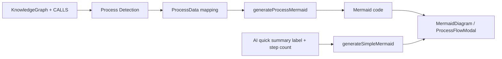
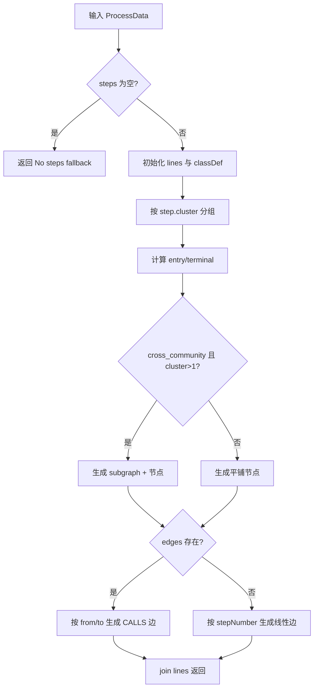
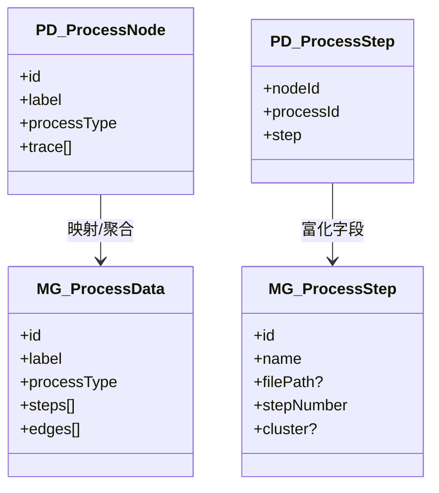

# mermaid_process_modeling

## 模块概述

`mermaid_process_modeling` 模块对应 `gitnexus-web/src/lib/mermaid-generator.ts`，它的职责是把“流程检测结果”转换为 Mermaid flowchart 文本，让前端可以直接渲染成可读的流程图。这个模块存在的核心价值不在于“字符串拼接”本身，而在于把结构化流程语义（步骤、调用边、社区归属、入口/终点）稳定地映射到可视化语言，并在信息不完整时提供可接受的回退行为。

在整体系统里，流程数据通常由 `process_detection_and_entry_scoring` 产出（见 [process_detection_and_entry_scoring.md](process_detection_and_entry_scoring.md)），而 `mermaid_rendering_component` 负责把本模块输出的 Mermaid 文本渲染为 SVG（见 [mermaid_rendering_component.md](mermaid_rendering_component.md)）。因此，本模块是“流程语义层”与“UI 渲染层”之间的关键适配器。

---

## 在系统中的位置



这里有两条主要路径：一条是完整流程图路径，使用 `generateProcessMermaid(process)`，支持分支、聚类和入口/终点样式；另一条是快速预览路径，使用 `generateSimpleMermaid(label, stepCount)` 生成简化线性图。前者强调信息完整性，后者强调响应速度和低认知负担。

---

## 核心数据结构

### `ProcessStep`

```ts
export interface ProcessStep {
  id: string;
  name: string;
  filePath?: string;
  stepNumber: number;
  cluster?: string;
}
```

`ProcessStep` 表示流程中的一个可视化节点。`id` 是主键，用于边连接和节点去重；`name` 是展示名称；`filePath` 用于附加文件来源信息；`stepNumber` 用于排序与入口/终点判定；`cluster` 用于跨社区流程时的子图分组。

需要特别注意：该类型与 `process_detection_and_entry_scoring` 中的 `ProcessStep` 含义不同。后者是 `{ nodeId, processId, step }` 的关系型记录，而本模块的 `ProcessStep` 是已“富化”后的展示模型。接入时应做一次显式映射，避免字段名看似相同但语义不一致导致的错误。

### `ProcessEdge`

```ts
export interface ProcessEdge {
  from: string;
  to: string;
  type: string;
}
```

`ProcessEdge` 描述步骤之间的关系边。当前实现仅用 `from`/`to` 生成箭头，`type` 字段暂未参与渲染语义分流（例如不同线型或颜色）。也就是说，这个字段在当前版本更像“为后续扩展预留的语义槽位”。

### `ProcessData`

```ts
export interface ProcessData {
  id: string;
  label: string;
  processType: 'intra_community' | 'cross_community';
  steps: ProcessStep[];
  edges?: ProcessEdge[];
  clusters?: string[];
}
```

`ProcessData` 是生成 Mermaid 的输入聚合对象。`processType` 决定是否启用 cluster 子图；`steps` 是必需数据；`edges` 可选，如果缺失会退化为按 `stepNumber` 的线性链路；`clusters` 当前在生成逻辑中未直接读取（更多依赖 `step.cluster` 实际值），但可作为上游元数据保留。

---

## 主要函数与内部机制

## `generateProcessMermaid(process: ProcessData): string`

这是模块主函数，用于生成完整流程图 Mermaid 文本。返回值始终是可渲染字符串，不抛出显式错误分支；当输入为空时返回占位图。

### 执行流程



该流程体现了“先定义视觉规则，再布局节点，最后连边”的顺序，便于维护和扩展。

### 关键子逻辑说明

函数首先注入多组 `classDef`（`entry`、`step`、`terminal`、`cluster` 等）以统一样式。入口节点和终止节点通过 `stepNumber` 排序后分别取首尾 ID 决定，不依赖图入度/出度分析，因此成本低但带有启发式特征。

随后会对步骤做 cluster 分桶。只有当 `processType === 'cross_community'` 且实际 cluster 组数大于 1 时，才启用 Mermaid `subgraph` 结构；否则采用平铺布局。这个条件避免了单社区流程被过度分区导致视觉噪声。

在节点命名上，函数对 `step.id` 执行字符清洗（只保留字母数字下划线）作为 Mermaid 节点 ID，以避免特殊字符破坏语法。展示文本也会做标签清洗与长度截断（30 字符），并附加 `filePath` 的文件名部分。

连边阶段分两种模式：

- 如果存在 `edges`，则把它们当作真实调用边生成分支/汇合结构；仅当 `from/to` 都能在 `steps` 中找到时才输出边。
- 如果 `edges` 不存在，则按 `stepNumber` 排序后串成线性链。

这使函数对不同质量的数据都能产出结果：高质量数据展示真实拓扑，低质量数据仍可展示顺序概览。

### 参数、返回值与副作用

- 参数：`process: ProcessData`。
- 返回：`string`，Mermaid flowchart 源码。
- 副作用：无外部副作用；纯函数。

---

## `generateSimpleMermaid(processLabel: string, stepCount: number): string`

该函数用于快速概览图。它把 `processLabel` 按 `' → '` 分割为入口与终点，并固定输出三段式 `graph LR`：入口节点 → “中间 N 步” → 终点节点。

这种实现适合聊天摘要、卡片预览或占位显示，优点是生成成本极低、稳定性高；缺点是丢失了分支结构与文件上下文信息。

### 行为要点

- 当 `processLabel` 不含箭头分隔符时，会回退为 `Start/End` 文案。
- 中间步数显示为 `stepCount - 2`，如果传入值过小可能出现负数文案（见下文边界条件）。

---

## 架构关系与类型映射



从工程实践看，最容易出错的是“同名 Step 类型的跨模块转换”。建议在适配层建立独立 mapper（例如 `toMermaidProcessData`），明确填写 `name/filePath/cluster` 的来源逻辑，并在 mapper 单测中覆盖缺失字段场景。

---

## 典型使用方式

### 1) 完整流程图生成

```ts
import { generateProcessMermaid, ProcessData } from '@/lib/mermaid-generator';

const process: ProcessData = {
  id: 'proc_checkout',
  label: 'Checkout Flow',
  processType: 'cross_community',
  steps: [
    { id: 'api.start', name: 'HandleCheckout', filePath: 'src/api/checkout.ts', stepNumber: 1, cluster: 'api' },
    { id: 'service.validate', name: 'ValidateCart', filePath: 'src/service/cart.ts', stepNumber: 2, cluster: 'service' },
    { id: 'service.pay', name: 'CreatePayment', filePath: 'src/service/pay.ts', stepNumber: 3, cluster: 'service' },
  ],
  edges: [
    { from: 'api.start', to: 'service.validate', type: 'CALLS' },
    { from: 'service.validate', to: 'service.pay', type: 'CALLS' },
  ],
};

const mermaidCode = generateProcessMermaid(process);
```

生成后的字符串可直接传给 `MermaidDiagram` 组件渲染，或传给 `ProcessFlowModal` 进行放大交互（见 [mermaid_rendering_component.md](mermaid_rendering_component.md)）。

### 2) 快速摘要图

```ts
import { generateSimpleMermaid } from '@/lib/mermaid-generator';

const quickCode = generateSimpleMermaid('HandleLogin → CreateSession', 6);
```

这个结果适合低成本预览，不建议用于需要精确结构解释的场景。

---

## 配置与可扩展点

当前模块没有显式配置对象，属于“约定式固定策略”。如果你计划扩展，通常有三类方向：

第一类是视觉策略参数化，例如把 `font-size`、颜色、标签截断长度（当前 30）做成可选参数，让不同页面或主题可复用同一生成器。

第二类是边语义增强，目前 `ProcessEdge.type` 未被使用。可以基于 `type` 输出不同箭头风格（虚线、粗线、颜色），把 `CALLS`、`IMPORTS`、`EVENT_TRIGGERS` 等关系区分开来。

第三类是节点语义增强，例如让 entry/terminal 判定不仅依赖 `stepNumber`，还综合入度/出度或框架入口提示，以提升复杂流程下的标记准确度。

---

## 边界条件、错误行为与已知限制

该模块整体是“尽力输出”策略，即尽量返回可渲染文本而不是抛错。维护时需要了解以下行为：

当 `steps` 为空时，函数返回固定占位图 `A[No steps found]`。这对 UI 友好，但可能掩盖上游数据断裂，因此建议在调用侧保留日志或统计。

节点 ID 清洗可能引入碰撞。虽然注释提到“用真实 ID 避免合并流程时碰撞”，但清洗规则会把大量符号替换为 `_`，例如 `a-b` 与 `a/b` 可能都变成 `a_b`。在极端数据下会导致 Mermaid 节点复用。可通过“清洗后附加短哈希”降低风险。

标签清洗会移除 `[]<>{}()` 等字符并截断到 30 字符，这能提升 Mermaid 兼容性，但会丢失部分语义细节。若流程名称依赖这些符号表达（如泛型、签名片段），展示信息会被压缩。

当提供 `edges` 时，函数不会自动补齐孤立节点的连接关系，只是“有边画边”。源码中已注明当前接受碎片图。这意味着你可能看到多个互不连通的子图，这是预期行为而非渲染 bug。

`generateSimpleMermaid` 对 `stepCount` 无下限保护，`stepCount < 2` 时中间步数可能出现负值。调用侧应保证最小值，或在函数内新增 `Math.max(stepCount - 2, 0)` 防御。

---

## 维护与测试建议

建议把测试重点放在“字符串包含关系”而非整串完全匹配，因为 classDef 顺序、空格缩进等小变动不影响语义却容易导致脆弱测试。

可以至少覆盖以下用例：

- 空步骤输入返回 fallback。
- 无 `edges` 时按 `stepNumber` 生成线性边。
- 有 `edges` 时正确生成分支边且忽略非法 from/to。
- `cross_community + 多 cluster` 时生成 `subgraph`。
- 特殊字符 ID/标签的清洗行为。

---

## 与其他文档的关系

本文件聚焦 Mermaid 过程建模与代码生成，不重复解释流程检测算法和 UI 渲染细节。需要深入时请参阅：

- 流程发现与评分： [process_detection_and_entry_scoring.md](process_detection_and_entry_scoring.md)
- Mermaid 渲染组件行为： [mermaid_rendering_component.md](mermaid_rendering_component.md)
- 应用状态与查询结果如何驱动界面： [app_state_orchestration.md](app_state_orchestration.md)
