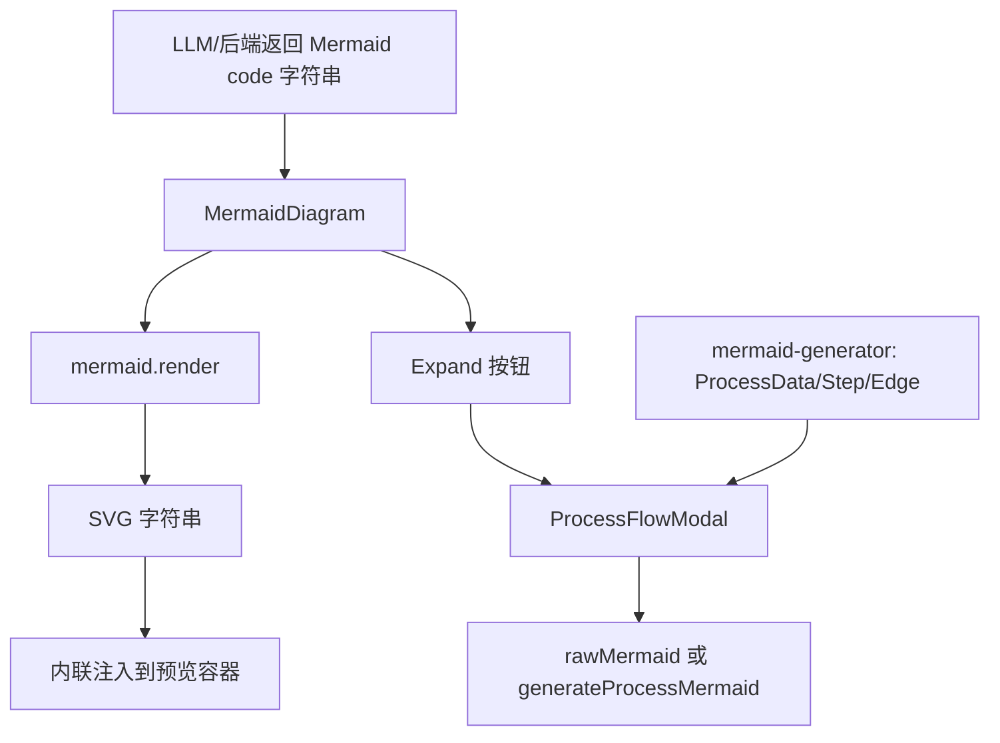
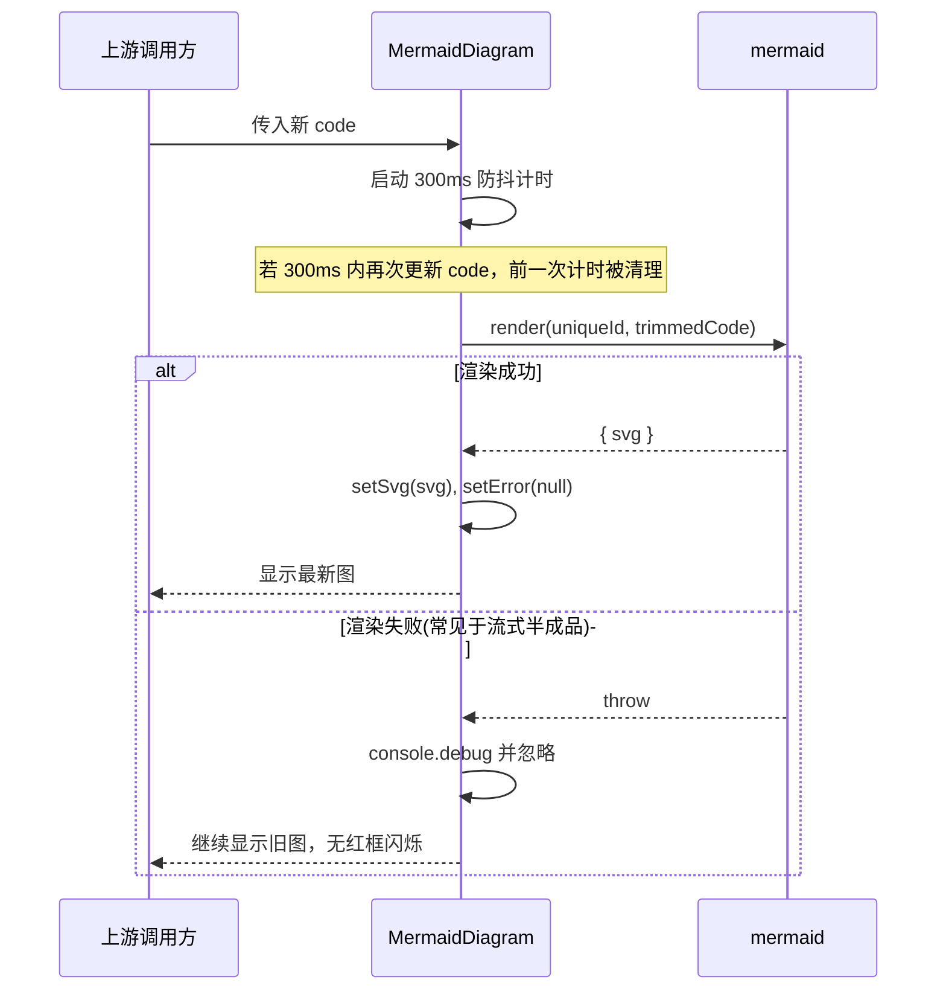
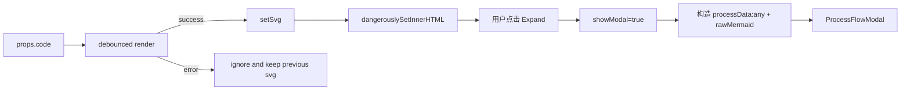

# mermaid_rendering_component

## 模块概述

`mermaid_rendering_component` 模块对应前端组件 `gitnexus-web/src/components/MermaidDiagram.tsx`，核心职责是在聊天/分析 UI 中把 Mermaid 文本实时渲染为可视化流程图，并提供“展开到全屏流程查看器”的入口。这个模块存在的意义并不只是“把字符串变成 SVG”，更关键的是它解决了 AI 流式输出场景下的渲染稳定性问题：当 Mermaid 代码还在逐字生成时，语法往往短暂不完整，如果每次都立即渲染并抛错，界面会频繁闪烁、报红、抖动。

因此，该组件采用了“**防抖 + 静默容错 + 保留最后一次有效 SVG**”的设计策略。也就是说，新的 `code` 输入先经过短延迟再尝试渲染；若当前片段不合法，组件不会清空旧图、也不会展示错误框，而是继续显示上一次成功结果。这种设计非常适合 AI assistant 的 streaming 输出体验。

从系统位置上看，它属于 `web_app_state_and_ui` 下的渲染层组件，与 `mermaid_process_modeling`（数据结构与代码生成）以及 `ProcessFlowModal`（放大查看与交互容器）形成“轻耦合组合”：`MermaidDiagram` 专注预览渲染，复杂交互交给 Modal。

---

## 在系统中的角色与依赖关系



`MermaidDiagram` 的上游通常是消息渲染器（例如 Markdown/聊天消息区）传入的 Mermaid 文本。下游有两条路径：第一条是直接在当前卡片中显示 SVG 预览；第二条是通过右上角 Expand 按钮进入 `ProcessFlowModal`，在更大画布中进行查看、缩放、平移等操作。该组件并不直接参与流程语义构建（那是 `mermaid-generator` 的职责），但会构造一个“兼容的伪 `ProcessData` 对象”以复用 Modal。

可参考相关文档：

- [app_state_orchestration](app_state_orchestration.md)（UI 状态与消息编排）
- [process_detection_and_entry_scoring](process_detection_and_entry_scoring.md)（流程信息来源）
- [mermaid_process_modeling](mermaid_process_modeling.md)（Mermaid 过程建模，若已生成）

---

## 核心组件：`MermaidDiagramProps`

```ts
interface MermaidDiagramProps {
  code: string;
}
```

`MermaidDiagram` 的输入非常克制，仅暴露一个 `code` 字段，代表待渲染的 Mermaid 源码字符串。这个极简接口带来两个好处：第一，调用侧无需关心 Mermaid 初始化和错误管理；第二，组件可以在内部自由优化渲染节奏（如防抖、错误抑制）而不影响外部 API。

### 参数语义

- `code`: 允许是完整代码，也允许是流式生成中的“暂时不完整文本”。组件针对后者做了容错设计。

### 返回值/输出

这是 React 组件，返回 JSX UI。最终效果包含：

1. 内嵌预览卡片（头部 + SVG 内容区）
2. Expand 按钮触发的 `ProcessFlowModal`
3. 理论上的错误展示分支（但当前实现中几乎不会触发，详见“行为细节与限制”）

---

## 内部工作机制

## 1) Mermaid 全局初始化（模块加载时）

组件文件在顶层执行 `mermaid.initialize(...)` 与 `mermaid.parseError = ...`。这意味着一旦模块被加载，Mermaid 的主题、排版参数、错误处理策略即被全局修改。

```ts
mermaid.initialize({
  startOnLoad: false,
  maxTextSize: 900000,
  theme: 'base',
  ...
  suppressErrorRendering: true,
});

mermaid.parseError = (_err) => {
  // Silent catch
};
```

设计意图是保持与 `ProcessFlowModal` 一致的视觉主题，并阻止 Mermaid 默认错误 UI 干扰聊天体验。需要注意，这种“全局写配置”在大型应用里会影响其他 Mermaid 使用点，后文会给出扩展建议。

## 2) 渲染状态机

组件使用三个状态字段驱动行为：

- `svg: string`：最近一次成功渲染的 SVG 字符串
- `showModal: boolean`：是否显示放大弹窗
- `error: string | null`：错误状态（当前逻辑中基本未被写入）

`useEffect([code])` 在每次代码变更时触发，并通过 `setTimeout(..., 300)` 做防抖。到期后执行 `mermaid.render(id, code.trim())`，成功则更新 `svg`。



这套流程的关键点是：失败不覆盖旧值，从而保持界面稳定。

## 3) 展开逻辑与伪 `ProcessData`

点击 Expand 按钮后，组件将 `showModal` 设为 `true`，并即时构造一个对象传给 `ProcessFlowModal`。该对象结构匹配 `ProcessData`，但额外塞入 `rawMermaid` 字段（通过 `any` 绕过类型限制）。

```ts
const processData: any = showModal ? {
  id: 'ai-generated',
  label: 'AI Generated Diagram',
  processType: 'intra_community',
  steps: [],
  edges: [],
  clusters: [],
  rawMermaid: code,
} : null;
```

而 `ProcessFlowModal` 内部优先读取 `rawMermaid`，否则才调用 `generateProcessMermaid(process)`。这使得聊天场景可以直接复用流程弹窗能力，而无需先构建完整 `steps/edges`。

---

## 组件交互与数据流



从数据流角度，`code` 是唯一输入，`svg` 是核心派生状态。该组件没有向上游抛事件（除 UI 展开行为在组件内闭环处理），因此它是典型“受控输入、内部渲染、无输出回调”的展示组件。

---

## 使用方式

最小使用示例：

```tsx
import { MermaidDiagram } from './components/MermaidDiagram';

const code = `
flowchart TD
  A[Start] --> B{Check}
  B -->|Yes| C[Done]
  B -->|No| D[Retry]
`;

export function Demo() {
  return <MermaidDiagram code={code} />;
}
```

用于流式场景的典型模式：

```tsx
// pseudo code
const [streamingMermaid, setStreamingMermaid] = useState('flowchart TD\n');

// 每次 token 到达时追加
setStreamingMermaid(prev => prev + chunk);

return <MermaidDiagram code={streamingMermaid} />;
```

由于组件内部有 300ms 防抖和错误静默机制，通常不需要调用方额外做“语法完整性判断”。

---

## 配置与可调参数

尽管该组件未暴露外部配置项，但内部有若干关键常量，维护者常会调整：

- `debounce = 300ms`：降低高频重渲染和视觉抖动
- `maxTextSize = 900000`：提升大图容纳能力
- `flowchart.nodeSpacing/rankSpacing/padding`：影响布局疏密
- `fontFamily/fontSize/themeVariables`：视觉风格统一

如果你计划把组件用于高吞吐流式输出（例如每 20~50ms 一个 chunk），`300ms` 是兼顾响应性和稳定性的实用基线。若更追求“即时感”，可适度降低；但太低会显著增加 Mermaid parser 压力。

---

## 错误处理、边界条件与已知限制

当前实现有几个非常关键的行为特征：

首先，虽然组件定义了 `error` 状态与错误 UI 分支，但在 `catch` 中并未调用 `setError(...)`，只做 `console.debug`。这意味着错误框在现实中几乎不可见。此策略适合流式体验，但会降低“最终失败时”的可观测性。

其次，渲染容器使用 `dangerouslySetInnerHTML` 注入 Mermaid 输出 SVG。通常 Mermaid 产物是受控 SVG，但如果 `code` 完全来自不可信输入，仍需评估 XSS 风险边界，尤其是启用 `htmlLabels: true` 时。

再次，`mermaid.initialize` 与 `mermaid.parseError` 在模块顶层执行，属于全局副作用。若项目中其他位置也在改 Mermaid 全局配置，可能出现后加载模块覆盖先前配置的问题，表现为“主题忽然变化”或“错误处理策略被重写”。

此外，ID 通过时间戳 + 随机串生成，基本可避免同帧冲突，但如果你在 SSR 或特殊测试环境模拟时间，需要确认唯一性策略仍成立。

最后，`processData` 使用 `any` 扩展 `rawMermaid` 字段，这是一种务实但不严格的类型绕过。长期维护建议在共享类型中正式声明该可选字段，避免调用链上的隐式约定。

---

## 扩展与重构建议

如果要增强该模块，优先级最高的方向是把“稳定渲染体验”保留，同时提高可维护性：

1. 将 `MermaidDiagramProps` 扩展为可选配置，例如 `debounceMs`、`onRenderError`、`maxHeight`，让不同页面可按场景调参。
2. 把 Mermaid 全局初始化抽到单例工厂（例如 `mermaid-runtime.ts`），避免多个组件重复初始化/互相覆盖。
3. 为 `ProcessData` 增加 `rawMermaid?: string` 官方字段，移除 `any`。
4. 对最终连续失败增加“温和提示”策略（例如 N 次失败后显示非阻塞 toast），平衡静默与可观测性。
5. 若安全要求较高，可在注入前引入 SVG 清洗策略或 Mermaid 安全级别约束。

---

## 维护者速查（行为摘要）

- 这是一个面向 AI 流式 Mermaid 文本的“抗抖动预览组件”。
- 成功渲染会更新 SVG；失败渲染默认静默并保留旧图。
- Expand 通过 `ProcessFlowModal` 提供高级查看能力。
- 当前错误状态分支基本不会触发（设计如此，但需知晓）。
- 模块包含 Mermaid 全局副作用，跨组件共享时要特别小心。

