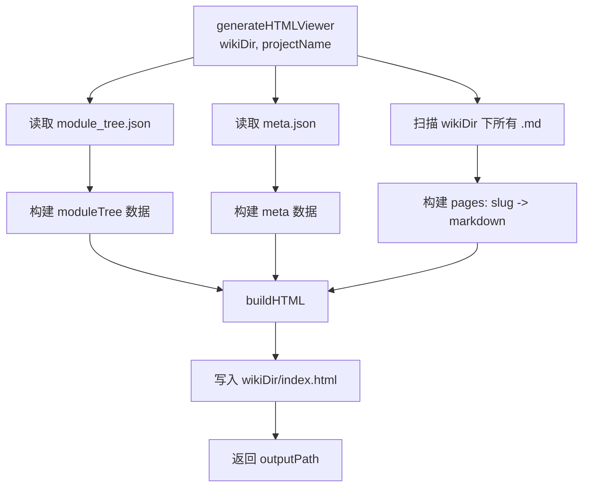
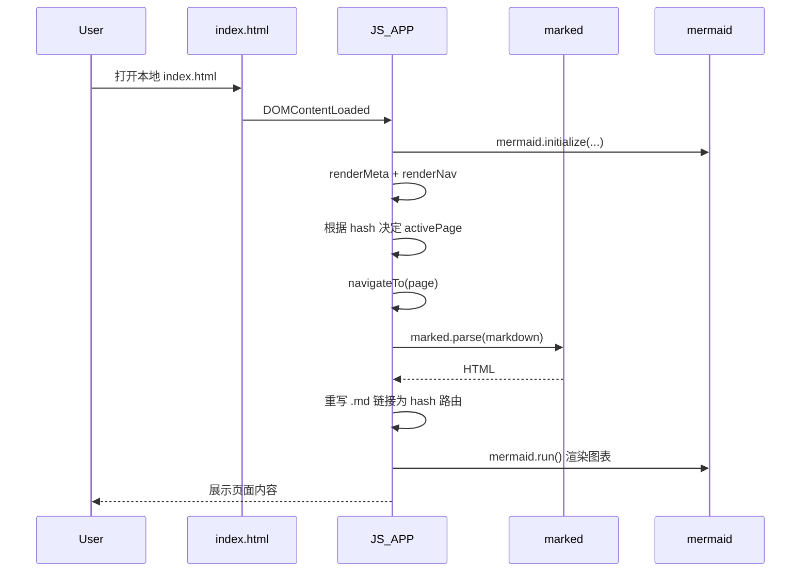
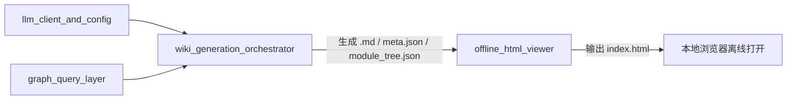
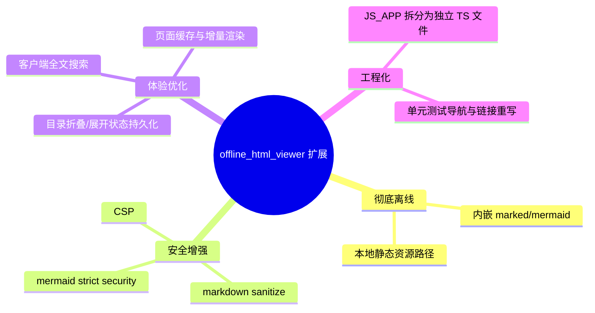

# offline_html_viewer 模块文档

## 1. 模块定位与设计动机

`offline_html_viewer`（实现文件：`gitnexus/src/core/wiki/html-viewer.ts`）负责把已经生成好的 Wiki Markdown 文档打包为一个单文件 `index.html`，使用户在没有后端服务的情况下也能直接离线浏览文档。它的目标并不是再做一次“文档生成”，而是完成**分发形态转换**：把“多文件 Markdown + 元数据”转换成“可本地打开的交互式浏览器页面”。

这个模块存在的核心价值是降低交付成本。对于很多代码审查、知识转移、离线演示场景，维护者希望把文档目录直接发给他人，而不是要求对方启动 Node 服务或接入数据库。`offline_html_viewer` 通过把页面内容、导航树和元信息内嵌到 HTML 的脚本变量中，提供了“拷贝即看”的体验。

在系统中，它属于 `core_wiki_generator` 的末端产物环节：`wiki_generation_orchestrator` 先产出 `*.md`、`module_tree.json`、`meta.json`，然后调用本模块生成 `index.html`。因此它与上游模块是强协作关系，但职责边界清晰：上游负责内容质量与结构，本模块负责展示与离线可用性。可参考 [wiki_generation_orchestrator.md](wiki_generation_orchestrator.md) 了解其调用时机。

---

## 2. 核心数据模型

### 2.1 `ModuleTreeNode`

```ts
interface ModuleTreeNode {
  name: string;
  slug: string;
  files: string[];
  children?: ModuleTreeNode[];
}
```

`ModuleTreeNode` 描述左侧导航树的节点结构。`name` 是展示名，`slug` 是页面键（通常对应 `xxx.md` 文件名去后缀），`files` 记录该模块关联文件，`children` 用于层级导航。这里的结构与 `wiki_generation_orchestrator` 中同名接口保持一致，意味着 HTML Viewer 不需要做额外映射即可消费 `module_tree.json`。

需要注意的是，当前前端导航渲染逻辑只用到了 `name`、`slug`、`children`，`files` 主要是为结构完整性和潜在扩展保留。

---

## 3. 模块架构与执行流程

### 3.1 生成阶段（Node 侧）



这个流程体现了一个关键设计：即使 `module_tree.json` 或 `meta.json` 缺失，流程也不会失败，而是退化为“无导航元信息”的可浏览页面。这使得 Viewer 对部分中间产物损坏有较强容错性。

### 3.2 运行阶段（浏览器侧）



浏览器侧逻辑完全内嵌在 `JS_APP` 字符串中，不依赖打包器。这种做法牺牲了可维护性（长字符串不利于类型检查），但换来单文件部署能力。

---

## 4. 核心函数详解

## 4.1 `generateHTMLViewer(wikiDir, projectName): Promise<string>`

这是模块的唯一导出入口，职责是读取数据、构建 HTML、写文件并返回输出路径。

```ts
export async function generateHTMLViewer(
  wikiDir: string,
  projectName: string,
): Promise<string>
```

函数内部主要步骤：

1. 尝试读取 `module_tree.json`，失败则使用空数组。
2. 尝试读取 `meta.json`，失败则使用 `null`。
3. 遍历 `wikiDir` 下所有 `.md` 文件，构建 `{ slug: content }`。
4. 调用 `buildHTML(...)` 得到完整 HTML 字符串。
5. 写入 `${wikiDir}/index.html`。
6. 返回输出路径。

副作用主要是文件系统 I/O（读目录、读文件、写文件）。该函数没有抛出“元数据缺失”类错误，但会在目录不可读、写入失败等底层 I/O 异常时抛错。

### 4.2 `esc(text: string): string`

`esc` 是服务端拼装 HTML 时的转义工具，用于避免 `projectName` 直接注入到 `<title>` 或 sidebar 标题时破坏 HTML 结构。它转义了 `& < > "`。

它并不对 Markdown 内容做过滤，因为 Markdown 在运行时由 `marked` 解析；这意味着安全模型与 `marked` 配置强相关，而不在该函数控制范围内。

### 4.3 `buildHTML(projectName, moduleTree, pages, meta): string`

`buildHTML` 负责拼装完整文档骨架，包含：

- `<head>`：引入 `marked` 与 `mermaid` CDN、内嵌 CSS。
- `<body>`：左侧导航、右侧内容区、移动端菜单按钮。
- `<script>`：注入 `PAGES/TREE/META` 三个全局变量并附加 `JS_APP`。

一个关键实现点是把 `pages/moduleTree/meta` 通过 `JSON.stringify` 直接嵌入脚本，实现零请求加载。代价是 HTML 文件体积会随 Markdown 数量线性增长。

### 4.4 `JS_APP`（客户端应用逻辑）

虽然是字符串常量，但它实际上是这个模块的前端运行时。关键行为包括：

- `renderMeta()`：读取 `META.generatedAt/model/fromCommit` 并渲染顶部元信息。
- `renderNav()` + `buildNavTree()`：渲染 `Overview` 和模块树，支持点击跳转。
- `navigateTo(page)`：核心路由函数，完成 hash 更新、active 高亮、Markdown 渲染、链接重写、Mermaid 渲染与滚动复位。
- 移动端菜单控制：通过 `#menu-toggle` 切换 sidebar 的 `open` class。

---

## 5. 与其他模块的关系



`offline_html_viewer` 不直接依赖 LLM 或图数据库，它消费的是编排器产物。因此如果你在排查文档内容“是否准确”，应优先检查上游生成模块；如果问题是“打不开、导航缺失、前端渲染异常”，则从本模块切入更高效。

---

## 6. 使用方式与集成示例

在当前系统中，通常由 `WikiGenerator.ensureHTMLViewer()` 间接调用：

```ts
const repoName = path.basename(this.repoPath);
await generateHTMLViewer(this.wikiDir, repoName);
```

如果你在工具链中独立调用本模块，可用如下方式：

```ts
import { generateHTMLViewer } from './core/wiki/html-viewer';

const output = await generateHTMLViewer('/path/to/wiki', 'my-project');
console.log('HTML viewer generated at:', output);
```

最小目录要求是至少有一个 `.md` 文件。`module_tree.json` 与 `meta.json` 可选，但缺失时体验会降级（无模块树或无元信息）。

---

## 7. 行为细节、边界条件与已知限制

### 7.1 容错与退化行为

- `module_tree.json` 读取失败：不会抛错，仅显示 `Overview` 导航。
- `meta.json` 读取失败：不会抛错，sidebar 元信息为空。
- 页面不存在：`navigateTo` 渲染 `Page not found`。

这种“尽量可用”策略适合离线分发，但也可能掩盖上游产物缺失问题。若需严格校验，建议在调用前增加文件完整性检查。

### 7.2 真正的“离线性”限制

尽管页面数据内嵌，当前仍通过 CDN 加载：

- `marked@11`
- `mermaid@11`

因此在完全断网环境下，若浏览器无法命中缓存，Markdown 与 Mermaid 可能无法渲染。也就是说它是“内容离线”，不是“依赖彻底离线”。若需要全离线，应考虑将库脚本改为内嵌或本地相对路径。

### 7.3 安全相关注意事项

`mermaid.initialize` 使用了 `securityLevel: 'loose'`，且 `marked.parse` 输出未经过额外 sanitize。这对可信仓库通常可接受，但若文档源不可信，存在 XSS 风险。用于多租户或外部上传内容场景时，建议：

1. 调整 Mermaid 安全级别。
2. 为 Markdown 渲染增加 HTML sanitize 层。
3. 在分发前做静态内容审查。

### 7.4 性能与规模限制

- 所有 `.md` 会一次性读入内存并嵌入单个 HTML，超大仓库可能导致 `index.html` 体积过大。
- Node 侧读取 Markdown 为串行 `await`，在文件很多时会拉长打包时间。
- 浏览器侧每次导航都重新 `marked.parse`，对超长文档会有渲染抖动。

---

## 8. 可扩展点与改造建议

如果你计划扩展本模块，建议优先考虑以下方向：



另外，`ModuleTreeNode` 当前在多个文件重复声明。若后续要提升类型一致性，可抽取到共享类型模块并统一导入，减少结构漂移风险。

---

## 9. 排障建议

当 `index.html` 可打开但内容异常时，可以按以下顺序定位：

1. 检查 `wikiDir` 是否存在目标 `*.md`（页面 not found 常见根因）。
2. 检查 `module_tree.json` 的 `slug` 是否与 Markdown 文件名一致。
3. 在浏览器控制台确认 CDN 脚本是否加载失败。
4. 检查 Markdown 内 Mermaid 代码块是否使用 `language-mermaid` 标记。
5. 若 hash 跳转异常，确认链接是相对 `.md` 链接（`http://` 链接不会被重写）。

---

## 10. 总结

`offline_html_viewer` 是 Wiki 体系中的“最后一公里”模块：它不改变文档语义，但决定文档是否能被低成本传播和消费。其设计重点是容错、零后端依赖和单文件交付；对应的权衡是安全与规模上的可改进空间。对维护者而言，理解它与 `wiki_generation_orchestrator` 的边界关系，将有助于在“内容问题”和“展示问题”之间快速切分排障路径。