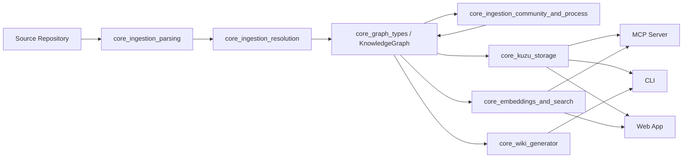
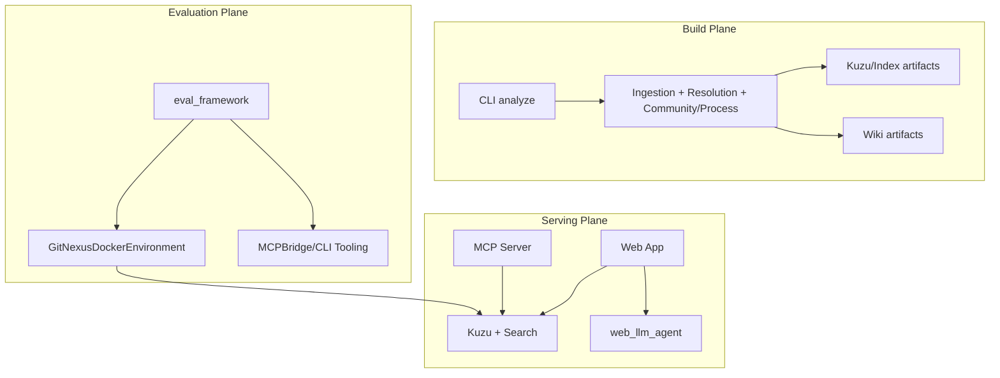

# GitNexus 仓库总览（Comprehensive Overview）

## 1. 仓库定位与目标

`GitNexus` 是一个面向代码库理解与 AI 协作的全链路系统。它的核心目标是：

1. 将源码仓库转换为结构化知识图谱（`KnowledgeGraph`）。
2. 在图谱上提供符号解析、调用关系推断、社区与流程识别。
3. 提供可持久化存储（Kuzu）、检索（BM25 + Embeddings + Hybrid）、文档生成（Wiki）。
4. 通过 CLI、MCP Server、Web UI、Eval Framework 支持开发者与 AI Agent 的多场景使用。

简而言之：**GitNexus = 代码解析引擎 + 图谱语义层 + 检索/文档能力 + AI 接口层**。

---

## 2. 仓库主干结构（高层）

```text
gitnexus/
├─ src/core/
│  ├─ graph/                      # 图谱类型契约
│  ├─ ingestion/                  # 解析、解析后消歧、社区/流程检测
│  ├─ kuzu/                       # CSV 导出与图存储适配
│  ├─ embeddings/ & search/       # 语义检索与混合搜索
│  └─ wiki/                       # Wiki 生成与 HTML viewer
├─ src/types/                     # pipeline 结果与进度类型
├─ src/mcp/                       # MCP 服务核心
├─ src/cli/                       # 命令行入口
├─ src/storage/                   # 仓库注册表与本地索引元数据管理
├─ eval/                          # 评测框架（agent/bridge/docker env）
└─ gitnexus-web/                  # Web 端（图渲染、web ingestion、agent、状态层）
```

---

## 3. 端到端架构（E2E）

### 3.1 主流程：从源码到图谱能力



---

### 3.2 运行面架构：CLI / MCP / Web / Eval 协同



---

## 4. 核心模块分层说明（含文档引用）

## 4.1 图谱契约层

- **`core_graph_types`**：定义 `GraphNode` / `GraphRelationship` / `KnowledgeGraph` 的统一 schema 和操作契约。  
  文档：[`core_graph_types.md`](core_graph_types.md)

---

## 4.2 Ingestion 处理层（构图主线）

1. **`core_ingestion_parsing`**  
   - 文件扫描、AST 解析、worker 并行提取、基础节点/关系抽取。  
   文档：[`core_ingestion_parsing.md`](core_ingestion_parsing.md)

2. **`core_ingestion_resolution`**  
   - 符号表、import 路径消歧、call target 解析、入口点评分与框架提示。  
   文档：[`core_ingestion_resolution.md`](core_ingestion_resolution.md)

3. **`core_ingestion_community_and_process`**  
   - 社区检测（Leiden）、集群语义增强（LLM）、流程路径检测。  
   文档：[`core_ingestion_community_and_process.md`](core_ingestion_community_and_process.md)

---

## 4.3 存储与检索层

1. **`core_kuzu_storage`**  
   - 将图谱流式导出为 CSV，适配 Kuzu 图数据库导入。  
   文档：[`core_kuzu_storage.md`](core_kuzu_storage.md)

2. **`core_embeddings_and_search`**  
   - Embedding 类型契约、BM25、Hybrid RRF 融合检索。  
   文档：[`core_embeddings_and_search.md`](core_embeddings_and_search.md)

3. **`core_pipeline_types`**  
   - Pipeline 进度/结果、可序列化传输结构。  
   文档：[`core_pipeline_types.md`](core_pipeline_types.md)

---

## 4.4 内容生成与服务接口层

1. **`core_wiki_generator`**  
   - 图查询 + LLM 文案生成 + 离线 HTML wiki。  
   文档：[`core_wiki_generator.md`](core_wiki_generator.md)

2. **`mcp_server`**  
   - MCP 协议服务、repo 发现、工具/资源系统、Kuzu 连接池。  
   文档：[`mcp_server.md`](mcp_server.md)

3. **`cli`**  
   - `analyze` / `setup` / `wiki` / `eval-server` 等命令入口。  
   文档：[`cli.md`](cli.md)

4. **`storage_repo_manager`**  
   - `.gitnexus` 本地索引元数据与 `~/.gitnexus/registry.json` 全局注册管理。  
   文档：[`storage_repo_manager.md`](storage_repo_manager.md)

---

## 4.5 Web 端能力层（gitnexus-web）

1. **图类型与渲染**
   - `web_graph_types_and_rendering`：Graphology + Sigma 渲染适配、画布交互。  
   文档：[`web_graph_types_and_rendering.md`](web_graph_types_and_rendering.md)

2. **Web Ingestion**
   - `web_ingestion_pipeline`：Web 侧符号解析、社区/流程检测、增强。  
   文档：[`web_ingestion_pipeline.md`](web_ingestion_pipeline.md)

3. **Pipeline 与存储**
   - `web_pipeline_and_storage`：worker 结果传输、CSV 生成、Kuzu WASM 类型。  
   文档：[`web_pipeline_and_storage.md`](web_pipeline_and_storage.md)

4. **Web 检索**
   - `web_embeddings_and_search`：Web 侧 embeddings/BM25/hybrid 搜索。  
   文档：[`web_embeddings_and_search.md`](web_embeddings_and_search.md)

5. **Web Agent**
   - `web_llm_agent`：多 Provider LLM 代理、流式步骤、动态上下文。  
   文档：[`web_llm_agent.md`](web_llm_agent.md)

6. **应用状态与 UI**
   - `web_app_state_and_ui`：前端状态编排、引用面板、Mermaid 渲染。  
   文档：[`web_app_state_and_ui.md`](web_app_state_and_ui.md)

7. **后端连接服务**
   - `web_backend_services`：HTTP 客户端、连接工作流、ZIP 导入。  
   文档：[`web_backend_services.md`](web_backend_services.md)

---

## 4.6 评测层

- **`eval_framework`**：评测 agent 运行时、MCP 桥接、Docker 评测环境预热与指标输出。  
  文档：[`eval_framework.md`](eval_framework.md)

---

## 5. 关键设计特征（跨模块）

- **强类型契约驱动**：核心图谱、pipeline、LLM、搜索结果均有明确类型边界。
- **多阶段语义上卷**：Parsing -> Resolution -> Community/Process -> Search/Wiki。
- **并发与降级兼容**：worker 并行 + fallback 串行；LLM 增强失败可回退启发式结果。
- **多入口统一消费**：CLI、MCP、Web、Eval 均消费同一图谱语义体系。
- **可观测与可复现**：progress、metrics、registry、staleness、eval mode 对照。

---

## 6. 推荐阅读顺序（上手路径）

1. [`core_graph_types.md`](core_graph_types.md)  
2. [`core_ingestion_parsing.md`](core_ingestion_parsing.md)  
3. [`core_ingestion_resolution.md`](core_ingestion_resolution.md)  
4. [`core_ingestion_community_and_process.md`](core_ingestion_community_and_process.md)  
5. [`core_kuzu_storage.md`](core_kuzu_storage.md)  
6. [`core_embeddings_and_search.md`](core_embeddings_and_search.md)  
7. [`mcp_server.md`](mcp_server.md) + [`cli.md`](cli.md)  
8. Web 端按：`web_graph_types_and_rendering` -> `web_ingestion_pipeline` -> `web_pipeline_and_storage` -> `web_embeddings_and_search` -> `web_llm_agent` -> `web_app_state_and_ui`  
9. 最后看 [`eval_framework.md`](eval_framework.md) 做效果验证与回归评测。

---

## 7. 一句话总结

`GitNexus` 是一个将代码仓库“结构化理解 -> 图谱化存储 -> 检索/文档化 -> AI 可调用化”打通的工程化平台，既能服务开发者交互，也能作为 AI Agent 的高质量代码认知基础设施。