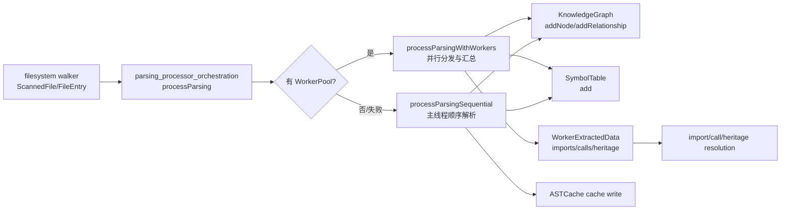
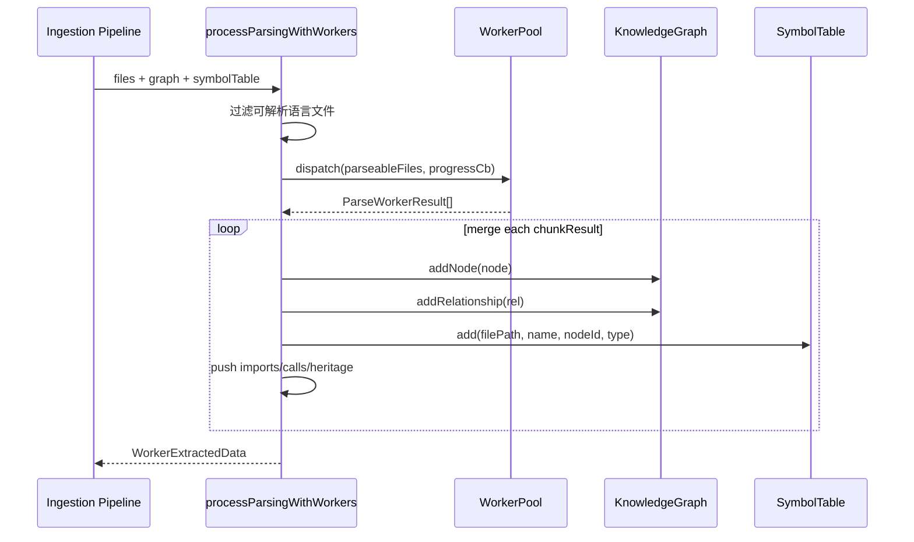
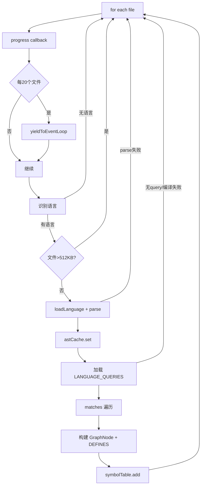
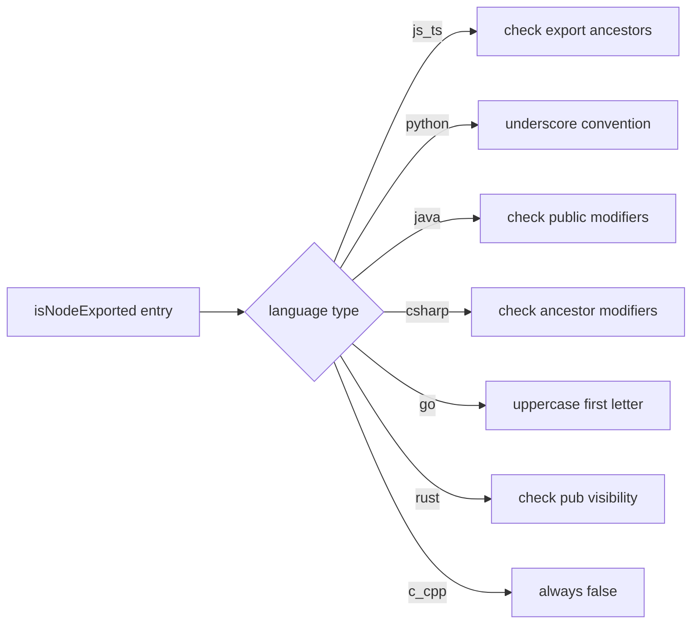
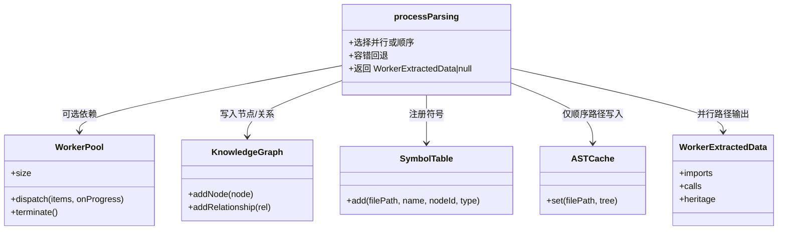

# parsing_processor_orchestration 模块文档

## 模块简介

`parsing_processor_orchestration` 是 `core_ingestion_parsing` 子系统里的“解析编排层”。如果把 `workers_parsing` 看作并行 AST 提取引擎，那么本模块就是引擎调度器和结果汇总器：它统一接收扫描后的源码文件集合，决定采用 **WorkerPool 并行解析** 还是 **主线程顺序回退解析**，并把解析结果写入 `KnowledgeGraph` 与 `SymbolTable`，同时输出后续消解阶段需要的中间事实（imports/calls/heritage）。

该模块存在的核心价值是把“解析策略选择 + 图谱落地 + 进度回调 + 容错降级”封装在一个稳定 API 里，避免上层 pipeline 直接与 worker 协议或 Tree-sitter 细节耦合。对维护者而言，这意味着你可以在不影响调用方的前提下调整并发策略、兼容更多语言、或增强错误恢复行为。

从整体流程上看，它位于文件扫描之后、符号/调用/导入消解之前，是摄取流水线的关键中间层。相关上下游文档建议配合阅读：

- 文件来源与扫描：[`filesystem_scanning_and_loading.md`](filesystem_scanning_and_loading.md)
- Worker 解析引擎：[`workers_parsing.md`](workers_parsing.md)
- 图模型契约：[`core_graph_types.md`](core_graph_types.md)
- 后续符号/导入/调用消解：[`core_ingestion_resolution.md`](core_ingestion_resolution.md)

---

## 在系统中的位置与职责边界



这个模块**不负责**最终导入路径解析、调用目标唯一化或继承关系最终落图，这些属于 resolution 阶段。它负责的是“把可提取的事实可靠地产生出来并注入基础图结构”。

---

## 核心数据结构

### `WorkerExtractedData`

```ts
export interface WorkerExtractedData {
  imports: ExtractedImport[];
  calls: ExtractedCall[];
  heritage: ExtractedHeritage[];
}
```

`WorkerExtractedData` 是本模块对外最关键的中间输出契约，封装了三类“已抽取、未完全解析”的事实：

- `imports`：原始导入语句事实（`filePath + rawImportPath + language`）
- `calls`：调用点事实（`calledName + sourceId`）
- `heritage`：继承/实现关系事实（`className + parentName + kind`）

这些数据通常会在后续模块中结合 `SymbolTable`、路径配置（例如 tsconfig/go module/composer）做消解，最终写为 `IMPORTS`/`CALLS`/`INHERITS` 等图关系。换句话说，本模块输出的是“候选语义边原料”。

---

## 公共 API 与内部执行路径

## `processParsing(...)`

```ts
processParsing(
  graph: KnowledgeGraph,
  files: { path: string; content: string }[],
  symbolTable: SymbolTable,
  astCache: ASTCache,
  onFileProgress?: (current: number, total: number, filePath: string) => void,
  workerPool?: WorkerPool,
): Promise<WorkerExtractedData | null>
```

`processParsing` 是统一入口，执行策略如下：

1. 如果提供 `workerPool`，优先调用 `processParsingWithWorkers`。
2. 若 worker 路径抛错（比如线程崩溃、通信错误、超时），打印 warning 并自动回退到 `processParsingSequential`。
3. 并行成功时返回 `WorkerExtractedData`；顺序回退路径返回 `null`（表示没有 worker 产出的预抽取事实集合）。

这个返回值设计有一个重要语义：**调用方必须处理 `null` 分支**，不能假设 imports/calls/heritage 总是可用。

---

## 并行路径：`processParsingWithWorkers`



该函数的重点不在解析本身，而在**结果合并与一致性写入**：

- 它先通过 `getLanguageFromFilename` 过滤不可解析文件，避免无意义 worker 开销。
- 通过 `workerPool.dispatch<ParseWorkerInput, ParseWorkerResult>` 交给并行解析层。
- 收到每个 chunk 的结果后，依次落地到 `graph` 和 `symbolTable`。
- 同时聚合 `imports/calls/heritage` 成为单一 `WorkerExtractedData` 返回。

### 进度回调行为

并行路径的进度回调由 worker pool 驱动，模块将其映射成：

- 处理中：`onFileProgress(Math.min(filesProcessed, total), total, 'Parsing...')`
- 完成时：`onFileProgress(total, total, 'done')`

注意第三个参数并非真实文件路径，而是阶段提示字符串。这对 UI 非常实用，但也意味着调用方如果依赖该参数做路径定位，要区分并行/顺序路径语义差异。

### 与 `ASTCache` 的关系

函数签名包含 `astCache`，但当前并行实现中并未写入缓存。因为 AST 在 worker 线程内创建，主线程拿到的是可序列化提取结果，不是 `Parser.Tree`。这属于有意设计：减少跨线程对象传输成本。

---

## 顺序回退路径：`processParsingSequential`

当 worker 不可用或失败时，模块会启用顺序模式保障功能正确性。该路径复用了传统 Tree-sitter 解析逻辑，重点是“尽力而为，不让单文件失败拖垮整批”。



### 关键内部步骤

顺序模式里，模块对每个文件执行以下动作：

1. 语言检测与大文件过滤（`> 512 * 1024` 直接跳过）。
2. 动态加载语言 grammar，执行 `parser.parse`。
3. 将 `tree` 写入 `ASTCache`。
4. 使用 `LANGUAGE_QUERIES[language]` 执行 pattern match。
5. 从 capture 中识别定义类节点，映射成标签（Function/Class/Interface/...）。
6. 生成 nodeId、写入 `KnowledgeGraph`，并写 `DEFINES` 关系。
7. 把符号注册到 `SymbolTable`。

与 worker 路径不同，顺序模式当前会在 capture 中直接跳过 `import` 与 `call`，因此不会返回可用于后续快速消解的 `WorkerExtractedData`。

---

## 导出可见性判定：`isNodeExported(...)`

虽然不是导出函数，但它决定了节点属性 `isExported` 的质量，直接影响 API surface 分析和入口点识别精度。



这是典型启发式策略，不追求语言规范层面的绝对准确，但在多语言统一索引场景中具备良好性价比。维护者应理解：任何一门语言的 AST 结构变化或 query 变更，都可能让该判定出现偏差。

---

## 组件协作关系详解



这个协作图体现了一个关键设计点：`processParsing` 对外暴露的是统一调用界面，对内则做分支策略处理。调用方不需要理解 worker 协议，也不需要关心 Tree-sitter 的细节异常，只需处理结果与 `null` 回退语义。

---

## 使用示例

### 示例 1：优先并行，失败自动回退

```ts
import { processParsing } from './core/ingestion/parsing-processor.js';
import { createWorkerPool } from './core/ingestion/workers/worker-pool.js';

const pool = createWorkerPool(new URL('./core/ingestion/workers/parse-worker.js', import.meta.url));

const extracted = await processParsing(
  graph,
  files, // [{path, content}, ...]
  symbolTable,
  astCache,
  (current, total, hint) => {
    console.log(`[parsing] ${current}/${total} - ${hint}`);
  },
  pool,
);

if (extracted) {
  // 并行路径：可直接进入 import/call/heritage resolution
  await resolveImports(extracted.imports, symbolTable, graph);
  await resolveCalls(extracted.calls, symbolTable, graph);
  await resolveHeritage(extracted.heritage, symbolTable, graph);
} else {
  // 顺序回退：没有预抽取数据，按系统策略走备用流程
  console.warn('Parsing used sequential fallback; pre-extracted facts unavailable.');
}

await pool.terminate();
```

### 示例 2：仅顺序解析（无 worker 环境）

```ts
const extracted = await processParsing(graph, files, symbolTable, astCache);
// extracted === null
```

这个模式常见于受限运行环境或调试场景。你会得到基础节点与 `DEFINES` 边，但不会有 worker 批量产出的 imports/calls/heritage 集合。

---

## 配置与扩展建议

### 并行能力接入

本模块本身不创建 `WorkerPool`，而是通过参数注入。这样做让部署层可以按环境决定是否并行。例如 CLI 可以启用高并发，某些 serverless 环境可禁用 worker。

### 语言支持扩展

如果新增语言，需同时关注以下点：

1. `getLanguageFromFilename` 能识别后缀。
2. `loadLanguage` 能加载对应 grammar。
3. `LANGUAGE_QUERIES` 提供该语言匹配规则。
4. `isNodeExported` 添加合理导出判定逻辑。

四者缺一都会导致“识别到了文件但提取质量异常”或“完全跳过”。

### 节点标签扩展

顺序模式里定义了较长的 capture->label 映射链。如果 query 新增了 `definition.xxx` capture，而此映射未更新，该定义会退化为默认 `CodeElement`，影响图谱语义质量。

---

## 边界条件、错误处理与限制

本模块采用“容错优先”策略，特点是尽量继续运行，因此你需要在上层补可观测性。

首先，文件级异常（parse 失败、query 编译失败）通常只是 `console.warn` 并跳过，不会 fail-fast。好处是大仓库更稳，代价是覆盖率下降可能不明显。建议记录跳过文件计数和原因分布。

其次，超大文件（>512KB）会被顺序路径静默跳过。这能防止 Tree-sitter OOM，但在包含生成代码仓库中可能丢失关键符号。

再次，并行失败会自动回退顺序，虽然提高了成功率，但行为语义变化较大：返回值从 `WorkerExtractedData` 变为 `null`，进度提示从 `'Parsing...'` 变为具体路径，且 AST 缓存策略不同。调用方必须对这两套行为都具备兼容逻辑。

另外，`isNodeExported` 属于启发式规则。对 Java/C#/Rust 等语言，AST 节点形态变化或 query capture 位置变化都可能导致误判。将其用于“硬权限判断”并不安全，更适合用于检索排序、入口启发和文档提示。

最后，当前并行路径没有将 AST 写入主线程 `ASTCache`。如果某个后续阶段强依赖缓存 AST，请确认它是否支持“缓存缺失时重解析”。

---

## 常见维护与排障场景

当你看到“worker pool parsing failed, falling back to sequential”时，不应只看最终是否成功，而应进一步检查：是否大量文件因此失去 imports/calls/heritage 事实、是否影响后续关系边密度、是否造成分析结果偏稀疏。

如果发现图中节点很多但 `CALLS`/`IMPORTS` 边偏少，先确认 `processParsing` 返回值是否经常为 `null`，再检查 worker 池稳定性与 query 覆盖情况。

如果 `isExported` 质量看起来异常（如大量 Java public 方法被标记为 false），通常要同时检查 query capture 命名、AST 节点层次、以及 `isNodeExported` 祖先/兄弟节点查找逻辑是否仍与 grammar 兼容。

---

## 与其他文档的参考关系

为了避免重复，以下主题请直接查阅对应模块文档：

- Worker 协议、子批次、超时与并发策略：[`workers_parsing.md`](workers_parsing.md)
- 图节点/关系 schema 与容器接口：[`core_graph_types.md`](core_graph_types.md)
- 符号表查询策略（exact/fuzzy）与调用消解：[`core_ingestion_resolution.md`](core_ingestion_resolution.md)
- AST 缓存管理策略：[`ast_cache_management.md`](ast_cache_management.md)

本文件聚焦“编排层如何把这些组件连起来”，而不是重复各组件内部实现细节。
