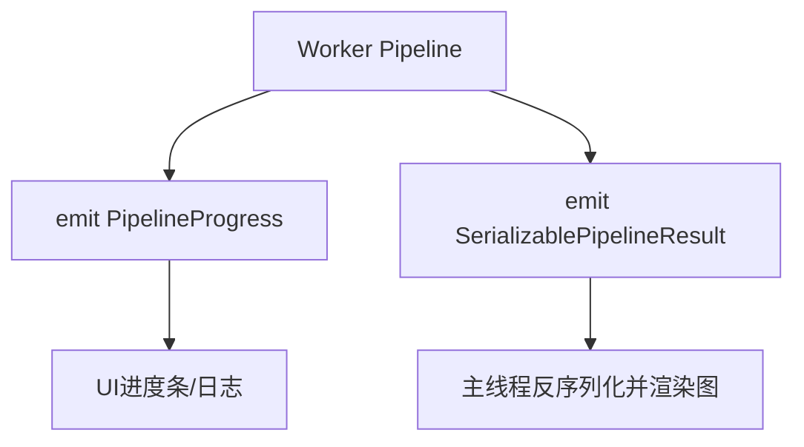
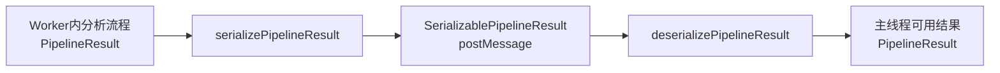
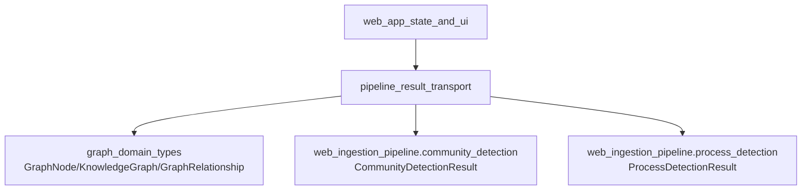
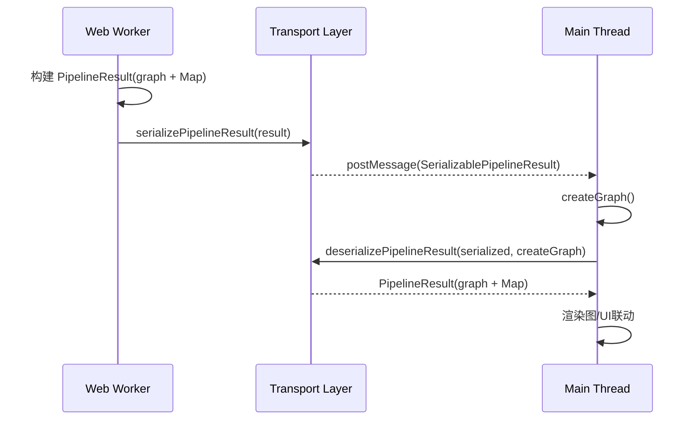

# pipeline_result_transport 模块文档

## 模块概述

`pipeline_result_transport` 模块定义了 Web 端分析流水线结果在**线程边界**之间传输时所需的核心类型与转换逻辑。它位于 `web_pipeline_and_storage` 领域中，承担的职责并不是“执行分析”，而是把分析阶段产出的复杂内存结构（尤其是 `KnowledgeGraph` 与 `Map`）安全、可预测地转换为可通过 `postMessage` 传输的数据，并在接收端恢复成可继续被业务代码消费的运行时结构。

这个模块存在的根本原因是浏览器 Worker 通信模型的约束：虽然结构化克隆（structured clone）支持很多内建对象，但在真实工程中，直接跨线程传递带方法的对象实例、含自定义原型的数据或强耦合运行时对象，往往会带来可维护性和一致性问题。该模块通过显式定义 `SerializablePipelineResult`，把“内部执行态”与“跨线程传输态”分离，降低了耦合，并让序列化/反序列化行为可测试、可审计。

从系统视角看，本模块是前端分析管线（见 [web_ingestion_pipeline.md](web_ingestion_pipeline.md)）与 UI/状态层（见 [web_app_state_and_ui.md](web_app_state_and_ui.md)）之间的“协议层”。它也与图模型定义（见 [graph_domain_types.md](graph_domain_types.md)）保持紧密关系，因为传输结构直接复用了 `GraphNode` 与 `GraphRelationship`。

---

## 设计目标与边界

该模块的设计目标是以最小语义损失完成结果传输，并保证主线程可以用统一方式恢复结果对象。它只负责类型定义和轻量转换，不负责图构建策略、社区检测算法、流程识别算法或存储落盘策略。这种边界划分让模块足够稳定：即使上游解析/推理流程升级，只要 `PipelineResult` 的关键契约不变，线程间传输机制无需频繁调整。

当前实现明确了两个世界：

- `PipelineResult`：流水线内部使用的原生结果对象，包含 `KnowledgeGraph`、`Map<string, string>`，以及可选的社区/流程检测结果。
- `SerializablePipelineResult`：用于 Worker 通信的扁平对象，避免传输 `Map` 或图实例方法。

这意味着该模块天然适合在“Worker 执行分析，主线程展示结果”的模式下复用，也适合未来扩展到“Service Worker / SharedWorker / iframe 通道”等需要显式数据协议的场景。

---

## 核心类型与函数详解

## `PipelinePhase`

`PipelinePhase` 是一个字符串联合类型，定义了流水线进度可能处于的阶段：

```ts
type PipelinePhase =
  | 'idle'
  | 'extracting'
  | 'structure'
  | 'parsing'
  | 'imports'
  | 'calls'
  | 'heritage'
  | 'communities'
  | 'processes'
  | 'enriching'
  | 'complete'
  | 'error';
```

这些阶段通常用于进度展示与状态机切换。阶段本身不带执行逻辑，但它是 UI 可观察性的关键锚点。特别是 `complete` 和 `error` 阶段，往往会触发界面模式切换（比如停止进度条、展示错误消息、允许用户下载结果等）。

## `PipelineProgress`

`PipelineProgress` 表示增量进度事件的数据结构：

```ts
interface PipelineProgress {
  phase: PipelinePhase;
  percent: number;
  message: string;
  detail?: string;
  stats?: {
    filesProcessed: number;
    totalFiles: number;
    nodesCreated: number;
  };
}
```

它的设计强调“既可给人看，也可给程序用”。`message` 和 `detail` 适合面向用户展示，`percent` 与 `stats` 适合渲染进度条和统计指标。需要注意的是，`percent` 在类型层面没有被限制为 `0~100`，调用方需要自行确保约束，否则 UI 可能出现越界显示。

## `PipelineResult`

`PipelineResult` 是流水线内部结果类型：

```ts
interface PipelineResult {
  graph: KnowledgeGraph;
  fileContents: Map<string, string>;
  communityResult?: CommunityDetectionResult;
  processResult?: ProcessDetectionResult;
}
```

`graph` 依赖图领域模型，包含节点、关系及添加方法；`fileContents` 保存文件内容快照并使用 `Map` 以便高效按路径索引。`communityResult` 与 `processResult` 是可选字段，表示某些后处理阶段可能未启用或尚未执行完成。

该类型最重要的语义是：它是“**运行时友好**”而非“**传输友好**”的数据结构。也就是说，它强调调用便利与后续处理能力，不直接追求可序列化性。

## `SerializablePipelineResult`

`SerializablePipelineResult` 是为跨线程传输设计的版本：

```ts
interface SerializablePipelineResult {
  nodes: GraphNode[];
  relationships: GraphRelationship[];
  fileContents: Record<string, string>;
}
```

它把 `KnowledgeGraph` 拆为纯数组，把 `Map` 转为普通对象。这一设计有两个直接收益：

1. 序列化行为更稳定，避免在不同运行环境下对复杂对象支持不一致。
2. 接收方无需依赖发送方的对象原型，仅根据字段重建即可。

需要注意的是，这个传输类型当前**不包含** `communityResult` 与 `processResult`。如果上游确实生成了这些数据，默认序列化过程会丢弃它们。这是一个明确的设计取舍，下文会详细讨论其影响与扩展方式。

## `serializePipelineResult(result)`

`serializePipelineResult` 将内部结果转换为可传输结构：

```ts
const serializePipelineResult = (result: PipelineResult): SerializablePipelineResult => ({
  nodes: result.graph.nodes,
  relationships: result.graph.relationships,
  fileContents: Object.fromEntries(result.fileContents),
});
```

工作机制很直接：节点和关系直接引用数组，文件内容通过 `Object.fromEntries` 从 `Map` 投影为对象字面量。这里的副作用很低，但调用方应理解它是“浅层转换”：如果节点属性内部包含可变对象，后续仍需在上层控制不可变性策略。

## `deserializePipelineResult(serialized, createGraph)`

`deserializePipelineResult` 负责在接收端恢复 `PipelineResult`：

```ts
const deserializePipelineResult = (
  serialized: SerializablePipelineResult,
  createGraph: () => KnowledgeGraph
): PipelineResult => {
  const graph = createGraph();
  serialized.nodes.forEach(node => graph.addNode(node));
  serialized.relationships.forEach(rel => graph.addRelationship(rel));

  return {
    graph,
    fileContents: new Map(Object.entries(serialized.fileContents)),
  };
};
```

这个函数不直接 `new` 图对象，而是通过 `createGraph` 注入构建逻辑。这是一个重要的可扩展点：你可以在不同运行环境中提供不同图实现（例如带去重策略、带索引策略或带调试钩子的实现），而不改动传输协议本身。

该函数重建出的结果同样不包含 `communityResult` 与 `processResult`。因此若业务依赖这两部分，需要在协议层扩展字段并同步修改序列化/反序列化函数。

---

## 进度事件与结果事件：双通道传输模型

在实际工程里，这个模块通常不是只传输一次“最终结果”，而是同时承载两类消息：`PipelineProgress`（高频、轻量、可覆盖）与 `SerializablePipelineResult`（低频、重载、一次性）。前者用于驱动 UI 的阶段反馈，后者用于在完成时一次性交付图数据和文件内容。



这个双通道模型的好处是显著的：在图数据构建尚未完成时，界面也能持续响应；而最终结果又能以稳定协议落地。对调用方来说，建议将两类消息在 message envelope 中显式区分（如 `type: progress | complete | error`），避免根据字段猜测消息类型。

---


## 架构关系



这条链路体现了模块的核心价值：把“计算态对象”转换成“传输态对象”，再恢复成“消费态对象”。发送端和接收端通过统一契约协作，避免直接共享复杂运行时对象导致的不确定行为。

---

## 与其他模块的依赖关系



`pipeline_result_transport` 在类型层依赖图模型和检测结果模型，但在传输结构上只实际承载图与文件内容。这种“声明依赖 > 实际传输字段”的现象并不矛盾：`PipelineResult` 作为内部类型需要完整表达能力，而 `SerializablePipelineResult` 作为协议类型追求最小必要集合。

若你需要了解图节点/边属性语义，请直接参考 [graph_domain_types.md](graph_domain_types.md)；若你要理解社区/流程结果如何计算，请参考 [web_ingestion_pipeline.md](web_ingestion_pipeline.md)，本文不重复算法细节。

---

## 数据流与生命周期



这个时序强调两件事。第一，`createGraph` 的调用发生在接收端，接收端拥有图实例化控制权。第二，跨线程边界前后数据结构会变化，但业务语义保持一致，即都表示“同一批节点、关系、文件内容”。

---

## 使用方式与代码示例

在 Worker 侧，典型写法如下：

```ts
import { serializePipelineResult } from '@/types/pipeline';

// analysisResult: PipelineResult
const payload = serializePipelineResult(analysisResult);
self.postMessage({ type: 'pipeline:complete', payload });
```

在主线程侧，典型写法如下：

```ts
import { deserializePipelineResult } from '@/types/pipeline';
import { createKnowledgeGraph } from '@/core/graph';

worker.onmessage = (event) => {
  if (event.data?.type !== 'pipeline:complete') return;

  const result = deserializePipelineResult(event.data.payload, createKnowledgeGraph);
  // result.graph / result.fileContents 可直接用于后续逻辑
};
```

如果你的图实现需要额外初始化（例如建立反向索引），可以在 `createGraph` 内统一封装：

```ts
const createGraph = () => {
  const g = createKnowledgeGraph();
  // g.enableIndex?.();
  return g;
};
```

---

## 扩展与定制建议

如果你计划把 `communityResult`、`processResult` 也跨线程传输，推荐按以下方式演进：先在 `SerializablePipelineResult` 中新增可选字段，再同步更新序列化与反序列化逻辑，最后在消息版本号或特征字段上做好前后兼容。这样可以避免主线程和 Worker 版本不一致时直接崩溃。

同时建议把“协议版本”作为消息包装层字段，例如：

```ts
type PipelineMessageV1 = {
  version: 1;
  payload: SerializablePipelineResult;
};
```

这样在未来字段扩展或重命名时，可以通过版本分流解析器，降低线上灰度发布风险。

---

## 边界条件、错误场景与已知限制

当前实现简单清晰，但也有几个必须注意的约束。

第一，`deserializePipelineResult` 假设输入数据结构可信。如果 `serialized.nodes` 或 `serialized.relationships` 含非法字段，错误会在 `graph.addNode` / `graph.addRelationship` 处暴露。因此在不可信来源下，必须在反序列化前做 schema 校验。

第二，`fileContents` 使用 `Record<string, string>` 时，键会被当作普通对象属性处理。极端情况下，若键名与对象原型属性冲突，可能导致不可预期行为。工程上可通过 `Object.create(null)` 或显式键名规范规避。

第三，`PipelineProgress.percent` 无边界约束，`stats` 也不是必填。UI 层必须容忍缺失字段并自行做归一化处理。

第四，`SerializablePipelineResult` 当前丢弃社区/流程检测结果。这不是 bug，而是协议能力限制；但如果业务端默认认为这些字段一定存在，就会产生“静默缺失”问题。

第五，图恢复顺序默认是先节点后关系，这与常见图约束一致。若 `relationships` 引用了不存在节点，`createGraph` 返回的实现可能抛错，也可能静默忽略，取决于图实现策略。建议在图实现中统一定义该行为并记录日志。

---

## 测试建议

建议至少覆盖三类测试。其一是“往返一致性”测试：`PipelineResult -> serialize -> deserialize` 后，节点数、关系数、文件数与关键字段应一致。其二是“异常输入”测试：缺字段、空数组、非法关系引用等情况要验证是否按预期报错。其三是“兼容性”测试：当协议扩展新字段时，旧版解析逻辑是否仍能安全运行。

---

## 总结

`pipeline_result_transport` 是一个体量小但关键性很高的模块。它通过显式类型契约和双向转换函数，稳定地连接了 Web Worker 分析执行与主线程结果消费两个世界。理解它的关键不在于算法复杂度，而在于数据契约边界：什么是内部态，什么是传输态，哪些字段必须保真，哪些字段可按需扩展。只要围绕这一边界持续演进，你就能在不牺牲可维护性的前提下，让分析管线在多线程 Web 架构中持续扩展。
