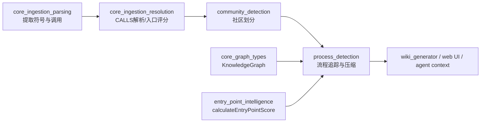
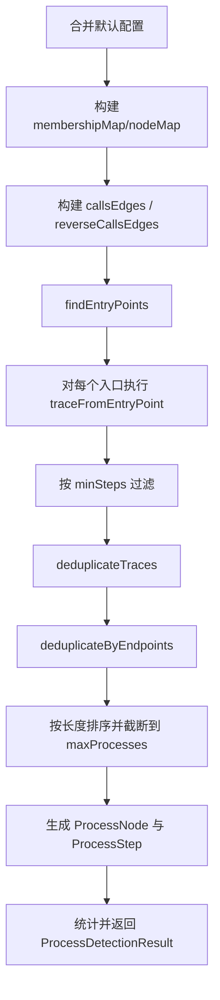
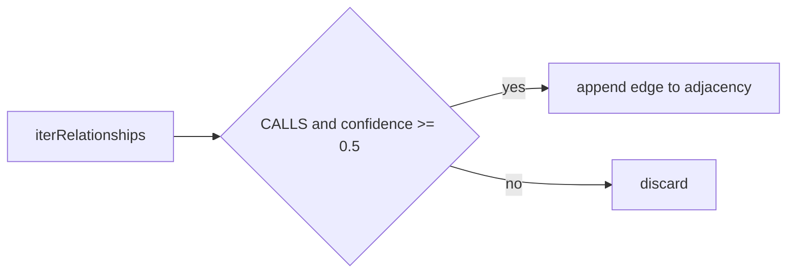
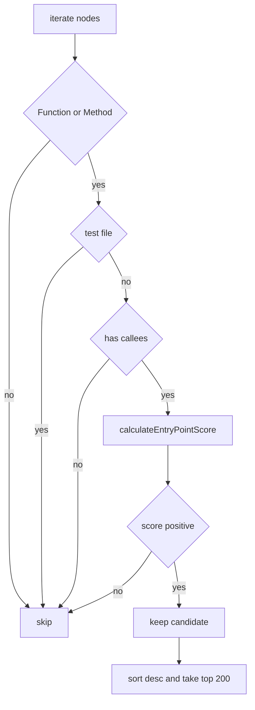
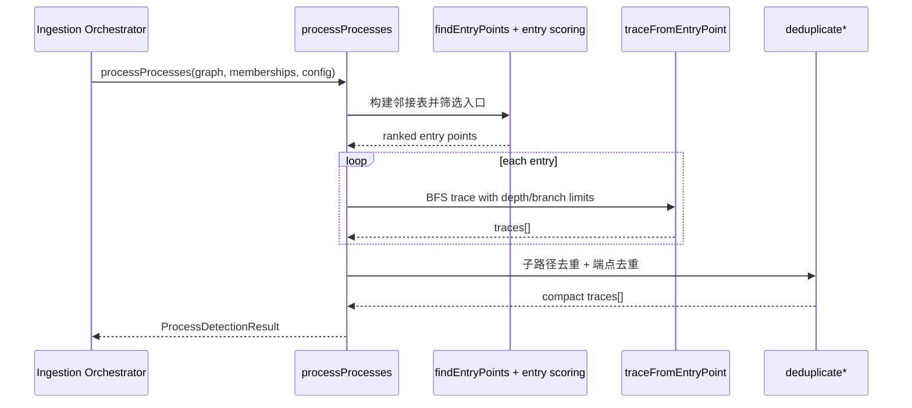
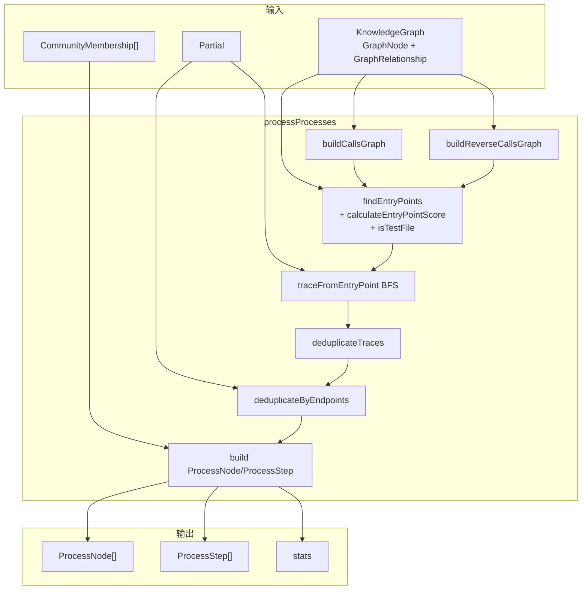

# process_detection 模块文档

## 模块定位与设计动机

`process_detection`（对应实现文件 `gitnexus/src/core/ingestion/process-processor.ts`）是 GitNexus ingestion 语义提炼阶段中的关键模块。它的目标不是做运行时级别的精确控制流分析，而是在已有静态知识图谱（`KnowledgeGraph`）之上，提炼出“对工程理解有用”的执行路径。换句话说，它关注的是“开发者和智能体如何快速理解业务流程”，而不是“编译器如何证明路径必然可达”。

在系统分层上，这个模块位于解析与解析后解析（resolution）之后，社区发现（community detection）之后。它依赖上游已经建立好的 `CALLS` 关系、节点属性（如 `name`、`filePath`、`isExported`）、以及 `CommunityMembership`，然后输出结构化流程对象（`ProcessNode[]`）和步骤对象（`ProcessStep[]`）。这些结果会被后续 wiki 生成、图可视化和 agent 上下文组织消费，用于回答“功能从哪里进入、经过哪些核心调用、在哪个边界结束”。

从设计哲学看，本模块采用了“可解释优先 + 规模受控 + 噪声抑制”的策略：先通过入口评分选择高价值起点，再用受限 BFS 扩展，再做两轮去重与截断，最终得到数量可控、长度适中、可展示的流程集合。

---

## 在整体系统中的位置



`process_detection` 的输入质量高度依赖上游。如果 `CALLS` 边召回不足，流程会显著变短或变少；如果调用解析噪声高，则可能出现跨域跳跃路径。因此排查流程质量问题时，不应只看本模块，也应联动检查 [`call_resolution.md`](call_resolution.md)、[`entry_point_intelligence.md`](entry_point_intelligence.md) 和 [`core_graph_types.md`](core_graph_types.md)。社区标签相关行为可参考 [`community_detection.md`](community_detection.md)。

---

## 核心数据模型

## `ProcessDetectionConfig`

`ProcessDetectionConfig` 控制了搜索空间和输出规模，是“质量-性能”平衡的核心旋钮。

```ts
export interface ProcessDetectionConfig {
  maxTraceDepth: number;  // 默认 10
  maxBranching: number;   // 默认 4
  maxProcesses: number;   // 默认 75
  minSteps: number;       // 默认 3
}
```

当前默认值中最值得注意的是 `minSteps=3`。这体现了模块作者的明确取舍：两跳（`A -> B`）不算“真正流程”，至少要三步才被视为多跳执行链，减少了“弱信息路径”的占比。

## `ProcessNode`

`ProcessNode` 表示一条被提炼后的流程。

```ts
export interface ProcessNode {
  id: string;
  label: string;
  heuristicLabel: string;
  processType: 'intra_community' | 'cross_community';
  stepCount: number;
  communities: string[];
  entryPointId: string;
  terminalId: string;
  trace: string[];
}
```

该结构里 `trace` 是最原始证据，包含完整有序节点序列；`entryPointId` 与 `terminalId` 用于快速定位边界；`communities` 和 `processType` 帮助上层判断流程是否跨职责域。`label`/`heuristicLabel` 来自“入口名 → 终点名”的启发式拼接，强调可读性而非严格语义。

## `ProcessStep`

`ProcessStep` 把一条流程拆成可索引的步骤记录。

```ts
export interface ProcessStep {
  nodeId: string;
  processId: string;
  step: number; // 1-indexed
}
```

`step` 从 1 开始，这一点对 UI 时间线和导出到外部系统时非常重要，避免与 0-index 系统混淆。

## `ProcessDetectionResult`

`ProcessDetectionResult` 是模块对外唯一汇总输出。

```ts
export interface ProcessDetectionResult {
  processes: ProcessNode[];
  steps: ProcessStep[];
  stats: {
    totalProcesses: number;
    crossCommunityCount: number;
    avgStepCount: number;
    entryPointsFound: number;
  };
}
```

`stats` 既用于展示，也可作为健康度监控指标。例如 `entryPointsFound` 断崖式下降通常意味着上游调用解析或过滤策略发生变化。

---

## 主流程：`processProcesses(...)`

```ts
processProcesses(
  knowledgeGraph: KnowledgeGraph,
  memberships: CommunityMembership[],
  onProgress?: (message: string, progress: number) => void,
  config: Partial<ProcessDetectionConfig> = {}
): Promise<ProcessDetectionResult>
```

这是模块编排入口，负责执行完整流程检测管线。它的行为是纯计算型的，不会修改输入 `knowledgeGraph`。



这套流程的关键设计是“先扩展候选，再压缩代表集”。模块允许追踪到 `maxProcesses * 2` 条候选轨迹，之后再做去重和按长度优先的截断。这有助于减少“过早剪枝导致高价值路径丢失”的问题。

---

## 关键内部函数详解

## `buildCallsGraph(graph)` 与 `buildReverseCallsGraph(graph)`

这两个函数把 `KnowledgeGraph` 关系集转换为邻接表，分别表示正向调用与反向调用。它们只接收 `rel.type === 'CALLS'` 且 `rel.confidence >= 0.5` 的边。



`MIN_TRACE_CONFIDENCE=0.5` 是一个非常实用的噪声阈值：它主动过滤低置信度模糊匹配边（如注释中提到的 fuzzy-global 0.3），减少流程“跳到不相关区域”的概率。

## `findEntryPoints(graph, reverseCallsEdges, callsEdges)`

入口发现只考虑 `Function` 和 `Method`。每个候选必须满足“非测试文件”且“至少有一个出边调用”，然后调用 `calculateEntryPointScore(...)` 评分，取分数大于 0 的候选，按降序选前 200 个。



这一步将“图结构信号 + 命名/导出/框架启发式”合并，是流程质量的首要决定因素。评分细节请参考 [`entry_point_intelligence.md`](entry_point_intelligence.md)。

## `traceFromEntryPoint(entryId, callsEdges, config)`

该函数从入口节点执行 BFS，并在每个队列项中携带“完整路径”。它通过三类条件终止当前分支：没有后继、达到最大深度、或者所有候选后继都导致环。

算法中有三个实用约束：

- 每个节点只追 `maxBranching` 个后继，限制横向爆炸。
- 路径内通过 `path.includes(calleeId)` 做环检测，避免显式循环。
- 单入口最多保留 `maxBranching * 3` 条路径，进一步限制产量。

这使得算法在大型图上仍可控，但也意味着它是“代表性抽样”而不是“穷举所有可达路径”。

## `deduplicateTraces(traces)`

这一步先按长度降序，然后用“短路径是否为长路径子串”规则去掉冗余路径。其目标是保留长链路，移除被覆盖的短链路。

需要注意，当前实现使用字符串拼接后 `includes` 判断子集，这在某些 ID 模式下可能出现误判（例如 token 边界重叠）。如果将来要提高严格性，建议改为基于数组窗口匹配而非字符串包含。

## `deduplicateByEndpoints(traces)`

这一步对 `entry -> terminal` 端点对做去重，只保留同端点中最长路径。它体现了“面向 agent 消费”的实用主义：同起止点的多条变体路径在很多问答场景中价值接近，保留最长代表路径即可压缩信息量。

## `capitalize` 与 `sanitizeId`

这两个工具函数用于标签和 ID 生成。`sanitizeId` 仅保留字母数字、转小写并截断到 20 字符，能够提升可读性，但会丢失区分度。因此如果你需要跨版本稳定且全局唯一的流程 ID，建议在上层再引入 trace 哈希。

---

## 组件交互图（运行时视角）



从这个交互可以看出，本模块本质是“离线批处理型”算法，不依赖外部 I/O；唯一外部副作用是开发环境下的调试日志与进度回调。

---

## 使用方式与配置建议

最常见调用方式如下：

```ts
import { processProcesses } from './core/ingestion/process-processor.js';

const result = await processProcesses(
  knowledgeGraph,
  communityMemberships,
  (msg, p) => console.log(`[process] ${p.toFixed(0)}% ${msg}`),
  {
    maxTraceDepth: 12,
    maxBranching: 3,
    maxProcesses: 100,
    minSteps: 3,
  }
);

console.log(result.stats);
```

对于不同规模仓库，可以采用如下调优思路：

- 中小仓库希望“看全一点”时，可适度提高 `maxProcesses` 和 `maxTraceDepth`。
- 大仓库或在线场景优先控制延迟时，应先降低 `maxBranching`，再视情况降低 `maxTraceDepth`。
- 如果结果过于碎片化，通常提高 `minSteps` 比盲目加深搜索更有效。

---

## 扩展点与二次开发建议

该模块当前是规则驱动实现，扩展空间主要集中在三个方向。第一是入口筛选策略，可加入更多业务域特征（例如目录白名单、注解语义）并复用 `entry-point-scoring` 的 `reasons` 做可解释输出。第二是路径采样策略，可将“仅取前 N 个后继”升级为按边置信度排序或按社区跨度优先。第三是去重策略，可从字符串包含改为图同构近似或编辑距离聚类，以更稳健地处理复杂路径变体。

如果你计划在 Web 端复用同样能力，可对照 [`process_detection_and_entry_scoring.md`](process_detection_and_entry_scoring.md) 了解前端同类实现约束。

---

## 边界条件、错误风险与已知限制

以下问题在维护和调优时最容易被忽略：

1. **并非真实运行时流程**：结果基于静态 `CALLS` 图，无法表达动态分派、反射、运行时注入、条件分支概率等。
2. **路径顺序依赖邻接表插入顺序**：`maxBranching` 是“切前 N 个”，若上游边顺序变化，输出可能波动。
3. **存在重复进度回调**：`20%` 阶段消息在当前实现里调用了两次，不影响结果但可能影响 UI 体验。
4. **`visited` 变量未使用**：`traceFromEntryPoint` 中声明了 `visited` 但未参与逻辑，说明实现曾演进，未来可清理。
5. **社区缺失时的类型偏差**：若 `memberships` 不完整，`communities` 可能为空，但 `processType` 会落到 `intra_community`，语义上更接近“unknown”。
6. **去重误判风险**：`deduplicateTraces` 使用字符串 `includes`，在极端 ID 命名下可能把非子路径误判为子路径。
7. **ID 稳定性有限**：`processId` 含索引位次，受排序和截断影响，不适合做长期持久引用主键。

---

## 维护者速查：当结果异常时先看什么

当你遇到“流程数量突然下降”或“路径看起来不合理”时，建议按顺序检查：先看 `CALLS` 边质量与置信度分布，再看入口评分命中情况（`entry_point_intelligence` 的 `reasons`），最后再调 `maxBranching/maxTraceDepth/minSteps`。实践中，大多数问题都出在上游关系质量而非 BFS 本身。

---

## 参考文档

- 图模型定义：[`core_graph_types.md`](core_graph_types.md)
- 入口评分与框架识别：[`entry_point_intelligence.md`](entry_point_intelligence.md)
- 调用关系解析：[`call_resolution.md`](call_resolution.md)
- 社区检测：[`community_detection.md`](community_detection.md)
- Web 侧对应实现：[`process_detection_and_entry_scoring.md`](process_detection_and_entry_scoring.md)


## API 参考（函数与类型的参数、返回值、副作用）

### `processProcesses(...)`

`processProcesses` 是本模块唯一导出的主入口。它接收 `KnowledgeGraph` 与社区归属信息，返回可直接落库或渲染的流程检测结果。

```ts
export const processProcesses = async (
  knowledgeGraph: KnowledgeGraph,
  memberships: CommunityMembership[],
  onProgress?: (message: string, progress: number) => void,
  config: Partial<ProcessDetectionConfig> = {}
): Promise<ProcessDetectionResult>
```

参数层面，`knowledgeGraph` 必须包含可迭代节点与关系（依赖 `iterNodes/iterRelationships`），并且 `CALLS` 关系的 `confidence` 字段可用于阈值过滤。`memberships` 是节点到社区的映射，允许不完整；若缺失，不会抛错，但会影响 `communities` 与 `processType` 的语义准确性。`onProgress` 是可选回调，模块会在多个阶段发送进度消息，数值区间是 0 到 100。`config` 支持部分覆盖，未提供的项回退到默认配置。

返回值 `ProcessDetectionResult` 包含三部分：`processes`（流程实体）、`steps`（流程展开步骤）、`stats`（统计摘要）。其中 `steps` 与 `processes` 一一对应但以“扁平事件流”组织，便于图数据库关系写入或前端时间线渲染。

副作用方面，这个函数不会修改输入图结构；它的可观察副作用仅有两种：一是通过 `onProgress` 推送阶段性消息；二是在 `NODE_ENV=development` 且有候选入口时输出 Top 10 调试日志。

### `ProcessDetectionConfig`

`ProcessDetectionConfig` 并非简单的“性能参数”，而是结果语义边界的一部分。`maxTraceDepth` 决定流程“纵向长度上限”；`maxBranching` 决定每步“横向扩展上限”；`maxProcesses` 决定最终保留的代表流程数量；`minSteps` 决定什么样的链路才算“流程”。

如果你把 `minSteps` 从 3 降到 2，会明显增加“薄流程”（单次调用关系）的比例，适合调试调用连通性，不适合直接面向产品展示。若提高 `maxBranching`，结果覆盖率可能上升，但噪声和计算成本通常同步上升。

### `ProcessNode`

`ProcessNode` 是流程级聚合对象。`id` 是模块内部生成标识，强调可读和本次运行内唯一，不保证跨运行稳定。`heuristicLabel` 与 `label` 目前同值，来自入口函数名与终点函数名拼接，主要服务人类阅读。`trace` 保存全路径节点 ID，有助于上层做反向定位（例如跳转到代码符号或图节点）。

`processType` 由流程触达社区数推导，取值只分 `intra_community` 与 `cross_community`。这一定义非常实用，但要注意它依赖社区归属完整性；若社区输入缺失，它可能“看起来是单社区”，而非真实单社区。

### `ProcessStep`

`ProcessStep` 表示“某节点在某流程的第几步”。由于同一节点可出现在不同流程中，所以主键语义通常是 `(processId, step)` 或 `(processId, nodeId, step)` 的组合，而不是单独 `nodeId`。`step` 从 1 开始，便于和产品语言中的“第 1 步、第 2 步”直接对应。

### `ProcessDetectionResult`

`ProcessDetectionResult.stats` 提供轻量观测信号。`totalProcesses` 用于评估压缩后产物规模；`crossCommunityCount` 用于衡量跨边界耦合；`avgStepCount` 反映流程平均长度；`entryPointsFound` 则可用于监控入口识别阶段是否发生突变。

在持续集成场景中，维护者可以为这四个指标建立基线区间。一旦出现越界（例如 `entryPointsFound` 突降到历史均值的 20% 以下），可自动触发回归检查。

---

## 依赖关系与数据流（细化视图）



这个数据流反映了一个关键事实：社区信息只在“流程标注阶段”参与，不影响“路径搜索阶段”。也就是说，社区划分不会改变路径本身，只影响流程的分类标签与跨域统计。因此当你观察到路径本体异常（例如明显跳跃），优先排查 `CALLS` 边质量和入口评分，而不是社区算法。

---

## 配置模板（按场景）

下面给出三个常见配置模板，便于在不同运行模式下快速落地。

```ts
// 1) 默认均衡（推荐起点）
const balanced: Partial<ProcessDetectionConfig> = {
  maxTraceDepth: 10,
  maxBranching: 4,
  maxProcesses: 75,
  minSteps: 3,
};

// 2) 探索优先（离线分析）
const exploratory: Partial<ProcessDetectionConfig> = {
  maxTraceDepth: 14,
  maxBranching: 5,
  maxProcesses: 150,
  minSteps: 3,
};

// 3) 延迟优先（交互式/UI）
const lowLatency: Partial<ProcessDetectionConfig> = {
  maxTraceDepth: 8,
  maxBranching: 2,
  maxProcesses: 40,
  minSteps: 3,
};
```

这些模板的本质差异在于“搜索广度与深度预算”。对于在线产品，通常应先压缩 `maxBranching` 再压缩 `maxTraceDepth`，因为横向扩展更容易触发组合爆炸。

---

## 可扩展实现示例：按边置信度排序再截断分支

当前实现在 `traceFromEntryPoint` 中直接对邻接数组 `slice(0, maxBranching)`，因此默认依赖边的输入顺序。若你希望结果更稳定，可以在构建邻接表阶段记录 `(targetId, confidence)` 并按置信度降序后再截断。

```ts
// 示例思路（伪代码）
const outgoing = getOutgoingWithConfidence(currentId)
  .sort((a, b) => b.confidence - a.confidence)
  .slice(0, config.maxBranching);
```

这种改法通常能减少“顺序抖动导致流程抖动”的问题，但也会增强“高置信度局部路径”的偏置。是否采用取决于你的业务目标：是追求稳定可复现，还是追求覆盖潜在边缘路径。

---

## 与相关模块的边界说明

`process_detection` 不负责产生 `CALLS` 边，也不负责社区划分，只消费它们；它也不负责把结果写入存储层。如果你需要理解“调用边如何解析出来”，请阅读 [`call_resolution.md`](call_resolution.md) 与 [`import_resolution.md`](import_resolution.md)。如果你需要理解“流程结果如何进入可视化或文档生成”，请阅读 [`core_wiki_generator.md`](core_wiki_generator.md) 与 [`web_ingestion_pipeline.md`](web_ingestion_pipeline.md)。
