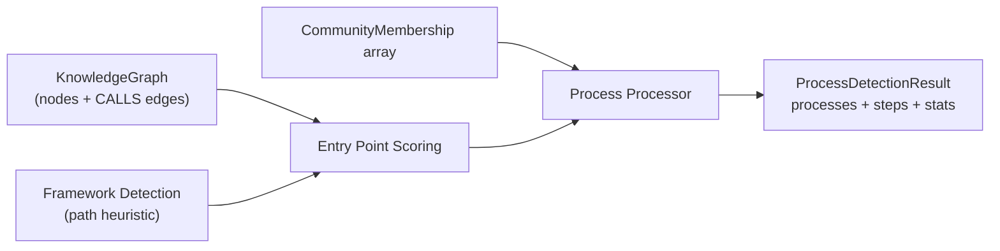
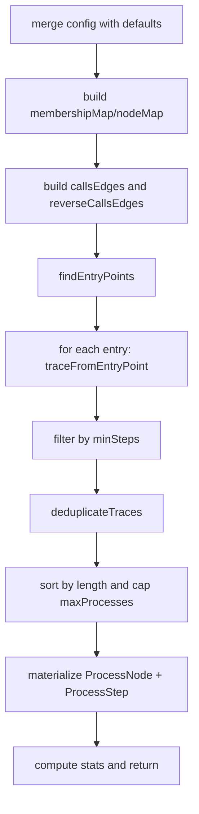
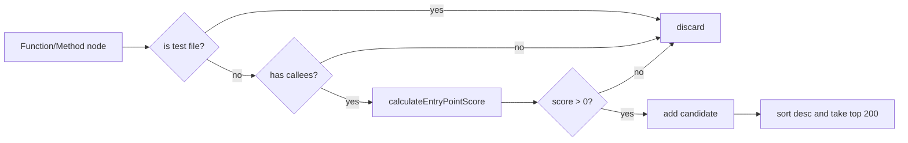
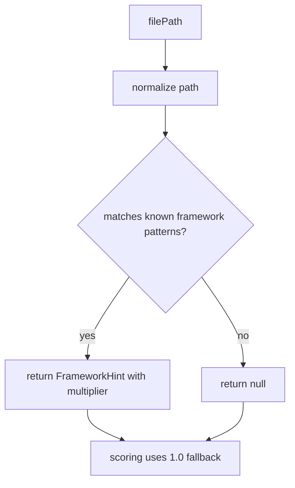
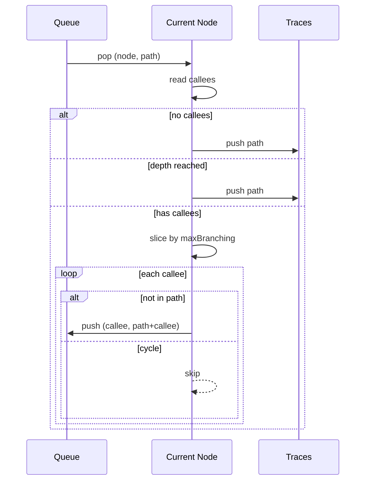

# process_detection_and_entry_scoring

## 模块概述

`process_detection_and_entry_scoring` 模块位于 `gitnexus-web/src/core/ingestion`，承担了“从静态代码关系图中推断可解释执行流程”的关键职责。它的核心目标不是做精确运行时追踪，而是基于 `CALLS` 关系、节点语义信息（函数名、导出状态、文件路径、语言）以及社区划分结果，构建一组**足够有用、可用于导航和问答的流程（Process）**。这类流程结果通常被上层 UI、图可视化、以及智能体上下文构建使用，用于回答“某个功能是怎么走到这里的”。

从设计上看，这个模块把问题拆成三个阶段：

首先，它用 `entry-point-scoring` 对可能的入口函数打分，筛出“更像业务入口”的候选节点。其次，它在 `process-processor` 中从这些入口沿着 `CALLS` 边做受限 BFS，生成多条路径，并做去重压缩。最后，它结合 `community_detection` 输出的成员关系，为流程打上跨社区/社区内标签，形成可消费的 `ProcessDetectionResult`。

这意味着该模块并不依赖 AST 细节，而依赖于上游已经构建好的 `KnowledgeGraph`（见 [graph_domain_types.md](graph_domain_types.md)）和调用关系解析结果（见 [symbol_indexing_and_call_resolution.md](symbol_indexing_and_call_resolution.md)）。它是 ingestion pipeline 中偏“语义提炼”的一层，而不是基础解析层。

---

## 核心组件一览

本模块（当前文档范围）包含以下核心类型：

- `ProcessDetectionConfig`
- `ProcessNode`
- `ProcessStep`
- `ProcessDetectionResult`
- `EntryPointScoreResult`
- `FrameworkHint`

以及三个关键函数簇：

- 流程检测主函数：`processProcesses(...)`
- 入口评分函数：`calculateEntryPointScore(...)`
- 框架识别函数：`detectFrameworkFromPath(...)`

---

## 在系统中的位置与依赖关系



`process-processor` 直接读取 `KnowledgeGraph.relationships` 中的 `CALLS` 边来构建邻接表；`entry-point-scoring` 提供候选入口排序能力；`framework-detection` 为评分提供路径语义增强；`CommunityMembership[]` 用于给流程标记社区跨度。最终输出的 `ProcessDetectionResult` 是一个结构化中间产物，可被图渲染、流程图生成或 LLM context 组织模块消费。

如果你需要先理解图模型字段，请先阅读 [graph_domain_types.md](graph_domain_types.md)。如果你在排查 CALLS 关系质量问题，建议联动查看 [symbol_indexing_and_call_resolution.md](symbol_indexing_and_call_resolution.md)。

---

## 详细组件说明

## `ProcessDetectionConfig`

`ProcessDetectionConfig` 决定了流程搜索的“深度、宽度和产量上限”，是控制性能与结果质量平衡的核心开关。

```ts
export interface ProcessDetectionConfig {
  maxTraceDepth: number;
  maxBranching: number;
  maxProcesses: number;
  minSteps: number;
}
```

默认值为：

```ts
const DEFAULT_CONFIG = {
  maxTraceDepth: 10,
  maxBranching: 4,
  maxProcesses: 75,
  minSteps: 2,
};
```

这套默认参数体现了一个偏保守设计：

- `maxTraceDepth=10` 防止超深调用链导致组合爆炸。
- `maxBranching=4` 在每个节点只追前几个分支，控制宽度。
- `maxProcesses=75` 限制最终输出规模，便于 UI 消费。
- `minSteps=2` 避免把“只有单节点”的路径当流程。

在大型仓库中，如果你发现“流程太少”，通常先提高 `maxProcesses`，再考虑提高 `maxTraceDepth`。如果你发现运行变慢或结果噪声高，优先降低 `maxBranching`。

---

## `ProcessNode`

`ProcessNode` 是“流程”本身的抽象对象，对应一条代表性 trace：

```ts
export interface ProcessNode {
  id: string;
  label: string;
  heuristicLabel: string;
  processType: 'intra_community' | 'cross_community';
  stepCount: number;
  communities: string[];
  entryPointId: string;
  terminalId: string;
  trace: string[];
}
```

该结构的重要字段含义如下：

- `trace` 保存完整有序节点 ID 路径，是最原始、可复现的流程证据。
- `entryPointId` 和 `terminalId` 让上层可快速定位起止节点。
- `communities` 与 `processType` 体现该流程是否跨越多个代码社区。
- `heuristicLabel`（与 `label` 当前同值）由“入口函数名 → 终点函数名”拼接生成，便于展示。

`id` 形如 `proc_${idx}_${sanitizeId(entryName)}`，具备可读性但并不保证跨运行稳定（因为 `idx` 受排序与截断影响）。如果业务需要稳定 ID，建议在上层额外构造基于 `trace` 哈希的标识。

---

## `ProcessStep`

`ProcessStep` 将流程拆解为“流程-节点-序号”三元组，用于关系建模或序列化输出：

```ts
export interface ProcessStep {
  nodeId: string;
  processId: string;
  step: number; // 1-indexed
}
```

该结构通常用于：

- 在图数据库中表达“节点属于流程，且位于第几步”；
- 在 UI 中按 step 渲染流程时间线；
- 与其它数据（如代码引用）做 step-level 关联。

注意 `step` 从 1 开始计数。

---

## `ProcessDetectionResult`

`ProcessDetectionResult` 是 `processProcesses(...)` 的最终输出：

```ts
export interface ProcessDetectionResult {
  processes: ProcessNode[];
  steps: ProcessStep[];
  stats: {
    totalProcesses: number;
    crossCommunityCount: number;
    avgStepCount: number;
    entryPointsFound: number;
  };
}
```

`stats` 提供了一个快速质量概览：入口数量、流程总数、跨社区数量、平均长度。它既适合用户展示，也适合流水线监控（例如检测某次提交后流程数量异常下降）。

---

## `EntryPointScoreResult`

`EntryPointScoreResult` 是入口评分函数的返回值：

```ts
export interface EntryPointScoreResult {
  score: number;
  reasons: string[];
}
```

这里的 `reasons` 非常关键，它不是仅用于调试日志，还可作为可解释性输出的一部分。比如你可以看到某候选被打高分，是因为 `exported + entry-pattern + framework:*` 叠加，而不是黑盒排序。

---

## `FrameworkHint`

`FrameworkHint` 来自路径模式识别：

```ts
export interface FrameworkHint {
  framework: string;
  entryPointMultiplier: number;
  reason: string;
}
```

当框架未识别时函数返回 `null`，评分流程自动退化为 multiplier=1.0（无奖励、无惩罚），保证新特性不会破坏旧行为。

---

## 核心流程：`processProcesses(...)`

```ts
processProcesses(
  knowledgeGraph,
  memberships,
  onProgress?,
  config?
): Promise<ProcessDetectionResult>
```

这是整个模块的编排入口。内部步骤可以概括为：构图 → 找入口 → BFS 追踪 → 去重 → 产出流程与步骤。



这个编排中最值得注意的是“先放大、后压缩”的策略：

- 追踪阶段允许累计到 `cfg.maxProcesses * 2` 条 trace；
- 去重后按长度优先截断到 `cfg.maxProcesses`。

这样做的直觉是，先保留冗余样本，再通过去重和排序提炼代表性长路径，避免过早截断损失重要流程。

### 参数与副作用

- `knowledgeGraph`: 必需；若 CALLS 边缺失，流程会显著减少。
- `memberships`: 可为空数组，但会导致大部分流程归类为 `intra_community`（或无社区）。
- `onProgress`: 可选进度回调；模块会在多个阶段调用。
- `config`: 局部覆盖默认配置。

函数本身不修改输入图，但会在 DEV 环境打印入口候选调试日志（通过 `findEntryPoints` 内部逻辑）。

---

## 入口发现与评分机制

入口发现由 `findEntryPoints(...)` 驱动，它只考虑 `Function` 与 `Method` 节点，并在候选前置阶段做硬过滤：

1. 测试文件直接跳过（`isTestFile(filePath)`）。
2. 没有出边（`calleeCount===0`）的函数跳过。
3. 评分 `score>0` 的节点保留。

随后按分数降序排序，最多取 200 个入口。



### `calculateEntryPointScore(...)` 评分公式

最终分数：

`finalScore = baseScore × exportMultiplier × nameMultiplier × frameworkMultiplier`

其中：

- `baseScore = calleeCount / (callerCount + 1)`，偏好“调别人多、被调少”的节点。
- `exportMultiplier`: 导出函数为 `2.0`，否则 `1.0`。
- `nameMultiplier`: 命中入口命名模式加分（`1.5`），命中工具函数模式重罚（`0.3`）。
- `frameworkMultiplier`: 从路径检测框架，按约定加权（例如 Next.js page、Laravel routes 常见为 `3.0`）。

### 命名模式覆盖范围

该模块内置了跨语言的正负模式规则：

- 正向入口模式覆盖 JavaScript/TypeScript、Python、Java、C#、Go、Rust、C/C++、PHP 等。
- 负向工具模式统一惩罚，如 `get*/set*`、`format*`、`*Util`、`helpers` 等。

这使得它在多语言仓库中具备基础可用性，但它本质仍是启发式规则，不应被当成“语义真值”。

---

## 框架感知：`detectFrameworkFromPath(...)`

`framework-detection` 只基于文件路径判断框架语境，不解析 AST。它覆盖了常见 Web/服务端生态，例如：

- Next.js Pages/App Router/API Route
- Express/MVC 目录约定
- Django/FastAPI/Flask 常见路径
- Spring/ASP.NET Controller 约定
- Go/Rust/C/C++ 主入口文件
- Laravel routes/controllers/jobs/listeners/middleware 等



这种设计的重要价值在于“渐进增强”：当路径匹配失败时不会破坏流程生成，仅仅失去额外加权。

---

## 路径追踪算法细节：`traceFromEntryPoint(...)`

追踪使用 BFS 队列，每个队列元素携带完整路径。算法特性如下：

- 终止条件：无后继、到达最大深度、或队列耗尽。
- 分支截断：每个节点只取前 `maxBranching` 个 callees。
- 环检测：通过 `path.includes(calleeId)` 避免显式回环。
- 追踪条数上限：`traces.length < config.maxBranching * 3`。



需要注意，该 BFS 并不是“遍历全部可达路径”的完整算法，而是有意做了宽度和数量剪枝，以换取可控性能。

---

## 去重策略：`deduplicateTraces(...)`

去重逻辑按路径长度降序处理，并用字符串包含关系判断“短路径是否是长路径子串”。若是则丢弃短路径。

这是一种轻量级近似去重，优点是实现简单、速度快，缺点是可能出现误判。例如不同节点 ID 拼接后形成偶然子串匹配，理论上会误去重（虽然在 `id->id->...` 结构下概率较低）。

如果你在高精度场景使用，建议改为“基于数组窗口匹配”的严格子序列判断。

---

## 使用方式与示例

### 基础调用示例

```ts
import { processProcesses } from 'gitnexus-web/src/core/ingestion/process-processor';

const result = await processProcesses(
  knowledgeGraph,
  communityMemberships,
  (msg, p) => console.log(`[process] ${p.toFixed(0)}% ${msg}`),
  {
    maxTraceDepth: 12,
    maxBranching: 3,
    maxProcesses: 100,
    minSteps: 2,
  }
);

console.log(result.stats);
```

### 单点评分示例

```ts
import { calculateEntryPointScore } from 'gitnexus-web/src/core/ingestion/entry-point-scoring';

const score = calculateEntryPointScore(
  'handleLogin',
  'typescript',
  true,
  2,   // callers
  8,   // callees
  'src/app/api/auth/route.ts'
);

// score.score: number
// score.reasons: ['base:2.67', 'exported', 'entry-pattern', 'framework:nextjs-api-route']
```

### 框架识别示例

```ts
import { detectFrameworkFromPath } from 'gitnexus-web/src/core/ingestion/framework-detection';

const hint = detectFrameworkFromPath('app/users/page.tsx');
// => { framework: 'nextjs-app', entryPointMultiplier: 3.0, reason: 'nextjs-app-page' }
```

---

## 扩展与定制建议

如果你计划扩展本模块，推荐按以下方向演进：

- 新语言支持：在 `ENTRY_POINT_PATTERNS` 中增加语言键与规则，并同步补充测试文件规则。
- 新框架支持：在 `detectFrameworkFromPath` 中新增路径约定分支，保持“未命中返回 null”的兼容策略。
- 精细去重：将字符串包含改为结构化子路径判断。
- 稳定流程 ID：引入基于 trace 的 hash 以支持跨版本对齐。

此外，`framework-detection.ts` 已预留 `FRAMEWORK_AST_PATTERNS` 常量，表明未来可能进入 AST 级框架识别阶段。那时可以将路径启发式与注解/装饰器证据融合，降低误判。

---

## 边界条件、错误场景与限制

这个模块总体是“容错但启发式”的，常见注意点如下：

- 当 `KnowledgeGraph` 缺少高质量 `CALLS` 边时，流程结果会变少或偏离真实业务路径。
- `findEntryPoints` 只看 `Function/Method` 标签；如果某语言入口建模成其它 label，会被忽略。
- `isTestFile` 采用路径规则，存在漏判与误判的可能，尤其是非约定目录结构。
- `traceFromEntryPoint` 的分支顺序依赖关系存储顺序，可能影响最终流程集合稳定性。
- 进度回调中存在一次重复的 `20%` 文案调用，这是无害但可清理的小瑕疵。
- `processId` 包含序号，跨次运行不稳定，不适合做长期外键。
- `buildCallsGraph`/`buildReverseCallsGraph` 仅按 `rel.type === 'CALLS'` 过滤；若关系类型命名不一致将完全失效。

---

## 与其它文档的关系

为了避免重复，建议按以下顺序阅读：

1. [graph_domain_types.md](graph_domain_types.md)：理解 `KnowledgeGraph/GraphNode/GraphRelationship` 字段。
2. [symbol_indexing_and_call_resolution.md](symbol_indexing_and_call_resolution.md)：理解 `CALLS` 关系如何被解析与可靠性来源。
3. [community_detection.md](community_detection.md)：理解 `CommunityMembership` 如何影响 `processType` 判定。
4. [web_pipeline_and_storage.md](web_pipeline_and_storage.md)：理解流程结果在整个 web pipeline 中的落位与序列化。

---

## 小结

`process_detection_and_entry_scoring` 的价值在于，以较低计算成本把“离散调用图”提炼成“可解释流程单元”。它通过入口评分、框架感知和受限 BFS，把原本难以直接消费的静态关系转换成更贴近开发者认知的流程结构。你可以把它理解为 ingestion 阶段中的“语义压缩器”：不追求完美还原运行时，而追求对调试、导航、文档生成、智能问答都足够实用的流程视图。