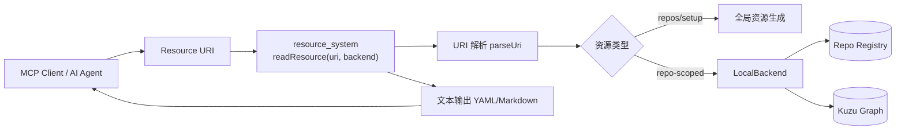
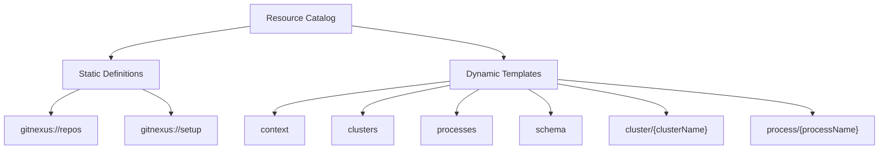
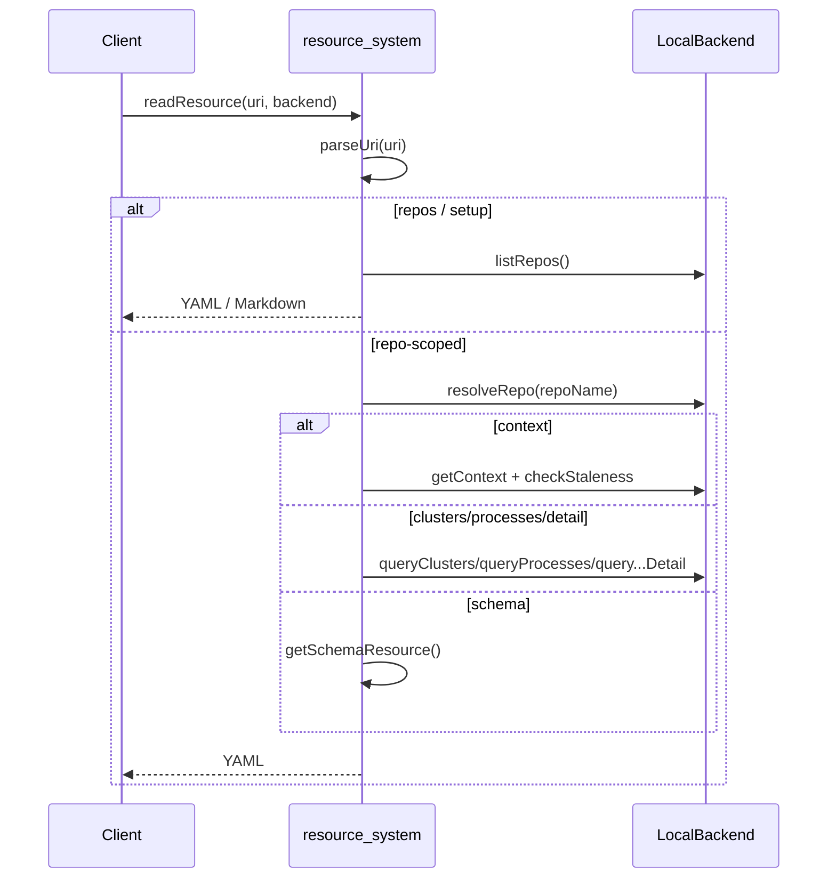
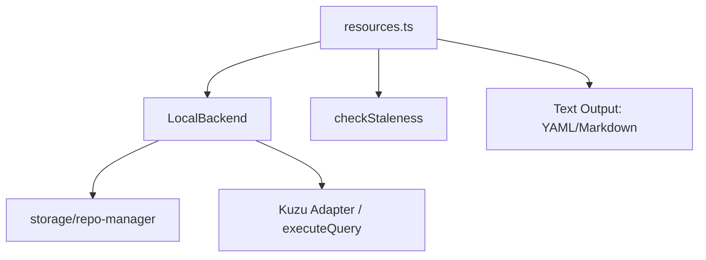
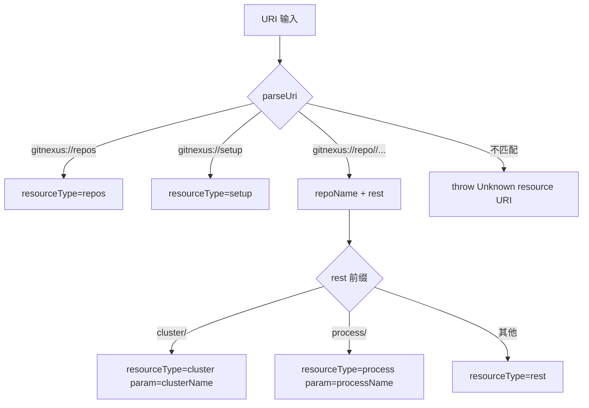
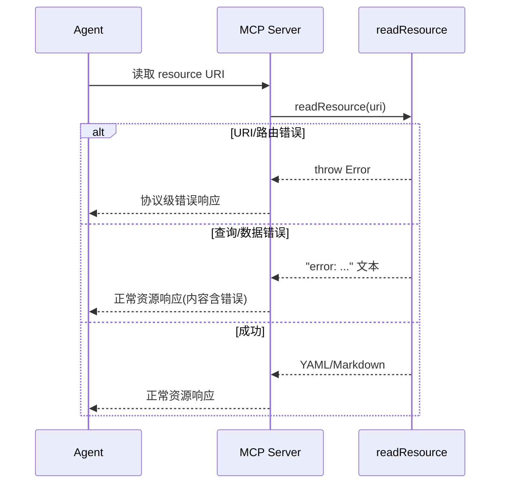

# resource_system 模块文档

## 模块定位与设计目标

`resource_system`（源码文件：`gitnexus/src/mcp/resources.ts`）是 GitNexus MCP 体系中的“资源读取层”，用于把后端能力以**可发现、可寻址、可按需读取**的 URI 资源形式暴露给 AI Agent。它存在的核心原因是：并非所有场景都适合工具调用（tool call）式交互，很多时候 Agent 更需要“先读一份结构化上下文，再决定下一步调用哪个工具”。因此该模块提供了类似只读 API 的资源模型，通过固定 URI 与模板 URI 统一组织全局信息和仓库级信息。

该模块的设计强调三件事。第一，采用统一 URI 命名空间（`gitnexus://...`）来减少 Agent 的探索成本，让模型可以通过模式推断可用资源。第二，资源内容统一返回 `string`（主要是 YAML/Markdown），降低 MCP 客户端实现复杂度，并增强对大模型的可读性。第三，资源实现直接复用 `LocalBackend` 的查询能力，避免在资源层重复造轮子，从而保持结果语义与工具查询一致。

从系统分层看，`resource_system` 位于 MCP server 的接口边缘层：上接 MCP Resource 请求，下接 `local_backend`、`staleness`，并间接依赖 Kuzu 图查询与仓库注册信息。关于查询执行与仓库解析细节，请参考 [`local_backend.md`](local_backend.md)；关于 MCP 总体架构请参考 [`mcp_server.md`](mcp_server.md)。

---

## 在整体系统中的位置



这个关系图说明了资源系统的职责边界：它不直接管理数据库连接、不实现复杂查询算法，而是承担“路由 + 结果整形 + 可读文本协议”的职责。对于 repo-scoped 资源（如 `clusters`、`processes`），它把请求转发给 `LocalBackend` 的直查方法；对于全局资源（如 `repos`、`setup`），它聚合注册信息并生成文档化文本。

---

## 核心类型（Core Components）

## `ResourceDefinition`

`ResourceDefinition` 描述**静态资源**，字段包含：

- `uri`: 完整资源 URI（例如 `gitnexus://repos`）
- `name`: 人类可读名称
- `description`: 资源说明
- `mimeType`: 内容类型（当前主要是 `text/yaml` 或 `text/markdown`）

该接口的设计价值在于让 MCP 客户端可以提前“列举固定入口资源”，并在 UI 层直接展示说明文本。静态资源通常是全局资源，不需要参数展开。

## `ResourceTemplate`

`ResourceTemplate` 描述**动态模板资源**，字段包含：

- `uriTemplate`: 模板 URI（例如 `gitnexus://repo/{name}/cluster/{clusterName}`）
- `name`: 模板名称
- `description`: 模板用途说明
- `mimeType`: 返回 MIME 类型

它的核心作用是把“可参数化资源”暴露给客户端，让 Agent 明白 URI 需要哪些 path 参数。该接口不负责实际解析参数，真实解析由 `parseUri` 完成。

---

## 资源目录模型

模块把资源分为两类：

1. **静态资源（getResourceDefinitions）**
   - `gitnexus://repos`：列出所有已索引仓库
   - `gitnexus://setup`：为所有仓库生成 AGENTS.md 风格引导内容

2. **动态资源模板（getResourceTemplates）**
   - `gitnexus://repo/{name}/context`
   - `gitnexus://repo/{name}/clusters`
   - `gitnexus://repo/{name}/processes`
   - `gitnexus://repo/{name}/schema`
   - `gitnexus://repo/{name}/cluster/{clusterName}`
   - `gitnexus://repo/{name}/process/{processName}`



这种划分让资源可发现性更好：客户端先读取 definitions/templates，再按需要实例化 URI。它比“隐藏式约定 URI”更适合 AI Agent 自主探索。

---

## 请求处理主流程

`readResource(uri, backend)` 是模块唯一公开的读取入口。其行为可概括为“解析 URI → 资源分发 → 调用实现函数 → 返回字符串”。



这里有一个非常关键的设计点：即使资源是 repo-scoped，`readResource` 也不自己实现仓库判定逻辑，而是依赖 `LocalBackend.resolveRepo`。这保证了资源请求与工具请求遵循同一套多仓库解析规则，减少行为分叉。

---

## 内部函数详解

## `getResourceDefinitions(): ResourceDefinition[]`

这个函数返回静态资源定义数组，是资源发现阶段的入口。它不接收参数，也没有副作用。返回结果是硬编码清单，因此具备稳定性和可预测性，适合客户端缓存。

返回值中的 `description` 带有“使用建议”（例如先读 repos），对 Agent 规划很重要。

## `getResourceTemplates(): ResourceTemplate[]`

该函数返回模板资源清单，定义可参数化 URI。它与 `getResourceDefinitions` 一样是纯函数、无 I/O。模板字段采用明确占位符（`{name}`、`{clusterName}`、`{processName}`），方便 MCP 客户端做自动补全或可视化表单。

## `parseUri(uri: string)`

`parseUri` 是私有函数，职责是把 URI 解析为结构化信息：`{ repoName?: string; resourceType: string; param?: string }`。

解析策略分三步。先处理两个全局固定 URI（`repos`、`setup`）；再匹配 repo-scoped 正则 `^gitnexus://repo/([^/]+)/(.+)$`；最后对 `cluster/...`、`process/...` 这种带二级参数路径提取 `param`。其中 `repoName` 和 `param` 都会执行 `decodeURIComponent`，可兼容 URL 编码名称。

当 URI 不符合任何模式时抛出异常：`Unknown resource URI`。这属于**硬错误**，会由上层调用方接管。

## `readResource(uri, backend): Promise<string>`

这是资源读取总入口。它先调用 `parseUri`，然后按 `resourceType` 分派到具体资源函数。对于未知 `resourceType` 会抛 `Unknown resource`。该函数本身不吞异常，因此 URI 级错误可被外层 MCP server 明确感知。

副作用方面，`readResource` 可能触发 `LocalBackend` 的仓库刷新、Kuzu 惰性初始化和图查询（取决于资源类型）。

## `getReposResource(backend)`

该函数通过 `backend.listRepos()` 获取注册仓库列表，并组装 YAML 文本。若为空则返回带提示注释的空数组。返回内容包括 `name/path/indexed/commit`，以及可选统计字段（`files/symbols/processes`）。

当检测到多仓库时，函数会附加“如何在工具调用中指定 repo 参数”的提示示例。这是面向 Agent 的重要“纠错提示设计”，能减少后续歧义查询。

## `getContextResource(backend, repoName?)`

它先 `resolveRepo`，再读取缓存上下文 `getContext(repoId)`；若拿不到则回退 `getContext()`（单仓场景）。随后调用 `checkStaleness(repoPath, lastCommit)` 生成索引新鲜度提示。

输出内容包含项目统计、可用工具列表、重建索引提示、关联资源清单。此函数本质上是“仓库入口首页”，用于让 Agent 快速知道当前可做什么。

需要注意它返回的 `resources_available` 中仓库名使用 `context.projectName` 拼接，而不是原始 URI 中的 repoParam，这通常一致，但在命名映射或大小写处理场景下可能表现不同。

## `getClustersResource(backend, repoName?)`

通过 `backend.queryClusters(repoName, 100)` 拉取聚合后的模块（Community）信息，最多展示 20 条。单条输出包括名称、symbol 数量、可选 cohesion 百分比。若结果超过展示上限，会追加提示引导使用查询工具做深挖。

异常处理采用 `try/catch` 并返回 `error: ...` 字符串，而不是抛异常。这与 URI 解析错误的处理方式不同：**查询级错误转为内容错误，解析级错误仍抛出**。

## `getProcessesResource(backend, repoName?)`

行为与 `getClustersResource` 对称，调用 `backend.queryProcesses(repoName, 50)` 并展示前 20 项。每项包含流程名称、类型、步数。

同样采用捕获异常并转为 `error` 文本的策略。

## `getSchemaResource()`

返回固定 YAML/Markdown 文本，描述图谱节点类型、关系类型、`CodeRelation` 统一边表约定，以及 Cypher 示例查询。该函数纯静态、无依赖。

它在实际使用中承担“Cypher prompt primer”角色：让 Agent 在不知道 schema 的情况下也能构造基础查询。

## `getClusterDetailResource(name, backend, repoName?)`

通过 `backend.queryClusterDetail(name, repoName)` 获取模块详情。成功时输出模块名、符号数、cohesion，以及最多 20 个成员（`name/type/file`）。若成员很多会追加 `... and N more`。

如果后端返回 `{ error }`，函数直接输出 `error: ...`。异常同样被 catch 后转成 error 文本。

## `getProcessDetailResource(name, backend, repoName?)`

通过 `backend.queryProcessDetail(name, repoName)` 获取流程详情，输出流程名、类型、步数和按 step 排序的 trace。格式是简洁文本行（`step: symbol (file)`），适合 LLM 快速读取。

和 cluster detail 一样，后端错误与运行异常都被转成 `error` 字符串。

## `getSetupResource(backend)`

该函数面向 onboarding，遍历所有仓库生成 AGENTS.md 风格章节，并用 `---` 分隔多个 repo。每个章节包括仓库规模、工具说明表、资源入口清单。

当没有索引仓库时，返回简短 markdown 提示用户运行 `npx gitnexus analyze`。

---

## 关键依赖与协作关系



`resource_system` 与 `LocalBackend` 是强依赖关系：资源层几乎不保留业务状态，也不做数据存储，只做轻组装。这个设计的好处是模块本身很薄，维护成本低；代价是资源输出能力上限受后端查询接口形态约束。

`checkStaleness` 仅在 context 资源中使用，用于把“索引是否过期”显式暴露给 Agent。相关结构可参考 `StalenessInfo`（`isStale`, `commitsBehind`, `hint`）。

---

## 使用方式与示例

## 1) 列举资源（服务端侧）

```ts
import { getResourceDefinitions, getResourceTemplates } from './mcp/resources.js';

const staticDefs = getResourceDefinitions();
const templates = getResourceTemplates();
```

## 2) 读取资源内容

```ts
import { readResource } from './mcp/resources.js';

const content = await readResource('gitnexus://repo/my-repo/context', backend);
console.log(content); // YAML string
```

## 3) 常见 URI 示例

```text
gitnexus://repos
gitnexus://setup
gitnexus://repo/my-repo/context
gitnexus://repo/my-repo/clusters
gitnexus://repo/my-repo/processes
gitnexus://repo/my-repo/schema
gitnexus://repo/my-repo/cluster/Auth%20Module
gitnexus://repo/my-repo/process/Login%20Flow
```

注意包含空格或特殊字符的名称应做 URL 编码；`parseUri` 会负责解码。

---

## 行为约束、边界情况与错误语义

资源系统的错误处理有两条路径，调用方需要区分。第一类是 URI 不合法或资源类型未知，这类错误会直接抛异常（例如 `Unknown resource URI`）；第二类是后端查询失败（如图库不可用、对象不存在），大多数资源函数会返回 `error: ...` 的文本内容。这意味着 MCP 客户端不能只依赖异常机制，还要检查返回文本是否为错误前缀。

多仓库场景下，repo 参数缺失可能导致 `resolveRepo` 抛出“多个仓库请指定 repo”的错误。由于 `readResource` 没有统一兜底包装，这个错误会外抛，属于调用参数问题而非数据层问题。

展示上限也是一个关键约束：`clusters` 与 `processes` 默认仅展示前 20 项，详情资源成员也只展示前 20。设计上这是为控制响应长度，避免 LLM 上下文膨胀；如果需要全量分析，应转用 `query`/`cypher` 工具。

`schema` 资源是静态说明，可能滞后于未来 schema 演进（例如新增标签或关系）。在高度精确场景中，应把它作为“起点提示”，再配合实时 Cypher 验证。

---

## 扩展与二次开发建议

若要新增资源，推荐遵循当前模块的最小改动路径：先在 `getResourceTemplates` 或 `getResourceDefinitions` 注册入口，再扩展 `parseUri` 的识别规则，最后在 `readResource` 的 `switch` 中添加分发分支并实现对应 `getXxxResource` 函数。


实现新资源时建议优先复用 `LocalBackend` 现有公开方法，避免在 `resources.ts` 内写复杂 Cypher。这样可以保持职责清晰，也能让工具调用和资源读取在数据语义上保持一致。

如果资源内容可能很大，建议在资源层做“摘要 + 引导”，而不是全量返回，延续当前 `displayLimit` 设计哲学。对 LLM 场景来说，可读摘要往往比超长原始数据更实用。

---

## 已知限制

当前资源返回类型统一为 `Promise<string>`，虽然对 MCP 客户端兼容性好，但也带来限制：无法直接携带结构化错误码、分页 token 或强类型字段。未来若要增强机器可消费性，可能需要引入“结构化 JSON + 可选渲染文本”的双通道返回。

另外，URI 解析目前依赖固定路径结构和简单前缀判断，对更复杂层级模板（例如多段参数、查询参数）支持有限。若未来资源数量增长，建议考虑集中式路由表替代手写分支。

---

## 与其他模块文档的关系

本文聚焦 `resource_system` 的 URI 资源模型与实现细节，不重复展开以下内容：

- `LocalBackend` 的工具执行、图查询和多仓解析：见 [`local_backend.md`](local_backend.md)
- MCP Server 会话、工具/资源注册与传输层：见 [`mcp_server.md`](mcp_server.md)
- 仓库注册元数据来源：见 [`storage_repo_manager.md`](storage_repo_manager.md)

通过这些文档组合阅读，可以完整理解“索引产物如何被 MCP Resource 与 Tool 同时消费”的全链路。


---

## URI 语法与路由约定（补充）

`resource_system` 当前采用路径段驱动的轻量路由，不使用 query string。规范化后的 URI 形态可以抽象为下述语法：

```text
gitnexus://repos
gitnexus://setup
gitnexus://repo/{repoName}/{resourceType}
gitnexus://repo/{repoName}/cluster/{clusterName}
gitnexus://repo/{repoName}/process/{processName}
```

其中 `{repoName}`、`{clusterName}`、`{processName}` 都允许 URL 编码值。模块通过 `decodeURIComponent` 还原参数，所以当名称中包含空格、斜杠转义字符或非 ASCII 字符时，调用方应优先提交编码后 URI，避免路径切分歧义。



这套策略实现成本低、可读性高，适合当前资源数量较少且结构清晰的场景。其代价是对复杂层级模板扩展不够友好；如果后续资源快速增长，建议迁移到“声明式路由表 + 参数 schema 校验”的实现。

---

## 与 MCP 会话层的协作边界

虽然 `resource_system` 不直接依赖 `MCPSession`，但在运行时它由 MCP HTTP 会话承载。会话层（见 [`mcp_server.md`](mcp_server.md)）负责连接生命周期和协议传输；`resource_system` 只关注“给定 URI，返回字符串内容”。这种分离让资源模块能够在本地测试中直接注入 `LocalBackend` mock，而不需要启动完整 HTTP transport。

同理，资源系统与 `ToolDefinition` 的关系是互补而非替代：工具定义描述“可执行动作”，资源定义描述“可读取上下文”。Agent 的推荐模式是“先读资源、再选工具”。这也是 `context` 资源内嵌 `tools_available` 的设计动机。

---

## 错误语义对照（调用方实现建议）

为了避免客户端误判，建议将资源错误分为“协议错误”和“内容错误”两层处理。

- 协议错误：URI 不匹配、未知资源类型、多仓未指定且无法自动决议。这类问题通常以异常形式抛出，应在 MCP handler 层映射为标准错误响应。
- 内容错误：底层查询异常、对象不存在、图库暂不可用。这类问题多数已被资源函数转为 `error: ...` 文本返回，应在客户端渲染层进行显式高亮。



在 Agent 实现里，推荐额外加入一条轻量规则：若资源文本以 `error:` 开头，则自动回退到 `gitnexus://repos` 或 `gitnexus://repo/{name}/context` 进行自修复导航。

---

## 可扩展性实践：新增资源的“最小闭环”示例

以下示例演示新增一个 `gitnexus://repo/{name}/hotspots` 资源时，如何保持与现有模块一致的实现风格。

```ts
// 1) 模板注册
{
  uriTemplate: 'gitnexus://repo/{name}/hotspots',
  name: 'Repo Hotspots',
  description: 'Frequently changed + highly connected symbols',
  mimeType: 'text/yaml',
}

// 2) readResource 分发
case 'hotspots':
  return getHotspotsResource(backend, repoName);
```

`getHotspotsResource` 的实现建议遵守当前约定：尽量复用 `LocalBackend` 的公开查询，限制默认返回数量，并在超限时提供“使用工具深挖”的引导语。若必须新增复杂图查询，优先在 `local_backend` 落地能力，再由资源层调用，避免资源模块演变成第二个查询引擎。

---

## 维护者检查清单

在发布或重构资源系统时，建议至少完成四类回归验证：第一，URI 兼容性，确保历史 URI 不破坏；第二，多仓歧义处理，确认在 0/1/N 仓条件下提示稳定；第三，错误一致性，确认抛异常与 `error:` 文本边界未被意外改变；第四，输出可读性，检查 YAML 缩进和 Markdown 表格在主流 MCP 客户端中渲染正常。

这些检查看似偏“文档接口”层，但它们直接决定 Agent 的可规划性与自恢复能力，因此在该模块中和功能正确性同等重要。
