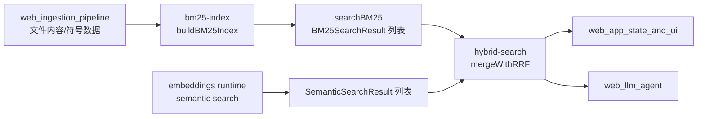
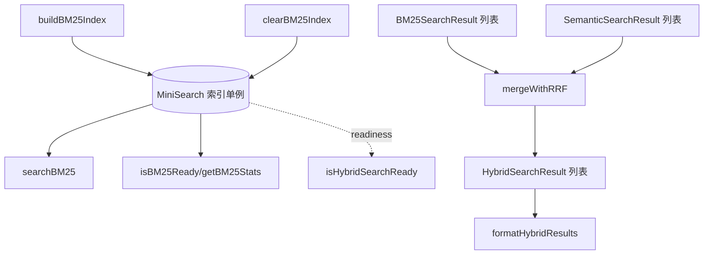
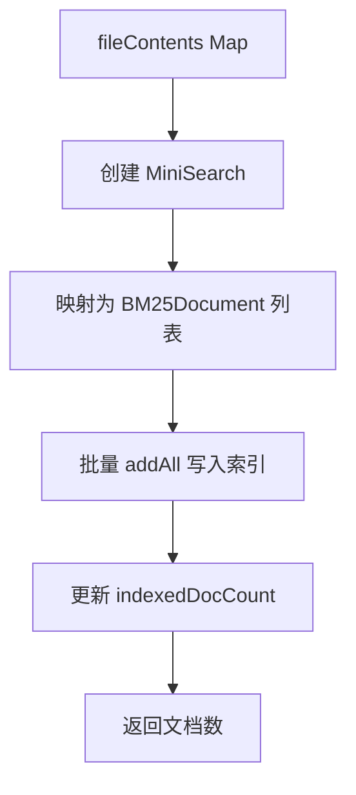
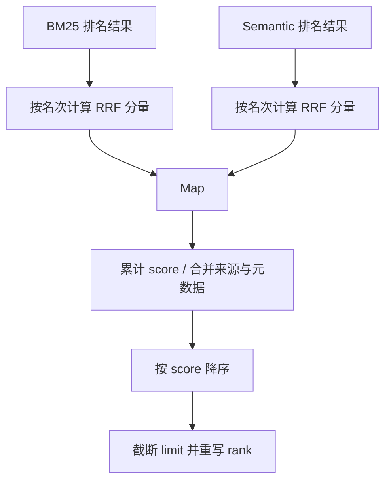

# search 模块文档（Web 端）

## 1. 模块简介：它做什么，为什么存在

`search` 模块位于 `gitnexus-web/src/core/search/`，由 `bm25-index.ts` 与 `hybrid-search.ts` 组成，是 GitNexus Web 端代码检索能力的核心执行层。它负责两件事情：第一，基于 `MiniSearch` 构建并查询 BM25 风格的全文索引；第二，将 BM25 结果与语义检索结果通过 RRF（Reciprocal Rank Fusion）融合成统一排序结果。

这个模块存在的根本原因是，代码检索天然存在“双目标冲突”。开发者既需要查到精确术语（如函数名、文件名、配置键），也需要查到语义相关实现（如“鉴权入口”、“路由初始化流程”）。单独依赖关键词检索会错过语义近似，单独依赖向量检索又容易漏掉精确符号。因此这里采用了“BM25 召回 + Semantic 召回 + RRF 融合”的组合策略，以较低复杂度获得更稳健的检索体验。

从系统角色看，它不是 ingestion 模块，也不是 embedding 模块，而是“查询时刻的检索编排层”。你可以把它理解为：把上游已经准备好的文件内容和语义结果，转成下游 UI/LLM 能直接消费的、可解释的候选列表。

---

## 2. 在整体系统中的位置



上图展示的是该模块的典型上下游关系。`bm25-index` 依赖 ingestion 后的文件内容来构建索引；`hybrid-search` 不负责生成语义结果，而是消费来自 embedding 子系统的 `SemanticSearchResult[]` 进行融合。如果你需要了解语义检索类型契约本身，请参考 [embeddings_types.md](embeddings_types.md)；如果你要看该模块在更大范围的汇总关系，可参考 [web_embeddings_and_search.md](web_embeddings_and_search.md)。

---

## 3. 模块架构与组件关系



`bm25-index.ts` 主要处理索引生命周期与关键词查询；`hybrid-search.ts` 主要处理结果融合与输出格式化。两者之间通过 `BM25SearchResult` 类型衔接，且 `hybrid-search` 会通过 `isBM25Ready()` 判断混合检索是否具备最基本可用条件。

---

## 4. 核心数据结构

### 4.1 `BM25Document`

```ts
export interface BM25Document {
  id: string;       // File path
  content: string;  // File content
  name: string;     // File name (boosted in search)
}
```

这是建索引输入结构，采用文件级粒度。`id` 用文件路径作为主键，`name` 专门用于查询时加权（boost）。

### 4.2 `BM25SearchResult`

```ts
export interface BM25SearchResult {
  filePath: string;
  score: number;
  rank: number;
}
```

这是 BM25 查询的标准输出。设计上只保留“文件路径 + 分数 + 排名”，便于后续融合模块直接消费。

### 4.3 `HybridSearchResult`

```ts
export interface HybridSearchResult {
  filePath: string;
  score: number;           // RRF score
  rank: number;            // Final rank
  sources: ('bm25' | 'semantic')[];

  nodeId?: string;
  name?: string;
  label?: string;
  startLine?: number;
  endLine?: number;

  bm25Score?: number;
  semanticScore?: number;
}
```

该结构同时承载了排序结果与可解释元数据。`sources` 说明命中来源；`bm25Score`、`semanticScore` 方便调试；`name/label/line` 让 UI 或 LLM 输出更具可读性。

---

## 5. `bm25-index.ts` 深入解析

### 5.1 内部状态设计

模块使用两个文件级单例变量：

- `searchIndex: MiniSearch<BM25Document> | null`
- `indexedDocCount: number`

这意味着索引是“进程内全局状态”，而不是与组件实例绑定。优点是调用简单；代价是多仓切换或重复分析时必须显式清理/重建。

### 5.2 `buildBM25Index(fileContents)`

```ts
export const buildBM25Index = (fileContents: Map<string, string>): number
```

该函数负责从 `Map<filePath, content>` 构建全文索引。核心流程是：创建 `MiniSearch` 实例、把每个文件映射为 `BM25Document`、批量 `addAll` 写入索引、更新文档计数。



查询字段配置是 `fields: ['content', 'name']`，返回字段配置是 `storeFields: ['id']`。这代表它既索引文件正文，也索引文件名，并在结果中保留文件标识。

### 5.3 tokenizer 行为与语义

该模块自定义了 tokenizer，目标是适配代码文本而非普通自然语言。它会基于空白和符号切分、尝试拆分 camelCase、过滤短词与停用词。


需要特别注意一个实现细节：代码先 `toLowerCase()` 再执行 camelCase 正则 `/([a-z])([A-Z])/g`。由于大写已经被降为小写，这个正则在多数输入下不会真正触发 camelCase 拆分。也就是说，注释意图与实际行为存在偏差，维护时应先做回归验证再调整。

### 5.4 `searchBM25(query, limit = 20)`

```ts
export const searchBM25 = (query: string, limit: number = 20): BM25SearchResult[]
```

该函数执行查询并返回排序结果。若索引未准备好，直接返回空数组，不抛异常。查询参数使用：`fuzzy: 0.2`、`prefix: true`、`boost: { name: 2 }`。

- `fuzzy: 0.2`：允许轻度拼写误差。
- `prefix: true`：支持前缀匹配，适合符号输入未输全时的召回。
- `boost.name = 2`：文件名命中权重更高。

### 5.5 可观测与生命周期 API

`isBM25Ready()` 用于判断索引是否可用，要求索引对象非空且文档数大于 0。`getBM25Stats()` 返回 `{ documentCount, termCount }`，适合做调试面板或状态提示。`clearBM25Index()` 负责清空索引与计数，常用于仓库切换、重新分析或内存回收。

---

## 6. `hybrid-search.ts` 深入解析

### 6.1 融合策略：`mergeWithRRF`

```ts
export const mergeWithRRF = (
  bm25Results: BM25SearchResult[],
  semanticResults: SemanticSearchResult[],
  limit: number = 10
): HybridSearchResult[]
```

融合算法使用固定常量 `RRF_K = 60`。每条结果按其在各自列表中的名次贡献分数：

`rrfScore = 1 / (RRF_K + rank)`

同一 `filePath` 在两路结果中都出现时，分数相加，并合并语义元数据。



这个设计不依赖分值归一化，因此对不同检索器的原始分值体系更鲁棒。

### 6.2 `isHybridSearchReady()`

该函数当前实现仅检查 BM25 就绪状态。也就是说，语义检索是可选增强；即便 `semanticResults` 为空，混合流程仍可退化为 BM25-only。

### 6.3 `formatHybridResults(results)`

该函数将结构化结果转为可读文本，便于 LLM prompt 或 CLI 输出。输出会包含路径、来源、相关度及可选行号区间。空结果时返回固定文本 `No results found.`。

---

## 7. 典型使用方式

### 7.1 建索引 + 关键词查询

```ts
import { buildBM25Index, searchBM25, getBM25Stats } from '@/core/search/bm25-index'

const count = buildBM25Index(fileContentsMap)
console.log('indexed:', count, getBM25Stats())

const bm25 = searchBM25('auth middleware', 20)
```

### 7.2 混合融合

```ts
import { mergeWithRRF, formatHybridResults } from '@/core/search/hybrid-search'

const bm25Results = searchBM25(query, 50)
const semanticResults = await semanticSearch(query, 50) // 你的实现

const hybrid = mergeWithRRF(bm25Results, semanticResults, 15)
console.log(formatHybridResults(hybrid))
```

### 7.3 退化模式（无语义结果）

```ts
const hybrid = mergeWithRRF(searchBM25(query, 20), [], 10)
```

---

## 8. 行为约束、边界条件与已知限制

首先，BM25 索引是单例状态，不做多仓隔离。若连续分析不同仓库但未调用 `clearBM25Index()` 与重建，结果会污染。

其次，`searchBM25` 未就绪时静默返回空数组，这在用户层面容易被误读为“查询无命中”。建议上层在查询前调用 `isBM25Ready()` 并提供明确提示。

再次，RRF 强依赖输入排序。`mergeWithRRF` 假设输入结果已经按各自相关性排好序，如果上游顺序不可信，融合结果会失真。

另外，融合键是 `filePath`。这会把同一文件内多个命中折叠为单条结果，更适合文件级导航，但不适合需要展示“同文件多符号命中”的场景。

还有，`semanticScore = 1 - distance` 只是调试值，不参与排序，也不保证跨模型可比。不要把它当成统一概率分数。

最后，`formatHybridResults` 用 `startLine` 的 truthy 判断决定是否显示行号区间；如果上游采用 0-based 行号，`0` 会被当作“无行号”。

---

## 9. 扩展建议

如果要扩展这个模块，建议优先做三类演进。第一类是可配置化：把 `RRF_K`、`fuzzy`、`boost` 暴露到配置层。第二类是粒度演进：从 `filePath` 级融合升级为 `filePath + nodeId` 级融合。第三类是可观测性增强：在 `HybridSearchResult` 增加每路 rank 贡献字段，方便线上调参与质量分析。

同时，若你要修正 tokenizer 的 camelCase 行为，建议先建立回归样例（如 `getUserById`、`AuthHTTPServer`、`snake_case_key`）再改实现，避免召回分布发生不可控漂移。

---

## 10. 相关文档

- 总览：[`web_embeddings_and_search.md`](web_embeddings_and_search.md)
- 语义类型契约：[`embeddings.md`](embeddings.md)
- 相关上游：[`web_ingestion_pipeline.md`](web_ingestion_pipeline.md)

---


