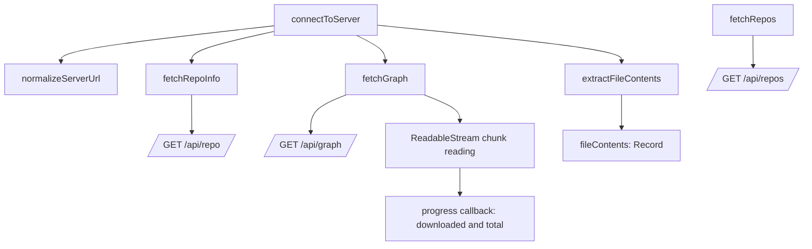
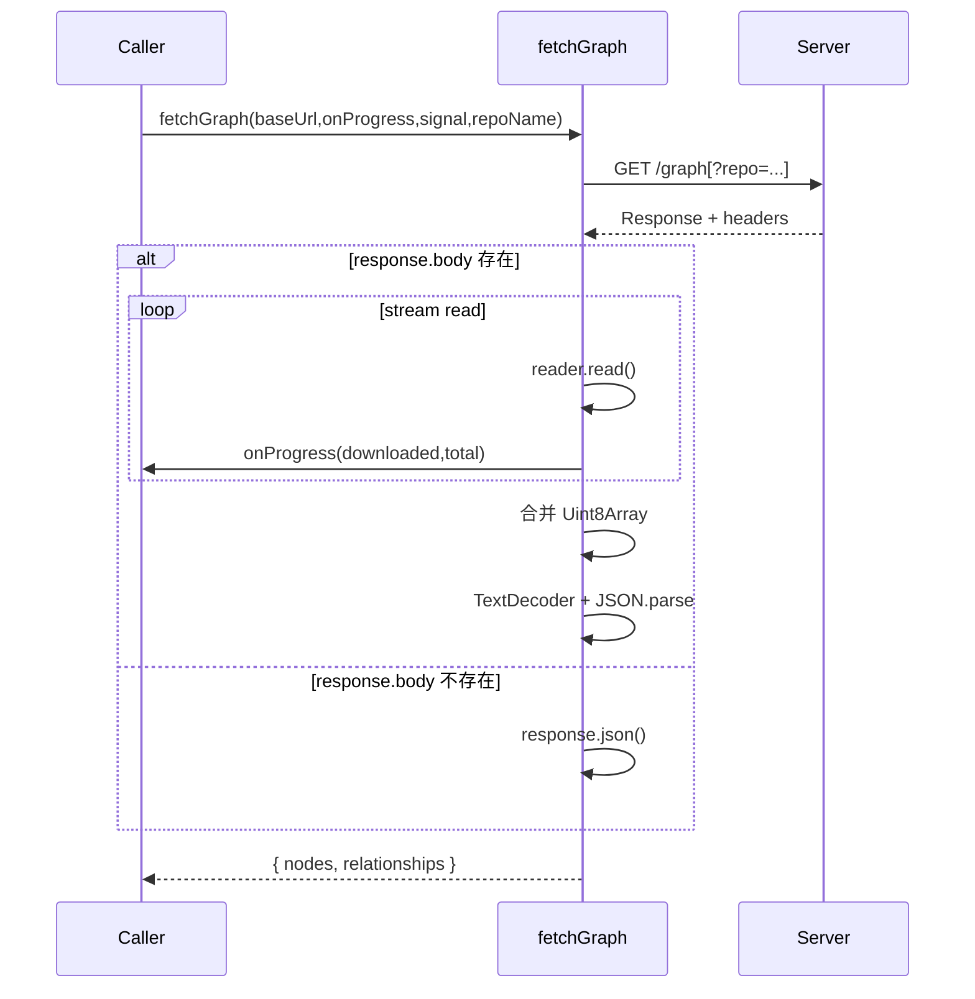
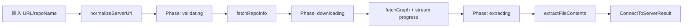
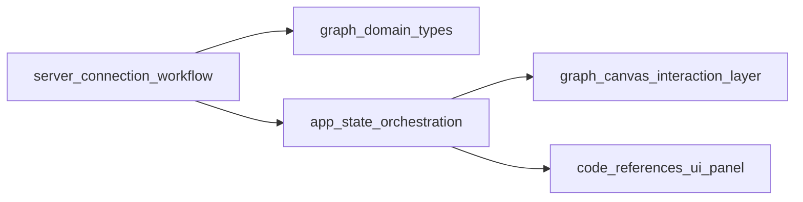

# server_connection_workflow 模块文档

## 1. 模块定位与设计目标

`server_connection_workflow` 对应文件 `gitnexus-web/src/services/server-connection.ts`。这个模块的核心职责是把“连接一个 GitNexus 兼容服务并拉取完整图数据”的过程收敛为一条可复用工作流，而不是让 UI 或上层状态模块分别处理 URL 规范化、服务探活、图下载、内容提取与进度回调。

它存在的价值在于把多阶段网络流程变成一个稳定契约：调用方只要提供服务器地址（可选仓库名），就能获得 `nodes`、`relationships`、`fileContents` 和 `repoInfo`。这种封装降低了上层对后端 API 细节的耦合，尤其适用于“从远程服务器一键加载仓库图谱”的场景。

从系统分层看，它位于 `web_backend_services` 子域，和 [backend_http_client.md](backend_http_client.md) 同属服务层，但关注点不同：`backend_http_client` 更像通用 API 客户端；`server_connection_workflow` 是面向“连接-下载-提取”的聚合流程服务。

---

## 2. 核心类型与数据契约

### 2.1 `RepoSummary`

`RepoSummary` 表示仓库列表中的摘要项，主要用于 `/repos` 列表接口返回。

```ts
export interface RepoSummary {
  name: string;
  path: string;
  indexedAt: string;
  lastCommit: string;
  stats: {
    files: number;
    nodes: number;
    edges: number;
    communities: number;
    processes: number;
  };
}
```

其中 `stats` 是聚合统计数据，字段均为必填数值。与 `backend_http_client` 中 `BackendRepo` 的可选统计字段不同，这里使用更“强假设”的结构，体现了该模块面向“已就绪服务端返回”的使用预期。

### 2.2 `ServerRepoInfo`

`ServerRepoInfo` 表示当前目标仓库（或默认仓库）的详情信息，来自 `/repo` 接口。

```ts
export interface ServerRepoInfo {
  name: string;
  repoPath: string;
  indexedAt: string;
  stats: {
    files: number;
    nodes: number;
    edges: number;
    communities: number;
    processes: number;
  };
}
```

与 `RepoSummary` 的差别在于路径字段名使用 `repoPath`，这也提示调用方不要盲目复用字段名映射。

### 2.3 `ConnectToServerResult`

`ConnectToServerResult` 是顶层工作流返回值。

```ts
export interface ConnectToServerResult {
  nodes: GraphNode[];
  relationships: GraphRelationship[];
  fileContents: Record<string, string>;
  repoInfo: ServerRepoInfo;
}
```

这里的 `GraphNode` 和 `GraphRelationship` 来自 `../core/graph/types`，详细结构请参考 [graph_domain_types.md](graph_domain_types.md)。

`fileContents` 是一个派生缓存（`filePath -> source code`），用于让上层在不重复扫描节点数组的前提下快速读取文件文本。

---

## 3. 模块架构与组件关系



这个架构反映了模块的两个层次：

第一层是独立 API 方法（`fetchRepos`、`fetchRepoInfo`、`fetchGraph`）；第二层是编排方法 `connectToServer`，把多个独立方法串成完整连接流程。`extractFileContents` 则是纯本地处理步骤，不依赖网络。

---

## 4. 关键函数逐项解析

## 4.1 `normalizeServerUrl(input: string): string`

该函数负责把用户输入转换成可请求的标准 API 基地址。处理顺序是：

1. `trim()` 去掉首尾空白。
2. 去掉末尾多余 `/`。
3. 若无协议，`localhost`/`127.0.0.1` 默认补 `http://`，其它主机补 `https://`。
4. 若末尾不是 `/api`，自动追加 `/api`。

这个策略减少了 UI 侧输入负担，例如用户输入 `localhost:4747/` 也能得到标准地址 `http://localhost:4747/api`。

## 4.2 `fetchRepos(baseUrl: string): Promise<RepoSummary[]>`

直接请求 `${baseUrl}/repos` 并返回 JSON。若 `response.ok` 为假，抛出 `Error(Server returned <status>)`。

该函数不做数据校验与结构修复，因此服务端响应结构变化会直接暴露给调用方。

## 4.3 `fetchRepoInfo(baseUrl: string, repoName?: string): Promise<ServerRepoInfo>`

请求 `${baseUrl}/repo`，若指定 `repoName` 则通过 `?repo=${encodeURIComponent(repoName)}` 传参。状态码异常时抛错信息包含 `statusText`，可读性优于 `fetchRepos`。

这一步在工作流中承担“服务与仓库有效性验证”职责。

## 4.4 `fetchGraph(baseUrl, onProgress?, signal?, repoName?)`

这是模块内部最复杂函数。它支持：

- 可选仓库参数编码；
- `AbortSignal` 取消请求；
- 基于 `ReadableStream` 的增量下载与进度回调；
- 无流场景回退到 `response.json()`。

核心流程如下：



其中 `total` 来自 `Content-Length`，若服务端未提供则为 `null`。调用方要容忍未知总长度场景（只能显示已下载字节，不能算百分比）。

## 4.5 `extractFileContents(nodes: GraphNode[]): Record<string, string>`

该函数遍历节点数组，筛选 `label === 'File'` 且带 `properties.content` 的节点，构造 `filePath -> content` 映射。

它通过 `(node.properties as any).content` 访问字段，说明 `content` 不在 `NodeProperties` 强类型定义中，而是运行期增强字段。这种做法灵活，但也带来类型安全弱化和字段拼写风险。

## 4.6 `connectToServer(url, onProgress?, signal?, repoName?)`

顶层编排函数，分三阶段：

1. `validating`：规范化 URL 并调用 `fetchRepoInfo`。
2. `downloading`：调用 `fetchGraph`，把字节进度透传给上层。
3. `extracting`：执行 `extractFileContents`。

最后返回 `ConnectToServerResult`。



---

## 5. 与系统其他模块的关系

该模块消费图类型定义（`GraphNode`/`GraphRelationship`），并把下载结果交给 UI 状态层或渲染层。典型协作路径如下：



若你已经在项目中使用 [backend_connectivity_hook.md](backend_connectivity_hook.md)，通常可以让 Hook 管理“连接状态与仓库选择”，再在真正进入仓库工作区时调用 `connectToServer` 完成图数据加载。

---

## 6. 使用示例

### 6.1 一次性连接并展示进度

```ts
import { connectToServer } from '@/services/server-connection';

const controller = new AbortController();

const result = await connectToServer(
  'localhost:4747',
  (phase, downloaded, total) => {
    if (phase === 'downloading') {
      console.log('download', downloaded, total);
    } else {
      console.log('phase', phase);
    }
  },
  controller.signal,
  'my-repo'
);

console.log(result.repoInfo.name);
console.log(result.nodes.length, result.relationships.length);
console.log(result.fileContents['src/index.ts']);
```

### 6.2 仅拉取仓库列表

```ts
import { normalizeServerUrl, fetchRepos } from '@/services/server-connection';

const baseUrl = normalizeServerUrl('https://demo.gitnexus.dev');
const repos = await fetchRepos(baseUrl);
```

---

## 7. 配置与扩展建议

该模块本身没有全局配置对象，所有行为由函数参数驱动。扩展时建议保持这种“无状态函数式”风格。

如果你要新增阶段（例如下载后自动做索引检查），推荐在 `connectToServer` 中添加新的 phase，并沿用现有 `onProgress(phase, downloaded, total)` 协议，这样不破坏调用方处理逻辑。

如果你要提升类型安全，可考虑在 `GraphNode` 的 `NodeProperties` 中显式加入 `content?: string`，从而消除 `as any`。

---

## 8. 边界条件、错误处理与限制

### 8.1 URL 规范化陷阱

`normalizeServerUrl` 只在“不是 `http://` / `https://` 开头”时补协议，因此像 `ftp://host` 会被误处理为 `https://ftp://host/api`。调用方若允许自定义协议，应先做前置校验。

### 8.2 `/api` 追加规则

函数仅检查 `endsWith('/api')`。如果输入是 `https://host/api/v2`，会变成 `https://host/api/v2/api`，可能导致错误路径。该模块默认服务基路径就是 `/api` 根，而不是版本化子路径。

### 8.3 进度总量可能为空

`Content-Length` 缺失时 `total = null`，进度 UI 不应强制显示百分比。

### 8.4 流读取内存占用

`fetchGraph` 会把所有 chunk 累积后再一次性 `JSON.parse`。对于超大图会产生双重内存压力（chunks + combined buffer）。当前实现不是增量 JSON 解析。

### 8.5 文件内容覆盖

`extractFileContents` 以 `filePath` 为键，若图中存在重复路径节点，后者会覆盖前者。

### 8.6 取消语义

取消由 `AbortSignal` 控制，实际抛错类型由运行环境决定（通常 `AbortError`）。`connectToServer` 不吞异常，调用方需自行区分“用户取消”与“服务失败”。

---

## 9. 开发与测试建议

建议至少覆盖以下测试维度：

- `normalizeServerUrl` 在本地地址、域名、已有 `/api`、空白输入等场景的输出。
- `fetchRepoInfo`/`fetchGraph` 的错误分支是否抛出包含状态码的信息。
- `fetchGraph` 在 `response.body` 为 `null` 与 stream 模式下行为一致。
- `connectToServer` 的 phase 回调顺序是否严格为 `validating -> downloading -> extracting`。
- `extractFileContents` 对非 `File` 节点、无 `content` 节点的忽略行为。

---

## 10. 总结

`server_connection_workflow` 是一个“高内聚、低状态”的连接编排模块。它把易散落在 UI 层的连接细节（地址标准化、仓库校验、图下载进度、内容提取）封装为明确流程，使上层可以聚焦于状态管理与交互呈现。对新开发者来说，优先掌握 `connectToServer` 的三阶段模型和 `fetchGraph` 的流式行为，就能快速理解该模块在整个 Web 图谱加载链路中的位置。