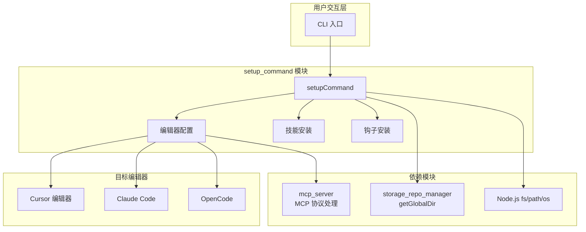
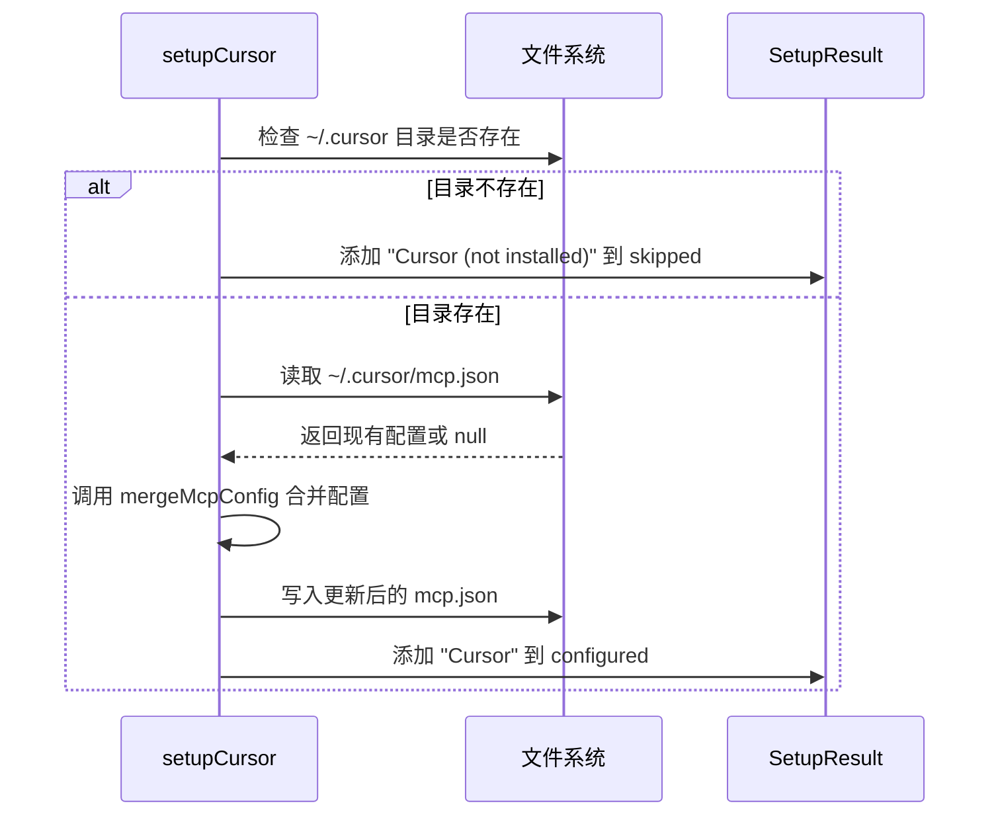
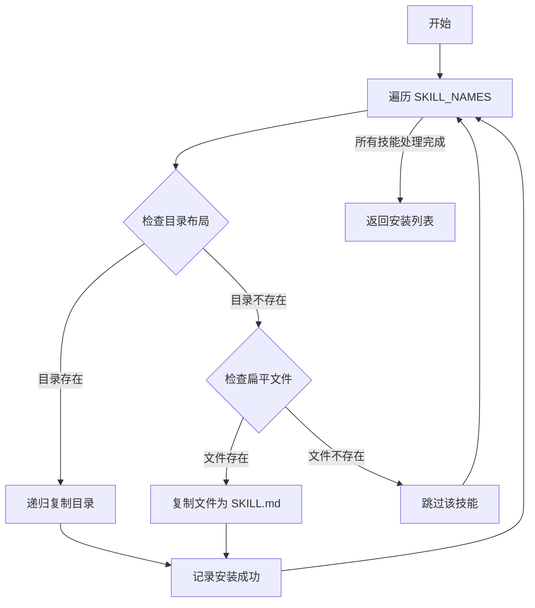
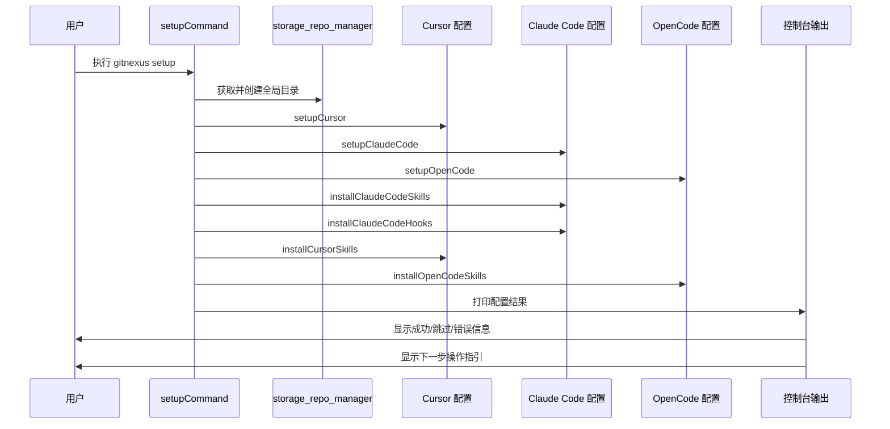

# setup_command 模块文档

## 1. 模块概述

### 1.1 模块定位与目的

`setup_command` 模块是 GitNexus 系统的 CLI（命令行界面）初始化配置组件，负责一次性全局 MCP（Model Context Protocol）服务器配置。该模块的核心使命是自动检测用户系统中安装的 AI 代码编辑器（如 Cursor、Claude Code、OpenCode 等），并为这些编辑器写入适当的 MCP 配置，使得 GitNexus MCP 服务器能够在所有项目中可用。

在现代 AI 辅助编程环境中，不同的编辑器采用不同的配置方式来集成外部工具和服务。GitNexus 通过 MCP 协议与这些编辑器进行通信，提供代码库知识图谱、语义搜索、流程检测等高级功能。`setup_command` 模块的存在意义在于简化这一集成过程，让用户无需手动编辑多个配置文件即可在所有支持的编辑器中启用 GitNexus 功能。

### 1.2 设计哲学

该模块遵循"约定优于配置"的设计原则，通过自动检测编辑器安装状态来减少用户的配置负担。同时，模块采用非破坏性合并策略，在写入配置时会保留用户现有的配置内容，仅添加或更新 GitNexus 相关的条目。这种设计确保了用户自定义配置不会被意外覆盖，提高了系统的安全性和可靠性。

模块还体现了"渐进式增强"的理念：对于完全支持 MCP 的编辑器（如 Cursor、OpenCode），直接写入完整的 MCP 服务器配置；对于部分支持的平台（如 Claude Code），则提供手动命令指引并安装辅助技能和钩子，以最大化功能覆盖范围。

### 1.3 与系统其他模块的关系

`setup_command` 模块在整个 GitNexus 架构中处于入口层，与多个核心模块存在依赖关系：

- **storage_repo_manager**：依赖 `getGlobalDir` 函数获取全局配置目录路径，用于存储全局 MCP 配置和技能文件
- **mcp_server**：配置的 MCP 服务器条目最终指向 `gitnexus mcp` 命令，该命令由 MCP 服务器模块处理
- **cli**：作为 CLI 命令集合的一部分，与其他命令（如 `analyze`、`wiki`）共同构成用户交互界面



---

## 2. 核心组件详解

### 2.1 SetupResult 接口

`SetupResult` 是模块的核心数据类型，用于收集和传达配置过程的结果状态。

```typescript
interface SetupResult {
  configured: string[];  // 成功配置的项目列表
  skipped: string[];     // 被跳过的项目列表（通常因为未安装）
  errors: string[];      // 发生错误的项目列表
}
```

#### 字段说明

| 字段 | 类型 | 说明 |
|------|------|------|
| `configured` | `string[]` | 记录所有成功完成配置的项目名称。每个条目包含具体的配置内容描述，如 "Cursor"、"Cursor skills (6 skills → ~/.cursor/skills/)" 等 |
| `skipped` | `string[]` | 记录因前置条件不满足而被跳过的配置项。最常见的原因是目标编辑器未安装在系统中 |
| `errors` | `string[]` | 记录配置过程中发生的所有错误。每个条目包含项目名称和错误消息，便于用户诊断问题 |

#### 使用模式

`SetupResult` 对象在整个配置流程中作为累加器使用，各个配置函数接收该对象的引用并追加结果：

```typescript
const result: SetupResult = {
  configured: [],
  skipped: [],
  errors: [],
};

await setupCursor(result);      // 修改 result.configured 或 result.skipped
await setupClaudeCode(result);  // 可能修改多个字段
// ... 其他配置函数

// 最后统一输出结果
printResults(result);
```

这种设计避免了多个异步函数返回值的复杂处理，同时保持了结果收集的集中性和一致性。

---

### 2.2 MCP 服务器条目生成

#### getMcpEntry 函数

该函数根据运行平台生成适当的 MCP 服务器配置条目。由于不同操作系统对可执行文件的处理方式不同，函数需要生成平台特定的命令配置。

```typescript
function getMcpEntry() {
  if (process.platform === 'win32') {
    return {
      command: 'cmd',
      args: ['/c', 'npx', '-y', 'gitnexus@latest', 'mcp'],
    };
  }
  return {
    command: 'npx',
    args: ['-y', 'gitnexus@latest', 'mcp'],
  };
}
```

#### 平台差异处理

| 平台 | command | args | 说明 |
|------|---------|------|------|
| Windows | `cmd` | `['/c', 'npx', '-y', 'gitnexus@latest', 'mcp']` | Windows 上 `npx` 是 `.cmd` 脚本，必须通过 `cmd /c` 调用 |
| macOS/Linux | `npx` | `['-y', 'gitnexus@latest', 'mcp']` | Unix-like 系统可直接执行 `npx` 命令 |

#### 返回结构

生成的条目符合 MCP 服务器的标准配置格式：

```json
{
  "command": "npx",
  "args": ["-y", "gitnexus@latest", "mcp"]
}
```

其中：
- `command`：要执行的可执行文件
- `args`：传递给命令的参数数组
- `-y`：自动确认 npm 提示，实现无交互安装
- `gitnexus@latest`：使用最新版本的 gitnexus 包
- `mcp`：调用 gitnexus 的 MCP 子命令

---

### 2.3 配置合并机制

#### mergeMcpConfig 函数

该函数负责将 GitNexus MCP 条目安全地合并到现有的配置对象中，确保不破坏用户已有的配置。

```typescript
function mergeMcpConfig(existing: any): any {
  if (!existing || typeof existing !== 'object') {
    existing = {};
  }
  if (!existing.mcpServers || typeof existing.mcpServers !== 'object') {
    existing.mcpServers = {};
  }
  existing.mcpServers.gitnexus = getMcpEntry();
  return existing;
}
```

#### 合并策略

1. **空值处理**：如果传入的配置对象为空或非对象类型，初始化为空对象
2. **命名空间创建**：确保 `mcpServers` 属性存在且为对象类型
3. **条目注入**：将 GitNexus 条目写入 `mcpServers.gitnexus`，覆盖同名条目（确保使用最新配置）
4. **保留其他配置**：不修改 `mcpServers` 中的其他服务器条目，也不修改配置对象的其他顶级属性

#### 合并示例

**输入（现有配置）：**
```json
{
  "mcpServers": {
    "other-tool": {
      "command": "other-tool",
      "args": ["--mode", "server"]
    }
  },
  "customSetting": true
}
```

**输出（合并后）：**
```json
{
  "mcpServers": {
    "other-tool": {
      "command": "other-tool",
      "args": ["--mode", "server"]
    },
    "gitnexus": {
      "command": "npx",
      "args": ["-y", "gitnexus@latest", "mcp"]
    }
  },
  "customSetting": true
}
```

---

### 2.4 文件操作工具函数

模块提供了一组辅助函数来处理 JSON 配置文件的读写操作，这些函数封装了错误处理和目录创建逻辑。

#### readJsonFile 函数

```typescript
async function readJsonFile(filePath: string): Promise<any | null>
```

**功能**：安全地读取并解析 JSON 文件

**参数**：
- `filePath`：要读取的文件路径

**返回值**：
- 成功时返回解析后的 JSON 对象
- 文件不存在或解析失败时返回 `null`

**异常处理**：使用 `try-catch` 捕获所有错误（包括文件不存在、权限不足、JSON 格式错误等），统一返回 `null` 而非抛出异常，使调用方可以优雅地处理"配置不存在"的情况。

#### writeJsonFile 函数

```typescript
async function writeJsonFile(filePath: string, data: any): Promise<void>
```

**功能**：将数据写入 JSON 文件，自动创建必要的目录结构

**参数**：
- `filePath`：目标文件路径
- `data`：要写入的 JavaScript 对象

**行为**：
1. 使用 `fs.mkdir` 创建父目录（`recursive: true` 确保多级目录都能创建）
2. 使用 `JSON.stringify(data, null, 2)` 格式化为带缩进的可读 JSON
3. 在文件末尾添加换行符（符合 POSIX 文本文件规范）
4. 以 UTF-8 编码写入文件

#### dirExists 函数

```typescript
async function dirExists(dirPath: string): Promise<boolean>
```

**功能**：检查指定路径是否存在且为目录

**参数**：
- `dirPath`：要检查的目录路径

**返回值**：
- `true`：路径存在且是目录
- `false`：路径不存在、是文件、或无法访问

**实现细节**：使用 `fs.stat` 获取文件状态，通过 `stat.isDirectory()` 判断类型。任何异常（权限不足、路径无效等）都返回 `false`。

---

## 3. 编辑器配置流程

### 3.1 Cursor 编辑器配置

#### setupCursor 函数

```typescript
async function setupCursor(result: SetupResult): Promise<void>
```

**配置目标**：`~/.cursor/mcp.json`

**执行流程**：



**配置结果示例**：
```json
{
  "mcpServers": {
    "gitnexus": {
      "command": "npx",
      "args": ["-y", "gitnexus@latest", "mcp"]
    }
  }
}
```

**错误处理**：任何文件读写错误都会被捕获并记录到 `result.errors` 中，包含具体的错误消息。

---

### 3.2 Claude Code 配置

Claude Code 的配置较为复杂，涉及三个独立的配置步骤：MCP 服务器注册、技能安装、钩子安装。

#### setupClaudeCode 函数（MCP 注册）

```typescript
async function setupClaudeCode(result: SetupResult): Promise<void>
```

**特殊性**：由于 Claude Code 的 MCP 配置机制限制，该函数不直接写入配置文件，而是输出手动配置命令供用户执行。

**检测路径**：`~/.claude`

**输出命令**：
```bash
claude mcp add gitnexus -- npx -y gitnexus mcp
```

**设计原因**：Claude Code 使用专用的 CLI 命令管理 MCP 服务器，直接编辑配置文件可能不被识别或在下一次 CLI 操作时被覆盖。

#### installClaudeCodeSkills 函数（技能安装）

```typescript
async function installClaudeCodeSkills(result: SetupResult): Promise<void>
```

**配置目标**：`~/.claude/skills/gitnexus-{skillName}/SKILL.md`

**安装的技能列表**：
- `gitnexus-exploring`：代码库探索技能
- `gitnexus-debugging`：调试辅助技能
- `gitnexus-impact-analysis`：影响分析技能
- `gitnexus-refactoring`：重构指导技能
- `gitnexus-guide`：通用使用指南
- `gitnexus-cli`：CLI 命令参考

**技能来源**：模块包内的 `skills/` 目录，支持两种布局：
1. **目录布局**：`skills/{name}/SKILL.md`（可包含 `references/` 等子目录）
2. **扁平布局**：`skills/{name}.md`（单个文件）

#### installClaudeCodeHooks 函数（钩子安装）

```typescript
async function installClaudeCodeHooks(result: SetupResult): Promise<void>
```

**配置目标**：
- 钩子脚本：`~/.claude/hooks/gitnexus/gitnexus-hook.cjs`
- 配置合并：`~/.claude/settings.json`

**钩子类型**：`PreToolUse`（工具调用前触发）

**触发条件**：当 Claude Code 准备调用 `Grep`、`Glob` 或 `Bash` 工具时

**钩子行为**：执行 `gitnexus-hook.cjs` 脚本，注入 GitNexus 图谱上下文

**配置合并示例**：
```json
{
  "hooks": {
    "PreToolUse": [
      {
        "matcher": "Grep|Glob|Bash",
        "hooks": [{
          "type": "command",
          "command": "node \"~/.claude/hooks/gitnexus/gitnexus-hook.cjs\"",
          "timeout": 8000,
          "statusMessage": "Enriching with GitNexus graph context..."
        }]
      }
    ]
  }
}
```

**已知限制**：
> ⚠️ **Windows 平台注意**：`SessionStart` 钩子在 Windows 上存在已知问题（Claude Code bug #23576），因此模块仅安装 `PreToolUse` 钩子。会话上下文通过 `CLAUDE.md` 和技能文件提供。

---

### 3.3 OpenCode 配置

#### setupOpenCode 函数

```typescript
async function setupOpenCode(result: SetupResult): Promise<void>
```

**配置目标**：`~/.config/opencode/config.json`

**配置结构**：
```json
{
  "mcp": {
    "gitnexus": {
      "command": "npx",
      "args": ["-y", "gitnexus@latest", "mcp"]
    }
  }
}
```

**检测路径**：`~/.config/opencode`

**合并策略**：与 Cursor 类似，采用非破坏性合并，保留现有配置的同时添加 GitNexus 条目。

#### installOpenCodeSkills 函数

```typescript
async function installOpenCodeSkills(result: SetupResult): Promise<void>
```

**配置目标**：`~/.config/opencode/skill/gitnexus-{skillName}/SKILL.md`

**技能安装逻辑**：与 Claude Code 技能安装共享 `installSkillsTo` 函数，确保所有平台获得一致的技能内容。

---

## 4. 技能安装系统

### 4.1 技能文件结构

GitNexus 技能遵循 Agent Skills 标准，每个技能是一个独立的目录，包含 `SKILL.md` 主文件和可选的辅助资源。

```
skills/
├── gitnexus-exploring/
│   ├── SKILL.md          # 技能主定义
│   └── references/       # 可选：相关参考文件
├── gitnexus-debugging/
│   └── SKILL.md
├── gitnexus-impact-analysis/
│   └── SKILL.md
├── gitnexus-refactoring/
│   └── SKILL.md
├── gitnexus-guide/
│   └── SKILL.md
└── gitnexus-cli/
    └── SKILL.md
```

### 4.2 installSkillsTo 函数

```typescript
async function installSkillsTo(targetDir: string): Promise<string[]>
```

**功能**：将所有 GitNexus 技能安装到目标目录

**参数**：
- `targetDir`：目标技能目录（如 `~/.cursor/skills`）

**返回值**：成功安装的技能名称数组

**执行流程**：



**双布局支持**：

1. **目录优先**：首先尝试 `skills/{name}/` 目录布局，如果存在则递归复制整个目录树
2. **文件回退**：如果目录不存在，回退到 `skills/{name}.md` 扁平文件布局

这种设计支持技能文件的渐进式组织，允许复杂技能包含多个资源文件，同时保持简单技能的单文件便利性。

### 4.3 copyDirRecursive 函数

```typescript
async function copyDirRecursive(src: string, dest: string): Promise<void>
```

**功能**：递归复制目录树，保持完整的目录结构

**实现细节**：
1. 创建目标目录（`recursive: true`）
2. 读取源目录所有条目（包括隐藏文件）
3. 对每个条目：
   - 如果是目录：递归调用自身
   - 如果是文件：使用 `fs.copyFile` 复制

**注意事项**：该函数不处理符号链接，符号链接会被作为普通文件复制其内容。

---

## 5. 主命令执行流程

### 5.1 setupCommand 函数

```typescript
export const setupCommand = async () => { ... }
```

这是模块的入口点，协调所有配置步骤并输出最终结果。

### 5.2 执行序列



### 5.3 输出格式

命令执行完成后，会输出结构化的结果报告：

```
  GitNexus Setup
  ==============

  Configured:
    + Cursor
    + Cursor skills (6 skills → ~/.cursor/skills/)
    + Claude Code (MCP manual step printed)
    + Claude Code skills (6 skills → ~/.claude/skills/)
    + Claude Code hooks (PreToolUse)
    + OpenCode
    + OpenCode skills (6 skills → ~/.config/opencode/skill/)

  Skipped:
    - Claude Code (not installed)

  Errors:
    ! OpenCode: Permission denied

  Summary:
    MCP configured for: Cursor, Claude Code (MCP manual step printed), OpenCode
    Skills installed to: Cursor skills (6 skills → ~/.cursor/skills/), Claude Code skills (6 skills → ~/.claude/skills/), OpenCode skills (6 skills → ~/.config/opencode/skill/)

  Next steps:
    1. cd into any git repo
    2. Run: gitnexus analyze
    3. Open the repo in your editor — MCP is ready!
```

---

## 6. 配置与使用

### 6.1 前置条件

运行 `setup` 命令前，请确保：

1. **Node.js 环境**：已安装 Node.js 18+ 和 npm
2. **目标编辑器**：至少安装一个支持的 AI 编辑器（Cursor、Claude Code、OpenCode）
3. **全局 npm 权限**：能够执行 `npx` 命令安装全局包

### 6.2 基本使用

```bash
# 全局安装 GitNexus
npm install -g gitnexus

# 运行 setup 命令
gitnexus setup
```

### 6.3 验证配置

配置完成后，可以通过以下方式验证：

**Cursor**：
```bash
cat ~/.cursor/mcp.json
# 应包含 gitnexus 条目
```

**Claude Code**：
```bash
claude mcp list
# 应显示 gitnexus 服务器
```

**OpenCode**：
```bash
cat ~/.config/opencode/config.json
# 应包含 mcp.gitnexus 配置
```

### 6.4 重新配置

`setup` 命令可以重复运行，每次都会：
- 更新 MCP 服务器配置到最新版本
- 重新安装技能文件（覆盖旧版本）
- 合并钩子配置（不重复添加已存在的钩子）

---

## 7. 边缘情况与注意事项

### 7.1 平台特定问题

#### Windows 平台

| 问题 | 解决方案 |
|------|----------|
| `npx` 是 `.cmd` 脚本 | `getMcpEntry` 自动使用 `cmd /c` 包装 |
| `SessionStart` 钩子不工作 | 仅安装 `PreToolUse` 钩子，通过技能文件提供会话上下文 |
| 路径分隔符 | 钩子命令中的路径使用 `.replace(/\\/g, '/')` 转换为正斜杠 |

#### macOS/Linux 平台

- 直接执行 `npx` 命令
- 所有钩子类型均可正常工作
- 路径使用原生正斜杠格式

### 7.2 权限问题

**常见错误**：
```
Errors:
  ! OpenCode: Permission denied
```

**可能原因**：
1. 目标目录权限不足
2. 文件被其他进程锁定
3. 防病毒软件阻止写入

**解决方案**：
- 检查目录权限：`ls -la ~/.config/opencode`
- 以适当权限运行命令（必要时使用 `sudo`）
- 临时禁用防病毒软件

### 7.3 配置冲突

**场景**：用户已手动配置了 `gitnexus` MCP 条目

**行为**：`mergeMcpConfig` 会覆盖现有的 `gitnexus` 条目，确保使用最新的配置格式。

**建议**：运行 `setup` 后检查配置文件，确认配置符合预期。

### 7.4 技能文件缺失

**场景**：包内 `skills/` 目录中某些技能文件不存在

**行为**：`installSkillsTo` 会跳过缺失的技能，不报错，继续安装其他技能。

**影响**：对应技能在编辑器中不可用，但其他功能不受影响。

### 7.5 网络问题

**场景**：运行 `setup` 时网络不可用

**影响**：
- `setup` 命令本身不依赖网络（仅本地文件操作）
- 但首次使用 MCP 服务器时，`npx` 需要下载 `gitnexus@latest`

**建议**：确保运行 `setup` 后首次打开编辑器时网络连接正常。

---

## 8. 扩展与定制

### 8.1 添加新编辑器支持

要添加对新编辑器的支持，需要：

1. **创建配置函数**：
```typescript
async function setupNewEditor(result: SetupResult): Promise<void> {
  const editorDir = path.join(os.homedir(), '.new-editor');
  if (!(await dirExists(editorDir))) {
    result.skipped.push('New Editor (not installed)');
    return;
  }

  const configPath = path.join(editorDir, 'config.json');
  try {
    const existing = await readJsonFile(configPath);
    const config = existing || {};
    // 根据编辑器要求合并配置
    config.mcpServers = config.mcpServers || {};
    config.mcpServers.gitnexus = getMcpEntry();
    await writeJsonFile(configPath, config);
    result.configured.push('New Editor');
  } catch (err: any) {
    result.errors.push(`New Editor: ${err.message}`);
  }
}
```

2. **在 setupCommand 中调用**：
```typescript
await setupNewEditor(result);
```

3. **（可选）添加技能支持**：
```typescript
async function installNewEditorSkills(result: SetupResult): Promise<void> {
  const editorDir = path.join(os.homedir(), '.config', 'new-editor');
  if (!(await dirExists(editorDir))) return;
  
  const skillsDir = path.join(editorDir, 'skills');
  try {
    const installed = await installSkillsTo(skillsDir);
    if (installed.length > 0) {
      result.configured.push(`New Editor skills (${installed.length} skills)`);
    }
  } catch (err: any) {
    result.errors.push(`New Editor skills: ${err.message}`);
  }
}
```

### 8.2 自定义技能

要添加自定义技能：

1. 在包内 `skills/` 目录创建新技能文件或目录
2. 将技能名称添加到 `SKILL_NAMES` 数组
3. 重新打包发布

**技能文件模板**：
```markdown
# gitnexus-custom-skill

## 描述
自定义技能的功能描述

## 能力
- 能力 1
- 能力 2

## 使用示例
```typescript
// 示例代码
```
```

### 8.3 修改 MCP 配置格式

如需更改 MCP 服务器条目的格式，修改 `getMcpEntry` 函数：

```typescript
function getMcpEntry() {
  return {
    command: 'node',
    args: [path.join(__dirname, 'mcp-server.js'), '--port', '3000'],
    env: {
      GITNEXUS_CONFIG: '~/.gitnexus/config.json'
    }
  };
}
```

---

## 9. 故障排除

### 9.1 常见问题诊断

| 问题 | 可能原因 | 解决方案 |
|------|----------|----------|
| 所有编辑器都被跳过 | 编辑器未安装或安装路径非标准 | 检查编辑器安装，或手动创建配置目录 |
| MCP 服务器不启动 | `npx` 命令执行失败 | 检查 npm 配置，尝试手动运行 `npx gitnexus mcp` |
| 技能不显示 | 技能目录权限问题 | 检查技能目录权限，确保编辑器有读取权限 |
| 钩子不触发 | 钩子配置格式错误 | 检查 `settings.json` 中的钩子配置语法 |

### 9.2 日志与调试

**启用详细输出**：
```bash
DEBUG=gitnexus:* gitnexus setup
```

**检查配置文件**：
```bash
# Cursor
cat ~/.cursor/mcp.json

# Claude Code
cat ~/.claude/settings.json

# OpenCode
cat ~/.config/opencode/config.json
```

**验证技能安装**：
```bash
ls -la ~/.cursor/skills/gitnexus-*
ls -la ~/.claude/skills/gitnexus-*
ls -la ~/.config/opencode/skill/gitnexus-*
```

### 9.3 手动修复

如果自动配置失败，可以手动编辑配置文件：

**Cursor 手动配置**：
```json
// ~/.cursor/mcp.json
{
  "mcpServers": {
    "gitnexus": {
      "command": "npx",
      "args": ["-y", "gitnexus@latest", "mcp"]
    }
  }
}
```

**Claude Code 手动配置**：
```bash
claude mcp add gitnexus -- npx -y gitnexus mcp
```

**OpenCode 手动配置**：
```json
// ~/.config/opencode/config.json
{
  "mcp": {
    "gitnexus": {
      "command": "npx",
      "args": ["-y", "gitnexus@latest", "mcp"]
    }
  }
}
```

---

## 10. 相关模块参考

- [cli](cli.md)：CLI 命令集合的整体架构
- [storage_repo_manager](storage_repo_manager.md)：全局目录管理和仓库注册
- [mcp_server](mcp_server.md)：MCP 服务器实现和协议处理
- [core_ingestion_parsing](core_ingestion_parsing.md)：代码解析和图谱构建（setup 后的分析流程）

---

## 11. 版本历史

| 版本 | 变更 |
|------|------|
| 1.0.0 | 初始版本，支持 Cursor、Claude Code、OpenCode |
| 1.1.0 | 添加 Claude Code 钩子支持 |
| 1.2.0 | 添加技能安装功能 |
| 1.3.0 | 改进 Windows 平台兼容性 |

---

## 12. 总结

`setup_command` 模块是 GitNexus 系统的入口配置组件，通过自动化检测和配置多个 AI 编辑器的 MCP 集成，大幅降低了用户的使用门槛。模块的核心设计原则包括：

1. **非破坏性合并**：保护用户现有配置
2. **平台自适应**：自动处理不同操作系统的差异
3. **渐进式增强**：根据编辑器能力提供不同程度的集成
4. **详细反馈**：清晰报告配置结果和错误信息

通过理解本模块的工作原理，开发者可以：
- 正确配置和使用 GitNexus 系统
- 诊断和解决配置相关问题
- 扩展支持新的编辑器或自定义配置行为
