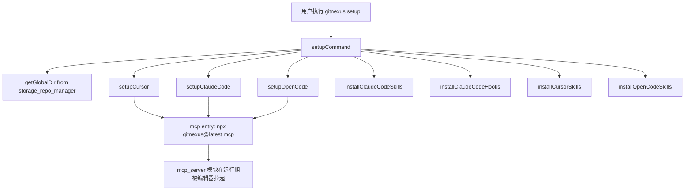
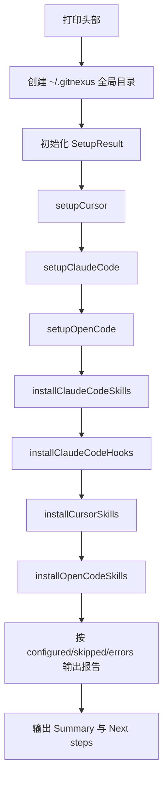

# setup_configuration 模块文档

## 模块定位与存在意义

`setup_configuration`（实现文件为 `gitnexus/src/cli/setup.ts`）是 GitNexus CLI 中的“一次性环境引导”模块。它的核心目标不是分析代码，也不是启动服务器，而是在用户机器上完成 **AI 编辑器与 GitNexus MCP 服务的全局接线**。这一步的意义在于：用户只需要运行一次 `gitnexus setup`，后续在任意仓库中打开编辑器时，都可以直接调用 GitNexus 的 MCP 能力，而不必为每个项目重复配置。

从系统分层看，这个模块属于 `cli` 的交互入口能力，向下只依赖极少量基础设施（文件系统与路径处理、用户主目录探测、全局目录定位），向上则为 `mcp_server` 的实际使用铺路。也就是说，它不直接处理图谱、解析、索引，而是为这些能力在编辑器内“可用”提供操作系统级配置基础。

该模块采用了非常务实的设计：一方面尽量自动化（自动检测 Cursor / Claude Code / OpenCode 的安装目录并写入配置）；另一方面对平台差异和工具限制保持保守策略（例如 Claude Code 的 MCP 注册采用命令提示的“手工步骤”，而不是强行改文件）。这种设计避免了高耦合和脆弱适配，也减少了用户配置被破坏的风险。

---

## 在整体系统中的角色



上图展示了该模块的真实职责边界：`setupCommand` 只做配置落盘与提示输出，不负责验证 MCP 服务是否已经成功启动，也不负责仓库分析。MCP 进程是否运行、工具是否可调用，是编辑器后续按配置启动 `gitnexus mcp` 后，由 [mcp_server.md](mcp_server.md) 负责的运行期行为。

---

## 核心数据结构

## `SetupResult`

`SetupResult` 是整个命令执行期的结果收集器，用于把多个子步骤（编辑器配置、skills 安装、hooks 合并）的执行结果统一汇总并最终输出。

```ts
interface SetupResult {
  configured: string[];
  skipped: string[];
  errors: string[];
}
```

它的设计重点在于“累加式记录”而不是“失败即中断”。也就是说，一个编辑器配置失败不会阻断其他编辑器配置，命令会继续执行并在最后集中汇报。这使得 `setup` 命令对多平台混合环境更友好：即便本机只安装了某一个编辑器，或者某个路径权限异常，用户仍能获得部分成功结果。

---

## 内部组件与实现机制

## 1) MCP 条目生成：`getMcpEntry()`

`getMcpEntry()` 根据平台返回编辑器可直接消费的命令结构。

- 在 `win32` 上返回 `cmd /c npx -y gitnexus@latest mcp`
- 在非 Windows 平台返回 `npx -y gitnexus@latest mcp`

这个分支是必要的，因为 Windows 下 `npx` 常表现为 `.cmd` 脚本，直接作为可执行文件调用在某些调用器中会失败。函数没有参数，返回对象会被多个编辑器配置函数复用，保证命令入口一致。

副作用方面，该函数本身无 I/O，仅依赖 `process.platform`。

## 2) 配置合并：`mergeMcpConfig(existing)`

该函数把 `gitnexus` 注入 `existing.mcpServers.gitnexus`。其行为是“软初始化 + 定点覆盖”：

1. 若输入不是对象，重置为空对象。
2. 若 `mcpServers` 不存在或不是对象，初始化为空对象。
3. 写入 `mcpServers.gitnexus = getMcpEntry()`。

返回值是更新后的对象。副作用仅限于对传入对象的就地修改（若输入对象可变）。该函数不清空其他 MCP 服务配置，因此对已有配置兼容性较好。

## 3) 文件 I/O 基础能力

`readJsonFile(filePath)` 负责读取并解析 JSON；读取失败、文件不存在、JSON 非法都会返回 `null`。这是一种“宽容读取”策略，适合配置场景。

`writeJsonFile(filePath, data)` 负责先 `mkdir -p` 父目录，再按两空格缩进写入 JSON，并附带末尾换行。它是该模块几乎所有落盘操作的统一写入口。

`dirExists(dirPath)` 通过 `fs.stat` 判断目录是否存在且为目录。异常统一返回 `false`，用于安装探测。

这些函数都不抛出业务语义错误，而是把异常延迟到上层编辑器函数中记录到 `SetupResult.errors`。

## 4) 编辑器配置函数

### `setupCursor(result)`

它检测 `~/.cursor` 是否存在。若不存在，写入 `skipped`；存在则合并写入 `~/.cursor/mcp.json`，成功后写入 `configured`。

参数是 `SetupResult` 引用，返回 `Promise<void>`。主要副作用是磁盘读写 `~/.cursor/mcp.json`。

### `setupClaudeCode(result)`

它只探测 `~/.claude` 是否存在，不直接写 MCP JSON，而是向控制台打印：

```bash
claude mcp add gitnexus -- npx -y gitnexus mcp
```

这是有意为之。该函数把结果记为 `Claude Code (MCP manual step printed)`，表示“检测成功 + 已提示后续动作”。副作用是控制台输出。

### `setupOpenCode(result)`

它检测 `~/.config/opencode`，存在时写入/更新 `~/.config/opencode/config.json` 的 `mcp.gitnexus` 字段。与 Cursor 不同的是 OpenCode 使用 `mcp` 命名空间而非 `mcpServers`。

## 5) Skills 安装体系

模块内置常量 `SKILL_NAMES`，当前包含 6 个技能：

- `gitnexus-exploring`
- `gitnexus-debugging`
- `gitnexus-impact-analysis`
- `gitnexus-refactoring`
- `gitnexus-guide`
- `gitnexus-cli`

### `installSkillsTo(targetDir)`

该函数是跨编辑器复用的技能安装核心。输入是目标目录，输出为实际安装成功的技能名数组。

它支持两种源布局：

1. 目录布局：`skills/{name}/SKILL.md`（可包含子目录与引用资源）
2. 扁平布局：`skills/{name}.md`（会被写入目标目录下的 `SKILL.md`）

若某个技能不存在，函数会静默跳过而非报错，这保证了发布包中技能集合可渐进演化。

### `copyDirRecursive(src, dest)`

该函数递归复制目录树，用于目录布局技能。参数分别是源目录和目标目录，返回 `Promise<void>`。副作用是文件系统写操作。

### 平台绑定安装器

- `installClaudeCodeSkills(result)` → `~/.claude/skills`
- `installCursorSkills(result)` → `~/.cursor/skills`
- `installOpenCodeSkills(result)` → `~/.config/opencode/skill`

三者都通过 `installSkillsTo` 实现，差异仅在目录探测与落盘位置。

## 6) Claude hooks 合并：`installClaudeCodeHooks(result)`

这个函数是模块里逻辑最“定制化”的部分。它会：

1. 将包内 `hooks/claude/gitnexus-hook.cjs` 复制到 `~/.claude/hooks/gitnexus/gitnexus-hook.cjs`（若源文件不存在则跳过复制）。
2. 读取并合并 `~/.claude/settings.json`。
3. 确保存在 `hooks.PreToolUse` 数组。
4. 检查是否已有包含 `gitnexus` 的命令钩子，若无则追加一个 matcher 为 `Grep|Glob|Bash` 的 `command` hook。

关键行为是“避免重复注入”：它通过 `some(...includes('gitnexus'))` 判断是否已经存在，避免每次运行 `setup` 都堆叠重复钩子。

注释中明确了已知限制：Windows 平台上 `SessionStart` hooks 存在 Claude Code 侧 bug，因此此处只配置 `PreToolUse`。

---

## 主流程：`setupCommand`

`setupCommand` 是导出的命令入口，外部通常通过 `gitnexus setup` 触发。



其中 `getGlobalDir()` 来自 `storage_repo_manager`，对应 `~/.gitnexus`。该目录在这里主要用于确保 GitNexus 全局空间存在；仓库索引注册等能力请参考 [storage_repo_manager.md](storage_repo_manager.md)。

---

## 配置产物与示例

Cursor 的目标文件通常如下：

```json
{
  "mcpServers": {
    "gitnexus": {
      "command": "npx",
      "args": ["-y", "gitnexus@latest", "mcp"]
    }
  }
}
```

OpenCode 的目标结构通常如下：

```json
{
  "mcp": {
    "gitnexus": {
      "command": "npx",
      "args": ["-y", "gitnexus@latest", "mcp"]
    }
  }
}
```

Claude Code 的 hooks 合并后会在 `settings.json` 中出现 `hooks.PreToolUse` 节点，内部 command 指向 `node "~/.claude/hooks/gitnexus/gitnexus-hook.cjs"`。

---

## 错误处理、边界条件与限制

该模块采用“局部失败、全局继续”的错误策略。单个步骤失败只会追加 `errors`，不会使整个命令提前退出。这对用户体验很重要，但也意味着调用方如果想做严格 CI 校验，需要额外解析输出并自行判定失败阈值。

一个重要边界是 JSON 读取宽容：`readJsonFile` 把“文件不存在”和“JSON 损坏”都归一为 `null`。优点是流程鲁棒，缺点是无法区分“首次初始化”与“配置文件已损坏”。如果后续要增强可观测性，建议区分 error code 并提供告警。

在幂等性方面：

- MCP 配置是覆盖同名 `gitnexus` 条目，重复运行安全。
- Claude hooks 通过存在性检测避免重复注入，重复运行基本安全。
- Skills 安装会覆盖目标文件内容（尤其扁平布局转 `SKILL.md`），可视为“以当前包版本重装”。

已知限制包括：

1. Claude MCP 仍需手动执行 `claude mcp add ...`。
2. Windows `SessionStart` hooks 受上游 bug 影响未启用。
3. 技能缺失会被静默跳过，默认不会在 `errors` 中暴露具体缺哪个技能。

---

## 使用与运维建议

建议在以下时机运行 `gitnexus setup`：首次安装 GitNexus、升级到新大版本、切换常用编辑器、或怀疑本地配置被覆盖后。命令可重复执行，通常不会产生破坏性副作用。

推荐的验证路径是：先检查编辑器配置文件是否含有 `gitnexus` 条目，再在编辑器中触发 MCP 工具调用。如果配置存在但调用失败，应进一步排查 `npx` 可执行性与网络环境（首次拉取 `gitnexus@latest` 需要网络）。

---

## 扩展指南（面向维护者）

如果要支持新编辑器，最稳妥的方式是遵循现有模板：

1. 新增 `setupXxx(result)` 负责“目录探测 + JSON 合并 + 结果记录”。
2. 如支持技能，新增 `installXxxSkills(result)` 并复用 `installSkillsTo`。
3. 若编辑器支持 hooks，新增“幂等合并”逻辑，避免重复注入。
4. 在 `setupCommand` 中按既定顺序接入。

请尽量保持 `SetupResult` 语义稳定（configured/skipped/errors），这对 CLI 输出与用户预期非常关键。

---

## 相关模块参考

- CLI 总体命令组织与调用入口：[`cli.md`](cli.md)
- `getGlobalDir` 与全局仓库注册：[`storage_repo_manager.md`](storage_repo_manager.md)
- MCP 运行期服务与会话模型：[`mcp_server.md`](mcp_server.md)
- 分析命令（setup 后常见下一步）：[`analyze_command.md`](analyze_command.md)
