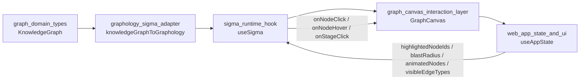
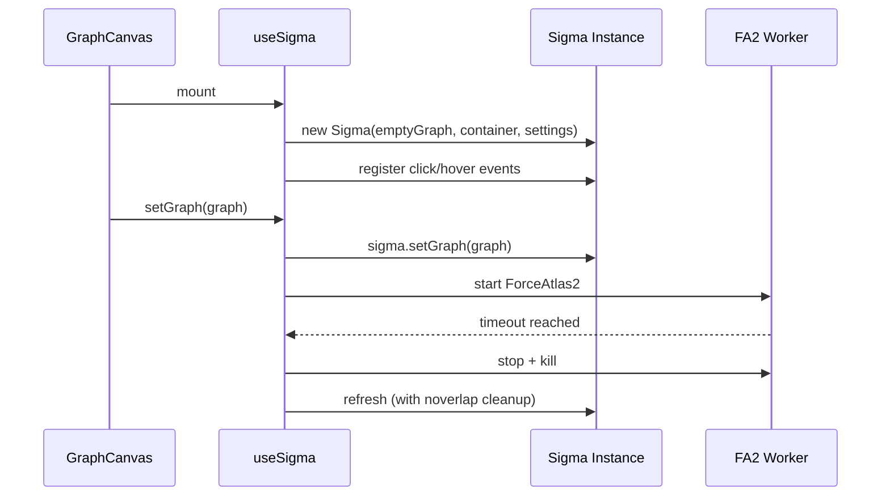
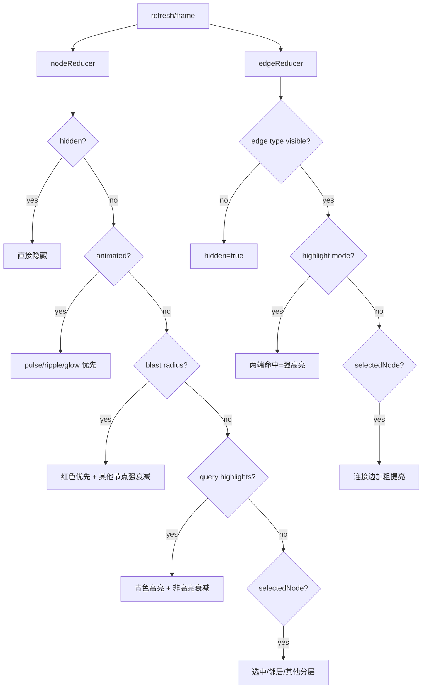
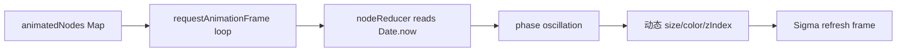

# sigma_runtime_hook 模块文档

## 模块简介

`sigma_runtime_hook` 对应代码文件 `gitnexus-web/src/hooks/useSigma.ts`，核心导出是 `useSigma` React Hook 及其输入/输出契约 `UseSigmaOptions`、`UseSigmaReturn`。这个模块的职责不是“构建图数据”，而是“驱动图运行时”：在浏览器中初始化 Sigma 渲染器、管理布局引擎生命周期、处理节点/边的动态视觉约简（reducer）、响应交互事件，并向上层 UI 暴露一组可编排的控制 API（如 `setGraph`、`focusNode`、`startLayout`、`stopLayout`）。

从设计上看，它是 `graphology_sigma_adapter` 与 `GraphCanvas` 之间的关键执行层。上游 adapter 负责把领域图转换为 Graphology 数据结构并写入初始属性；`useSigma` 则将这些属性变成可交互、可动画、可过滤的实时图视图。模块存在的根本原因是：图可视化在前端并非一次性渲染，而是持续变化的运行态系统，必须同时处理状态同步、性能、交互一致性与视觉可读性。

---

## 在系统架构中的位置



`sigma_runtime_hook` 的输入有两类：一类是“图对象输入”（`setGraph` 接收 Graphology 图），另一类是“状态输入”（来自 `UseSigmaOptions` 的高亮、动画、可见边类型等）。它把两类输入汇聚到 Sigma 的 `nodeReducer` / `edgeReducer` 和渲染循环中，最后把点击、悬停、缩放、聚焦、布局控制等行为反向暴露给 UI。

建议联读：
- [graphology_sigma_adapter.md](graphology_sigma_adapter.md)
- [graph_canvas_interaction_layer.md](graph_canvas_interaction_layer.md)（若存在）
- [web_app_state_and_ui] 对应文档（若已生成）

---

## 核心 API 契约

### `UseSigmaOptions`

```ts
interface UseSigmaOptions {
  onNodeClick?: (nodeId: string) => void;
  onNodeHover?: (nodeId: string | null) => void;
  onStageClick?: () => void;
  highlightedNodeIds?: Set<string>;
  blastRadiusNodeIds?: Set<string>;
  animatedNodes?: Map<string, NodeAnimation>;
  visibleEdgeTypes?: EdgeType[];
}
```

这个配置对象代表“外部状态注入 + 事件回调注入”。其中 `highlightedNodeIds`、`blastRadiusNodeIds`、`animatedNodes` 与 `visibleEdgeTypes` 不直接改变图结构，而是通过 reducer 在渲染时决定视觉层级、颜色、尺寸、是否隐藏。`onNodeClick`、`onNodeHover`、`onStageClick` 则把底层渲染事件抬升为业务交互事件。

### `UseSigmaReturn`

```ts
interface UseSigmaReturn {
  containerRef: React.RefObject<HTMLDivElement>;
  sigmaRef: React.RefObject<Sigma | null>;
  setGraph: (graph: Graph<SigmaNodeAttributes, SigmaEdgeAttributes>) => void;
  zoomIn: () => void;
  zoomOut: () => void;
  resetZoom: () => void;
  focusNode: (nodeId: string) => void;
  isLayoutRunning: boolean;
  startLayout: () => void;
  stopLayout: () => void;
  selectedNode: string | null;
  setSelectedNode: (nodeId: string | null) => void;
  refreshHighlights: () => void;
}
```

返回值同时包含“命令式 API”（zoom/focus/layout 控制）和“受控状态”（`isLayoutRunning`、`selectedNode`）。`containerRef` 是渲染挂载点，`sigmaRef` 则提供底层实例访问能力（用于高级扩展或调试）。

---

## 内部架构与运行机制

### 1）初始化阶段：只创建一次 Sigma 运行时

`useEffect([])` 在组件首次挂载时创建空 Graphology 图与 Sigma 实例，并配置渲染参数（字体、标签阈值、相机范围、默认边程序、hover 绘制器等）。这一步还注册了四类事件：

- `clickNode`：设置选中节点并上抛 `onNodeClick`
- `clickStage`：清空选中并上抛 `onStageClick`
- `enterNode`：上抛 `onNodeHover(node)` 并把鼠标改为 `pointer`
- `leaveNode`：上抛 `onNodeHover(null)` 并恢复 `grab`

在卸载时会清理 layout worker、timeout、Sigma 实例，避免内存泄漏或后台线程残留。



### 2）状态同步策略：Ref 持有“热状态”，避免重建实例

高亮集、blast radius、动画节点、边类型过滤都通过 `useRef` 持有，并在依赖变化时更新，再调用 `sigma.refresh()`。这种设计避免了因为 React 重新渲染而重建 Sigma 实例，也避免 reducer 闭包读取到旧状态。`selectedNode` 同时保留 `ref + state`：

- `selectedNodeRef` 供 reducer 即时读取
- `selectedNode` state 供 React UI 显示

这是一种典型的“渲染引擎状态与 React 视图状态并存”的折中模式。

### 3）Reducer 管线：节点与边视觉逻辑中心

Sigma 的 `nodeReducer` 和 `edgeReducer` 是本模块最关键的执行路径。它们在每次刷新时根据当前状态输出“临时渲染属性”，不直接改写原始图数据。



这个优先级很重要：**动画效果优先于普通高亮，高亮模式优先于选中模式**。因此当外部同时触发多个状态时，视觉呈现遵循固定策略，避免冲突不可预测。

---

## 关键内部函数说明

### `hexToRgb` / `rgbToHex` / `dimColor` / `brightenColor`

这组辅助函数用于 reducer 中的颜色运算。`dimColor` 不是简单降低亮度，而是与暗背景色 `#12121c` 混合，能在深色主题下保留原色“色相提示”；`brightenColor` 通过向白色插值来提亮。它们对“高亮对比但不刺眼”的视觉风格至关重要。

### `getFA2Settings(nodeCount)`

根据节点规模动态生成 ForceAtlas2 参数。小图重视速度与可读性，大图重视稳定与性能：

- 节点越大，`gravity` 越低，防止过度收缩
- 节点越大，`scalingRatio` 越高，拉开整体间距
- `barnesHutOptimize` 在中大型图启用，加速近似计算
- `slowDown` 随规模增大，控制震荡

这套参数是“快速收敛优先”的调校，而非精确物理模拟。

### `getLayoutDuration(nodeCount)`

决定 FA2 自动停止时间，范围 20s~45s。设计依据是：布局在线程 worker 中运行，配合 WebGL 渲染，允许相对更长时间换取更可读最终布局。超大图给更长收敛窗口。

### `runLayout(graph)`

执行完整布局生命周期：清理旧布局 -> 推断设置并合并自定义参数 -> 启动 FA2 worker -> 到时 `stop()` -> `noverlap.assign()` 做轻量防重叠收尾 -> 刷新。

副作用是会改变节点坐标（写回 Graphology 属性），并更新 `isLayoutRunning`。

### `setGraph(newGraph)`

把新图挂入 Sigma 的标准入口。它会：

1. 停掉现有布局与 timer
2. `sigma.setGraph(newGraph)` 替换图
3. 清空当前选中
4. 自动启动布局
5. 相机 `animatedReset`

这意味着它不是“纯赋值”，而是“换图 + 重新布局 + 视角复位”的复合操作。

### `focusNode(nodeId)`

聚焦并选中节点。如果节点存在，会设置选中状态并将相机动画移动到节点位置（ratio=0.15）。它内置一个防抖语义：若已选中同一节点，不重复相机动画，减少双击时抖动。

### `setSelectedNode(nodeId)`

与 `focusNode` 不同，`setSelectedNode` 的核心是“更新选中 + 强制边刷新”。函数内部做了一个极小相机比例扰动（`*1.0001`），用于触发 Sigma 边缓存刷新，这是一个明确的运行时 workaround。

### `startLayout()` / `stopLayout()`

`startLayout` 在当前图存在且非空时重新运行布局；`stopLayout` 会立即停止 worker，并执行一次 `noverlap` 收尾。适用于用户手动停止布局、或在特定交互后希望快速稳定画面。

### `refreshHighlights()`

只是 `sigma.refresh()` 的语义化封装。用于外部在不改图结构时强制重绘（例如外部状态系统更新了 reducer 依赖对象）。

---

## 动画系统（animatedNodes）

当 `animatedNodes` 非空时，Hook 会启动 `requestAnimationFrame` 循环，每帧 `sigma.refresh()`。节点动画由 reducer 基于时间差实时计算，不改写图中的永久属性。

支持三种动画类型（来自 `NodeAnimation.type`）：

- `pulse`：青色脉冲，通常用于搜索结果反馈
- `ripple`：红色涟漪，通常用于 blast radius 反馈
- `glow`：紫色呼吸光，通常用于强调高亮

动画计算采用 `sin` 相位做 0-1 循环，视觉上是平滑往返而非线性跳变。



注意事项：持续帧刷新会带来 GPU/CPU 压力，建议外部在动画结束后及时清理 `animatedNodes`。

---

## 布局与交互的协同关系

`sigma_runtime_hook` 不是单独的布局模块，它把布局与交互逻辑耦合在同一个运行时里，原因是两者会互相影响：

- 布局运行期间节点位置持续变化，点击与 hover 必须实时可用
- 高亮/选中 reducer 在布局过程中也要持续生效
- 布局结束后需要立刻做 noverlap 收尾并刷新显示

因此该模块提供 `isLayoutRunning`，让 UI 能在操作层显示“布局进行中”状态或暴露“停止布局”按钮。

---

## 使用方式与代码示例

```tsx
import { useSigma } from '@/hooks/useSigma'
import { knowledgeGraphToGraphology } from '@/lib/graph-adapter'

function GraphView({ kg, highlightedNodeIds, visibleEdgeTypes }) {
  const {
    containerRef,
    setGraph,
    focusNode,
    zoomIn,
    zoomOut,
    resetZoom,
    isLayoutRunning,
    stopLayout,
  } = useSigma({
    highlightedNodeIds,
    visibleEdgeTypes,
    onNodeClick: (id) => console.log('clicked', id),
    onStageClick: () => console.log('stage clicked'),
  })

  useEffect(() => {
    if (!kg) return
    const graph = knowledgeGraphToGraphology(kg)
    setGraph(graph)
  }, [kg, setGraph])

  return (
    <>
      <div ref={containerRef} style={{ width: '100%', height: 720 }} />
      <button onClick={zoomIn}>+</button>
      <button onClick={zoomOut}>-</button>
      <button onClick={resetZoom}>Reset</button>
      <button onClick={() => focusNode('node:abc')}>Focus A</button>
      {isLayoutRunning && <button onClick={stopLayout}>Stop Layout</button>}
    </>
  )
}
```

实践上建议把 Graphology 图对象缓存起来，避免不必要的 `setGraph` 调用；因为 `setGraph` 会重置相机并触发布局。

---

## 配置与行为要点

### Sigma 初始化参数（内建）

模块内已硬编码一组偏深色主题、强调可读性的参数，例如：

- `defaultEdgeType: 'curved'` 并启用 `@sigma/edge-curve`
- `hideEdgesOnMove: true`（相机移动时隐藏边提升流畅度）
- `minCameraRatio: 0.002`, `maxCameraRatio: 50`
- 自定义 `defaultDrawNodeHover`（深色胶囊标签 + 节点辉光）

这意味着如果你要更改视觉主题，通常需要扩展或 fork 此 Hook，而不是在外部简单传参。

### 边类型过滤

`visibleEdgeTypes` 通过 `edgeReducer` 直接执行：不在列表中的边会 `hidden = true`。这里依赖 `SigmaEdgeAttributes.relationType` 与 `EdgeType` 文本一致，若上游适配器输出了不兼容的关系类型，过滤将失效或误隐藏。

---

## 边界条件、错误场景与已知限制

### 1）空图与不存在节点

- `runLayout` 在 `graph.order === 0` 时直接返回
- `focusNode` 在节点不存在时直接返回
- `setGraph` 若 Sigma 尚未初始化（极早期调用）会静默返回

这些保护避免了运行时异常，但也意味着调用方若未检查状态，可能出现“按钮点击无效果”而无报错提示。

### 2）选择状态与高亮状态优先级

当存在 `highlightedNodeIds` / `blastRadiusNodeIds` 且没有选中节点时，高亮逻辑占主导；一旦选中节点存在，会切换到“选中-邻居-其余”模式。若你希望两种模式叠加，需要改写 reducer 优先级。

### 3）Sigma 边缓存 workaround

`setSelectedNode` 通过微小相机扰动触发边刷新，这是对渲染器缓存行为的工程性补丁。潜在影响是：某些严格相机同步逻辑中会观察到极轻微 ratio 变化。若未来 Sigma 内核修复该问题，可考虑移除此逻辑。

### 4）动画帧循环开销

`animatedNodes` 非空时会持续刷新，每帧重算 reducer。大型图 + 高频动画可能增加渲染压力。建议在 `NodeAnimation.duration` 到期后由上层状态管理及时移除动画条目。

### 5）布局停止条件是“时间驱动”

当前布局停止不是基于收敛指标，而是固定 timeout。对于结构极复杂图，可能“未充分收敛就停止”；对于简单图，可能“已稳定但仍在跑”。这是可预测但非最优的策略。

---

## 扩展建议

如果你要扩展 `useSigma`，优先考虑以下方向：

1. 把初始化参数抽成 `UseSigmaOptions` 可选配置（如相机边界、标签密度、hover renderer）。
2. 为布局策略增加“手动档位”（fast/balanced/quality）并映射到 `getFA2Settings` + `getLayoutDuration`。
3. 将 reducer 视觉规则拆成可组合函数，便于新增业务态（例如错误节点、脏代码热点、AI 引用层）。
4. 引入收敛检测（位移阈值）替代固定 timeout，减少无效布局时长。

扩展时需保持一个关键约束：**避免在 React render 路径中频繁重建 Sigma/Graph 对象**，否则性能和交互稳定性会显著下降。

---

## 与其他模块的职责边界

`sigma_runtime_hook` 只负责运行态渲染与交互，不负责：

- 领域图建模与关系语义定义（见 [graph_domain_types.md](graph_domain_types.md)）
- 领域图到 Graphology 的初始转换（见 [graphology_sigma_adapter.md](graphology_sigma_adapter.md)）
- 应用级状态管理（如 AI 高亮开关、查询结果来源，见 `useAppState` 所在模块文档）

理解这个边界有助于排障：如果是节点坐标/颜色初始值不对，先看 adapter；如果是点击/高亮/动画表现不对，再看 `useSigma`。

---

## 总结

`sigma_runtime_hook` 是 `gitnexus-web` 图交互体验的核心执行层。它通过稳定的实例生命周期管理、基于 reducer 的视觉状态机、面向规模自适应的布局参数和可编排的控制 API，把“静态图数据”转化为“可导航、可筛选、可反馈”的运行时图界面。对维护者而言，最重要的是把握三条主线：状态同步（refs）、视觉优先级（reducers）和布局生命周期（FA2 + timeout + noverlap）。只要这三条主线保持一致，模块就能在复杂交互场景下维持可预测行为。