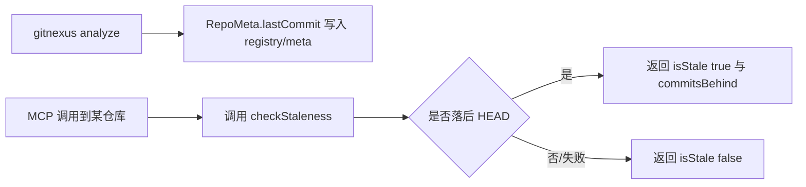
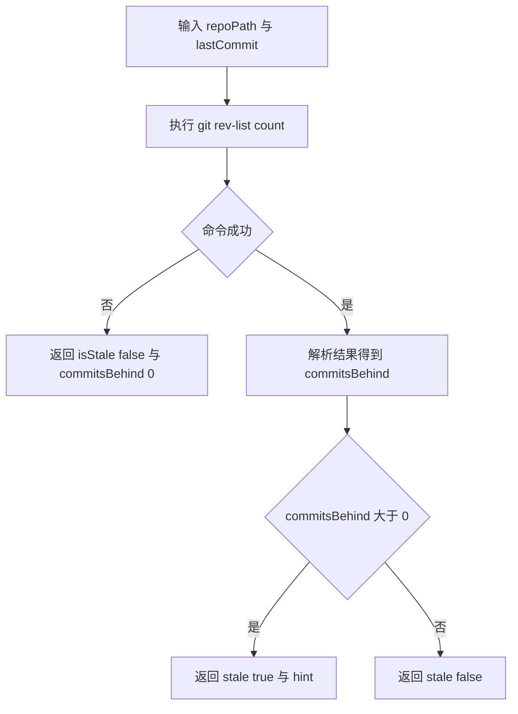
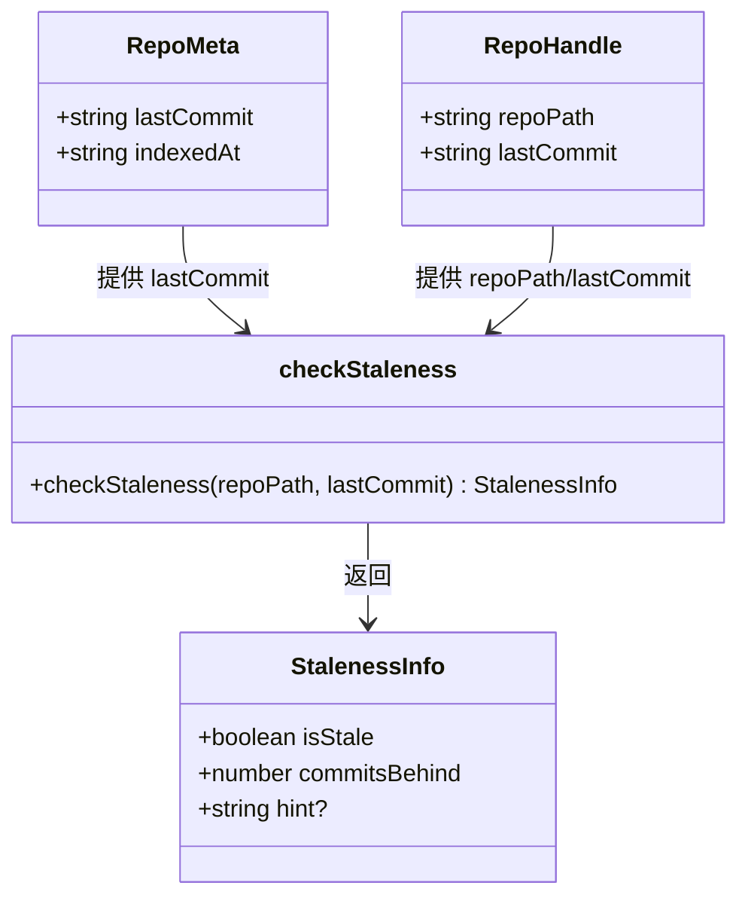
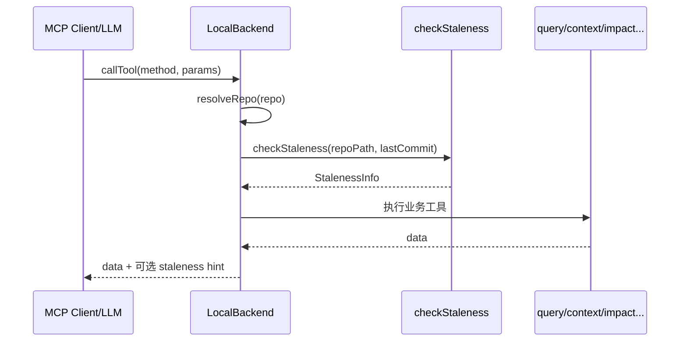

# staleness_detection 模块文档

## 模块简介与设计动机

`staleness_detection`（源码：`gitnexus/src/mcp/staleness.ts`）是 MCP 服务中的一个轻量“索引新鲜度探测器”。它的核心目标非常明确：判断当前 GitNexus 索引是否已经落后于代码仓库的 `HEAD`，并在落后时返回可直接给 LLM/调用方消费的提示信息（hint），引导执行 `analyze` 重新索引。

这个模块之所以存在，是因为 GitNexus 的图谱与检索能力依赖“某个时刻”的索引快照。当开发者继续提交代码后，索引元数据中的 `lastCommit` 可能不再代表当前仓库状态。如果不做新鲜度检测，MCP 工具可能会在“语义上正确但版本上过期”的图数据上回答问题，导致结果偏差。`staleness_detection` 用极低成本（一次 Git 命令）弥补这个可观测性缺口。

从架构角色看，它不是分析流水线的一部分，也不写入任何存储；它只是读取“索引时 commit”与“当前 HEAD”的差距，输出一个标准化结构体 `StalenessInfo`。因此它被设计成无状态、可重复调用、失败时不阻断主流程（fail-open）的辅助模块。

---

## 在系统中的位置



上图中的 `lastCommit` 通常来自索引阶段写入的仓库元数据（可参考 [`storage_repo_manager.md`](storage_repo_manager.md)）。`repoPath` 则来自 MCP 本地后端解析出的仓库句柄（可参考 [`local_backend.md`](local_backend.md) 和 [`mcp_server.md`](mcp_server.md)）。`staleness_detection` 本身不感知 Kuzu、向量索引或图查询逻辑，因此耦合面很小，适合在任何工具调用前后插入。

---

## 核心组件

## `StalenessInfo`

`StalenessInfo` 是模块对外唯一核心类型，定义如下：

```ts
export interface StalenessInfo {
  isStale: boolean;
  commitsBehind: number;
  hint?: string;
}
```

其语义是：

- `isStale` 表示索引是否落后于当前 `HEAD`。
- `commitsBehind` 是落后提交数，来源于 `git rev-list --count <lastCommit>..HEAD`。
- `hint` 仅在 `isStale=true` 时出现，提供面向人类/LLM 的可操作建议。

这个结构体刻意保持最小集，不携带具体 commit 列表、branch 名称或冲突信息，目的是让上层可以快速决策（例如“是否提示重建索引”），而不增加响应负担。

---

## 核心函数与内部工作机制

## `checkStaleness(repoPath: string, lastCommit: string): StalenessInfo`

### 功能说明

`checkStaleness` 会在目标仓库目录下执行 Git 命令，计算 `lastCommit` 到 `HEAD` 之间新增了多少提交，并据此判断索引是否过期。

### 参数

- `repoPath`：Git 仓库路径，用于设置命令执行目录（`cwd`）。
- `lastCommit`：索引构建时记录的提交哈希。

### 返回值

返回 `StalenessInfo`：

- 若 `commitsBehind > 0`，则返回 `isStale: true`，并带英文 hint（含复数处理）。
- 若 `commitsBehind === 0`，返回 `isStale: false`。
- 若执行出错（例如不是 Git 仓库、commit 不存在、权限问题），进入 `catch`，**默认返回不陈旧**（fail-open）。

### 副作用

- 读取本地 Git 状态（执行子进程命令）。
- 不修改文件系统、不写数据库、不更新内存状态。

### 实现流程图



### 关键实现细节

函数使用 `execSync` 同步执行命令，这意味着它在调用线程上阻塞直到 Git 命令返回。对于单次调用开销通常可接受，但在高并发/批量仓库检查场景中，需要由上层做并发控制或缓存。`stdio` 被设置为 `pipe`，以便捕获输出并避免污染主进程标准输出。

此外，函数内部通过 `parseInt(result, 10) || 0` 兜底解析异常值，这是一种“宽松读取”策略：即便输出非预期，也不会抛错，而是按 0 处理并继续走“非陈旧”路径。

---

## 组件关系与依赖说明



`staleness_detection` 只依赖 Node.js 标准库（`child_process`，以及当前文件中未实际使用的 `path` import），因此几乎没有外部运行时耦合。它与 `RepoMeta.lastCommit` 的关系是**数据契约关系**：如果上游索引阶段未正确写入 commit，本模块就无法给出可靠结果。

---

## 使用方式与示例

### 基础调用

```ts
import { checkStaleness } from './mcp/staleness';

const info = checkStaleness('/path/to/repo', 'a1b2c3d4');

if (info.isStale) {
  console.log(info.hint);
  // => ⚠️ Index is 3 commits behind HEAD. Run analyze tool to update.
}
```

### 结合 MCP 工具调用前置提示

```ts
const staleness = checkStaleness(repo.repoPath, repo.lastCommit);
if (staleness.isStale) {
  // 可注入到 tool response 的 warning 区域，提醒先 analyze
  warnings.push(staleness.hint);
}
```

### 返回示例

```json
{
  "isStale": true,
  "commitsBehind": 2,
  "hint": "⚠️ Index is 2 commits behind HEAD. Run analyze tool to update."
}
```

---

## 行为约束、边界条件与已知限制

`staleness_detection` 的逻辑很简单，但在生产中有几个关键边界要理解。

首先，它是基于 commit 拓扑差异而不是文件差异，因此“工作区未提交改动”不会体现在 `commitsBehind`。也就是说，一个仓库即使有大量未提交修改，只要 `HEAD` 未前进，它仍会返回 `isStale=false`。如果需要覆盖未提交变更，应与 `detect_changes` 一类能力联动，而不是依赖本模块。

其次，函数采取 fail-open。任何异常都返回“非陈旧”，这保证了主流程可用性，但会带来**假阴性**风险。例如仓库路径错误、Git 不可用、`lastCommit` 被重写历史后不可达时，理论上应提示“无法判断”，但当前实现会静默降级为 `isStale=false`。

再次，`git rev-list --count A..HEAD` 语义是“从 A 不可达但从 HEAD 可达的提交数”。在分支切换、rebase、force-push 场景下，这个数字可能与“业务直觉上的落后程度”不完全一致。模块也不报告“ahead/behind 双向关系”，只关心“索引相对当前 HEAD 是否落后”。

最后，本文件存在 `import path from 'path';` 但未使用。这不会影响运行，但在严格 lint 规则下可能触发告警，属于可清理的技术债。

---

## 错误条件说明

尽管函数内部吞掉了异常，上层仍应了解常见失败来源：

- `repoPath` 不是 Git 仓库或目录不存在。
- `lastCommit` 为空、格式非法或在当前历史中不可达。
- 运行环境缺少 Git 可执行文件。
- 进程权限不足，无法在目标目录执行命令。

由于当前策略不暴露错误明细，如果你的业务希望“可观测失败原因”，建议封装一个增强版本，返回 `status: 'ok' | 'unknown'` 或附加 `errorReason` 字段。

---

## 可扩展建议

如果要扩展该模块，推荐保持“最小侵入”的原则，并优先保证与现有 `StalenessInfo` 的兼容。

一个常见扩展是加入 `mode` 参数，例如 `commits_only`（当前行为）与 `workspace_included`（额外检测未提交变更）。另一个方向是返回更丰富的诊断信息，比如 `headCommit`、`indexedCommit`、`checkedAt`，便于上层缓存与审计。若在 MCP 响应中需要多语言提示，可把 `hint` 改为结构化字段（如 `hintCode` + `hintArgs`），由展示层做国际化渲染。

---

## 与其他模块文档的关联

为避免重复，下面这些主题建议直接阅读对应文档：

- 仓库索引元数据（`lastCommit` 的来源与持久化）：[`storage_repo_manager.md`](storage_repo_manager.md)
- MCP 本地后端的仓库解析与工具分发：[`local_backend.md`](local_backend.md)
- MCP 会话与 HTTP 接入层：[`mcp_server.md`](mcp_server.md)

`staleness_detection` 可以理解为这些模块之间的“新鲜度守门员”：实现简单，但对回答可信度很关键。


## 与 LocalBackend 的协作机制（补充）

虽然 `checkStaleness` 是一个纯函数风格的工具函数，但它在运行时几乎总是通过 `LocalBackend` 被消费。`LocalBackend` 在内存中维护 `RepoHandle`，其中已经包含 `repoPath` 与 `lastCommit`，这使得 staleness 检测可以在工具分发前以极低成本插入。

在实际工程中，常见做法不是“检测失败就阻断调用”，而是“检测到陈旧就附带 warning/hint”。这种设计与当前模块的 fail-open 策略是一致的：即保证查询链路可用，同时尽量提供正确性提醒。



## 配置与运维建议（补充）

在多仓库或长生命周期 MCP 服务中，建议把 staleness 检测视为“运行时健康信号”而不仅是 UI 提示。具体来说，可以按仓库记录最近一次检测时间与结果，用于后续审计：当用户反馈“为什么回答不准确”时，可以快速回放当时索引是否已经落后。

另一个实用实践是把提示策略做成可配置，例如：

- 落后 1~2 commits：仅提示，不强制
- 落后 > N commits：提升提示等级，建议先 `analyze`
- 连续多次检测失败：额外返回“状态未知”标记（在你自定义封装层实现）

## 典型误区与排查路径（补充）

一个高频误区是把“工作区 dirty”误认为“索引 stale”。本模块只比较 commit 历史，不覆盖未提交变更；若你需要覆盖工作区改动，应结合 `detect_changes` 之类的工具链能力。

另一个常见问题是“为什么明明变了代码却显示 not stale”。优先排查以下路径：

1. `lastCommit` 是否来自正确仓库、是否被误写。
2. 当前 `repoPath` 是否与索引时路径一致（尤其是符号链接或挂载路径变化）。
3. Git 历史是否被 rebase/force-push，导致旧 commit 在当前图中不可达并触发 fail-open。
4. 运行环境中的 Git 可执行文件是否可用。

## 最小扩展示例：返回可观测状态（补充）

如果你希望在不破坏现有调用方的情况下增强可观测性，可以在外层封装：

```ts
type StalenessStatus = 'ok' | 'unknown';

interface ObservableStalenessInfo extends StalenessInfo {
  status: StalenessStatus;
  errorReason?: string;
}

function checkStalenessObservable(repoPath: string, lastCommit: string): ObservableStalenessInfo {
  try {
    const info = checkStaleness(repoPath, lastCommit);
    return { ...info, status: 'ok' };
  } catch (e: any) {
    // 注意：当前 checkStaleness 内部已吞错，这里只是展示扩展思路
    return { isStale: false, commitsBehind: 0, status: 'unknown', errorReason: e?.message };
  }
}
```

## 总结

`staleness_detection` 代码体量很小，但它是 GitNexus 在“可用性”与“正确性提示”之间取得平衡的关键模块。它不改变任何索引状态，不参与图谱查询，只负责快速回答一个问题：**当前索引是否可能过期**。理解这一职责边界，有助于你在扩展时避免把它演化成重量级状态管理组件。
