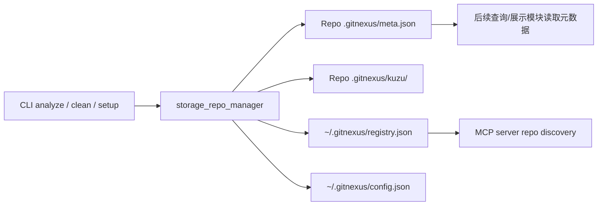
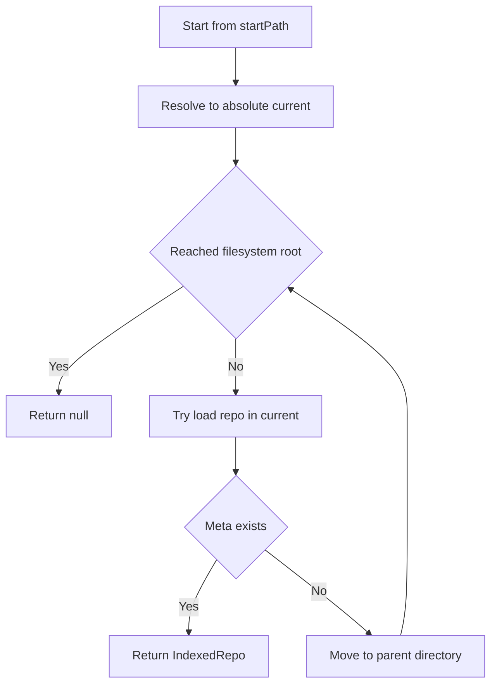
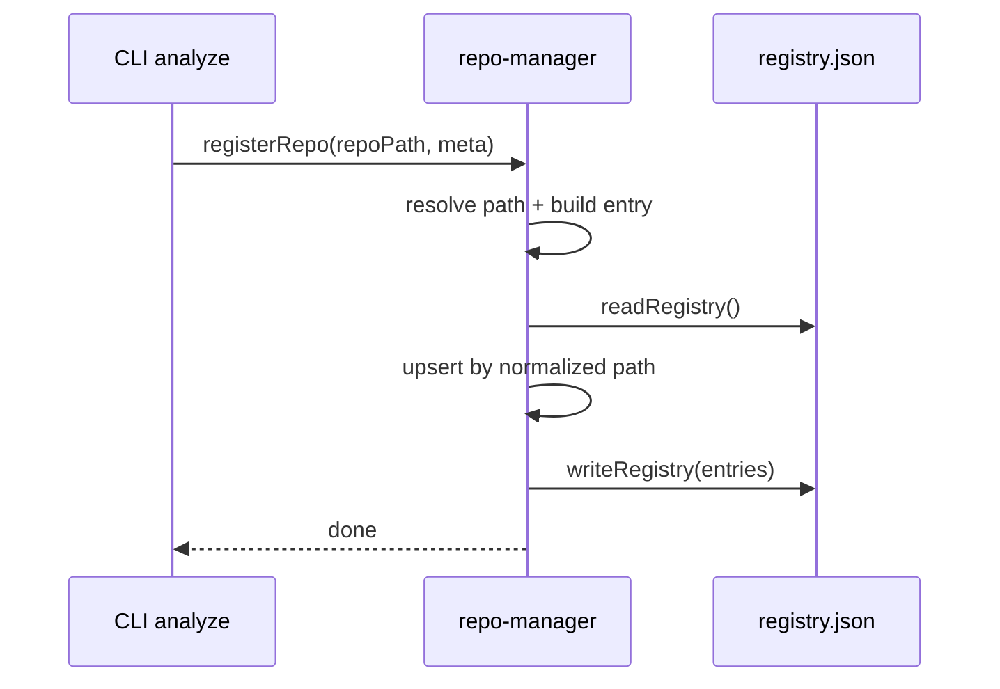
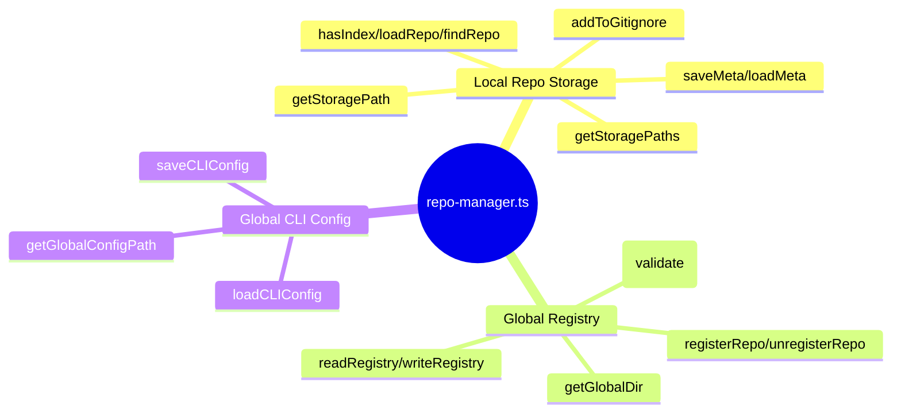

# storage_repo_manager 模块文档

## 模块概述

`storage_repo_manager`（对应源码 `gitnexus/src/storage/repo-manager.ts`）是 GitNexus 在**本地索引存储生命周期**中的基础设施模块。它解决了两个核心问题：第一，如何在单个仓库内稳定定位和管理 `.gitnexus/` 索引目录；第二，如何在用户级别（`~/.gitnexus`）维护一个跨仓库可发现的注册中心，供 CLI、MCP 服务和其他运行时从任意工作目录快速发现已索引仓库。

从职责边界上看，这个模块不负责“构建索引”（那是 ingestion / pipeline 的职责），也不负责“查询图数据”（那是 kuzu、search、mcp 的职责），而是承担了一个非常关键的“**存储定位与元数据编排层**”：它把索引产物的位置、状态、统计摘要、全局发现信息，以及 CLI 全局配置统一落盘为简单 JSON 文件，并提供幂等的读写 API。

该模块的设计明显偏向“轻依赖 + 文件系统原语”：仅使用 Node.js 的 `fs/promises`、`path`、`os`，避免引入数据库或复杂配置系统。这种设计使其在 CLI 场景下启动快、可调试性高，同时也意味着调用方需要理解它的错误吞噬策略与弱一致性边界（详见“边界条件与限制”章节）。

---

## 在系统中的位置与协作关系

`storage_repo_manager` 处于“分析完成后落盘”和“运行时发现仓库”之间。其典型上游是 CLI 分析命令（例如 `gitnexus analyze`），典型下游是 MCP 后端或其他需要枚举仓库的服务。



上图表达了模块的两类存储域：

1. **仓库局部域**：`<repo>/.gitnexus/`，保存该仓库索引元数据与图存储目录（`kuzu/`）。
2. **用户全局域**：`~/.gitnexus/`，保存全局仓库注册表和 CLI 级别配置。

如果你已经阅读过其他模块文档，可结合：

- [cli.md](cli.md) 了解命令触发时机（若该文档存在）。
- [mcp_server.md](mcp_server.md) 了解注册表如何被服务端发现逻辑消费（若该文档存在）。
- [core_pipeline_types.md](core_pipeline_types.md) 理解 `stats` 字段通常来自哪类分析结果汇总。

---

## 数据模型详解

### `RepoMeta`

`RepoMeta` 是仓库索引元数据的核心结构，落盘在 `<repo>/.gitnexus/meta.json`。它用于描述一次索引的来源仓库、提交版本、时间戳和可选统计信息。

```ts
export interface RepoMeta {
  repoPath: string;
  lastCommit: string;
  indexedAt: string;
  stats?: {
    files?: number;
    nodes?: number;
    edges?: number;
    communities?: number;
    processes?: number;
    embeddings?: number;
  };
}
```

其中 `lastCommit` 与 `indexedAt` 是索引新鲜度判断的关键字段；`stats` 是可选的摘要，通常用于列表展示、健康检查或粗粒度告警。注意该接口本身不做字段校验，调用方应保证格式一致（例如时间建议统一 ISO 8601 字符串）。

### `IndexedRepo`

`IndexedRepo` 是运行期聚合对象，包含路径派生结果与已加载的 `meta`：

```ts
export interface IndexedRepo {
  repoPath: string;
  storagePath: string;
  kuzuPath: string;
  metaPath: string;
  meta: RepoMeta;
}
```

该结构常由 `loadRepo()` 或 `findRepo()` 返回，便于调用方一次拿齐“仓库根路径 + 存储路径 + 元数据”。

### `RegistryEntry`

`RegistryEntry` 是全局注册表 `~/.gitnexus/registry.json` 中的条目结构：

```ts
export interface RegistryEntry {
  name: string;
  path: string;
  storagePath: string;
  indexedAt: string;
  lastCommit: string;
  stats?: RepoMeta['stats'];
}
```

它是 `RepoMeta` 的“发现层投影”，侧重跨仓库索引发现，不包含完整仓库内部状态。

### `CLIConfig`

`CLIConfig` 用于保存 CLI 的用户级配置（例如 LLM 接入参数）：

```ts
export interface CLIConfig {
  apiKey?: string;
  model?: string;
  baseUrl?: string;
}
```

该结构目前字段较少，但它承担了配置持久化入口，未来扩展通常会在此接口追加可选字段。

---

## 核心 API 与内部行为

## 本地仓库存储辅助函数

### `getStoragePath(repoPath: string): string`

该函数将任意输入路径规范化（`path.resolve`）后拼接 `.gitnexus`，返回仓库索引根目录路径。它不检查目录是否存在，只做路径推导。

### `getStoragePaths(repoPath: string)`

该函数基于 `getStoragePath()` 一次返回三条关键路径：

- `storagePath`: `<repo>/.gitnexus`
- `kuzuPath`: `<repo>/.gitnexus/kuzu`
- `metaPath`: `<repo>/.gitnexus/meta.json`

这是调用方避免硬编码路径字符串的首选入口。

### `loadMeta(storagePath: string): Promise<RepoMeta | null>`

该函数从 `<storagePath>/meta.json` 读取并反序列化 `RepoMeta`。任何异常（文件不存在、JSON 非法、权限问题）都会被吞掉并返回 `null`。这使上层调用简化了异常处理，但也带来“错误类型不可区分”的限制。

### `saveMeta(storagePath: string, meta: RepoMeta): Promise<void>`

该函数会先 `mkdir -p`（`recursive: true`）确保目录存在，再写入格式化 JSON（2 空格缩进）。这是标准的元数据落盘入口。

### `hasIndex(repoPath: string): Promise<boolean>`

通过检查 `meta.json` 可访问性判断仓库是否“看起来已索引”。注意它的判定标准较弱：只要 `meta.json` 存在即可，不保证 `kuzu/` 数据完整。

### `loadRepo(repoPath: string): Promise<IndexedRepo | null>`

先计算路径集合，再读取 meta；如果 meta 缺失或读取失败返回 `null`，否则返回完整 `IndexedRepo`。这个 API 常用于“给定仓库根目录，快速构建运行时对象”。

### `findRepo(startPath: string): Promise<IndexedRepo | null>`

从 `startPath` 开始逐级向父目录回溯，直到文件系统根目录，尝试加载第一个可识别的 `.gitnexus/meta.json`。适用于“当前目录未知是否在仓库根”的场景，例如 MCP 会话从任意 cwd 启动。



### `addToGitignore(repoPath: string): Promise<void>`

该函数确保 `.gitnexus` 被加入仓库 `.gitignore`。如果 `.gitignore` 不存在则直接创建；若已包含则不重复写入。它实现了简单幂等行为，避免污染版本控制。

---

## 全局注册表管理（`~/.gitnexus/registry.json`）

### `getGlobalDir()` / `getGlobalRegistryPath()`

前者返回 `~/.gitnexus`，后者返回 `~/.gitnexus/registry.json`。两者仅做路径计算，不触发 I/O。

### `readRegistry(): Promise<RegistryEntry[]>`

读取并解析全局注册表。若文件不存在、JSON 非法或读取异常，统一返回空数组。这意味着调用方无需 try/catch 即可安全迭代，但也意味着无法区分“首次使用”和“读取失败”。

### `registerRepo(repoPath: string, meta: RepoMeta): Promise<void>`

该函数用于“新增或更新”仓库注册项，通常在 `analyze` 成功后调用。它会：

1. 规范化仓库路径；
2. 从路径 basename 推导 `name`；
3. 读取现有 registry；
4. 通过 `path.resolve(e.path) === resolved` 判定是否已有条目；
5. 覆盖更新或追加；
6. 写回 registry。



### `unregisterRepo(repoPath: string): Promise<void>`

该函数通过路径归一化删除对应条目，通常在 `gitnexus clean` 后调用。它不校验目标是否存在，天然幂等：多次调用同一仓库不会报错。

### `listRegisteredRepos(opts?: { validate?: boolean })`

默认直接返回 registry 所有条目；若 `validate: true`，则逐条检查 `<entry.storagePath>/meta.json` 是否仍可访问，自动剔除失效条目并回写“清理后的 registry”。

这一设计实现了**延迟修复（lazy cleanup）**：只有当调用方请求校验时，系统才进行实际修剪，避免每次读取都产生额外 I/O 开销。

---

## 全局 CLI 配置管理（`~/.gitnexus/config.json`）

### `getGlobalConfigPath()`

返回 CLI 配置文件路径 `~/.gitnexus/config.json`。

### `loadCLIConfig(): Promise<CLIConfig>`

读取并解析配置文件。异常时返回空对象 `{}`。调用方可直接与默认配置 merge。

### `saveCLIConfig(config: CLIConfig): Promise<void>`

确保目录存在后将配置写为格式化 JSON。该函数不会做字段白名单验证，因此建议上层在写入前做 schema 校验。

---

## 典型使用模式

下面给出一个常见流程：分析完成后写本地元数据、注册到全局 registry，并确保 `.gitignore` 配置正确。

```ts
import {
  getStoragePaths,
  saveMeta,
  registerRepo,
  addToGitignore,
} from './storage/repo-manager';

async function onAnalyzeSuccess(repoPath: string, commit: string) {
  const { storagePath } = getStoragePaths(repoPath);

  const meta = {
    repoPath,
    lastCommit: commit,
    indexedAt: new Date().toISOString(),
    stats: { files: 120, nodes: 5400, edges: 12800 },
  };

  await saveMeta(storagePath, meta);
  await registerRepo(repoPath, meta);
  await addToGitignore(repoPath);
}
```

如果你在服务端需要从任意目录定位可用索引，可使用：

```ts
import { findRepo, listRegisteredRepos } from './storage/repo-manager';

const current = await findRepo(process.cwd());
const all = await listRegisteredRepos({ validate: true });
```

---

## 配置与扩展建议

该模块当前采用“接口 + JSON 文件”模型，扩展成本低。实践中常见扩展方向包括：

- 在 `RepoMeta.stats` 增加新统计维度（例如 token 数、语言分布）。
- 在 `CLIConfig` 中新增 provider 级配置（如超时、重试策略）。
- 为 registry 引入版本字段（例如 `schemaVersion`），便于未来迁移。

建议扩展时保持向后兼容：

1. 新字段尽量可选；
2. `load*` 读取后提供默认值归一化层；
3. 写入时保持稳定格式，避免无关字段抖动。

---

## 边界条件、错误处理与已知限制

该模块采用“宽松容错”策略：大量读取 API 在出错时返回 `null`/空数组/空对象，而不是抛错。这降低了调用复杂度，但有几个必须注意的 operational gotchas：

首先，`loadMeta`、`readRegistry`、`loadCLIConfig` 都会吞掉 JSON 解析错误。损坏文件与文件不存在在调用侧表现一致，可能掩盖真实故障。对生产级工具，建议在上层增加诊断命令（例如 `gitnexus doctor`）显式检查 JSON 完整性。

其次，`hasIndex` 与 `listRegisteredRepos(validate)` 只检查 `meta.json` 存在，不验证 `kuzu/` 数据是否完整可读。因此“存在 meta 但图数据库损坏”的情况不会被此模块识别。

再次，registry 写入不是事务性的：并发进程同时 `registerRepo` 或 `unregisterRepo` 可能出现最后写入覆盖前者结果（典型 read-modify-write 竞态）。如果你的部署场景存在高并发 CLI 调用，建议在上层引入文件锁或串行化调度。

此外，路径等价判定依赖 `path.resolve`，对大小写不敏感文件系统（如默认 macOS）和符号链接场景可能仍有边缘不一致。若你需要更严格唯一性，可在上层做 realpath 归一化。

---

## 与其他模块文档的关系

为了避免重复，本模块文档只覆盖“存储定位/注册/配置持久化”。以下主题建议参考对应模块文档：

- 索引产物如何生成：参见 [core_ingestion_parsing.md](core_ingestion_parsing.md) 与 [core_ingestion_resolution.md](core_ingestion_resolution.md)
- 图结构与语义模型：参见 [core_graph_types.md](core_graph_types.md)
- CLI 命令参数与入口：参见 [cli.md](cli.md)
- MCP 侧如何消费仓库注册信息：参见 [mcp_server.md](mcp_server.md)

---

## 维护者速查



如果你要排查“为什么仓库没被发现”，优先检查三点：仓库内是否存在有效 `meta.json`、全局 `registry.json` 是否包含条目、调用方是否开启了 `validate` 导致条目被自动剔除。