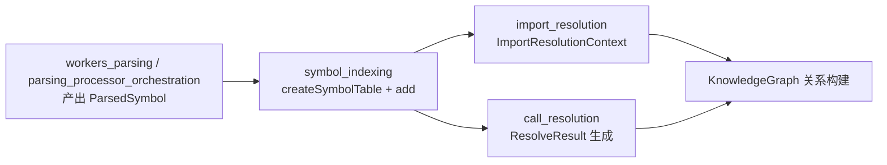
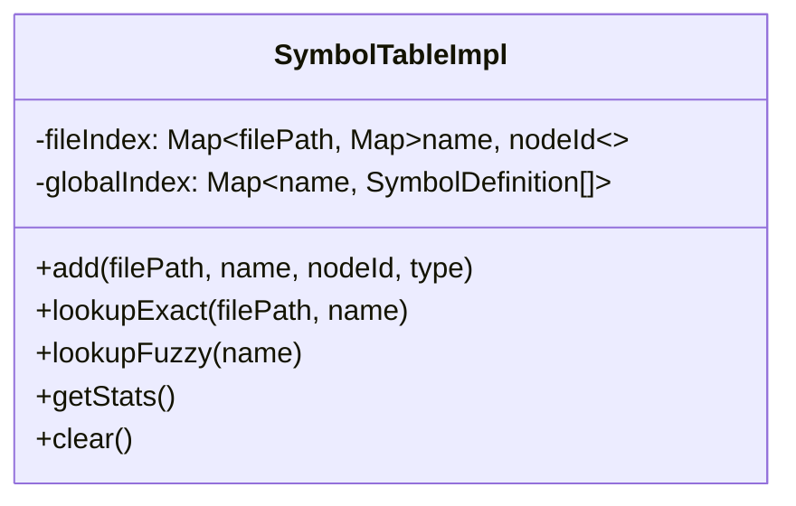
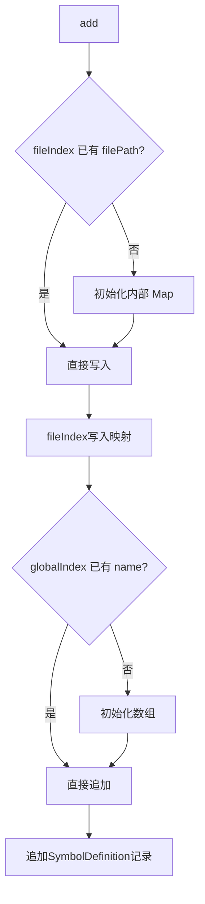
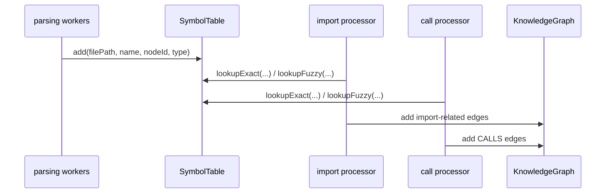

# symbol_indexing 模块文档

## 模块简介与设计动机

`symbol_indexing` 是 `core_ingestion_resolution` 里的基础能力模块，核心目标是把“解析阶段抽取出来的符号定义”组织成可高效查询的索引结构，供后续的导入解析（import resolution）、调用解析（call resolution）以及图关系构建流程复用。它的代码体量很小，但在整个 ingestion pipeline 中承担的是“事实层索引”的角色：如果没有它，上游只能拿到离散的 `name/file/nodeId` 片段，下游就很难在可控复杂度下完成符号定位。

该模块的设计重点不是做完整语义分析，而是提供一种轻量、稳定、可解释的检索接口。它通过“双索引”策略同时支持高置信度的精确查找和低置信度的全局兜底查找：精确查找用于“已知文件上下文”的定位，全局查找用于“上下文缺失或不完整”的容错场景。这种分层检索模型能够在保证吞吐的同时，把“确定性”和“不确定性”区分开，便于调用方在后续流程中做置信度建模。

---

## 在整体系统中的位置



`symbol_indexing` 仅负责“符号定义存储与查询”，不会主动解析 AST、不会生成关系边、也不会判定调用是否正确。它在职责上是一个内存索引服务，处于解析结果与解析决策之间。你可以把它理解为 pipeline 内部的“符号字典层”。

如果你需要完整理解其上下游，建议配合阅读：

- [`workers_parsing.md`](workers_parsing.md)：符号定义从哪里来。
- [`parsing_processor_orchestration.md`](parsing_processor_orchestration.md)：解析结果如何汇总进入后续阶段。
- [`import_resolution.md`](import_resolution.md)（若存在）或对应导入解析文档：符号表如何辅助 import 解析。
- [`call_resolution.md`](call_resolution.md)（若存在）或调用解析文档：符号表如何参与调用目标定位。
- [`core_graph_types.md`](core_graph_types.md)：解析命中后最终如何映射到图节点与关系。

---

## 核心数据模型

## `SymbolDefinition`

```ts
export interface SymbolDefinition {
  nodeId: string;
  filePath: string;
  type: string; // 'Function', 'Class', etc.
}
```

`SymbolDefinition` 表示“一个可被引用的符号定义实例”。其中 `nodeId` 是图系统中的真实实体 ID，`filePath` 用来标识定义来源文件，`type` 用于表达符号类别（例如 `Function`、`Class` 等）。这个结构刻意保持扁平，避免在索引层引入过多语义负担，从而让它可以被多种语言解析器与多条解析链路共同复用。

需要注意的是：同名符号在项目里可能出现多次，因此 `SymbolDefinition` 常常以数组形式出现（见 `lookupFuzzy`），调用方必须自己处理歧义。

---

## 核心接口与实现

## `SymbolTable` 接口

```ts
export interface SymbolTable {
  add: (filePath: string, name: string, nodeId: string, type: string) => void;
  lookupExact: (filePath: string, name: string) => string | undefined;
  lookupFuzzy: (name: string) => SymbolDefinition[];
  getStats: () => { fileCount: number; globalSymbolCount: number };
  clear: () => void;
}
```

`SymbolTable` 暴露的 API 十分克制，只有写入、两种读取、统计和清理五类操作。它没有删除单个符号、没有更新语义合并策略，也没有内置冲突解决机制。这说明其定位是“构建期批量填充 + 解析期只读查询”的轻状态组件，而非长期演化的数据库抽象。

## `createSymbolTable` 内部结构

实现中维护两个 `Map`：

```ts
const fileIndex = new Map<string, Map<string, string>>();
const globalIndex = new Map<string, SymbolDefinition[]>();
```



`fileIndex` 是文件内精确索引，适合高置信度场景；`globalIndex` 是名字到定义列表的反向索引，适合兜底场景。两者同步写入，读取时由调用方按场景选择。

---

## 方法级行为说明

## `add(filePath, name, nodeId, type)`

`add` 会同时写入 `fileIndex` 与 `globalIndex`。其行为有两个关键特征：第一，在 `fileIndex` 中，同一 `filePath + name` 的重复写入会覆盖旧值；第二，在 `globalIndex` 中，同名定义是持续 `push`，不会去重。这意味着“精确索引倾向最新值，全局索引保留历史追加痕迹”。



## `lookupExact(filePath, name)`

该方法执行 O(1) 级别的两层 Map 命中逻辑，返回唯一 `nodeId` 或 `undefined`。它不返回 `type`，因为这个接口只用于“快速确定目标节点”，而不是用于候选比较。

## `lookupFuzzy(name)`

该方法返回某个符号名对应的全部 `SymbolDefinition` 候选；若不存在则返回空数组。该返回值是“低置信候选集”，通常应在调用方结合 import 上下文、文件上下文、语言规则或评分机制进一步筛选。

## `getStats()`

`getStats` 返回 `{ fileCount, globalSymbolCount }`。需要特别强调：`globalSymbolCount` 是“全局唯一 symbol name 的数量”，不是定义总条目数；若同名定义很多，它不会线性增长。

## `clear()`

`clear` 会清空两个索引，典型用于仓库切换、增量任务结束或内存回收阶段。它是硬重置，不保留任何快照。

---

## 典型使用模式

下面是一个简化的构建与查询示例：

```ts
import { createSymbolTable } from "gitnexus/src/core/ingestion/symbol-table";

const table = createSymbolTable();

// 解析阶段批量注册
for (const symbol of parsedSymbols) {
  table.add(symbol.filePath, symbol.name, symbol.nodeId, symbol.type);
}

// 高置信查找：已知目标文件
const exact = table.lookupExact("src/service/user.ts", "getUserById");

// 低置信兜底：上下文不足时
const candidates = table.lookupFuzzy("render");

// 调试统计
console.log(table.getStats());

// 生命周期结束后清理
table.clear();
```

如果你在实现调用解析器，推荐采用“先 `lookupExact`，再 `lookupFuzzy`”的两段式策略，并将命中路径映射为不同置信度等级，而不要把 fuzzy 结果当成与 exact 同等可靠。

---

## 与其他模块的协作关系



`symbol_indexing` 不直接依赖图模块，但它返回的 `nodeId` 最终会成为 `GraphRelationship` 的端点。因此一旦 `nodeId` 生成策略发生变化（例如 ID 规范调整），索引命中虽然仍然成功，但图连边可能失败或产生孤立节点。这个契约一致性是维护时最重要的跨模块注意点。

---

## 边界条件、错误场景与限制

当前实现没有显式抛错分支，输入参数默认由上游保证有效，因此很多行为是“静默失败或静默覆盖”的。你在集成时应重点关注以下情况：

- 当同一文件中同名符号被重复写入时，`lookupExact` 只会看到最后一次写入的 `nodeId`，这可能掩盖解析阶段的重复抽取问题。
- `lookupFuzzy` 返回数组可能包含重复项（同一记录被多次 `add`），调用方如果直接取第一个候选，结果会依赖写入顺序。
- `type` 字段在索引层不参与检索约束，因此 `lookupFuzzy("Foo")` 可能同时返回函数、类、变量等同名实体。
- 该实现是纯内存结构，没有持久化、没有并发隔离、没有容量控制。在超大仓库或长生命周期进程中，需要在流水线层主动调用 `clear` 管理内存。
- `filePath` 作为主键一部分，若路径规范不统一（相对路径/绝对路径、大小写、分隔符差异），会显著降低 `lookupExact` 命中率。

---

## 可扩展性建议

如果你计划扩展该模块，建议保持“轻索引、重决策在调用方”的原则。实务中更安全的扩展方向包括：

1. 在 `add` 阶段加入可选去重策略，减少 `globalIndex` 噪声。
2. 为 `lookupFuzzy` 增加可选过滤参数（如 `type`、路径前缀），但保持向后兼容。
3. 增加 `getStats` 的细粒度指标（定义总数、重复率）以便监控数据质量。
4. 在调试模式下暴露冲突告警钩子，帮助定位重复定义或路径标准化问题。

若你还需要覆盖 Web 端对应实现差异，可参考 [`symbol_indexing_and_call_resolution.md`](symbol_indexing_and_call_resolution.md) 与 [`web_ingestion_pipeline.md`](web_ingestion_pipeline.md)。

---

## 维护者速查

`symbol_indexing` 的本质是一个“分层符号查找表”：用 `fileIndex` 提供高精度定位，用 `globalIndex` 提供低精度兜底。它不负责解释语义正确性，只负责稳定、快速地返回候选。任何“命中后如何判定可信、如何连边、如何评分”的问题，都应放在 import/call 解析模块处理，而不是在本模块过度耦合。
