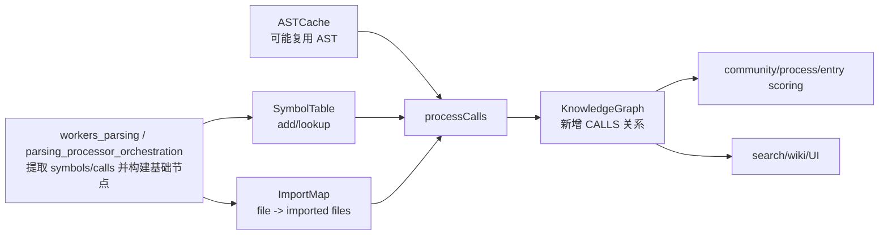
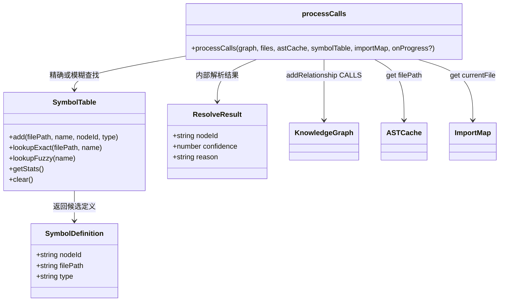
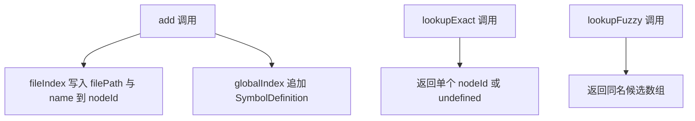
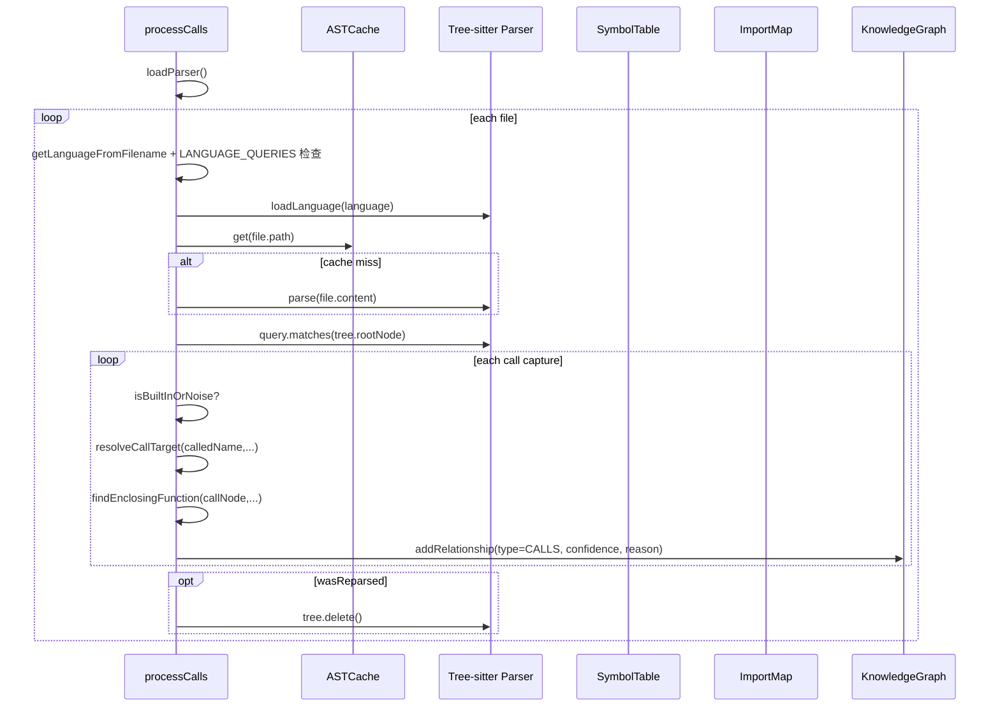
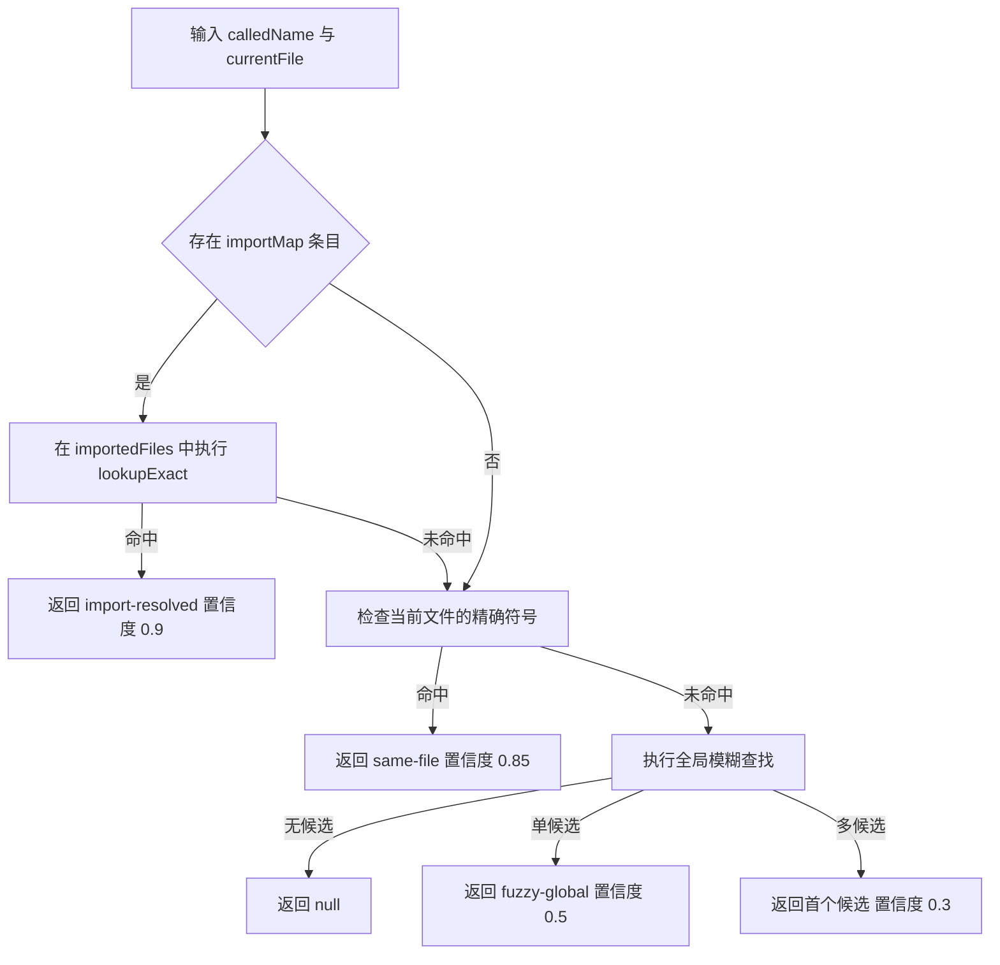

# symbol_indexing_and_call_resolution 模块文档

## 模块简介与设计动机

`symbol_indexing_and_call_resolution` 是 `web_ingestion_pipeline` 中连接“语法抽取结果”和“可查询调用图”的关键桥梁。这个模块由两部分组成：一部分是 `SymbolTable`（符号索引），另一部分是 `processCalls`（调用关系解析与落图）。前者负责把“某个名字在什么文件定义、对应哪个节点”组织成高效可查的索引；后者负责在 AST 中找到调用点后，把调用名尽可能解析成具体目标节点，并将 `CALLS` 边写入 `KnowledgeGraph`。

从工程上看，这个模块存在的原因很直接：仅有 AST 捕获到的 `foo()` 文本并不足以回答“它到底调用了哪个函数节点”。如果没有符号表和分层解析策略，图中调用边会大量缺失，或者全部退化为低质量猜测。该模块通过“先精确、后模糊”的策略，把解析置信度显式编码到关系中（`confidence` + `reason`），让下游检索、可视化、Agent 推理都可以感知不确定性，而不是把所有边都当成同等可靠。

在浏览器/前端运行环境（`gitnexus-web`）中，这种设计尤其重要：我们既要保持解析吞吐，又要避免引入过于重量级的静态分析器。`symbol_indexing_and_call_resolution` 采用轻量但可解释的启发式方案，达成了“可用性优先”的平衡。

---

## 模块在整体流水线中的位置



这张图说明该模块并不负责“生成函数节点”本身，而是消费上游已建立的节点/符号事实，再补全调用边。它与 `ast_cache_management`、`parsing_processor_orchestration` 强关联，也依赖图模型契约（`graph_domain_types`）。如果你还不熟悉这些模块，建议先阅读：

- [`parsing_processor_orchestration.md`](parsing_processor_orchestration.md)
- [`workers_parsing.md`](workers_parsing.md)
- [`ast_cache_management.md`](ast_cache_management.md)
- [`graph_domain_types.md`](graph_domain_types.md)

---

## 架构与核心对象关系



这里的关键是职责分离：`SymbolTable` 是索引容器，`processCalls` 是解析执行器。`ResolveResult` 虽然是内部接口（未导出），但它定义了调用解析质量的语义核心。

---

## 核心组件详解

## `SymbolDefinition`

```ts
export interface SymbolDefinition {
  nodeId: string;
  filePath: string;
  type: string; // 'Function', 'Class', etc.
}
```

`SymbolDefinition` 表示“一个名字的某个定义版本”。同名符号在不同文件中可以有多个定义，因此 `lookupFuzzy` 返回的是数组而不是单值。`type` 在当前实现主要用于上下文描述与后续扩展（例如未来按类型筛选候选），当前解析流程本身不会严格利用它做分派。

### 字段语义

- `nodeId`：目标图节点 ID，是最终建边时真正使用的实体引用。
- `filePath`：定义所在文件，用于精确查找和冲突区分。
- `type`：符号类别（`Function`、`Class`、`Method` 等），当前偏元信息属性。

---

## `SymbolTable` 接口与 `createSymbolTable` 实现

```ts
export interface SymbolTable {
  add(filePath, name, nodeId, type): void;
  lookupExact(filePath, name): string | undefined;
  lookupFuzzy(name): SymbolDefinition[];
  getStats(): { fileCount: number; globalSymbolCount: number };
  clear(): void;
}
```

`createSymbolTable` 内部维护两个索引：

1. `fileIndex: Map<filePath, Map<symbolName, nodeId>>`
2. `globalIndex: Map<symbolName, SymbolDefinition[]>`

它们对应“高置信精确查找”和“低置信兜底查找”两个场景。设计上这是典型的双索引结构：以少量内存换调用解析速度和鲁棒性。

### 数据结构示意



### `add(filePath, name, nodeId, type)`

该方法会同时更新两个索引。它不会去重，也不会检查覆盖冲突：

- 对 `fileIndex`，同一文件同名符号再次 `add` 会覆盖旧 `nodeId`。
- 对 `globalIndex`，同名条目会持续 `push`，可出现重复定义记录。

这是一种偏性能和简单性的实现，适合“构建期一次性写入”为主的场景。

### `lookupExact(filePath, name)`

这是最可信路径：限定文件 + 名字。若 `filePath` 未注册或名字不存在，返回 `undefined`。

### `lookupFuzzy(name)`

返回该名字的全局定义列表。调用方必须自行处理歧义（当前 `processCalls` 仅取第一个候选）。

### `getStats()`

返回两个轻量指标：

- `fileCount`: `fileIndex` 中文件数量。
- `globalSymbolCount`: `globalIndex` 中“不同名字”的数量，而不是定义总数。

这一点很容易误解：如果同名在 20 个文件定义，`globalSymbolCount` 仍只加 1。

### `clear()`

清空两个 Map，用于批次结束或仓库切换时释放内存。

---

## `processCalls(...)`：调用解析主流程

```ts
processCalls(
  graph: KnowledgeGraph,
  files: { path: string; content: string }[],
  astCache: ASTCache,
  symbolTable: SymbolTable,
  importMap: ImportMap,
  onProgress?: (current: number, total: number) => void
)
```

这个函数按文件迭代，执行“语言确认 -> AST 获取 -> query 匹配 -> 调用解析 -> 建边”。

### 处理时序



### 核心行为说明

函数会先加载 parser，并对每个文件调用 `onProgress(i + 1, total)`。当语言不支持或缺少对应 query 时，该文件直接跳过。这意味着调用方可能看到进度推进，但实际某些文件未参与调用解析，这是预期行为。

AST 获取采用“cache-first”策略：优先 `astCache.get`，miss 时临时重解析。若重解析后 query 执行抛错，会 `console.warn` 并在必要时删除临时树，避免泄漏。

匹配阶段只处理带 `@call` capture 的项，并要求 `@call.name` 存在。调用名通过 `isBuiltInOrNoise` 过滤噪声后，交给 `resolveCallTarget`。若解析失败（返回 `null`），该调用点不会落图。

成功解析后，函数会尝试通过 `findEnclosingFunction` 获取“调用源函数节点”；若找不到（顶层调用），退化为 `File` 节点 ID。最终关系类型固定 `CALLS`，并附带置信度和原因。

---

## 内部关键算法

## `resolveCallTarget(...)`

优先级策略是本模块最重要的行为约定：

1. 先查导入文件中的同名定义（`import-resolved`, `0.9`）
2. 再查当前文件同名定义（`same-file`, `0.85`）
3. 最后全局模糊查找（`fuzzy-global`, `0.5 / 0.3`）



这是一个“可解释但保守”的策略。它不尝试做复杂的类型流/作用域分析，因此性能可控、跨语言一致，但会在重名场景下产生歧义边。

## `findEnclosingFunction(...)`

该函数从调用节点向上爬 AST，直到遇到函数/方法定义节点。它支持多语言节点类型，如 JS/TS 的 `function_declaration`、Python 的 `function_definition`、Java 的 `method_declaration`、Rust 的 `function_item/impl_item` 等。

找到函数名后，先 `lookupExact(filePath, funcName)`；若未命中，则按 `generateId(label, `${filePath}:${funcName}`)` 手工构造 ID 作为回退。这个回退很实用，但有一个隐含前提：ID 生成规则必须与上游建节点规则保持一致。

## `isBuiltInOrNoise(name)`

该函数通过一个静态 `Set` 过滤常见内建/框架噪声名，包括 JS/TS、React hooks、常见集合方法、Python 内建等。其目标是减少低价值调用边，避免图被 `map/filter/print` 等噪声淹没。

注意这不是语义级“真正 built-in 判定”，只是名称黑名单，因此可能发生误杀（业务函数名恰好叫 `map`）或漏网（未收录的库函数名）。

---

## `ResolveResult`（内部接口）

```ts
interface ResolveResult {
  nodeId: string;
  confidence: number;  // 0-1
  reason: string;      // 'import-resolved' | 'same-file' | 'fuzzy-global'
}
```

虽然 `ResolveResult` 在文件中是内部类型（未 `export`），但它对模块行为至关重要：它把“解析结果”和“可信度解释”绑定在一起，直接决定图边质量。维护时建议保持 `reason` 词汇稳定，以便下游 UI/分析逻辑能够持续消费。

---

## 典型使用方式

### 1) 创建符号表并注册符号

```ts
import { createSymbolTable } from './symbol-table';

const symbolTable = createSymbolTable();
symbolTable.add('src/a.ts', 'foo', 'Function:src/a.ts:foo', 'Function');
symbolTable.add('src/b.ts', 'foo', 'Function:src/b.ts:foo', 'Function');

console.log(symbolTable.lookupExact('src/a.ts', 'foo')); // Function:src/a.ts:foo
console.log(symbolTable.lookupFuzzy('foo').length); // 2
```

### 2) 执行调用解析并写入图

```ts
await processCalls(
  graph,
  files,
  astCache,
  symbolTable,
  importMap,
  (current, total) => {
    console.log(`Call resolution: ${current}/${total}`);
  }
);
```

调用后可在 `graph.relationships` 中筛选 `type === 'CALLS'` 并根据 `confidence` 做阈值过滤，例如仅展示 `>= 0.85` 的高可信调用链。

---

## 配置、扩展与定制建议

当前模块没有集中配置对象，但可以通过代码常量和策略点进行扩展。

首先，若要增强语言支持，应同步更新调用捕获 query（`LANGUAGE_QUERIES`）与 `FUNCTION_NODE_TYPES`，否则会出现“能识别调用点但找不到调用源函数”或“完全抓不到调用”的情况。

其次，若你希望更少噪声或更完整调用图，可以定制 `isBuiltInOrNoise` 集合。实践上建议按语言拆分黑名单，并在仓库级保留可覆盖配置，以减少误杀。

再次，`resolveCallTarget` 是最有价值的演进点。你可以在不破坏外部 API 的情况下新增中间策略，比如“同目录优先”“按导出可见性过滤”“按 symbol type 过滤函数类节点”。但要确保新增策略仍返回明确 `confidence/reason`。

---

## 边界行为、错误条件与已知限制

这个模块是启发式解析，不是完整编译器语义分析器。以下行为在当前实现中需要特别注意。

第一，`lookupFuzzy` 在多候选时直接取第一个定义，且候选顺序依赖插入顺序。这会导致同仓库不同扫描顺序可能影响低置信边的目标选择。

第二，`SymbolTable.add` 对 `globalIndex` 不去重，重复构建/增量更新若未配合清理，可能累积重复候选，进一步降低模糊解析质量。

第三，`findEnclosingFunction` 的手工 ID 回退依赖 `generateId` 规则一致性。如果上游节点 ID 模式调整但这里未同步，可能写入指向不存在节点的关系。

第四，`isBuiltInOrNoise` 是纯名称匹配，不看命名空间、不看作用域，因此在业务代码重名时可能过滤掉真实调用。

第五，调用解析依赖 `ImportMap` 质量。若导入解析缺失或错误，策略 A 会失效，系统将更多落入 same-file/fuzzy 路径，整体置信度下降。

第六，`processCalls` 在 query 错误时只告警并继续，不抛出致命异常。这利于整体可用性，但也意味着问题可能被静默掩盖，建议在上层监控 `console.warn` 或增加统计埋点。

---

## 维护者改造指南

如果你准备扩展本模块，建议遵循三个原则。第一，保持 `SymbolTable` 的 O(1) 精确查询特性，不要让高级策略侵入基础索引层。第二，任何新解析策略都要给出稳定 `reason`，否则下游无法解释边来源。第三，在增加复杂度前先评估前端/WASM 环境成本，避免把重型静态分析直接搬到浏览器侧。

一个稳妥的演进方向是把 `resolveCallTarget` 抽成可插拔策略链，例如：

```ts
type Resolver = (ctx: ResolveContext) => ResolveResult | null;

const resolvers: Resolver[] = [
  resolveByImports,
  resolveBySameFile,
  resolveByGlobalName,
];
```

这样既能逐步增强能力，也能保持当前模块对外接口稳定。

---

## 总结

`symbol_indexing_and_call_resolution` 提供了一个高性价比的调用关系补全机制：用双索引符号表保证快速查找，用分层策略做目标解析，用置信度表达不确定性，再将结果结构化写入图谱。它不是“最精确”的方案，但在多语言、前端可运行、可解释性优先的约束下，是一个非常务实且可持续演进的核心模块。


> 注：本文档已基于 `gitnexus-web/src/core/ingestion/symbol-table.ts` 与 `gitnexus-web/src/core/ingestion/call-processor.ts` 的当前实现进行核对。