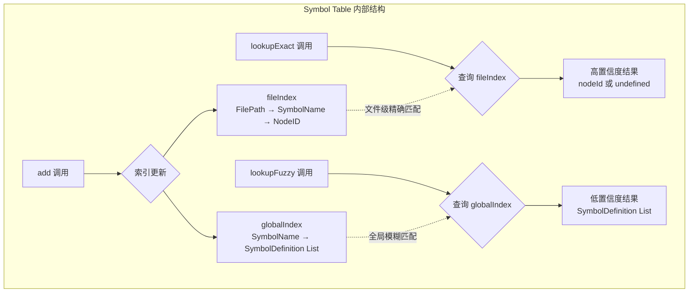
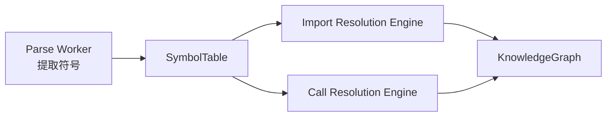
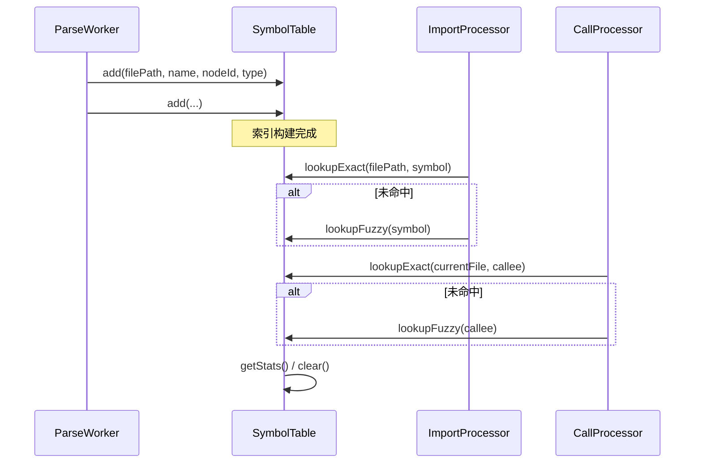

# Symbol Table Management（符号表管理）

## 概述

Symbol Table Management 模块是 GitNexus 代码摄入（Ingestion）管道中的核心基础设施组件，负责在代码分析过程中跟踪和管理所有已识别的符号定义。该模块的设计灵感来源于编译器理论中的符号表概念，但针对现代代码库的知识图谱构建场景进行了专门优化。

在代码摄入流程中，解析器（Parser）会从源代码文件中提取出函数、类、接口、变量等各种符号。Symbol Table 的作用是建立一个高效的索引系统，使得后续的导入解析（Import Resolution）和调用关系解析（Call Resolution）阶段能够快速定位这些符号的定义位置。这种设计确保了系统能够在处理跨文件引用、模块导入以及框架特有的"魔法"行为时，准确地建立代码元素之间的关联关系。

该模块采用双层索引架构：文件级索引用于高精度的符号查找，全局索引用于低精度但更灵活的模糊匹配。这种设计平衡了查找性能和解析准确性，使得系统既能处理规范的导入语句，也能应对缺少显式导入或框架运行时注入等复杂场景。

## 核心数据结构

### SymbolDefinition

`SymbolDefinition` 是符号表中最基本的数据单元，代表代码库中的一个已识别符号定义。

```typescript
export interface SymbolDefinition {
  nodeId: string;      // 知识图谱中对应节点的唯一标识符
  filePath: string;    // 符号定义所在的文件路径
  type: string;        // 符号类型，如 'Function'、'Class'、'Interface' 等
}
```

**字段说明：**

| 字段 | 类型 | 说明 |
|------|------|------|
| `nodeId` | `string` | 该符号在知识图谱中对应的 `GraphNode` 的唯一标识符。通过此 ID 可以追溯到完整的节点信息，包括属性、关系等。 |
| `filePath` | `string` | 符号定义所在的源代码文件的绝对或相对路径。路径格式与 `FilePath` 接口保持一致。 |
| `type` | `string` | 符号的语法类型，由 AST 解析器提取。常见值包括 `Function`、`Class`、`Method`、`Variable`、`Interface`、`TypeAlias` 等。 |

`SymbolDefinition` 被设计为轻量级数据传输对象（DTO），仅包含符号定位所需的最小信息集。完整的符号元数据（如参数列表、返回类型、文档注释等）存储在知识图谱的 `GraphNode` 中，通过 `nodeId` 进行关联。这种分离设计减少了符号表本身的内存占用，同时保持了与图谱存储层的松耦合。

### SymbolTable

`SymbolTable` 是符号表的主体接口，定义了符号注册、查找和管理的全部操作。

```typescript
export interface SymbolTable {
  add: (filePath: string, name: string, nodeId: string, type: string) => void;
  lookupExact: (filePath: string, name: string) => string | undefined;
  lookupFuzzy: (name: string) => SymbolDefinition[];
  getStats: () => { fileCount: number; globalSymbolCount: number };
  clear: () => void;
}
```

## 架构设计

### 双层索引架构

Symbol Table 采用双层索引设计，分别服务于不同置信度的查找场景：



`fileIndex` 的结构是 `Map<FilePath, Map<SymbolName, NodeID>>`，用于高精度符号查找。它适合解析明确的导入语句和同文件引用，因为匹配时同时使用了文件路径与符号名称，结果置信度高。`globalIndex` 的结构是 `Map<SymbolName, SymbolDefinition[]>`，用于低精度但高召回的全局查找。它在导入缺失、框架魔法行为、动态解析等场景中提供降级能力。

### 组件交互与系统位置



符号表处于“解析产物”和“关系解析”之间，是连接 AST 提取结果与知识图谱关系构建的中间索引层。解析阶段向符号表写入，解析关系阶段从符号表读取，因此它承担了跨阶段共享上下文的职责。

### 生命周期流程



该流程体现了先构建、后查询、最终清理的典型批处理模式。实际系统中，这通常对应 ingest pipeline 的不同阶段。

## 详细 API 说明

### add(filePath, name, nodeId, type)

`add` 用于将一个符号定义写入符号表。内部会同时更新 `fileIndex` 与 `globalIndex`：前者便于精确定位，后者便于全局回退。

参数上，`filePath` 与 `name` 决定键空间位置，`nodeId` 连接到知识图谱节点，`type` 保存符号类别。该方法无返回值，但会改变符号表内部状态。

一个重要行为是：同一 `filePath` 下同名 `name` 会在 `fileIndex` 中被覆盖（Map.set 语义）；而在 `globalIndex` 中会继续 `push` 新条目。这意味着精确索引偏向“最后写入”，全局索引偏向“保留历史/多候选”。

### lookupExact(filePath, name)

`lookupExact` 执行高置信度查询。它先取出 `fileIndex[filePath]`，再查该文件下的 `name`。如果文件不存在或符号不存在，返回 `undefined`。

该方法适用于 import 已经定位到具体文件、或当前文件内局部解析场景。由于查找维度包含文件路径，误匹配概率低，是关系构建的首选路径。

### lookupFuzzy(name)

`lookupFuzzy` 在全局索引中按名称查找，返回 `SymbolDefinition[]`。如果未命中，返回空数组。

这是一条低置信度、高召回路径，常用于 `lookupExact` 失败后的降级。由于可能返回多个同名定义，调用方必须结合上下文做二次选择，例如根据 import 路径、目录邻近性、符号类型或框架启发式打分。

### getStats()

`getStats` 返回 `{ fileCount, globalSymbolCount }`，分别代表文件级索引中已登记文件数、以及全局索引中“唯一符号名”的数量。这个统计并非“总定义数”，因为同名多个定义在 `globalSymbolCount` 中只计一次键。

该方法主要用于调试、质量校验和运行时观测。

### clear()

`clear` 清空两个索引 Map。调用后，符号表回到初始状态。此方法是长生命周期进程中避免内存累积的关键，特别是连续处理多个仓库时。

## 与其他模块的关系

Symbol Table Management 属于 `core_ingestion_resolution` 体系，向上承接 `core_ingestion_parsing` 的解析结果，向下服务 import 与 call 两类解析引擎。

与 [import_resolution_engine](import_resolution_engine.md) 的关系是最直接的：后者需要先把 import path 归一化并定位到文件，再借助 `lookupExact` 获取节点 ID；若失败，再用 `lookupFuzzy` 做补偿，最终产出类似 `ResolveResult` 的置信度结果。

与 [call_resolution_engine](call_resolution_engine.md) 的关系同样紧密：调用解析通常先尝试当前文件、再尝试导入上下文、最后退化到全局同名匹配。SymbolTable 在这个多阶段策略中充当统一符号索引。

与 [core_graph_types](core_graph_types.md) 的关系体现在 `nodeId`：符号表不保存完整节点，只保存可跳转到 `GraphNode.id` 的引用，保持了职责边界。

如需了解符号来源，请参考 [core_ingestion_parsing](core_ingestion_parsing.md)；如需理解解析结果如何进入流水线总结果，可参考 [core_pipeline_types](core_pipeline_types.md)。

## 使用与扩展示例

### 基本用法

```typescript
import { createSymbolTable } from 'gitnexus/src/core/ingestion/symbol-table';

const st = createSymbolTable();

st.add('src/a.ts', 'Foo', 'node_1', 'Class');
st.add('src/b.ts', 'Foo', 'node_2', 'Function');

const exact = st.lookupExact('src/a.ts', 'Foo');
// => 'node_1'

const fuzzy = st.lookupFuzzy('Foo');
// => [
//   { nodeId: 'node_1', filePath: 'src/a.ts', type: 'Class' },
//   { nodeId: 'node_2', filePath: 'src/b.ts', type: 'Function' }
// ]

console.log(st.getStats());
// => { fileCount: 2, globalSymbolCount: 1 }

st.clear();
```

### 典型解析策略（精确优先，模糊兜底）

```typescript
function resolveSymbol(st: SymbolTable, filePath: string, name: string) {
  const exact = st.lookupExact(filePath, name);
  if (exact) {
    return { nodeId: exact, confidence: 1.0, reason: 'same-file' };
  }

  const candidates = st.lookupFuzzy(name);
  if (candidates.length > 0) {
    return { nodeId: candidates[0].nodeId, confidence: 0.5, reason: 'fuzzy-global' };
  }

  return null;
}
```

## 关键边界条件与限制

该实现简洁高效，但也有明确边界。首先，路径字符串必须在写入与查询时保持同一规范，否则 `lookupExact` 会因 key 不一致而失败。其次，同文件同名符号会被覆盖，不保留多版本；如果语言或预处理机制允许这种情况，调用方需要外部处理。

另外，全局索引不去重，重复调用 `add` 可能让 `lookupFuzzy` 结果包含重复定义。对重试机制或增量更新场景，这一点尤其需要注意。当前实现也没有提供删除单个符号、按文件批量移除等能力，因此更适合“全量构建 + 查询 + clear”的批处理模型，而非高频增量维护。

并发方面，`Map` 在该实现下没有并发控制语义。如果多个 worker 线程/任务同时写入同一个 SymbolTable 实例，可能出现竞态条件。推荐通过单线程汇聚写入、消息队列串行化，或在上层加锁。

## 设计取舍总结

该模块的核心价值在于以极低实现复杂度提供了 ingest 阶段最关键的符号定位能力。双索引策略体现了明确的工程取舍：`lookupExact` 保证准确性，`lookupFuzzy` 保证鲁棒性。它并不试图在本层完成复杂语义判定，而是把候选结果交给上层解析器结合上下文决策。这种“索引层轻量、决策层上移”的边界划分，使模块易于维护，也便于在 import/call 解析策略演进时保持稳定。
