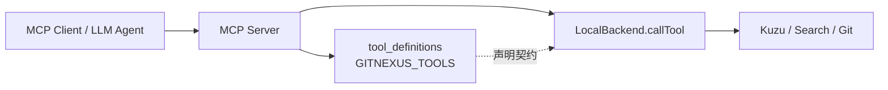
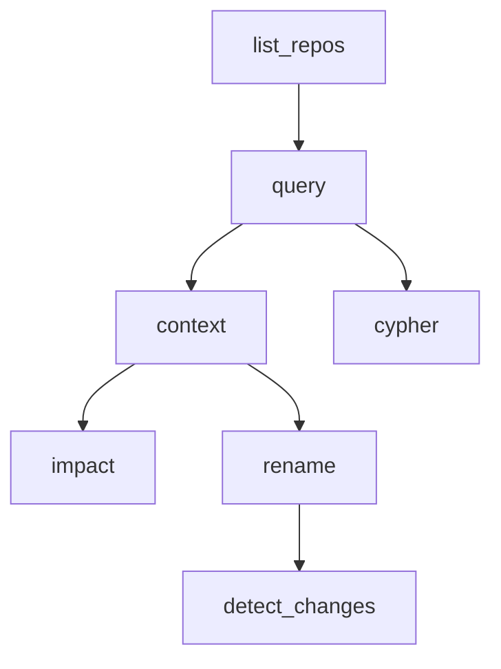
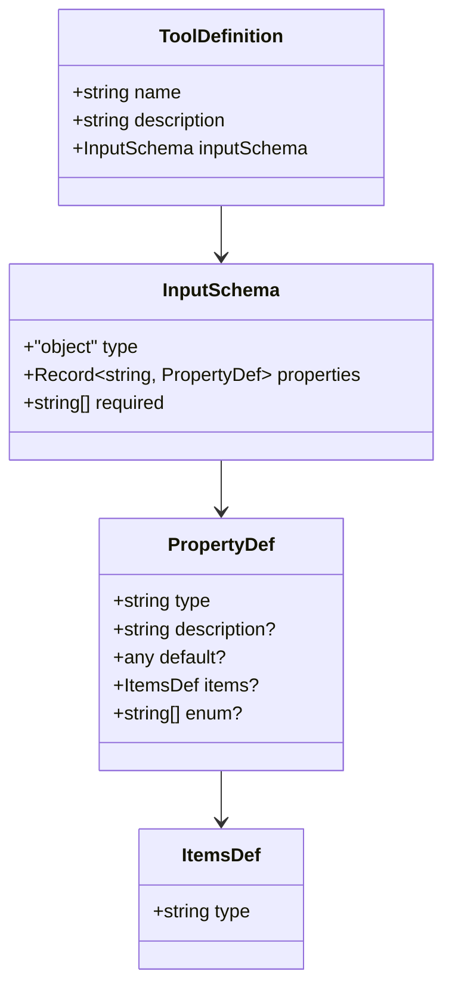
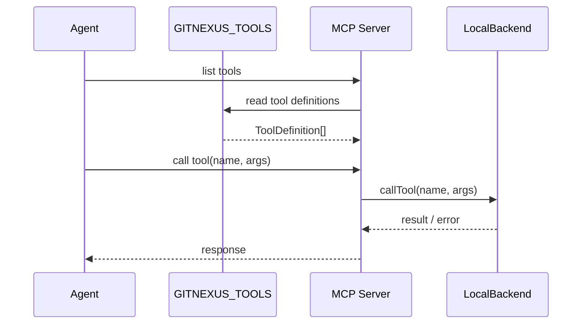

# tool_definitions 模块文档

## 概述与设计动机

`tool_definitions`（源码文件：`gitnexus/src/mcp/tools.ts`）是 GitNexus MCP 能力的“工具契约层”。这个模块本身不执行查询、不访问数据库、也不直接操作文件系统；它的职责是以声明式方式定义：GitNexus 对外暴露了哪些 MCP tools、每个 tool 的语义是什么、接受什么输入参数、哪些参数是必填项。换句话说，它是运行时工具实现（见 [local_backend.md](local_backend.md)）与外部调用方（MCP client、LLM agent、评测桥接器）之间的稳定接口面。

该模块存在的核心原因是“协议清晰性与可发现性”。在 MCP 场景中，Agent 往往先读取工具目录（tool list），再决定如何构造调用参数。如果没有统一、机器可读的 schema 和高质量的 description，Agent 容易出现误调用、漏传参数或把工具用在错误阶段。`tool_definitions` 通过 `ToolDefinition` + `GITNEXUS_TOOLS`，把这些规则集中管理，确保不同客户端看到一致的工具说明。

从系统分层角度看，这个模块是**元数据定义层（metadata layer）**，而非执行层（execution layer）。它与 `mcp_server` 的关系是“声明被注册与暴露”，与 `local_backend` 的关系是“声明对应具体实现分发”。因此，当你扩展新工具时，通常需要同时修改此模块和后端实现模块，否则会出现“定义存在但无法执行”或“实现存在但不可发现”的不一致。

---

## 模块在系统中的位置



上图中，`tool_definitions` 并不参与真实业务计算，它提供的是“可调用能力清单与输入协议”。MCP Server 向客户端公开该清单，客户端据此选择工具并构造参数；真正执行由 `LocalBackend.callTool` 负责。你可以把它理解为 API 世界里的 OpenAPI 片段：不是 handler，但决定了 handler 如何被正确调用。

关联阅读：
- MCP 服务会话与服务生命周期：[`mcp_server.md`](mcp_server.md)
- 工具执行与路由细节：[`local_backend.md`](local_backend.md)
- MCP 资源（非 tool）定义体系：[`resource_system.md`](resource_system.md)

---

## 核心组件

## `ToolDefinition` 接口

`ToolDefinition` 是本模块唯一核心类型，用于描述单个工具的协议结构：

```typescript
export interface ToolDefinition {
  name: string;
  description: string;
  inputSchema: {
    type: 'object';
    properties: Record<string, {
      type: string;
      description?: string;
      default?: any;
      items?: { type: string };
      enum?: string[];
    }>;
    required: string[];
  };
}
```

其设计重点有三层。

第一层是识别信息：`name` 必须唯一，对应后端分发方法名（例如 `query`、`impact`）。如果 `name` 与执行层 switch-case 不一致，调用会落入 `Unknown tool` 错误。

第二层是语义引导：`description` 不仅写“是什么”，还强调“WHEN TO USE / AFTER THIS”。这对于 Agent 十分关键，因为它通过自然语言策略选择工具链路（例如先 `query`，再 `context`，最后 `impact`）。

第三层是参数契约：`inputSchema` 采用 JSON-Schema 风格的简化结构。`properties` 定义字段类型与描述，`required` 声明必填项，`default` 与 `enum` 用于约束与提示。需要注意的是，这里是**声明**而非自动强校验器，真实参数校验仍取决于执行层实现。

---

## `GITNEXUS_TOOLS` 常量

`GITNEXUS_TOOLS` 是 `ToolDefinition[]`，内置 GitNexus 当前公开工具目录。根据当前代码，主要包含以下工具：

1. `list_repos`
2. `query`
3. `cypher`
4. `context`
5. `detect_changes`
6. `rename`
7. `impact`

这些工具有一个统一约定：除 `list_repos` 外，几乎都支持可选 `repo` 参数，用于多仓库环境下显式定位目标仓库。这一点与 `LocalBackend.resolveRepo()` 的歧义处理策略直接对应（多仓时未传 repo 会报错）。

### 工具关系与推荐调用顺序



这个流程不是强制顺序，但体现了 description 中强调的“探索 → 聚焦 → 改动前评估 → 改动后验证”工作流：
- 先发现仓库（`list_repos`）
- 再做语义检索（`query`）
- 对具体符号深挖（`context`）
- 修改前做爆炸半径评估（`impact`）
- 修改后做改动影响回看（`detect_changes`）
- 对复杂结构问题直接用 `cypher`

---

## 各工具定义详解（契约视角）

### 1) `list_repos`

`list_repos` 是多仓场景的入口工具，`inputSchema.properties` 为空、`required` 为空。其 description 明确要求：在多仓情况下，后续工具必须传 `repo`，否则会出现目标仓库不明确。

这一定义与执行层 `listRepos()` 的返回结构语义一致：仓库名、路径、索引时间、commit 与统计信息。它本质是会话初始化工具，而非分析工具。

### 2) `query`

`query` 面向“概念到执行流”的检索，必填 `query`，可选参数包括 `task_context`、`goal`、`limit`、`max_symbols`、`include_content`、`repo`。其中 `limit` 与 `max_symbols` 提供默认值，体现“可不传即可工作”的 Agent 友好策略。

description 中强调它返回 process-grouped 结果，并说明其排序融合策略（BM25 + semantic + RRF）。这使调用方在消费结果时应优先读取 `processes` 与 `process_symbols`，而不仅是单文件命中列表。

### 3) `cypher`

`cypher` 是结构化查询的低层逃生口，必填 `query`。description 在定义内直接内嵌了 schema、边类型、示例语句和输出格式预期（`{ markdown, row_count }`），这相当于把“查询语言说明书”塞进了工具元信息，便于 LLM 在无额外文档时也能构造可执行语句。

由于它直接执行用户提供的 Cypher，调用方需要自己承担查询正确性与复杂度控制；该模块只定义入口，不提供安全沙箱策略。

### 4) `context`

`context` 的核心是“单符号 360 度视图”，参数设计支持两种定位路径：
- `name` + 可选 `file_path`（可能有歧义）
- `uid`（零歧义）

`required` 为空，是因为“name/uid 至少一个”属于跨字段规则，无法通过当前简化 schema 表达，只能由执行层补充校验。这是本模块 schema 能力的一个典型边界。

### 5) `detect_changes`

`detect_changes` 用于把 git diff 与图谱流程关联。关键参数 `scope` 通过 `enum` 约束为 `unstaged | staged | all | compare`，并提供默认值 `unstaged`。`base_ref` 仅在 `compare` 模式下需要，这种条件依赖同样是声明层难以完整表达、需要执行层检查的场景。

### 6) `rename`

`rename` 定义了跨文件重命名能力，`new_name` 为必填，`symbol_name`/`symbol_uid` 用于目标定位，`dry_run` 默认 `true`，体现“默认预览、显式应用”的安全策略。description 还约定了变更置信度标记（`graph` vs `text_search`），使结果可用于人工审阅与自动化阈值决策。

### 7) `impact`

`impact` 面向改动前风险评估，必填 `target` 与 `direction`。`relationTypes` 被定义为字符串数组，`maxDepth`、`includeTests`、`minConfidence` 控制分析深度和噪声过滤。description 已把结果语义写得很细（风险等级、按深度分组、流程/模块影响），这对 Agent 进行“先看 d=1 再扩展”的策略规划很重要。

---

## 数据模型与字段约束图



这个模型刻意保持轻量，便于直接序列化给 MCP 客户端。代价是表达能力有限：例如 oneOf、allOf、dependentRequired、pattern 等高级 JSON Schema 约束都不在此类型中，因此一些复杂校验只能在执行层补齐。

---

## 与执行层的契约一致性



当 `ToolDefinition` 与 `LocalBackend.callTool()` 的方法集合不一致时，会出现以下两种问题：
- 定义有、实现无：客户端看得到工具，但调用时报 `Unknown tool`。
- 实现有、定义无：客户端无法发现工具，除非硬编码名称。

因此维护时应把二者当成“一对一契约”，建议在 CI 增加一致性检查（例如比较 `GITNEXUS_TOOLS.map(name)` 与分发分支集合）。

---

## 使用示例

下面示例展示如何消费工具定义并进行简单参数检查（示意）。

```typescript
import { GITNEXUS_TOOLS } from "gitnexus/src/mcp/tools";

const queryTool = GITNEXUS_TOOLS.find(t => t.name === "query");
if (!queryTool) throw new Error("query tool missing");

function hasRequiredArgs(toolName: string, args: Record<string, unknown>) {
  const tool = GITNEXUS_TOOLS.find(t => t.name === toolName);
  if (!tool) return false;
  return tool.inputSchema.required.every((k) => k in args);
}

console.log(hasRequiredArgs("impact", { target: "AuthService", direction: "upstream" })); // true
```

一个典型 MCP 调用参数（以 `impact` 为例）：

```json
{
  "target": "validateUser",
  "direction": "upstream",
  "maxDepth": 3,
  "relationTypes": ["CALLS", "IMPORTS"],
  "repo": "my-service"
}
```

---

## 扩展与演进指南

当你要新增工具（例如 `trace_dataflow`）时，建议遵循以下步骤：

1. 在 `tools.ts` 新增 `ToolDefinition` 条目，写清楚 `WHEN TO USE / AFTER THIS`。
2. 在 `LocalBackend.callTool()` 增加分发分支和实现逻辑。
3. 若工具依赖新的资源或上下文，也同步更新 MCP server 注册流程。
4. 增加契约回归测试：
   - 工具名可发现
   - required 字段与实现校验一致
   - 默认值语义与实现一致

若只是扩展参数，优先保持向后兼容：新增可选字段而不是修改既有必填字段；否则旧客户端可能立刻失效。

---

## 边界条件、错误与限制

`tool_definitions` 是静态声明层，因此其风险主要来自“声明与现实不一致”：

- **跨字段约束表达不足**：例如 `context` 需要 `name` 或 `uid` 二选一，schema 无法原生表达，必须依赖执行层报错。
- **默认值不自动生效**：`default` 仅用于提示，是否真正应用由后端实现决定。
- **类型字符串自由度高**：`PropertyDef.type` 是普通字符串，不是严格 union，拼写错误（如 `bool`）在编译层未必能被充分阻止。
- **描述文本驱动策略有偏差风险**：Agent 可能过度依赖 description 中建议流程，因此文案更新需要与行为同步。
- **多仓 repo 参数是“约定”**：并非所有工具 schema 都强制 required，但在多仓环境下常常是事实必需。

此外，`GITNEXUS_TOOLS` 目前是代码内常量，不支持运行时动态插件注册；这提升了稳定性，但限制了生态扩展能力。若未来要支持插件化工具市场，可能需要引入外部声明加载、签名校验与版本协商机制。

---

## 维护建议

建议把此模块视为“对外 API 文档的源码单一事实来源（SSOT）”。每次后端行为变化时，优先检查这里的 description 和 schema 是否仍准确。尤其是返回结构发生变化（例如 `query` 增加新字段）时，应同步更新描述文案，避免 Agent 基于过期语义做错误决策。

如果你正在阅读本文件并准备调试具体工具行为，请直接跳转到 [`local_backend.md`](local_backend.md) 查看执行算法、查询细节与异常路径；`tool_definitions` 只回答“有什么工具、应如何调用”，不回答“内部如何算出来”。
