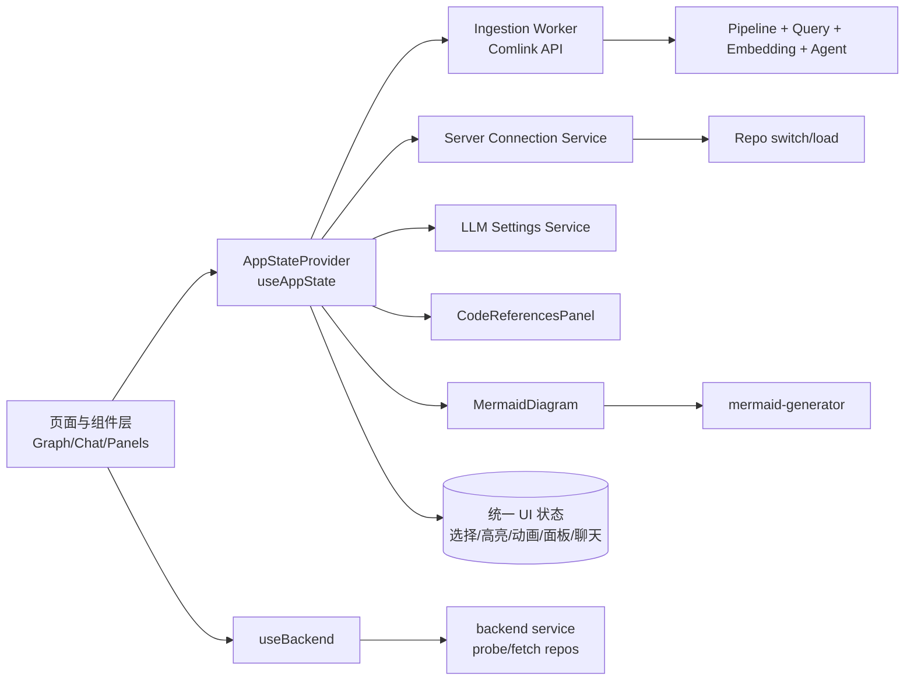
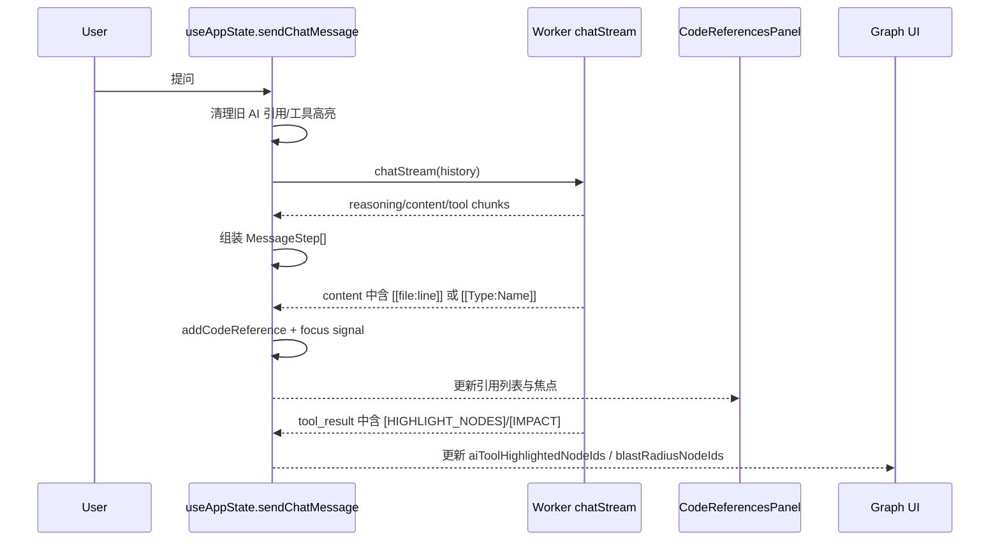
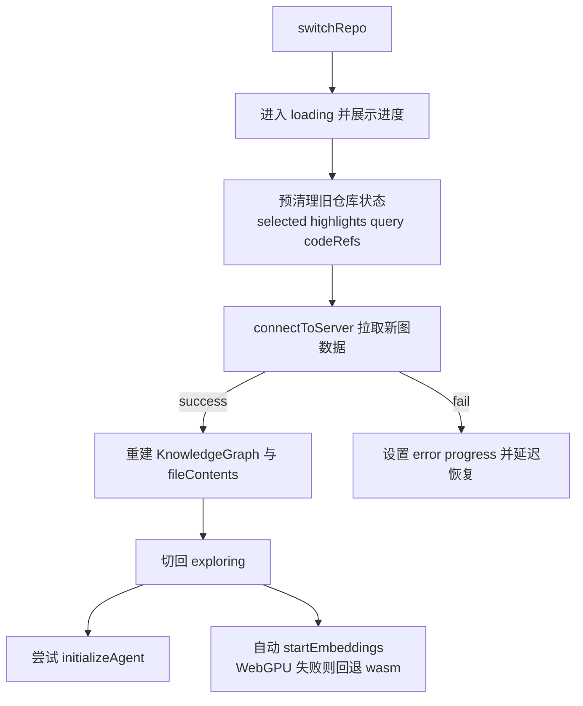
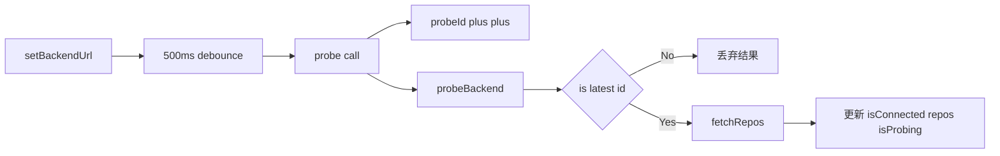

# web_app_state_and_ui 模块文档

## 1. 模块概览：它做什么、为什么存在

`web_app_state_and_ui` 是 GitNexus Web 前端体验层的“交互中枢模块”。它把应用级状态编排（`useAppState`）、后端连接状态管理（`useBackend`）、代码引用可视化面板（`CodeReferencesPanel`）、Mermaid 图渲染组件（`MermaidDiagram`）以及流程图语法生成器（`mermaid-generator`）放在同一个模块域内，形成从“数据状态”到“用户可见界面反馈”的完整闭环。

这个模块存在的核心原因是：GitNexus 的前端不是单一页面渲染，而是图谱探索、AI 对话、代码证据定位、流程图可视化、多仓库切换并发发生的复杂交互系统。若没有统一的状态和 UI 编排层，开发者会在多个组件中重复处理异步竞态、面板同步、跨仓库状态污染、流式输出抖动等问题。`web_app_state_and_ui` 通过将这些横切能力集中管理，显著降低了组件之间的耦合和一致性风险。

从系统边界看，本模块位于 Web 端“最靠近用户交互”的位置，上游依赖图类型、管道结果、向量检索和 LLM 类型定义，下游驱动画布组件和面板组件的具体呈现。相关基础类型建议配合阅读：

- 图域类型与渲染适配：[`web_graph_types_and_rendering.md`](web_graph_types_and_rendering.md)
- 流水线结果与 Kuzu/WASM 类型：[`web_pipeline_and_storage.md`](web_pipeline_and_storage.md)
- 向量与检索类型：[`web_embeddings_and_search.md`](web_embeddings_and_search.md)
- LLM/Agent 类型与上下文：[`web_llm_agent.md`](web_llm_agent.md)
- 后端服务协议：[`web_backend_services.md`](web_backend_services.md)

---

## 2. 总体架构

这张图的关键点是：

1. **`useAppState` 是状态与行为统一入口**，既持有状态，又封装调用 Worker、聊天流处理、引用抽取和高亮更新。
2. **`useBackend` 是连接控制平面**，关注“连通性与仓库可用性”，不直接承担业务数据编排。
3. **`CodeReferencesPanel` 与 `MermaidDiagram` 是可视化终端**，消费状态中心产出的结构化信息进行展示和交互。

---

## 3. 子模块划分与职责

> 建议阅读顺序：先读 [`app_state_orchestration.md`](app_state_orchestration.md)，再读 [`backend_connectivity_hook.md`](backend_connectivity_hook.md)，最后按需查阅 UI 与 Mermaid 两个展示子域（[`code_references_ui_panel.md`](code_references_ui_panel.md)、[`mermaid_rendering_component.md`](mermaid_rendering_component.md)、[`mermaid_process_modeling.md`](mermaid_process_modeling.md)）。

### 3.1 app_state_orchestration

对应文档：[`app_state_orchestration.md`](app_state_orchestration.md)

这是本模块最核心的子域，定义了 `AppState`、`CodeReference`、`QueryResult`、`NodeAnimation` 等关键类型，并在 `AppStateProvider` 中统一管理视图模式、图数据、筛选器、查询高亮、AI 高亮、聊天流、代码引用、embedding 生命周期和多仓库切换。它内部通过 Comlink 与 Worker 通信，实现 `runPipeline / runQuery / semanticSearch / chatStream` 的跨线程调用，同时处理流式 chunk 到 UI 步骤（reasoning/content/tool）的映射。

如果你只读一个子模块，优先读这个，因为它定义了几乎所有 UI 行为如何被触发与清理。

### 3.2 backend_connectivity_hook

对应文档：[`backend_connectivity_hook.md`](backend_connectivity_hook.md)

`useBackend` 提供后端 URL 持久化、连通性探测、防抖重探测、仓库列表加载和竞态防护。它使用 `probeIdRef` 保证异步结果不会被过期请求覆盖，解决了“用户快速切换 URL 时 UI 状态抖动”的常见问题。该 Hook 设计上刻意保持轻量，只处理连接生命周期，不负责图谱装载和查询行为。

### 3.3 code_references_ui_panel

对应文档：[`code_references_ui_panel.md`](code_references_ui_panel.md)

该组件把“当前选中节点代码预览”和“AI 引用证据卡片”合并展示，并提供从引用反向聚焦图节点的操作入口。它实现了可拖拽宽度、折叠态、引用卡片滚动定位与短时 glow 提示，强化聊天证据与代码上下文之间的可发现性。组件本身不做复杂业务编排，而是依赖 `useAppState` 的引用数据和焦点信号。

### 3.4 mermaid_rendering_component

对应文档：[`mermaid_rendering_component.md`](mermaid_rendering_component.md)

`MermaidDiagram` 面向流式 Mermaid 文本渲染，采用“防抖 + 静默失败 + 保留最后有效 SVG”策略，避免 AI 输出中间态导致的红框闪烁。组件还支持一键展开到 `ProcessFlowModal`，用于复杂图的放大查看。该设计在实时聊天体验中非常关键，因为 Mermaid 文本通常是逐段到达而非一次性完整返回。

### 3.5 mermaid_process_modeling

对应文档：[`mermaid_process_modeling.md`](mermaid_process_modeling.md)

该子模块负责把结构化 `ProcessData` 转成 Mermaid flowchart 代码。它支持基于 `edges` 的真实分支、基于 `stepNumber` 的回退线性链路、跨社区子图分组（subgraph）、入口/终点样式标注，并提供简版 `generateSimpleMermaid` 作为快速预览路径。它是流程语义层和渲染层之间的核心适配器。

---

## 4. 关键交互数据流

### 4.1 AI 问答到代码引用与图高亮

这个链路体现了模块价值：聊天不只是文本输出，而是实时驱动代码证据面板与图谱可视反馈。

### 4.2 多仓库切换与状态防污染

这里的“预清理”是设计关键。若不清理旧 `nodeId` 集合，图层 reducer 可能把新图错误当成全体未命中而整体 dim。

### 4.3 后端连接探测与竞态保护

该流程防止“先发请求后返回”覆盖“后发请求先返回”导致的状态回退问题。

---

## 5. 核心类型与接口速览

本模块核心组件对应的高层语义如下：

- `AppState`：全局状态与动作接口，连接 UI、Worker 与服务层。
- `CodeReference / CodeReferenceFocus`：代码证据条目与焦点事件模型。
- `NodeAnimation`：节点短时动画反馈模型（pulse/ripple/glow）。
- `QueryResult`：查询结果与可视高亮节点集合。
- `UseBackendResult`：后端连接状态和动作契约。
- `CodeReferencesPanelProps`：面板与图聚焦桥接契约（`onFocusNode`）。
- `MermaidDiagramProps`：Mermaid 渲染输入契约（`code`）。
- `ProcessStep / ProcessEdge / ProcessData`：流程图生成输入模型。

类型和字段细节请分别查看对应子文档，避免本文重复。

---

## 6. 使用与扩展建议

### 6.1 集成建议

1. 在应用根节点尽早挂载 `AppStateProvider`，避免下游 Hook 在 provider 外使用导致运行时错误。
2. 把 `useBackend` 放在连接入口或顶部容器，让 URL、连接状态、仓库选择形成单一事实来源。
3. 将 `CodeReferencesPanel` 的 `onFocusNode` 明确桥接到图画布 `focusNode`，保持代码与图的双向导航。
4. 对 AI Mermaid 输出统一使用 `MermaidDiagram`，不要重复实现渲染容错逻辑。

### 6.2 扩展建议

- 新增高亮来源时，建议单独维护状态集合并定义明确清理时机（发送消息前、切仓前、手动关闭时）。
- 扩展聊天 chunk 类型时，优先增加 `MessageStep` 类型分支而非直接拼接字符串。
- 若要支持更多代码语言高亮，可在 `CodeReferencesPanel` 抽取 `getLanguageFromPath` 统一扩展。
- 若多个组件都使用 Mermaid，建议把全局初始化抽离到共享 runtime，避免配置覆盖。

---

## 7. 错误条件、边界与已知限制

本模块整体采用“交互优先、容错降级”的风格，主要注意点如下：

- `useAppState` 必须在 provider 内调用，否则会抛错。
- Worker 未初始化时，多数动作会抛 `Worker not initialized` 或返回失败状态。
- 聊天中的引用解析依赖正则，复杂文件名或重名节点可能导致漏匹配/误匹配。
- `CodeReferencesPanel` 当前主要展示 AI 引用，用户引用展示策略较保守。
- `MermaidDiagram` 默认静默渲染失败，减少抖动但降低错误可见性。
- `generateSimpleMermaid` 对小 `stepCount` 无硬性下限保护，调用方应保证输入合理。
- 本地存储不可用时（隐私模式/配额限制）会降级运行，但偏好不会持久化。

---

## 8. 与其他模块关系（避免重复阅读）

- 若你关注图渲染与 Sigma 运行时：看 [`web_graph_types_and_rendering.md`](web_graph_types_and_rendering.md)
- 若你关注 ingestion/解析/符号解析算法：看 [`web_ingestion_pipeline.md`](web_ingestion_pipeline.md)
- 若你关注向量检索与 hybrid search：看 [`web_embeddings_and_search.md`](web_embeddings_and_search.md)
- 若你关注 LLM Provider/Agent 上下文构造：看 [`web_llm_agent.md`](web_llm_agent.md)
- 若你关注后端 repo 服务细节：看 [`web_backend_services.md`](web_backend_services.md)

---

## 9. 结论

`web_app_state_and_ui` 不是单一 UI 组件集合，而是 GitNexus Web 前端的交互控制层。它通过统一状态编排、连接治理、证据可视化和流式渲染容错，把多条复杂用户链路（图探索、AI 问答、代码定位、流程图浏览、多仓切换）组织成一致且可维护的体验。对维护者而言，最重要的不是记住每个 state 字段，而是保持三个原则：**状态分区清晰、异步竞态可控、跨域副作用可清理**。
