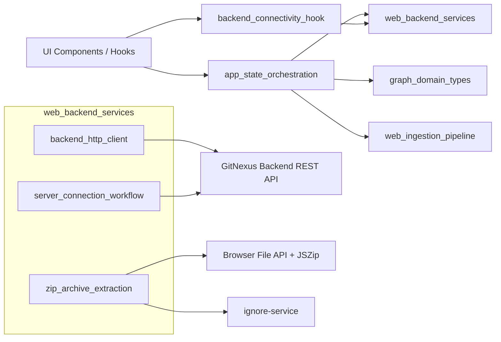
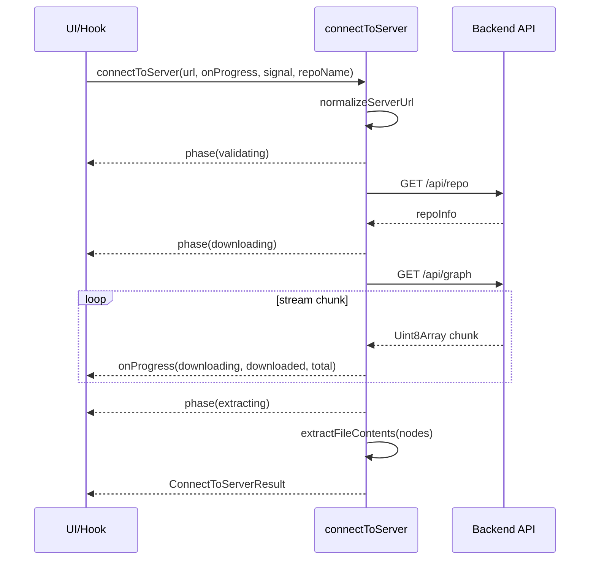
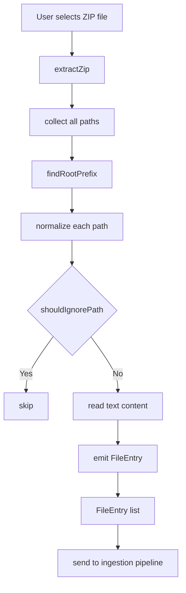
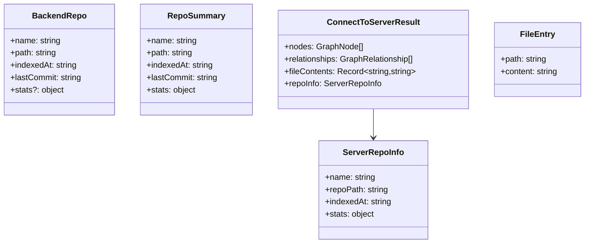

# web_backend_services 模块文档

## 1. 模块概述：它做什么、为什么存在

`web_backend_services` 是 GitNexus Web 前端中连接“外部代码数据来源”的服务层模块，负责把两类输入统一成可被应用状态与图谱渲染层消费的数据形态：第一类是通过 HTTP 从 GitNexus backend 拉取仓库图谱与分析结果；第二类是用户在浏览器中上传 ZIP 后本地解压得到源码文件列表。这个模块的设计目标并不是做复杂业务计算，而是解决前端工程中最容易分散和重复的问题：URL 规范化、请求超时与错误语义统一、大体量图数据下载进度、仓库元数据读取、ZIP 根目录归一化与忽略规则过滤。

在系统架构上，它扮演“边界适配层（boundary adapter）”：向下对接浏览器 API（`fetch`、`AbortController`、`ReadableStream`、`File`）与后端 REST API，向上为 `app_state_orchestration`、`backend_connectivity_hook`、图渲染与查询功能提供稳定接口。这样做的收益是显著降低 UI 层认知负担：页面逻辑不再关心网络细节和文件系统噪声，而只处理“连接成功了吗”“拿到了哪些 repo”“图数据是否加载完成”“可分析文件有哪些”等领域语义。

---

## 2. 设计原则与问题域

该模块围绕三个核心问题进行设计。第一，后端连接问题：真实用户输入的服务地址格式并不统一，且网络失败、超时、状态码错误会造成大量分支逻辑。第二，大图下载问题：完整知识图可能较大，若没有流式进度反馈，前端体验会“长时间无响应”。第三，ZIP 导入问题：不同来源压缩包目录结构不一致，且包含大量应忽略文件，若直接进入解析流程会造成噪声与性能浪费。

因此，`web_backend_services` 采用了“薄服务 + 强约束流程”的策略：单个 API 函数保持轻量，专注传输与最小规范化；复杂场景通过工作流函数（`connectToServer`）串联阶段并输出统一结果；本地 ZIP 路线通过前置净化（根目录剥离 + `shouldIgnorePath`）降低后续 ingestion 成本。

---

## 3. 模块组成与职责分解

`web_backend_services` 当前可清晰拆为三个子模块，每个子模块已有独立文档，建议按需深入阅读：

1. **backend_http_client**：后端 HTTP 客户端能力，包含默认地址管理、带超时请求、状态码断言，以及图、查询、搜索、文件、流程、集群等 API 封装。详见 [backend_http_client.md](backend_http_client.md)。
2. **server_connection_workflow**：连接编排能力，封装 URL 规范化、仓库信息验证、图谱流式下载、文件内容提取、阶段进度回调。详见 [server_connection_workflow.md](server_connection_workflow.md)。
3. **zip_archive_extraction**：ZIP 本地导入能力，封装根目录识别与剥离、忽略规则过滤、文本提取并返回 `FileEntry[]`。详见 [zip_archive_extraction.md](zip_archive_extraction.md)。

这三者不是互斥关系，而是“在线拉取路径”和“离线导入路径”的并行入口：前两者服务于连接后端模式，第三者服务于浏览器本地模式。

---

## 4. 核心类型总览（跨文件视角）

本模块对外暴露的核心类型主要分为三组。第一组是后端仓库元信息：`BackendRepo`、`RepoSummary`、`ServerRepoInfo`，用于描述仓库列表和当前仓库详情。第二组是连接工作流结果：`ConnectToServerResult`，整合 `nodes`、`relationships`、`fileContents` 与 `repoInfo`。第三组是本地 ZIP 入口类型：`FileEntry`，承载规范化后的源码路径和文本内容。

这些类型与图域类型（`GraphNode`、`GraphRelationship`）直接耦合，详细图结构定义请阅读 [graph_domain_types.md](graph_domain_types.md)。同时它们被应用状态层消费（`AppState`、`UseBackendResult`），相关状态编排见 [app_state_orchestration.md](app_state_orchestration.md) 与 [backend_connectivity_hook.md](backend_connectivity_hook.md)。

---

## 5. 架构图：在整个 Web 系统中的位置

这张图反映了一个关键边界：`web_backend_services` 不拥有全局状态，它只是能力提供者；状态收敛与交互联动发生在 Hook/State 层。对维护者而言，这个边界有助于避免“服务层侵入 UI 状态”的反模式。

---

## 6. 在线连接路径（Server 模式）数据流

这个流程的优势在于“分阶段可观测”：调用方能够把 `validating/downloading/extracting` 显式映射到 UI 文案与进度条状态，而不是只等待一个黑盒 Promise。

---

## 7. 离线导入路径（ZIP 模式）数据流

离线路径的核心价值是把“ZIP 来源差异”压平。无论用户上传的是 GitHub 自动打包 ZIP 还是手工 ZIP，上层都拿到一致的相对路径与文本内容集合。

---

## 8. 子模块功能导读（避免重复）

### 8.1 backend_http_client

该子模块强调“通用 HTTP 能力标准化”：`fetchWithTimeout` 处理超时与网络异常语义，`assertOk` 统一状态码错误提取，`probeBackend` 提供轻量可达性探测，`fetchGraph` 针对大仓库拉长超时窗口。它对后端 API 的封装覆盖仓库、图、查询、搜索、文件、流程和集群全链路，是 UI 与后端交互的基础底座。详细函数级参数、返回、异常行为与扩展模板请看 [backend_http_client.md](backend_http_client.md)。

### 8.2 server_connection_workflow

该子模块强调“多步骤连接工作流”：用 `normalizeServerUrl` 处理用户输入地址，用 `fetchRepoInfo` 做连接有效性验证，用 `fetchGraph` 承担可中断流式下载，再通过 `extractFileContents` 构建快速文件内容索引。`ConnectToServerResult` 让调用方一次拿到图结构和仓库信息，适合进入工作区时的一次性加载。完整阶段模型与边界条件详见 [server_connection_workflow.md](server_connection_workflow.md)。

### 8.3 zip_archive_extraction

该子模块强调“本地文件净化与统一格式输出”：通过 `findRootPrefix` 自动去掉公共根目录，借助 `shouldIgnorePath` 去除噪声文件，最终输出 `FileEntry[]` 供 pipeline 使用。它是 browser-only 模式的重要入口，也是降低 ingestion 噪声的第一道门。有关 fail-fast 行为、并发内存特征、排序稳定性与演进建议详见 [zip_archive_extraction.md](zip_archive_extraction.md)。

---

## 9. 关键组件关系图（类型与职责）

要点是：`BackendRepo/RepoSummary/ServerRepoInfo` 都在描述仓库，但来源接口和字段严格程度不同；`ConnectToServerResult` 是工作流聚合结果；`FileEntry` 是 ZIP 导入入口，不依赖图类型。

---

## 10. 实际使用建议

在真实应用中，推荐把“连接状态”和“数据请求”分层处理：连接 URL 与仓库选择由 `useBackend` 一类 Hook 统一管理，请求动作由 `web_backend_services` 执行，最终结果写入 `AppState`。这样可以避免组件级重复请求和错误处理分散。

若是 server 模式，优先用 `connectToServer` 一次性拉取；若是 ZIP 模式，先 `extractZip` 得到 `FileEntry[]`，再交给 pipeline（见 [web_pipeline_and_storage.md](web_pipeline_and_storage.md) 与 [web_ingestion_pipeline.md](web_ingestion_pipeline.md)）。两种路径最终都会汇入图与状态层，因此 UI 可以复用同一套展示组件。

---

## 11. 扩展指南

扩展本模块时建议遵循三条原则。第一，新增后端 API 封装时复用统一错误语义和参数编码策略，保持调用体验一致。第二，新增连接阶段时沿用 `phase + progress` 回调协议，避免破坏既有 UI 进度逻辑。第三，扩展 ZIP 行为优先修改忽略策略模块而不是在提取函数内堆特例，以保持不同入口的一致过滤语义。

如果需要提升类型安全，可在服务层返回前增加轻量 schema 验证（例如 type guard / zod），但要避免把业务规则塞进基础传输层。

---

## 12. 风险点、边界条件与限制总表

- **URL 规范化限制**：`normalizeServerUrl` 假设 API 基路径是 `/api` 根，版本化路径场景需谨慎。
- **内存压力**：`fetchGraph` 和 ZIP 提取都可能在大数据量下产生较高内存峰值（整包缓冲/并发读取）。
- **返回类型偏宽**：部分 API 返回 `unknown`，上层需做类型守卫。
- **模块级共享配置**：`backend_http_client` 的 `backendUrl` 是单例变量，不支持同页多后端并行。
- **失败策略差异**：`probeBackend` 返回布尔值而不抛错；多数业务 API 则抛异常；ZIP 提取采用 fail-fast。

维护时建议先确认调用场景属于“可用性探测”“业务读取”还是“数据导入”，再设计错误处理策略，以避免统一成单一模式导致体验不一致。

---

## 13. 与其他模块的阅读路线

为了避免重复阅读，建议按职责链路查看：

1. 先读本文件把握 `web_backend_services` 作为边界适配层的角色。
2. 再按入口选择：
   - 后端连接路线： [backend_http_client.md](backend_http_client.md) → [server_connection_workflow.md](server_connection_workflow.md)
   - 本地 ZIP 路线： [zip_archive_extraction.md](zip_archive_extraction.md)
3. 然后进入状态与图域： [backend_connectivity_hook.md](backend_connectivity_hook.md)、[app_state_orchestration.md](app_state_orchestration.md)、[graph_domain_types.md](graph_domain_types.md)
4. 最后看下游 pipeline 与搜索： [web_ingestion_pipeline.md](web_ingestion_pipeline.md)、[web_pipeline_and_storage.md](web_pipeline_and_storage.md)、[web_embeddings_and_search.md](web_embeddings_and_search.md)

通过这条路线，新开发者可以快速建立“输入来源 → 服务适配 → 状态收敛 → 图谱消费”的完整心智模型。
