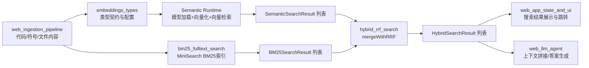
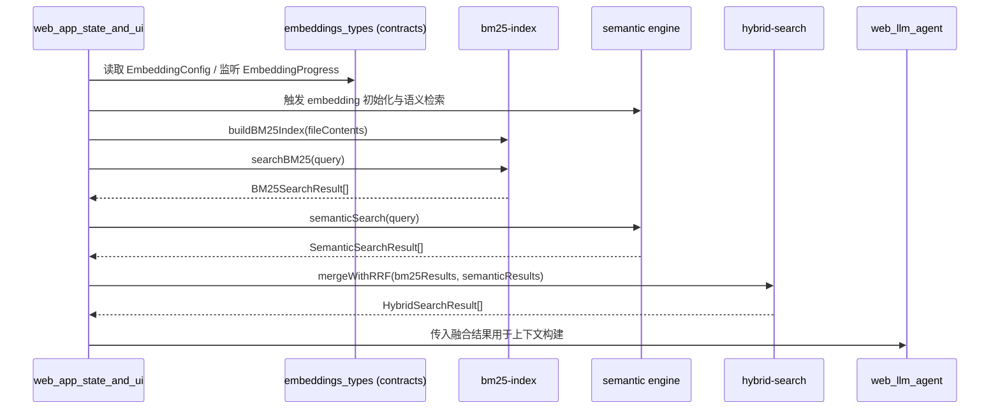

# web_embeddings_and_search 模块深度文档

## 1. 模块概述：它解决了什么问题，为什么存在

`web_embeddings_and_search` 是 GitNexus Web 端“检索能力层”的核心模块，负责把代码库内容转化为可检索资产，并提供三种互补的检索视角：语义检索（embedding）、关键词检索（BM25）、以及融合检索（RRF hybrid）。它的设计目标不是只做“能搜到”，而是让系统在真实开发场景中同时满足“术语精确命中”和“概念近义召回”，从而为代码导航、LLM 上下文构建、问题定位等任务提供稳定输入。

该模块存在的根本原因是单一检索策略在代码语境中通常不够。只用关键词检索会错过语义等价表达（例如“authorization”与“auth guard”）；只用向量检索又可能漏掉精确符号（例如配置键、类名、文件名片段）。因此模块采用“双引擎 + 融合排序”设计：BM25 提供 lexical recall，semantic search 提供 conceptual recall，最后由 RRF 在不依赖分数归一化的情况下融合结果，得到更稳健的最终排序。

在整体系统中，`web_embeddings_and_search` 承接 `web_ingestion_pipeline` 的结构化代码数据，向上服务 `web_app_state_and_ui` 的交互体验，并可为 `web_llm_agent` 提供可解释、可追溯的候选上下文。它是 Web 端“代码理解闭环”中的关键中间层。

---

## 2. 架构总览



上图体现了该模块的三层职责分离。第一层是“契约层”（embeddings types），保证 embedding 流程与调用方之间的数据结构一致。第二层是“两路召回层”（semantic + BM25），分别负责概念召回和关键词召回。第三层是“融合与输出层”（hybrid RRF），将两路结果变成统一排名，供 UI 与 Agent 消费。

这种分层的好处是可替换性强：你可以替换 embedding 模型、调整 BM25 tokenizer、甚至更换融合策略，而不需要整体重写调用链。只要输入输出契约稳定，模块间协作就能保持稳定。

---

## 3. 子模块与核心能力说明

### 3.1 embeddings_types

`embeddings_types` 子模块聚焦“语义检索契约层”，定义了可嵌入节点、模型下载进度、管线阶段进度、默认配置以及语义检索结果结构。它本身不承担具体模型推理实现，但为执行层与 UI 层提供了稳定的数据契约，确保 embedding 生命周期（加载模型、批处理、索引、就绪/错误）可以被一致地观测和消费。

详见：[`embeddings_types.md`](embeddings_types.md)

### 3.2 bm25_fulltext_search

`bm25_fulltext_search` 子模块负责文件级关键词召回，核心 API 是 `buildBM25Index`、`searchBM25`、`isBM25Ready`、`getBM25Stats` 与 `clearBM25Index`。它使用 MiniSearch 维护模块级索引单例，强调“快接入、低依赖、可重建”。

详见：[`bm25_fulltext_search.md`](bm25_fulltext_search.md)

### 3.3 hybrid_rrf_search

`hybrid_rrf_search` 子模块负责融合重排，核心 API 是 `mergeWithRRF`、`isHybridSearchReady`、`formatHybridResults`。它采用 RRF（`RRF_K = 60`）按名次融合 BM25 与语义结果，避免跨检索器分数归一化的复杂性。

详见：[`hybrid_rrf_search.md`](hybrid_rrf_search.md)

---

## 4. 组件关系与交互流程



这个时序说明了一个关键事实：`web_embeddings_and_search` 是“能力聚合层”，而不是单一函数库。它在生命周期上覆盖了索引构建、查询执行、结果融合与结果格式化。对调用方来说，正确的调用顺序（先建索引、再查询、最后融合）和就绪判断（`isBM25Ready` / `isHybridSearchReady`）比单个 API 细节更重要。

---

## 5. 与其他模块的系统级关系

- 与 `web_ingestion_pipeline` 的关系：该模块提供文件内容、符号信息、节点元数据，是 BM25 建索引和语义节点生成的上游输入源。可参考 [`web_ingestion_pipeline.md`](web_ingestion_pipeline.md)。
- 与 `web_pipeline_and_storage` 的关系：索引或分析结果状态常通过 pipeline 类型在 UI 中流转。可参考 [`web_pipeline_and_storage.md`](web_pipeline_and_storage.md)。
- 与 `web_app_state_and_ui` 的关系：该模块消费进度与检索结果并驱动交互展示（列表、代码定位、引用面板等）。可参考 [`web_app_state_and_ui.md`](web_app_state_and_ui.md)。
- 与 `web_llm_agent` 的关系：融合结果可作为 Agent 的高价值上下文候选，提升回答相关性与可解释性。可参考 [`web_llm_agent.md`](web_llm_agent.md)。

---

## 6. 使用与配置指南

### 6.1 推荐调用流程

```ts
import { buildBM25Index, searchBM25 } from '@/core/search/bm25-index'
import { mergeWithRRF } from '@/core/search/hybrid-search'
import { DEFAULT_EMBEDDING_CONFIG, type SemanticSearchResult } from '@/core/embeddings/types'

// 1) ingestion 完成后构建 BM25
buildBM25Index(fileContentsMap)

// 2)（可选）初始化 embedding runtime，使用默认或自定义配置
const config = { ...DEFAULT_EMBEDDING_CONFIG, device: 'wasm' as const }

// 3) 查询时执行双路召回
const bm25 = searchBM25(query, 50)
const semantic: SemanticSearchResult[] = semanticResultsFromYourRuntime

// 4) 融合重排
const hybrid = mergeWithRRF(bm25, semantic, 20)
```

### 6.2 关键配置建议

- `EmbeddingConfig.device`: 默认 `webgpu` 性能更好，但需准备 `wasm` 兜底。
- `EmbeddingConfig.batchSize`: 设备弱、内存小时应降低，避免卡顿或 OOM。
- `EmbeddingConfig.dimensions`: 必须与模型输出维度一致，否则后续索引/检索会失配。
- BM25 查询 `limit`: 建议召回阶段取较大值（如 50），融合后再截断显示（如 10~20）。

---

## 7. 扩展指南：如何安全演进

如果你准备扩展该模块，建议按“契约优先、行为可观测、渐进替换”原则进行：

1. **先扩类型契约，再改实现**：例如新增 embedding 阶段或新设备类型，优先更新 `embeddings_types`，再调整执行层。
2. **保持融合接口稳定**：`mergeWithRRF` 的输入输出最好保持后向兼容，避免 UI/Agent 大范围改动。
3. **增加调试可观测字段**：在不破坏主契约的前提下加入 diagnostics（如单路贡献分）便于线上调优。
4. **明确粒度策略**：当前以 `filePath` 融合，若切换到符号级，需要同步更新展示与上下文拼装逻辑。

---

## 8. 错误条件、边界情况与限制

该模块整体偏“无状态函数 + 轻状态索引”，异常流不复杂，但有几个高频陷阱：

- **未建索引即查询**：`searchBM25` 会静默返回空数组，不抛错，容易被误判为“无结果”。
- **单例索引生命周期问题**：BM25 索引为模块级单例，切换仓库时若不 `clear/rebuild` 可能产生污染。
- **输入排序依赖**：RRF 依赖输入结果顺序；上游若未按各自相关性排序，融合结果会失真。
- **语义分数不可直接对比**：`distance` 与 BM25 `score` 量纲不同，不能直接线性相加。
- **元数据覆盖**：同一文件有多条语义命中时，融合后可能只保留最后写入的语义元数据。
- **tokenizer 语义偏差**：BM25 的 camelCase 处理与注释意图存在潜在偏差，维护时应回归验证。

---

## 9. 模块小结

`web_embeddings_and_search` 的核心价值在于把“可搜索”升级为“可用、可解释、可扩展的搜索”。它通过类型契约稳定接口，通过 BM25 与语义检索实现互补召回，再通过 RRF 输出统一排序结果，最终服务 UI 与 LLM 场景。对于新接手该模块的开发者，建议先读三个子模块文档（types → BM25 → hybrid），再回到本文件理解系统级协作边界与演进策略。
