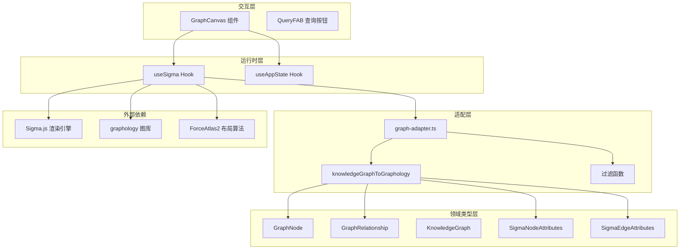
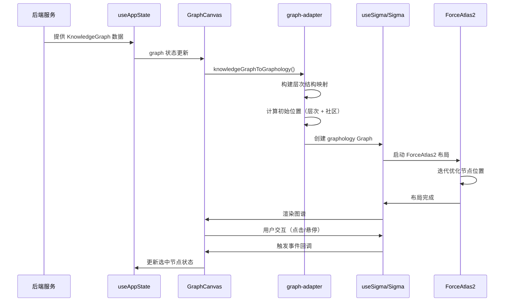

# Web Graph Types and Rendering 模块文档

## 1. 模块概述

### 1.1 模块目的与设计理念

`web_graph_types_and_rendering` 模块是 GitNexus Web 前端的核心可视化组件，负责将代码库的知识图谱以交互式图形的方式呈现给用户。该模块解决了大型代码库理解过程中的关键挑战：如何直观地展示代码元素之间的复杂关系网络，同时保持高性能和流畅的用户体验。

模块的设计基于以下核心理念：

**分层抽象架构**：模块采用了清晰的分层设计，从底层的领域类型定义（`graph_domain_types`），到中间的图形库适配器（`graphology_sigma_adapter`），再到上层的运行时钩子（`sigma_runtime_hook`）和交互层（`graph_canvas_interaction_layer`）。这种分层使得每个组件职责单一，易于维护和扩展。

**智能布局策略**：针对大型代码图谱（可能包含数万个节点），模块实现了混合布局策略。首先基于代码层次结构进行初始定位（文件夹、包等结构节点采用径向分布，内容节点靠近其父节点），然后使用 ForceAtlas2 力导向算法进行优化，最后用 Noverlap 算法进行轻微的去重叠清理。这种策略确保了即使在超大规模图谱中，层次结构依然清晰可见。

**社区感知可视化**：模块集成了社区检测算法的结果，通过 Leiden 算法识别的代码社区会以不同的颜色呈现。符号节点（函数、类、方法等）根据其所属社区着色，而结构节点（文件夹、包等）保持类型-based 颜色。这种设计使得开发者能够快速识别代码的功能模块和依赖关系。

**动态高亮系统**：模块支持多种高亮模式，包括查询结果高亮（青色脉冲动画）、爆炸半径高亮（红色涟漪动画）和 AI 工具高亮（紫色辉光动画）。这些视觉效果帮助用户快速定位感兴趣的代码区域，同时通过节点和边的动态渲染优化保持上下文清晰。

### 1.2 解决的问题

1. **大规模图谱性能**：通过 WebGL 渲染（Sigma.js）、Web Worker 布局计算和智能节点过滤，模块能够流畅处理超过 50,000 个节点的图谱。

2. **层次结构可视化**：传统的力导向布局往往打乱代码的层次结构。本模块通过层次感知的初始定位和可调节的节点质量（mass）参数，确保文件夹和包等结构节点保持合理的空间分布。

3. **关系类型区分**：不同类型的代码关系（CONTAINS、CALLS、IMPORTS、EXTENDS 等）使用不同的颜色和粗细，使得开发者能够快速识别依赖类型。

4. **交互与导航**：提供缩放、聚焦、深度过滤、节点类型过滤等功能，帮助用户在复杂图谱中快速导航。

### 1.3 与其他模块的关系

本模块与以下模块紧密协作：

- **[core_graph_types](core_graph_types.md)**：共享核心的 GraphNode、GraphRelationship 和 KnowledgeGraph 类型定义，确保前后端数据结构一致。
- **[web_ingestion_pipeline](web_ingestion_pipeline.md)**：接收由 ingestion pipeline 生成的知识图谱数据，包括社区检测结果和过程检测信息。
- **[web_app_state_and_ui](web_app_state_and_ui.md)**：通过 useAppState hook 共享应用状态，包括选中的节点、过滤设置和高亮状态。
- **[web_embeddings_and_search](web_embeddings_and_search.md)**：接收搜索结果并触发相应的节点高亮动画。
- **[web_llm_agent](web_llm_agent.md)**：显示 AI 代理的分析结果，包括引用高亮和工具调用高亮。

## 2. 架构概览

### 2.1 组件架构图



### 2.2 数据流图



### 2.3 核心组件说明

#### 2.3.1 领域类型层（graph_domain_types）

这一层定义了图谱的核心数据结构，包括：

- **GraphNode**：表示代码元素（文件、函数、类等），包含标签、属性和唯一标识符
- **GraphRelationship**：表示节点之间的关系（调用、继承、导入等），包含置信度和解析原因
- **KnowledgeGraph**：图谱容器，提供节点和关系的增删方法

详细文档见：[graph_domain_types.md](graph_domain_types.md)

#### 2.3.2 适配层（graphology_sigma_adapter）

负责将领域模型转换为 Sigma.js 可渲染的格式：

- **knowledgeGraphToGraphology**：核心转换函数，实现层次感知和社区感知的节点定位
- **filterGraphByLabels**：按节点类型过滤可见性
- **filterGraphByDepth**：按与选中节点的距离过滤
- **getNodesWithinHops**：获取指定跳数内的节点

详细文档见：[graphology_sigma_adapter.md](graphology_sigma_adapter.md)

#### 2.3.3 运行时层（sigma_runtime_hook）

React Hook 封装 Sigma.js 的生命周期和交互：

- **useSigma**：管理 Sigma 实例、布局算法、相机控制和事件处理
- **nodeReducer/edgeReducer**：动态计算节点和边的视觉属性
- **动画循环**：支持脉冲、涟漪、辉光等动画效果

详细文档见：[sigma_runtime_hook.md](sigma_runtime_hook.md)

#### 2.3.4 交互层（graph_canvas_interaction_layer）

用户界面组件，提供：

- **GraphCanvas**：主画布组件，集成所有控制功能
- **工具栏**：缩放、聚焦、布局控制
- **AI 高亮切换**：启用/禁用 AI 生成的视觉效果
- **状态提示**：显示选中节点信息和布局状态

详细文档见：[graph_canvas_interaction_layer.md](graph_canvas_interaction_layer.md)

## 3. 核心功能详解

> 说明：本章节为模块级摘要；实现细节请优先阅读以下子模块文档：
> - [graph_domain_types.md](graph_domain_types.md)
> - [graphology_sigma_adapter.md](graphology_sigma_adapter.md)
> - [graph_canvas_interaction_layer.md](graph_canvas_interaction_layer.md)
> - [sigma_runtime_hook.md](sigma_runtime_hook.md)

### 3.1 节点定位策略

模块采用三阶段定位策略：

**阶段 1：结构节点径向分布**
```typescript
// 文件夹、包等结构节点使用黄金角分布
const goldenAngle = Math.PI * (3 - Math.sqrt(5));
const angle = index * goldenAngle;
const radius = structuralSpread * Math.sqrt((index + 1) / structuralNodes.length);
```

**阶段 2：社区中心计算**
```typescript
// 每个社区分配一个区域
const clusterCenters = new Map<number, { x: number; y: number }>();
communities.forEach(communityId => {
  const angle = idx * goldenAngle;
  const radius = clusterSpread * Math.sqrt((idx + 1) / communityCount);
  clusterCenters.set(communityId, { x, y });
});
```

**阶段 3：层次感知子节点定位**
```typescript
// 子节点靠近父节点，但根据社区调整
if (clusterCenter && symbolTypes.has(node.label)) {
  // 社区优先
  x = clusterCenter.x + jitter;
} else if (parentPos) {
  // 层次优先
  x = parentPos.x + jitter;
}
```

### 3.2 节点质量（Mass）系统

ForceAtlas2 算法使用节点质量来控制排斥力：

| 节点类型 | 基础质量 | 作用 |
|---------|---------|------|
| Project | 50 | 最重，锚定整个图谱 |
| Package | 30 | 很重，保持包结构 |
| Module | 20 | 重，模块级分组 |
| Folder | 15 | 重，展开文件夹布局 |
| Class/Interface | 5 | 中等，代码结构节点 |
| File | 3 | 中等，跟随文件夹 |
| Function/Method | 2 | 轻，密集分布 |

### 3.3 关系类型可视化

每种关系类型有独特的颜色和粗细：

```typescript
const EDGE_STYLES = {
  CONTAINS: { color: '#2d5a3d', sizeMultiplier: 0.4 },    // 森林绿
  DEFINES: { color: '#0e7490', sizeMultiplier: 0.5 },     // 青色
  IMPORTS: { color: '#1d4ed8', sizeMultiplier: 0.6 },     // 蓝色
  CALLS: { color: '#7c3aed', sizeMultiplier: 0.8 },       // 紫色
  EXTENDS: { color: '#c2410c', sizeMultiplier: 1.0 },     // 橙色
  IMPLEMENTS: { color: '#be185d', sizeMultiplier: 0.9 },  // 粉色
};
```

### 3.4 动态高亮系统

**脉冲动画（搜索结果）**：
- 颜色：青色（#06b6d4）
- 效果：大小在 1.5-2.3 倍之间振荡
- 频率：正弦波，周期约 2 秒

**涟漪动画（爆炸半径）**：
- 颜色：红色（#ef4444）
- 效果：大小在 1.3-2.5 倍之间振荡
- 用途：显示代码变更影响范围

**辉光动画（AI 高亮）**：
- 颜色：紫色（#a855f7）
- 效果：大小在 1.4-2.0 倍之间振荡
- 用途：AI 代理推荐的代码元素

## 4. 使用指南

### 4.1 基本使用

```tsx
import { GraphCanvas } from './components/GraphCanvas';
import type { GraphCanvasHandle } from './components/GraphCanvas';

function MyComponent() {
  const canvasRef = useRef<GraphCanvasHandle>(null);
  
  // 编程方式聚焦节点
  const focusOnNode = (nodeId: string) => {
    canvasRef.current?.focusNode(nodeId);
  };
  
  return <GraphCanvas ref={canvasRef} />;
}
```

### 4.2 配置选项

通过 `useAppState` 配置图谱行为：

```typescript
interface AppState {
  visibleLabels: NodeLabel[];      // 可见节点类型
  visibleEdgeTypes: EdgeType[];    // 可见关系类型
  depthFilter: number | null;      // 深度过滤（从选中节点的跳数）
  highlightedNodeIds: Set<string>; // 高亮节点
  isAIHighlightsEnabled: boolean;  // 启用 AI 高亮
}
```

### 4.3 性能优化建议

1. **节点类型过滤**：在超大型图谱中，隐藏低层级节点（如 Variable、Import）可显著提升性能。
2. **深度过滤**：使用 `depthFilter` 限制显示范围，仅显示选中节点周围 N 跳内的节点。
3. **边类型过滤**：隐藏某些关系类型（如 DECORATES、USES）可减少渲染负担。
4. **布局控制**：大型图谱的布局可能需要 30-45 秒，提供手动停止功能避免用户等待。

## 5. 边缘情况与限制

### 5.1 已知限制

1. **超大规模图谱**：超过 100,000 节点时，初始布局时间可能超过 1 分钟。建议后端进行图谱简化或分块加载。
2. **社区检测依赖**：社区着色依赖于后端的 Leiden 算法结果。如果社区检测失败，符号节点将回退到类型颜色。
3. **浏览器兼容性**：依赖 WebGL，在旧浏览器或某些移动设备上可能无法正常工作。
4. **内存占用**：大型图谱可能占用 500MB+ 内存，主要消耗在 graphology 图结构和 Sigma 渲染缓冲区。

### 5.2 边缘情况处理

1. **孤立节点**：没有父关系的节点会随机分布在中心区域，但保持合理空间分布。
2. **循环依赖**：CALLS 关系中的循环依赖不会导致布局失败，ForceAtlas2 能处理循环图。
3. **空图谱**：当图谱为空时，布局算法不会启动，避免错误。
4. **节点缺失**：边的 source/target 不存在时会被跳过，不会导致崩溃。

## 6. 扩展指南

### 6.1 添加新节点类型

1. 在 `types.ts` 中扩展 `NodeLabel`
2. 在 `constants.ts` 中配置 `NODE_COLORS` 和 `NODE_SIZES`
3. 在 `graph-adapter.ts` 的 `getNodeMass` 中定义质量（可选）
4. 在 UI 过滤面板中新增可见性开关

### 6.2 添加新关系类型

1. 在 `types.ts` 中扩展 `RelationshipType`
2. 在 `graph-adapter.ts` 的 `EDGE_STYLES` 中定义视觉样式
3. 在边类型过滤器中注册该类型
4. 验证 edgeReducer 的高亮逻辑是否符合预期

### 6.3 自定义动画

在 `useSigma.ts` 的 `nodeReducer` 动画分支中新增类型，并保证：
- 返回 `res.highlighted = true` 以便提升 zIndex
- 控制 size 变化区间，避免遮挡过多邻居节点
- 设置明确结束时间，防止长期占用 requestAnimationFrame

## 7. 子模块文档索引（交叉引用）

为了避免在本文件中重复实现细节，以下子模块文档按“类型定义 → 转换适配 → 运行时渲染 → UI 交互”顺序组织，建议按顺序阅读：

1. [graph_domain_types.md](graph_domain_types.md)：解释 GraphNode / GraphRelationship / KnowledgeGraph 的语义边界与字段约定，是整个模块的数据契约基础。
2. [graphology_sigma_adapter.md](graphology_sigma_adapter.md)：解释知识图谱如何转换为 graphology + Sigma 可渲染结构，重点包括层级定位、社区着色、边样式与过滤函数。
3. [sigma_runtime_hook.md](sigma_runtime_hook.md)：解释 `useSigma` 的生命周期管理、ForceAtlas2 布局控制、node/edge reducer 高亮机制及性能策略。
4. [graph_canvas_interaction_layer.md](graph_canvas_interaction_layer.md)：解释 GraphCanvas 如何将状态管理、渲染引擎与交互控件整合成完整用户体验。

在阅读这些文档时，可结合以下外部模块文档一起查看上下游关系：
- [web_ingestion_pipeline.md](web_ingestion_pipeline.md)（图数据来源）
- [web_app_state_and_ui.md](web_app_state_and_ui.md)（前端状态与交互事件来源）
- [web_embeddings_and_search.md](web_embeddings_and_search.md)（搜索高亮来源）
- [web_llm_agent.md](web_llm_agent.md)（AI 高亮来源）

## 8. 新贡献者必读：隐式契约与高风险改动点

1. **`MEMBER_OF` 的 targetId 解析约定是硬编码的**  
   `GraphCanvas` 会把 `rel.targetId` 按 `comm_<number>` 解析社区索引（`parseInt(rel.targetId.replace('comm_', ''), 10)`）。这意味着如果上游把社区节点 ID 改成其它格式（例如 UUID），社区聚类配色会静默退化。

2. **过滤是“隐藏”，不是“删图”**  
   `filterGraphByLabels` / `filterGraphByDepth` 仅设置节点 `hidden` 属性，不移除节点或边。这样性能更好，但也意味着“不可见节点仍参与某些图运算/邻接关系判定”。改成物理删除会影响 `useSigma` 的 reducer 逻辑与相机行为。

3. **布局阶段是“先结构，再力导”**  
   `knowledgeGraphToGraphology` 的初始点位（结构扩散 + 社区中心 + BFS 父子）不是装饰，而是为 ForceAtlas2 提供“好初值”。如果你只保留随机初始坐标，布局收敛时间和层级可读性都会明显恶化。

4. **高亮优先级是产品语义，不是渲染细节**  
   在 `useSigma` 的 `nodeReducer` 中，动画效果 > 爆炸半径 > 常规高亮 > 选中态。边 reducer 也有对应优先级。随意调整分支顺序会改变 AI 结果解释的视觉语义，属于产品行为变更。

5. **`focusNode` 同时修改“视觉焦点 + 业务焦点”**  
   `GraphCanvasHandle.focusNode` 除了移动相机，还会设置 app selected node 并打开代码面板。不要把它当成纯 camera API，否则会在跨模块调用时出现“镜头到了，但面板不同步”的体验割裂。

## 9. 外部相关模块参考

- [core_graph_types.md](core_graph_types.md)
- [web_ingestion_pipeline.md](web_ingestion_pipeline.md)
- [web_app_state_and_ui.md](web_app_state_and_ui.md)
- [web_embeddings_and_search.md](web_embeddings_and_search.md)
- [web_llm_agent.md](web_llm_agent.md)
