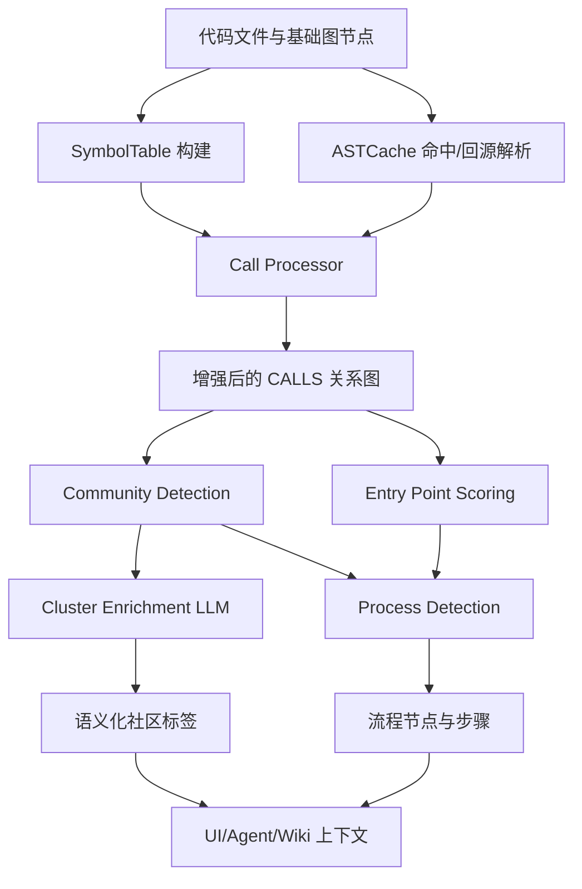
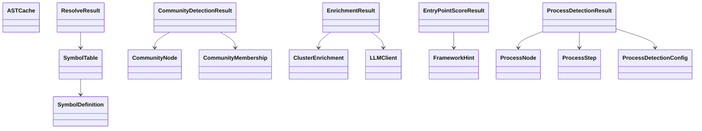
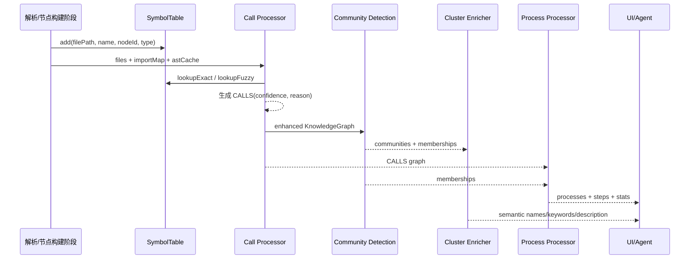

# web_ingestion_pipeline 模块文档

## 1. 模块综述

`web_ingestion_pipeline` 是 `gitnexus-web` 中负责“从代码结构到可解释知识图谱语义层”的核心分析流水线。它位于前端图谱应用与底层数据模型之间，接收已经抽取得到的代码节点与基础关系（尤其是函数/方法调用关系），并进一步完成符号解析、调用目标归因、社区发现、流程检测与语义增强（LLM enrichment）等工作。换句话说，这个模块不只是“解析代码”，而是把静态代码事实组织成用户和 AI 都更容易理解的结构化认知层。

该模块存在的核心原因是：原始代码图通常过于细碎，难以直接支持“功能导航”“流程解释”“智能问答上下文构建”。例如，只有 `CALLS` 边并不能直接告诉你系统里有哪些功能簇、哪些函数是入口、一次典型执行链路如何跨模块传播。`web_ingestion_pipeline` 通过一系列启发式与图算法，将低层边关系提升为高层语义对象（community、process、entry point hints），从而显著降低认知负担。

此外，这是一个面向 Web 运行时优化过的实现。模块包含了专门的 AST 缓存与资源回收策略（WASM Tree 生命周期管理），并在入口评分与框架识别中采用路径启发式，确保在浏览器环境下仍能以较低成本获得可用、可解释、可扩展的分析结果。

---
## 快速回答（给新加入的高级工程师）

1. **它解决什么问题？**  
   代码解析后的原始图谱通常只有“节点+边”，但缺少“功能分组、入口判断、执行流程、语义标签”。`web_ingestion_pipeline` 的职责是把这些低层事实提升为可导航、可解释、可被 Agent 直接消费的认知结构。

2. **心智模型是什么？**  
   可以把它想成“代码交通分析中心”：`SymbolTable` 像地名索引，`processCalls` 像路径匹配器，`processCommunities` 像城区划分器，`processProcesses` 像主干通勤路线抽取器，`enrichClusters` 则像给每个城区贴上人类可读标签。

3. **数据如何流动？**  
   典型顺序是：符号索引（`createSymbolTable`）→ 调用关系补全（`processCalls`，依赖 `ASTCache`）→ 社区聚类（`processCommunities`）→ 入口评分（`calculateEntryPointScore` + `detectFrameworkFromPath`）→ 流程追踪（`processProcesses`）→ 可选语义增强（`enrichClusters` / `enrichClustersBatch`）。

4. **主要权衡是什么？**  
   - 选择“启发式 + 置信度”而不是“全量语义精确解析”，换来跨语言与前端运行时可接受性能；
   - 选择路径规则做框架识别而不是 AST 注解级识别，换来低成本部署与快速反馈；
   - 选择受限 BFS（深度/分支上限）而不是穷举路径，换来稳定可控的输出规模。

5. **新贡献者最该注意什么？**  
   - 任何新增关系推断都要维护 `confidence/reason` 语义，不要把弱证据伪装成强事实；
   - `ASTCache` 的 `tree.delete()` 生命周期不能破坏，否则浏览器 WASM 内存会被悄悄吃满；
   - 流程质量高度依赖调用解析质量，先修 `SymbolTable + import`，再调流程参数。

## 2. 模块架构总览

上图体现了一个“先关系精化，再语义上卷”的处理链路。`SymbolTable + Call Processor` 负责尽可能把调用点解析到具体目标节点；在此基础上，`Community Detection` 将大量符号组织成协作簇，`Process Detection` 则沿调用边追踪可解释流程；最后 `Cluster Enrichment` 用 LLM 将社区命名和摘要语义化，便于展示和检索。

### 2.1 组件关系（类型与处理器）

这个关系图强调：本模块既包含“算法执行器”，也包含大量“跨阶段数据契约类型”。这些类型定义是稳定集成点，保障了 UI、存储、Agent 与后续检索层可以一致消费结果。

---

## 3. 子模块说明（高层）

> 下面给出每个子模块的职责与使用场景概览。实现细节、函数参数、边界行为与示例代码请直接阅读对应文档。

### 3.1 AST 缓存管理（`ast_cache_management`）

该子模块以 `ASTCache` 为核心抽象，基于 LRU 策略缓存 `web-tree-sitter` 的 `Parser.Tree`，减少重复解析开销。其关键设计点是淘汰时调用 `tree.delete()`，主动释放 WASM 侧内存，避免长会话中的隐性内存增长。对于浏览器侧分析任务，这是稳定性与性能的基础保障。

详见：[`ast_cache_management.md`](ast_cache_management.md)

### 3.2 符号索引与调用解析（`symbol_indexing_and_call_resolution`）

该子模块通过 `SymbolTable` 建立双层索引（按文件精确查找 + 全局模糊查找），并在 `processCalls` 中结合 `ImportMap` 与 AST 查询结果，将调用文本解析为具体图节点。解析结果显式携带 `confidence` 与 `reason`（`ResolveResult` 语义），这让下游能够区分高置信和弱归因调用边，避免“全都当真”的误判。

详见：[`symbol_indexing_and_call_resolution.md`](symbol_indexing_and_call_resolution.md)

### 3.3 社区检测（`community_detection`）

该子模块将函数/类/方法等符号节点与 `CALLS/EXTENDS/IMPLEMENTS` 关系投影到聚类图，使用 Leiden 算法发现代码协作社区。它输出 `CommunityNode` 与 `CommunityMembership`，并提供 `modularity`、`cohesion` 等可解释指标。社区结果是流程分析与语义增强的关键输入，也是图可视化分组的核心依据。

详见：[`community_detection.md`](community_detection.md)

### 3.4 集群语义增强（`cluster_enrichment`）

该子模块引入 `LLMClient`，将社区成员信息转为语义名称、关键词与摘要（`ClusterEnrichment`）。模块提供串行与批处理两种模式，并在响应解析失败、模型异常时自动回退到启发式标签，确保流水线始终可用。它不改变图结构，但显著提升可读性与交互体验。

详见：[`cluster_enrichment.md`](cluster_enrichment.md)

### 3.5 流程检测与入口评分（`process_detection_and_entry_scoring`）

该子模块先基于名称模式、导出状态、调用比率和框架路径提示（`FrameworkHint`）计算入口分数（`EntryPointScoreResult`），再从高分入口沿 `CALLS` 边做受限 BFS，生成流程节点与步骤（`ProcessNode` / `ProcessStep`）。其结果可直接用于“功能调用链”展示与 Agent 解释路径构建。

详见：[`process_detection_and_entry_scoring.md`](process_detection_and_entry_scoring.md)

---

## 4. 端到端数据流

该流程说明了一个关键原则：**先把“结构正确性”做扎实，再叠加“语义可读性”**。调用边质量影响社区与流程质量；社区结果又反过来影响流程类型（跨社区/社区内）与 UI 导航效率。

---

## 5. 与其他模块的边界与协作

`web_ingestion_pipeline` 并非孤立模块。它依赖图数据模型与上游解析成果，也会将结果交给存储、搜索和 UI 交互层。建议结合以下文档理解全链路：

- 图结构契约：[`graph_domain_types.md`](graph_domain_types.md) / [`core_graph_types.md`](core_graph_types.md)
- Web 侧流水线结果与存储：[`web_pipeline_and_storage.md`](web_pipeline_and_storage.md)
- Web 搜索与混合检索：[`web_embeddings_and_search.md`](web_embeddings_and_search.md)
- 应用状态与前端交互：[`web_app_state_and_ui.md`](web_app_state_and_ui.md)

如果上述文档尚未生成，可先以本模块文档作为语义层参考，再回溯数据来源和结果消费端。

---

## 6. 使用与配置建议

在实际接入中，建议将该模块作为一个可配置流水线运行，而不是把所有处理步骤硬编码为固定参数。最低建议配置包括：

1. AST 缓存大小（与仓库规模相关）；
2. 流程检测参数（`maxTraceDepth`、`maxBranching`、`maxProcesses`、`minSteps`）；
3. 是否启用 LLM enrichment，以及采用串行还是 batch。

对于中大型仓库，优先保证调用解析质量（symbol/import 完整性），其次再调高流程追踪深度。否则会出现“流程数量很多但语义噪声高”的问题。

---

## 7. 常见边界情况与注意事项

- **调用归因歧义**：同名函数跨文件大量存在时，`lookupFuzzy` 可能产生低置信匹配。务必利用 `confidence` 字段做后处理，而不是无条件信任。
- **Top-level 调用处理**：不在函数内部的调用会回退到 `File` 级 source 节点，这会影响某些流程可视化的细粒度。
- **社区统计与展示数量不一致**：Leiden 原始社区数可能大于最终展示社区数（singleton 被过滤）。
- **LLM 输出不稳定**：enrichment 结果是“尽力增强”而非强一致事实，建议在产品层保留 heuristic fallback 展示。
- **框架检测为路径启发式**：`FrameworkHint` 基于路径模式，不读取注解/装饰器语义，可能出现漏判或误判。
- **性能与质量权衡**：流程检测参数越激进（深度/分支越大），计算量和噪声都可能上升，需要结合仓库规模迭代调参。

---

## 8. 扩展建议

如果你要扩展 `web_ingestion_pipeline`，推荐优先从三个方向入手：

1. **提高调用解析精度**：在 `resolveCallTarget` 中引入更多语言语义（命名空间、类作用域、方法接收者等）。
2. **增强入口识别**：将 `framework-detection` 从路径启发式升级为 AST 注解/装饰器识别（文档中已有未来模式常量可参考）。
3. **流程去重策略升级**：当前子串包含法易受路径重叠影响，可考虑图同构近似或编辑距离聚类，提升流程代表性。

这些扩展都可在不破坏现有类型契约的前提下渐进实施。
