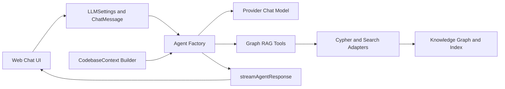
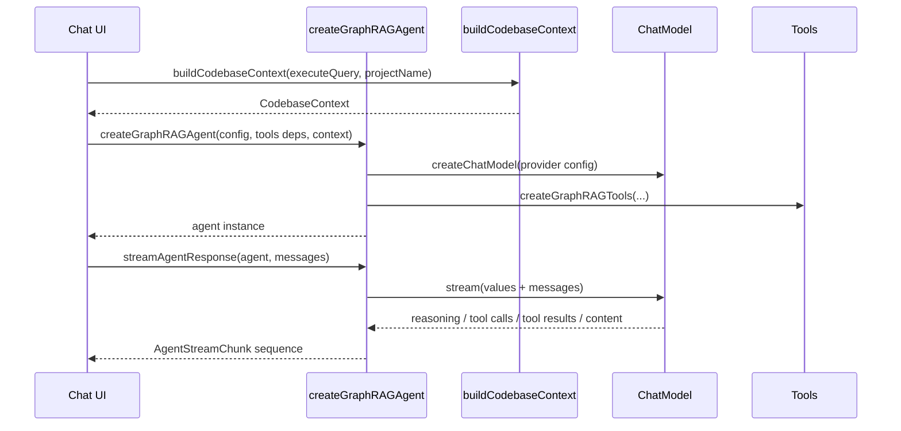
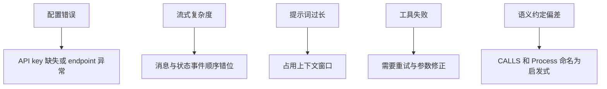

# web_llm_agent 模块文档

## 1. 模块概述

`web_llm_agent` 是 `gitnexus-web` 前端侧的 LLM 智能体编排模块，核心目标是把“代码图谱检索能力”与“多模型供应商推理能力”组合成一个可交互、可追踪、可扩展的 Graph RAG Agent。它不是一个单纯的聊天封装层，而是一个在浏览器环境中完成模型适配、系统提示词注入、工具调用编排、流式消息还原的执行中枢。

该模块存在的根本原因是：通用聊天模型并不理解当前代码库结构，也不天然具备可验证的证据链。`web_llm_agent` 通过三类机制解决这个问题：第一，定义统一的 provider/config/message 类型契约，降低不同模型 SDK 差异；第二，构建带有强约束规则的系统提示词，并可动态注入代码库统计与热点；第三，把 LangGraph 的多路流事件（messages + values）规整为前端可消费的步骤流，确保 UI 能展示“推理 → 调工具 → 读结果 → 最终回答”的完整过程。

如果把 `web_ingestion_pipeline` 看作“构图与索引”，把 `web_embeddings_and_search` 看作“检索基础设施”，那么 `web_llm_agent` 就是把这些基础能力转化为自然语言交互体验的应用层智能体。

---

## 0. 先回答你最关心的 5 个问题

### 1) 这个模块解决什么问题？

在 `gitnexus-web` 里，图谱检索能力（Cypher / semantic / hybrid）和 LLM 推理能力天然是两套系统：前者擅长“找证据”，后者擅长“组织答案”。`web_llm_agent` 的存在，就是把这两套系统粘成一个**可追踪的调查员**：模型不只是生成文本，而是按“检索→阅读→验证→回答”的流程工作，并把过程流式暴露给 UI。

### 2) 心智模型是什么？

把它想成一个“技术尽调指挥台”：
- `types.ts` 是**作业标准**（所有人必须用同一套表单和事件格式）
- `agent.ts` 是**调度中心**（选模型、挂工具、下发规则、转译流事件）
- `context-builder.ts` 是**开场 briefing**（先给项目全貌，避免模型盲搜）

### 3) 数据如何流动？

主链路是：`LLMSettings`（持久化配置）→ 运行时拼成 `ProviderConfig` → `createChatModel` 创建 provider client → `createGraphRAGAgent` 注入 tools + system prompt → `streamAgentResponse` 把 LangGraph 双路事件归一为 `AgentStreamChunk` → UI 逐步渲染 reasoning / tool_call / tool_result / content。

### 4) 核心取舍是什么？

- 选了“**双流并行（values + messages）**”而不是单流：复杂度更高，但可同时保留文本实时性和工具状态完整性。
- 选了“**强约束提示词**”而不是自由对话：牺牲部分灵活表达，换来可验证、可引用的工程输出。
- 选了“**类型先行 + 运行时补校验**”：`LLMSettings` 允许 `Partial`，提升配置体验；但请求前必须做必填字段校验。

### 5) 新人最容易踩的坑？

- 把 `LLMSettings` 当成可直接请求的配置（其实它是“可能不完整”的持久化结构）。
- 扩展流事件时只改 UI，不改 `AgentStreamChunk` 与 `streamAgentResponse`。
- 新增 provider 只改类型不改 `createChatModel` 分支，或只改工厂不补 `DEFAULT_LLM_SETTINGS`。
- 忽略图语义约定（例如 `CALLS` 在该系统里是工程化简化，不是精确运行时调用图）。

---

## 2. 架构总览



上图体现了该模块的职责边界：UI 与设置层只关心输入配置和展示步骤；Agent Factory 负责把模型、工具、系统提示词粘合；Context Builder 在初始化阶段为模型补齐“项目全景”；Streaming 层负责把底层异步事件还原成可渲染的结构化片段。

### 2.1 组件交互细化



这个时序说明了一个关键设计：`web_llm_agent` 将“构建期逻辑”（模型与提示词拼装）和“运行期逻辑”（流式会话编排）明确拆分，便于测试与扩展。

---

## 3. 子模块划分与职责

本模块可拆为三个高内聚子模块，建议先读类型层，再读执行层。以下文档均已生成并可直接跳转（分别对应 `types.ts`、`agent.ts`、`context-builder.ts`）：

1. **类型与配置层**：[`llm_provider_and_message_types.md`](llm_provider_and_message_types.md)
   - 定义 `ProviderConfig`、`LLMSettings`、`ChatMessage`、`AgentStreamChunk` 等核心契约。
   - 解决多供应商参数不一致和流式消息结构不统一的问题。

2. **Agent 工厂与流式编排层**：[`agent_factory_and_streaming.md`](agent_factory_and_streaming.md)
   - 提供 `createChatModel`、`createGraphRAGAgent`、`streamAgentResponse`、`invokeAgent`。
   - 是实际执行入口，负责 provider SDK 适配、工具注入、双流模式事件归一化与去重。

3. **动态上下文构建层**：[`dynamic_context_builder.md`](dynamic_context_builder.md)
   - 通过 Cypher 生成 `CodebaseContext`（统计、热点、目录树），并注入系统提示词。
   - 让模型在第一轮就获得“代码库地形图”，减少盲搜与无效 token 消耗。

---

## 4. 与其它模块的关系（避免重复说明）

`web_llm_agent` 依赖多个基础模块，但不重复实现其能力：

- 图结构类型请参考 [`web_graph_types_and_rendering.md`](web_graph_types_and_rendering.md) 与 [`graph_domain_types.md`](graph_domain_types.md)。
- 摄取/解析/关系解析能力请参考 [`web_ingestion_pipeline.md`](web_ingestion_pipeline.md)（及其子文档）。
- 向量/BM25/混合检索结果类型请参考 [`web_embeddings_and_search.md`](web_embeddings_and_search.md)。
- Pipeline 结果封装与 Kuzu-WASM 存储类型请参考 [`web_pipeline_and_storage.md`](web_pipeline_and_storage.md)。
- UI 状态与消息渲染消费端请参考 [`web_app_state_and_ui.md`](web_app_state_and_ui.md)。

从职责上看，`web_llm_agent` 是“面向会话的编排层”，其它模块提供“数据面与检索面”能力。

---

## 5. 关键内部设计与 rationale

### 5.1 多供应商统一入口

通过 `ProviderConfig` 判别联合 + `createChatModel` 分支适配，系统把 OpenAI/Azure/Gemini/Anthropic/Ollama/OpenRouter 收敛到统一 `BaseChatModel`。这样 UI 与上层调用不需要关心 SDK 差异，只需传入标准配置对象。

### 5.2 强约束系统提示词 + 可选动态上下文

`BASE_SYSTEM_PROMPT` 负责定义“证据优先、必须验证、优先图查询、结构化输出”等行为规范。`buildDynamicSystemPrompt` 则把当前仓库统计信息附加到提示词末尾，避免稀释核心规则。

### 5.3 双流模式编排

`streamAgentResponse` 同时消费 `values` 与 `messages`：

- `messages` 提供 token 级文本流，保障实时显示体验。
- `values` 提供状态快照，兜底捕获漏掉的 tool call/result。

该设计避免单一流模式导致“文本实时性好但工具状态错乱”或“工具顺序完整但文本卡顿”的问题。

### 5.4 去重与阶段判定

通过 `yieldedToolCalls` / `yieldedToolResults` 追踪已发事件，避免 UI 重复渲染。通过 `hasSeenToolCallThisTurn` 与 `allToolsDone` 把 AI 输出区分为 reasoning 与 final content，提升可解释性展示。

---

## 6. 使用与配置指南

### 6.1 最小使用流程

```ts
import { createGraphRAGAgent, streamAgentResponse } from './core/llm/agent';

const agent = createGraphRAGAgent(
  providerConfig,
  executeQuery,
  semanticSearch,
  semanticSearchWithContext,
  hybridSearch,
  isEmbeddingReady,
  isBM25Ready,
  fileContents,
  codebaseContext
);

for await (const chunk of streamAgentResponse(agent, [
  { role: 'user', content: '解释 auth 相关调用链' }
])) {
  // 根据 chunk.type 更新 UI
}
```

### 6.2 配置建议

- 生产环境务必在 agent 创建前做 provider 配置校验（尤其是 `apiKey`、Azure endpoint、deploymentName）。
- 若模型上下文较小，建议限制动态上下文字段长度（例如 folder tree 深度、hotspots 数量）。
- 对本地 Ollama，优先确认服务地址、模型可用性与上下文窗口配置是否匹配。

---

## 7. 扩展指南

### 7.1 新增 LLM Provider

推荐按以下顺序扩展：

1. 在 `LLMProvider` 增加新 provider 字面量。
2. 添加新的 `XxxConfig extends BaseProviderConfig`。
3. 将其纳入 `ProviderConfig` 联合类型。
4. 在 `createChatModel` 添加分支实现与运行时校验。
5. 在 `DEFAULT_LLM_SETTINGS` 增加默认配置。
6. 在设置 UI 中暴露对应字段。

### 7.2 扩展流式事件类型

若要展示更多中间态（如检索计划、重试次数），应优先扩展 `AgentStreamChunk.type`，再在 `streamAgentResponse` 产生对应分片，最后由 UI 消费。不要直接在 UI 猜测原始 LangGraph 事件结构。

---

## 8. 风险、边界与注意事项



- **配置层风险**：部分 provider 分支校验不对称（如 Azure 校验较弱），错误可能在请求阶段才暴露。
- **流式层风险**：双流模式提高鲁棒性，但也增加事件去重和状态机复杂度，扩展时需回归测试。
- **提示词成本**：系统提示词和动态上下文都较长，低上下文模型可能退化为“频繁截断或工具调用不稳定”。
- **图语义限制**：`CALLS`、`Process` 等边/节点定义是工程化抽象，不等价于程序运行时真实调用图。

---

## 9. 维护者快速检查清单

- 新 provider 是否完成：类型、默认配置、工厂分支、UI 表单、运行时校验。
- 新工具是否影响流式阶段判定：tool call/result 是否可被唯一 ID 跟踪。
- 新提示词规则是否与现有工具能力一致：避免“要求做某事但工具无法实现”。
- 动态上下文查询是否高效：避免在大型仓库中造成冷启动阻塞。

---

## 10. 阅读路径建议

- 先读 [`llm_provider_and_message_types.md`](llm_provider_and_message_types.md) 建立数据契约认知。
- 再读 [`agent_factory_and_streaming.md`](agent_factory_and_streaming.md) 理解真实执行链路。
- 最后读 [`dynamic_context_builder.md`](dynamic_context_builder.md) 掌握 prompt 注入策略。

如果你需要联动理解“智能体为什么能查到这些代码关系”，再回看摄取与检索侧文档：[`web_ingestion_pipeline.md`](web_ingestion_pipeline.md)、[`web_embeddings_and_search.md`](web_embeddings_and_search.md)。
