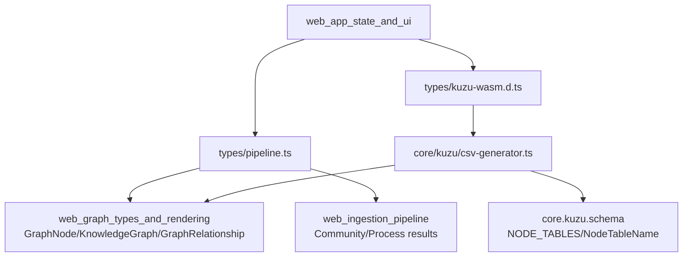
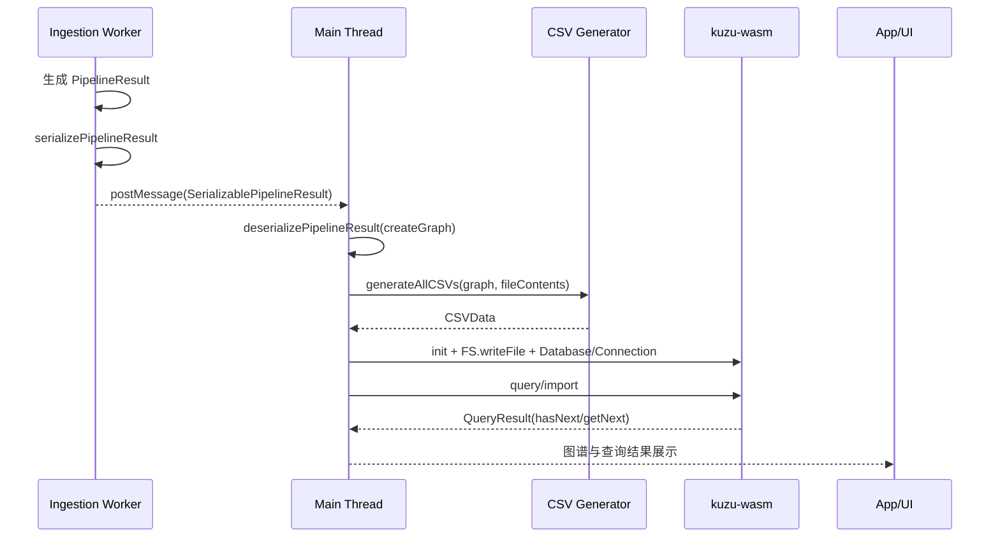

# web_pipeline_and_storage 模块文档

## 1. 模块定位与存在价值

`web_pipeline_and_storage` 是 GitNexus Web 端里连接“分析流水线结果”和“图数据库落地/查询能力”的桥接模块。它的核心职责不是做 AST 解析、调用解析或社区检测（这些在 [web_ingestion_pipeline.md](web_ingestion_pipeline.md)），而是把上游生成的数据以可传输、可持久化、可查询的形式稳定地交付给前端运行时与 Kuzu WASM 存储层。

这个模块存在的主要原因有两个。第一，浏览器多线程模型（Web Worker）要求线程间通信数据可结构化克隆，不能依赖复杂运行时对象；因此需要专门的流水线结果协议类型与序列化/反序列化策略。第二，图数据库 Kuzu 的高效导入路径依赖 CSV 批量装载，而上游数据是内存对象图；因此需要专门的 CSV 生成与文本安全处理逻辑。换言之，本模块解决的是“**执行态数据**”向“**通信态数据**”和“**存储态数据**”转换的问题。

在系统中，它位于以下链路中段：

- 上游：图构建与语义增强（见 [web_ingestion_pipeline.md](web_ingestion_pipeline.md)、[web_graph_types_and_rendering.md](web_graph_types_and_rendering.md)）
- 当前模块：结果协议 + CSV 生成 + Kuzu WASM 类型绑定
- 下游：Web 端查询/检索与 UI 消费（见 [web_embeddings_and_search.md](web_embeddings_and_search.md)、[web_app_state_and_ui.md](web_app_state_and_ui.md)）

---

## 2. 架构总览

```mermaid
flowchart LR
    A[Web Ingestion Pipeline\nKnowledgeGraph + fileContents] --> B[PipelineResult]
    B --> C[serializePipelineResult]
    C --> D[SerializablePipelineResult\npostMessage]
    D --> E[deserializePipelineResult]
    E --> F[可消费的 PipelineResult]

    F --> G[generateAllCSVs]
    G --> H[CSVData\nnode CSVs + relation CSV]
    H --> I[kuzu-wasm.FS.writeFile]
    I --> J[Kuzu WASM Database/Connection]
    J --> K[QueryResult 迭代读取]
    K --> L[UI / 搜索 / 交互]
```

这张图展示了本模块的三段式能力：

1. **线程传输协议层**：把 `PipelineResult` 转换为 `SerializablePipelineResult` 并在主线程恢复。
2. **存储交换格式层**：把知识图和文件内容转换为与 Kuzu Schema 对齐的 CSV。
3. **WASM 存储接口层**：通过 `kuzu-wasm` 的数据库、连接和结果游标类型完成查询生命周期。

三层分离的设计使系统在演进时更稳健：你可以独立替换图构建逻辑、CSV 落地策略或查询消费逻辑，而不必全链路重写。

---

## 3. 核心组件关系

从依赖方向可以看出：`web_pipeline_and_storage` 的复杂性主要在“契约适配”，不是算法推理。它大量复用上游图领域类型，并为下游存储/查询提供稳定边界。

---

## 4. 子模块说明（高层）

### 4.1 `pipeline_result_transport`

该子模块定义分析流水线进度与结果传输协议，核心类型包括 `PipelineProgress`、`PipelineResult`、`SerializablePipelineResult`，并提供双向转换函数。它解决 Worker 与主线程之间的数据语义保持问题，特别是把 `Map` 与图对象实例转为可安全传输的纯数据结构，再通过可注入的 `createGraph` 恢复运行态对象。详细内容见 [pipeline_result_transport.md](pipeline_result_transport.md)。

### 4.2 `kuzu_csv_generation`

该子模块负责将 `KnowledgeGraph` 及 `fileContents` 转为 Kuzu 可批量导入的 CSV 文本，包含文本清洗（换行/控制字符处理）、RFC 4180 转义、代码内容抽取、节点分表导出与统一关系表导出。它是图语义层与数据库装载层之间的关键翻译器。详细内容见 [kuzu_csv_generation.md](kuzu_csv_generation.md)。

### 4.3 `kuzu_wasm_type_bindings`

该子模块是 `kuzu-wasm` 的 TypeScript 声明绑定，定义 `Database`、`Connection`、`QueryResult`、`FS` 及 `init` 的类型契约。它不提供业务逻辑，但决定了调用侧如何组织初始化、查询迭代、资源回收与临时文件写入流程。详细内容见 [kuzu_wasm_type_bindings.md](kuzu_wasm_type_bindings.md)。

---

## 5. 关键数据流与交互过程

这个时序揭示了模块设计中的一个核心原则：**同一份语义数据在不同阶段有不同表现形态**。执行时强调对象能力，传输时强调序列化稳定性，存储时强调 schema 对齐和文本安全性。

---

## 6. 配置与使用指导（实操视角）

在工程集成时，建议把本模块放入一个明确的“pipeline persistence”服务层，统一封装以下步骤：

1. 监听 Worker 完成消息并调用 `deserializePipelineResult`。
2. 使用 `generateAllCSVs` 生成节点与关系 CSV。
3. 通过 `kuzu-wasm` 的 `FS.writeFile` 写入虚拟文件路径。
4. 使用 `Connection.query` 执行导入语句和后续查询。
5. 用 `hasNext/getNext` 迭代结果并映射为 UI 需要的数据结构。
6. 在 `finally` 中关闭 `Connection` / `Database` 并清理临时 CSV 文件。

如果你的应用支持多仓库并行分析，建议进一步引入：

- 消息版本号（避免主线程与 Worker 协议不一致）
- 临时文件命名规范（防止同名覆盖）
- 查询结果 DTO 规范化层（避免 `any` 扩散）

---

## 7. 典型扩展点

本模块最常见扩展包括：

- **协议扩展**：在 `SerializablePipelineResult` 中增加 `communityResult` / `processResult` 或其他衍生指标。
- **CSV 表扩展**：新增节点标签对应的 CSV 生成器（例如未来多语言节点类型）。
- **类型增强**：为 `QueryResult.getNext()` 增加项目侧泛型封装，减少运行时断言。
- **健壮性增强**：为反序列化输入加 schema 验证，避免不可信消息污染主线程状态。

建议扩展时遵循“先协议兼容，再功能上线”的顺序，以降低前后端或主线程/Worker 版本错配风险。

---

## 8. 风险、边界与注意事项

该模块虽然实现不长，但位于关键边界层，常见问题集中在契约细节：

- `PipelineProgress.percent` 无强约束，UI 需自行归一化。
- 当前可序列化结果默认不包含某些可选分析结果，可能出现“静默缺失”。
- CSV 导出存在截断策略（文件/片段长度上限），这会影响后续语义检索召回。
- 二进制检测是启发式，不是绝对判定。
- `kuzu-wasm` 结果行是 `any`，若不做转换层，类型错误会后置到运行时。
- WASM 虚拟文件系统路径语义与浏览器原生文件系统不同，排障时容易混淆。

换句话说，这个模块的主要风险不是“算法错”，而是“边界协议错”和“生命周期管理错”。

---

## 9. 与其他模块文档的阅读顺序建议

若你是首次接触该域，推荐按以下顺序阅读：

1. [web_graph_types_and_rendering.md](web_graph_types_and_rendering.md)：先理解图节点/关系模型。
2. [web_ingestion_pipeline.md](web_ingestion_pipeline.md)：理解图如何被构建与增强。
3. [pipeline_result_transport.md](pipeline_result_transport.md)：理解线程通信契约。
4. [kuzu_csv_generation.md](kuzu_csv_generation.md)：理解对象图如何转存储格式。
5. [kuzu_wasm_type_bindings.md](kuzu_wasm_type_bindings.md)：理解运行时查询接口边界。
6. [web_app_state_and_ui.md](web_app_state_and_ui.md)：理解结果最终如何在产品界面消费。

---

## 10. 子模块文档索引（交叉引用）

以下子模块文档已通过自动拆分生成并完成交叉引用（建议先读本文架构，再按主题深入）：

- 线程传输与结果协议： [pipeline_result_transport.md](pipeline_result_transport.md)
- Kuzu CSV 生成与文本安全处理： [kuzu_csv_generation.md](kuzu_csv_generation.md)
- Kuzu WASM 类型绑定与查询接口： [kuzu_wasm_type_bindings.md](kuzu_wasm_type_bindings.md)

此外，与本模块强相关的上下游文档：

- 图模型定义： [web_graph_types_and_rendering.md](web_graph_types_and_rendering.md)
- 分析管线实现： [web_ingestion_pipeline.md](web_ingestion_pipeline.md)
- UI 消费与状态管理： [web_app_state_and_ui.md](web_app_state_and_ui.md)

---

## 11. 总结

`web_pipeline_and_storage` 的本质是 Web 端图分析系统中的“数据形态转换中枢”。它把上游复杂语义结果变成可通信、可入库、可查询的数据契约，保障了从 Worker 到主线程、从内存对象到 Kuzu 存储再到 UI 查询消费的完整闭环。维护该模块时，最重要的是守住三条线：**协议兼容性、CSV/Schema 一致性、资源生命周期完整性**。