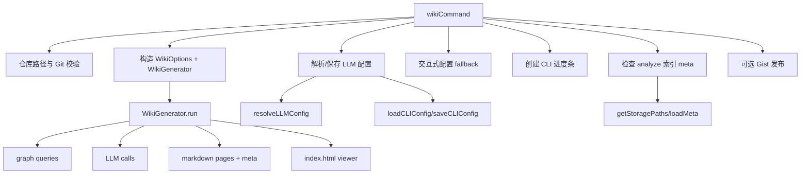
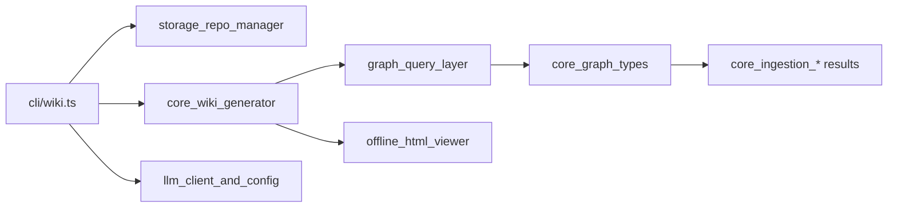
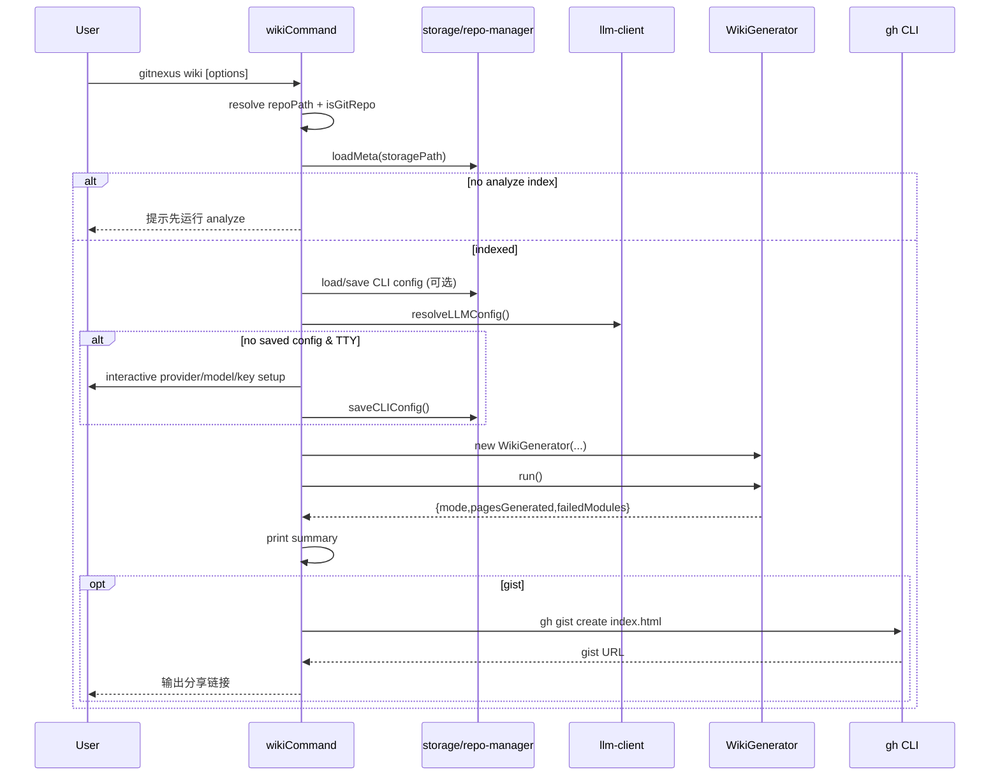
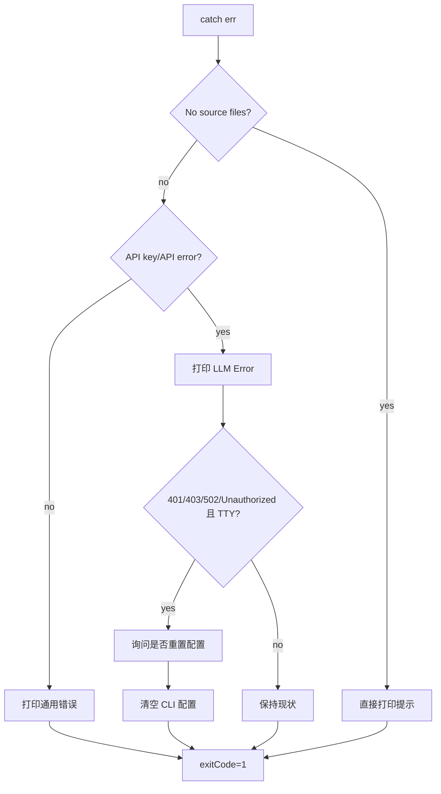
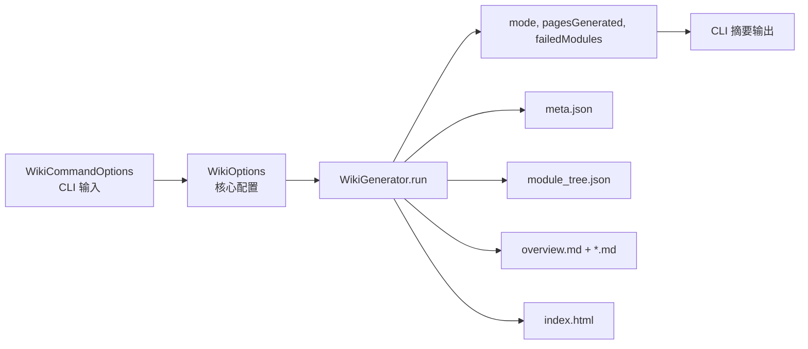
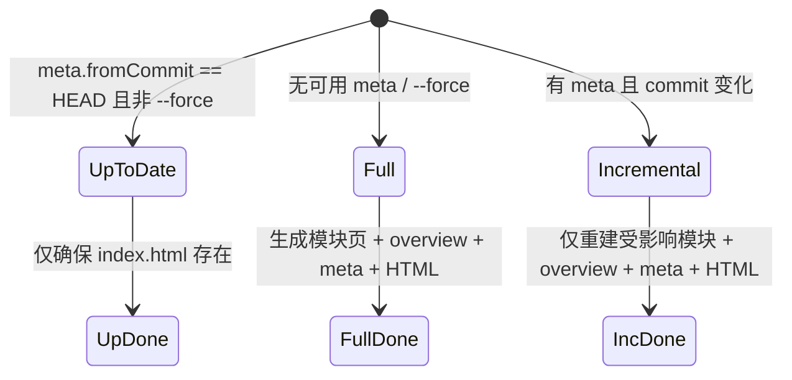

# wiki_generation 模块文档

## 模块简介与设计动机

`wiki_generation`（实现文件：`gitnexus/src/cli/wiki.ts`，核心类型：`WikiCommandOptions`）是 GitNexus CLI 中负责“将已索引仓库转化为可阅读 Wiki 文档”的命令入口层。它的职责不是直接完成文档内容生成，而是把仓库定位、索引前置校验、LLM 配置解析、交互式配置引导、进度可视化、失败处理以及可选发布（GitHub Gist）这些用户侧编排工作统一起来，然后调用核心生成器 `WikiGenerator` 执行真正的文档管线。

这个模块存在的原因是：Wiki 生成在工程上是一个跨层能力，既涉及底层知识图谱数据与 LLM 推理，又涉及 CLI 用户体验和运维可用性。单纯把 `WikiGenerator.run()` 暴露给用户会让很多关键问题失控，例如未索引仓库的误调用、无 API Key 的失败路径、长时间运行时进度不可见、鉴权失败后的重新配置、以及生成结果的分享方式。`wiki_generation` 把这些“入口责任”收口成一个稳定命令：`gitnexus wiki [path] [options]`。

从系统分层看，它位于 CLI 层，向下依赖 `storage_repo_manager`（元数据与配置读写）和 `core_wiki_generator`（文档生成编排），间接依赖图查询、LLM 客户端与 HTML Viewer。建议配合阅读：[wiki_generation_orchestrator.md](wiki_generation_orchestrator.md)、[core_wiki_generator.md](core_wiki_generator.md)、[llm_client_and_config.md](llm_client_and_config.md)、[graph_query_layer.md](graph_query_layer.md)、[offline_html_viewer.md](offline_html_viewer.md)。

---

## 核心组件

## `WikiCommandOptions`

```ts
export interface WikiCommandOptions {
  force?: boolean;
  model?: string;
  baseUrl?: string;
  apiKey?: string;
  concurrency?: string;
  gist?: boolean;
}
```

`WikiCommandOptions` 是 CLI 参数到运行期行为的映射层。与核心生成器的 `WikiOptions` 相比，这里 `concurrency` 被设计成 `string`，因为命令行参数天然是文本；在进入 `WikiGenerator` 前会执行 `parseInt` 转换。`gist` 用于控制是否发布 HTML 到 GitHub Gist：`true` 强制发布、`false` 强制不发布、未传时交互询问（仅 TTY）。

`model/baseUrl/apiKey` 既会参与本次运行的 LLM 配置解析，也会被立即持久化到 `~/.gitnexus/config.json`，从而影响后续命令默认行为。这一点很关键：它不是“只对本次生效”的临时覆盖，而是“临时覆盖 + 永久更新”。

## `wikiCommand(inputPath?, options?)`

`wikiCommand` 是模块主入口，返回 `Promise<void>`，以副作用驱动执行：输出控制台日志、更新进度条、读写配置文件、调用生成器、在失败时设置 `process.exitCode`。它不返回结构化业务结果给调用方，因此上层集成通常把它当作 CLI 终端命令，而不是服务内可组合纯函数。

---

## 架构与依赖关系

### 顶层调用架构



这张图强调 `wiki_generation` 的定位：它是“执行壳层”，把依赖有序拼装起来，而内容生产逻辑下沉到 `WikiGenerator`。这样做的好处是 CLI 层能专注交互与鲁棒性，核心层能专注生成算法与增量策略，职责边界清晰。

### 与相邻模块的关系



`wiki_generation` 本身并不直接查询 Kuzu 图数据，也不直接发起 prompt 构造。它通过 `WikiGenerator` 间接使用这些能力。若需要深入生成阶段，请阅读 [wiki_generation_orchestrator.md](wiki_generation_orchestrator.md)。

---

## 运行流程详解

### 1）仓库解析与前置合法性检查

命令首先输出 banner，然后解析目标仓库路径：若用户传入 `inputPath` 则用 `path.resolve`；否则通过 `getGitRoot(process.cwd())` 自动向上定位当前 Git 根目录。定位失败或 `isGitRepo` 校验失败都会立即终止并设置 `process.exitCode = 1`。

随后调用 `getStoragePaths(repoPath)` 定位 `.gitnexus` 存储目录，并通过 `loadMeta(storagePath)` 判断是否已有分析索引。如果没有 `meta`，命令会明确提示先执行 `gitnexus analyze`。这一步保证 Wiki 不会在“无知识图基础”的状态下盲跑。

### 2）LLM 配置解析与交互式引导

配置链路分两段：

1. 若 CLI 传了 `--api-key/--model/--base-url`，先立刻与现有配置合并并 `saveCLIConfig`。
2. 再统一调用 `resolveLLMConfig` 计算最终配置（优先级见后文）。

如果既没有已保存配置（`apiKey + baseUrl`）也没有 CLI 覆盖，则进入“首次引导模式”：

- 非交互环境（非 TTY）下，只能依赖环境变量或 CLI 参数提供 key；没有就报错退出。
- 交互环境下，会提示用户选择 OpenAI / OpenRouter / Custom endpoint，输入 model、API key（支持掩码输入），并保存到 `~/.gitnexus/config.json`。

这个策略体现出一个设计选择：即使环境变量里有 key，只要没有显式保存配置且当前是 TTY，也优先让用户做一次明确的 provider 选择，减少“误用默认供应商”的隐性风险。

### 3）进度条与阶段耗时可见性

模块用 `cli-progress.SingleBar` 展示总进度，并维护 `lastPhase/phaseStart`。如果某阶段持续超过 3 秒，`setInterval` 会把 phase 更新为 `阶段名 (Ns)`。这使用户在长耗时 LLM 调用或图查询期间能看到“仍在工作”的反馈，降低卡死感。

值得注意的是，进度值由 `WikiGenerator` 回调驱动。CLI 只负责显示，不参与百分比计算逻辑。

### 4）构建 `WikiOptions` 并执行生成

CLI 把用户参数转换为核心层配置：

```ts
const wikiOptions: WikiOptions = {
  force: options?.force,
  model: options?.model,
  baseUrl: options?.baseUrl,
  concurrency: options?.concurrency ? parseInt(options.concurrency, 10) : undefined,
};
```

然后创建 `WikiGenerator(repoPath, storagePath, kuzuPath, llmConfig, wikiOptions, onProgress)` 并执行 `run()`。返回结果包含：

- `mode`: `full | incremental | up-to-date`
- `pagesGenerated`
- `failedModules`

CLI 根据模式输出不同摘要，并在末尾触发 `maybePublishGist`。

### 5）后处理：可选发布 GitHub Gist

若生成了 `index.html`，命令可通过 GitHub CLI 执行 `gh gist create` 并输出两个地址：原始 gist URL 和 `gistcdn.githack.com` viewer URL。这样用户无需本地环境即可共享文档结果。

---

## 关键流程图

### 主流程时序图



### 错误处理决策图



该策略不是“遇错即崩”，而是尽量给出可恢复动作。特别是鉴权相关错误时，允许用户一键清空配置并下次重新引导，降低排障成本。

---

## 内部函数行为说明

## `prompt(question: string, hide = false): Promise<string>`

这是一个轻量交互工具函数。普通模式下使用 `readline.question`，返回 `trim()` 后文本；`hide=true` 时进入 raw mode 手动处理字符输入，用 `*` 回显并支持退格。该实现适合 API key 输入场景，避免明文回显。

副作用包括：对 `stdin` raw mode 的切换、监听器注册与移除、在 `Ctrl+C` 时 `process.exit(1)` 立即退出。若调用链中存在额外 stdin 监听器，需要关注并发交互冲突。

## `hasGhCLI(): boolean`

通过 `execSync('gh --version')` 探测 GitHub CLI 可用性。失败即返回 `false`，不抛异常。这个函数用于前置降级，防止后续发布路径硬失败。

## `publishGist(htmlPath)`

执行：

```bash
gh gist create "<htmlPath>" --desc "Repository Wiki — generated by GitNexus" --public
```

函数会从输出文本中提取 gist URL，并尝试通过正则解析 `{user}/{id}` 构建 githack viewer URL。失败返回 `null`。该函数默认创建公开 gist，存在代码泄漏风险，需在受控仓库中谨慎使用。

## `maybePublishGist(htmlPath, gistFlag?)`

该函数封装发布策略：

- `gistFlag === false`：直接跳过。
- HTML 文件不存在：跳过。
- `gh` 不可用：仅在 `--gist` 强制时提示安装。
- 未强制时且在 TTY：询问用户是否发布。

它是“best-effort”行为，不影响 Wiki 主流程成败。

---

## 配置语义与优先级

`resolveLLMConfig` 的有效优先级是：

1. CLI overrides（本次参数）
2. 环境变量（`GITNEXUS_API_KEY` / `OPENAI_API_KEY` / `GITNEXUS_LLM_BASE_URL` / `GITNEXUS_MODEL`）
3. `~/.gitnexus/config.json`
4. 默认值（`baseUrl=openrouter`，`model=minimax/minimax-m2.5`）

因此，运行示例：

```bash
# 临时指定并保存
# 注意：当前实现会持久化这些值
gitnexus wiki --base-url https://api.openai.com/v1 --model gpt-4o-mini --api-key sk-...

# 强制全量重建 wiki
# 会跳过 up-to-date 快捷路径并重建页面
gitnexus wiki --force

# 提高并发（可能更快，也更易触发限流）
gitnexus wiki --concurrency 5

# 生成后直接发布（需要 gh + gh auth login）
gitnexus wiki --gist
```

---

## 与 `WikiGenerator` 的协作边界

CLI 层把执行意图和环境准备交给核心层，核心层负责内容生成细节。`WikiGenerator` 的关键能力包括：

- `full/incremental/up-to-date` 模式决策
- 模块分组（LLM + fallback）
- 叶子/父模块按依赖顺序生成
- 增量变更检测（基于 commit diff）
- HTML viewer 统一构建

CLI 不应重复实现这些逻辑，只需要处理参数与用户交互。详细见 [wiki_generation_orchestrator.md](wiki_generation_orchestrator.md)。

---

## 扩展与二次开发建议

如果你要扩展 `wiki_generation` 命令，建议遵循现有边界：

1. 新增用户交互或参数语义放在 `cli/wiki.ts`。
2. 新增生成策略（比如新的页面类型）放在 `core/wiki/generator.ts`。
3. 新增 LLM provider 兼容能力放在 `core/wiki/llm-client.ts`。

例如，增加 `--private-gist` 时，建议只改 CLI 发布路径参数，不要侵入 `WikiGenerator`。而如果要支持“仅重建 overview”，应在生成器层新增模式，CLI 仅透传。

---

## 边界条件、错误场景与限制

- 未在 Git 仓库中执行会直接失败。
- 未执行 `analyze` 时无法生成 Wiki。
- 非 TTY 且无 API key 时无法进入交互配置，只能报错退出。
- `--concurrency` 通过 `parseInt` 解析；非法值可能变成 `NaN`，最终行为取决于下游默认处理，建议调用方传入合法整数。
- Gist 发布依赖外部 `gh` 命令和登录态；失败不会回滚 wiki 生成。
- API key 输入掩码仅在 TTY raw mode 有效；某些终端/CI 环境可能不支持。
- 发布到公开 gist 可能暴露仓库结构与实现细节，请确认合规性。

---

## 实践建议

在团队使用中，推荐采用如下流程：先通过 `gitnexus analyze` 建好索引，再首次执行 `gitnexus wiki` 完成交互配置；之后在 CI 或自动脚本中使用 `--model/--base-url` + 环境变量 key 的非交互模式执行增量更新。若团队有分享需求，可把 `--gist` 作为显式选项，避免误发布。

如果你在排障时看到 `LLM Error` 且状态码为 401/403，优先清理 `~/.gitnexus/config.json` 中旧配置或直接按提示重置；如果是 429，优先降低 `--concurrency` 并检查供应商速率限制策略。


## 跨模块数据契约（CLI 与 Wiki 生成核心）

虽然 `wiki_generation` 的直接核心类型只有 `WikiCommandOptions`，但要真正理解命令行为，必须把它与 `core_wiki_generator` 的契约一起看。CLI 层会把字符串化参数整理成 `WikiOptions` 并传入 `WikiGenerator`，而 `WikiGenerator.run()` 再返回模式化结果供 CLI 渲染。这种“薄入口 + 厚编排”结构是该模块最重要的设计基线。



这个契约意味着：CLI 可以稳定演进用户体验（参数、交互、提示），而不需要理解每个图查询与 Prompt 模板细节；同时核心层也可以独立迭代模块划分和增量策略，而不破坏命令外观。对于维护者来说，这是避免“命令层堆业务逻辑”退化的关键。

### 关键类型映射

`wiki.ts` 中的 `WikiCommandOptions` 与核心层 `WikiOptions` 并不完全同构。最容易踩坑的是并发参数：CLI 为 `string`，核心期望 `number`。当前实现仅做 `parseInt(..., 10)`，没有进一步校验是否为正整数。也就是说，当用户传入 `--concurrency abc` 时，值可能变成 `NaN` 并下沉到核心层，最终表现取决于核心代码的默认逻辑和比较运算路径。生产环境建议在 CLI 层增加显式验证与报错。

此外，CLI 参数 `apiKey/model/baseUrl` 会被“立即保存”到 `~/.gitnexus/config.json`，随后再参与 `resolveLLMConfig()` 组装。这个行为不是纯“override”，而是“override + persist”，对自动化脚本和多仓库用户影响很大：一次命令可能改变全局默认配置。

---

## 生成核心（被调用方）工作机理速览

这里不重复 `core_wiki_generator.md` 的全部内容，只补充与 `wiki_generation` 命令直接相关的最小认知模型，帮助你在 CLI 侧定位问题。

### `WikiGenerator.run()` 的三态结果



CLI 侧输出中的 `mode` 就来自这个状态机。也就是说，当用户反馈“为什么这次没重建页面”时，先看是否命中 `up-to-date` 分支（且未使用 `--force`）通常就能快速解释。

### 核心层依赖的数据接口（CLI 需要知道的）

`WikiGenerator` 依赖图查询层返回的三个核心数据形状：

- `FileWithExports`：用于模块分组输入（文件路径 + 导出符号）
- `CallEdge`：用于模块内/模块间调用关系叙述
- `ProcessInfo`：用于流程（Process）摘要与步骤轨迹

CLI 本身不消费这些结构，但当文档质量异常时（例如“架构图空白”“流程段落缺失”），排障应直接定位到 [graph_query_layer.md](graph_query_layer.md) 对应查询，而不是先怀疑 CLI。

---

## 重要函数级说明（参数、返回值、副作用）

### `wikiCommand(inputPath?: string, options?: WikiCommandOptions): Promise<void>`

该函数是异步命令入口。`inputPath` 为可选仓库路径，不传则自动从当前工作目录向上查找 Git 根目录。`options` 为命令参数对象，主要影响生成模式、LLM 配置与发布行为。函数返回 `Promise<void>`，并通过标准输出和 `process.exitCode` 传达结果；因此它天然是“终端命令风格 API”，而不是适合在服务内部直接复用的纯业务函数。

它的副作用非常明确：会读取仓库元数据（验证 analyze 前置）、可能写入全局 CLI 配置、启动长生命周期进度条、读写 wiki 产物文件、并可选调用外部 `gh` 命令创建公开 Gist。任何把它嵌入别的宿主环境（例如 GUI 或守护进程）的尝试，都要先处理这些副作用。

### `prompt(question: string, hide = false): Promise<string>`

`question` 是提示文本；`hide` 决定是否启用密文输入模式。返回值是用户输入字符串（普通模式下会 `trim()`，密文模式下不会额外 trim）。密文模式通过 raw mode 手工接管按键事件，实现星号回显、退格删除和 Ctrl+C 退出。副作用在于直接操作 `process.stdin` 的模式与监听器，如果调用方在同一进程并发使用 readline，可能产生输入竞争。

### `hasGhCLI(): boolean`

无参数，返回系统是否可执行 `gh --version`。它通过 `execSync` 进行即时探测；失败吞掉异常并返回 `false`。这是发布链路的降级探针，避免用户在未安装 GitHub CLI 时看到难懂的子进程错误。

### `publishGist(htmlPath: string): { url: string; rawUrl: string } | null`

输入为 HTML 文件绝对路径。成功时返回 gist 页面地址和可直接渲染的 githack 地址，失败返回 `null`。函数内部会执行外部命令并解析输出文本，属于“强副作用 + 弱保证”函数：它不抛出细分错误类型，也不区分认证失败、网络失败、命令不存在等原因。

### `maybePublishGist(htmlPath: string, gistFlag?: boolean): Promise<void>`

这是发布策略门面。`gistFlag` 为三态：`true` 强制发布、`false` 强制跳过、`undefined` 在 TTY 下询问。返回 `Promise<void>`，不影响主命令成功状态。它会先检查文件存在，再检查 `gh` 可用性，最后执行发布动作。由于是 best-effort 设计，发布失败只打印提示，不回滚任何 wiki 文件。

---

## 运维与调试建议（面向维护者）

在真实项目里，`wiki_generation` 的故障通常集中在三类：前置索引缺失、LLM 鉴权/限流、外部发布失败。建议把排障顺序固定为“仓库状态 → 配置状态 → 供应商状态 → 生成器日志”。例如先确认 `loadMeta` 不为空，再确认 `~/.gitnexus/config.json` 与环境变量是否冲突，最后再排查模型服务可用性。

若要在 CI 运行，推荐关闭交互路径并显式提供参数与密钥：使用非 TTY 环境变量注入 key，必要时传 `--concurrency` 控制速率，避免触发上游 429。对于公开仓库，`--gist` 可以用于成果分享；对于私有仓库，建议默认禁用并改为内部制品分发。

当你需要做功能扩展时，请保持该模块“入口编排”定位，不要把图查询、Prompt 拼装、模块树重建等逻辑上移到 CLI。否则一旦核心层演进（例如增量策略变化），CLI 会出现重复实现与行为漂移，维护成本会迅速上升。
