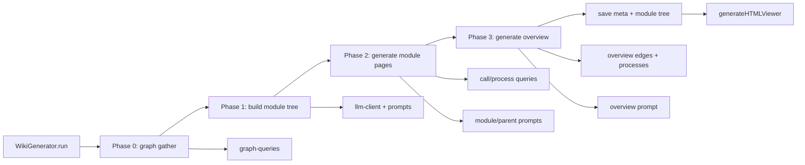
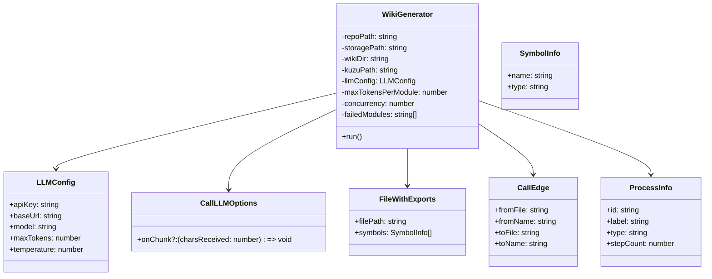
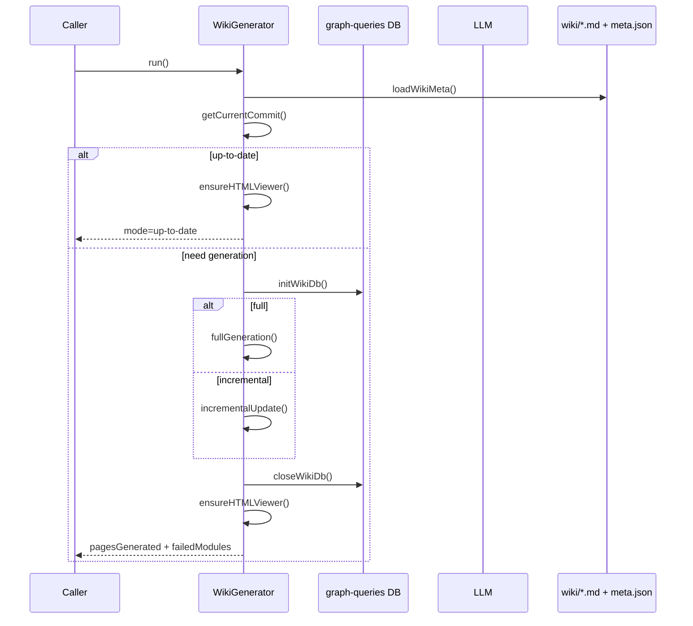
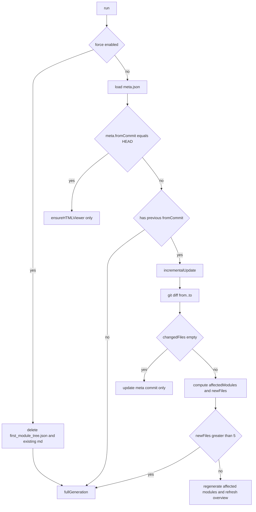

# wiki_generation_orchestrator 模块文档

## 1. 模块定位与存在意义

`wiki_generation_orchestrator`（对应实现文件 `gitnexus/src/core/wiki/generator.ts`）是 GitNexus Wiki 生成能力的总编排器。它不是“单次调用 LLM 生成一页文档”的简单封装，而是一个面向真实仓库场景的分阶段流水线控制器：先从知识图拿结构，再做模块分组，再按依赖顺序生成模块页面，最后汇总为项目总览，并在结束后产出离线 HTML 浏览器。

这个模块存在的核心原因是：源码仓库的文档生成不仅是自然语言任务，更是**数据准备、执行顺序、成本控制、失败恢复、增量更新**的综合工程问题。`WikiGenerator` 将这些问题收敛到一个稳定入口 `run()`，让 CLI、服务端或其他上层模块不必直接感知 LLM 调用细节、图查询细节和增量策略。

从系统位置看，它依赖 `core_ingestion_*` 与图存储阶段已经产出的知识图数据（文件、调用边、流程节点），并通过 `graph-queries` 读取这些结构化信息；再通过 `llm-client` 组织模型调用；最终把产物写入 `storagePath/wiki`，并交给 `offline_html_viewer` 产出可离线浏览的页面包。关于图数据与解析来源，请参考 [core_ingestion_parsing.md](core_ingestion_parsing.md)、[core_ingestion_resolution.md](core_ingestion_resolution.md)、[core_graph_types.md](core_graph_types.md)。

---

## 2. 核心数据模型

本模块对外暴露的数据类型非常少，但每个类型都承担了明确的流程契约。

### 2.1 `WikiOptions`

`WikiOptions` 是运行期配置入口，控制生成模式、模型上下文预算和并发行为：

```ts
export interface WikiOptions {
  force?: boolean;
  model?: string;
  baseUrl?: string;
  apiKey?: string;
  maxTokensPerModule?: number;
  concurrency?: number;
}
```

需要注意，`options.model/baseUrl/apiKey` 在当前 `WikiGenerator` 实现中并不会直接覆盖 `llmConfig`（构造函数里真正使用的是传入的 `llmConfig` 对象）；因此如果调用方希望切换模型，应优先在 `llmConfig` 层设置，而不是仅依赖 `WikiOptions` 同名字段。

### 2.2 `WikiMeta`

`WikiMeta` 是增量更新的状态快照，写入 `wiki/meta.json`：

```ts
export interface WikiMeta {
  fromCommit: string;
  generatedAt: string;
  model: string;
  moduleFiles: Record<string, string[]>;
  moduleTree: ModuleTreeNode[];
}
```

它的关键作用是把“上次文档对应的 Git commit”和“模块-文件映射”持久化，使后续可通过 `git diff` 精确定位受影响模块，而不是每次全量重跑。

### 2.3 `ModuleTreeNode`

`ModuleTreeNode` 是文档结构树节点：

```ts
export interface ModuleTreeNode {
  name: string;
  slug: string;
  files: string[];
  children?: ModuleTreeNode[];
}
```

它支持两层结构：叶子节点直接持有源码文件，父节点通过 `children` 汇总子模块文档。该结构服务于“先叶后父”的生成顺序。

---

## 3. 架构与组件关系

### 3.1 顶层架构图



这张图体现了两个重要设计点。第一，编排器始终把图查询与 LLM 调用穿插进行，而不是一次性把所有数据打包后再生成。这样可在每个阶段控制上下文大小。第二，HTML Viewer 构建被放在末尾统一执行，且在“仓库无变化”场景也会尝试补建，确保文档分发稳定。

### 3.2 组件依赖图（代码级）



`WikiGenerator` 本身是唯一状态机。`LLMConfig` 与 `CallLLMOptions` 描述模型调用参数和流式回调；`FileWithExports`、`CallEdge`、`ProcessInfo` 是查询层回传的结构化知识，分别用于模块划分、架构关系和流程描述增强。

---

## 4. 主流程：`run()` 如何驱动全链路

### 4.1 运行序列图



`run()` 的职责是执行模式决策与资源生命周期管理。它先准备目录并读取 `meta.json`，再根据 `force`、当前 commit、历史快照决定走全量、增量或直接返回。无论哪条分支，图数据库连接都通过 `try/finally` 保证 `closeWikiDb()` 被调用，避免资源泄漏。

### 4.2 返回值语义

`run()` 返回：

```ts
{ pagesGenerated: number; mode: 'full' | 'incremental' | 'up-to-date'; failedModules: string[] }
```

`pagesGenerated` 统计实际写入的新页面数量，不代表模块总数；例如页面已存在时会跳过并不计数。`failedModules` 会聚合阶段内失败节点，便于上层在日志或 UI 中提示“部分成功”。

---

## 5. 全量生成（`fullGeneration`）内部机制

全量流程分三阶段，与文件头注释描述一致。

### 5.1 Phase 0：收集结构

编排器通过 `getFilesWithExports()` 和 `getAllFiles()` 获得文件集合，然后用 `shouldIgnorePath()` 过滤非源码路径。这里的关键实现细节是“导出信息回填”：即把 `filesWithExports` 映射到 `allFiles`，没有导出符号的文件也会以 `symbols: []` 参与后续分组，从而避免“仅按导出文件建模块”导致的结构偏差。

若过滤后 `sourceFiles.length === 0`，会直接抛错终止：`No source files found in the knowledge graph...`。这通常意味着摄取阶段未完成或忽略规则过严。

### 5.2 Phase 1：构建模块树（一次 LLM 调用）

`buildModuleTree()` 会先尝试读取 `first_module_tree.json`。如果存在有效快照，就直接复用，支持断点恢复；否则触发新分组。

分组请求由以下上下文组成：

- `formatFileListForGrouping(files)`：文件及导出符号摘要
- `formatDirectoryTree(...)`：目录树文本
- `GROUPING_SYSTEM_PROMPT` + `GROUPING_USER_PROMPT`

LLM 返回后通过 `parseGroupingResponse()` 做强校验与降级：

1. 支持从 markdown fenced code block 提取 JSON。
2. JSON 解析失败则走 `fallbackGrouping()`（按顶层目录归组）。
3. 对每个模块路径去重并验证文件存在性。
4. 未分配文件强制落到 `Other` 模块。

随后执行 token 预算检查：`estimateModuleTokens(modulePaths)` 超过 `maxTokensPerModule` 且文件数大于 3 时，调用 `splitBySubdirectory()` 拆成子模块，并把父节点 `files` 置空。

### 5.3 Phase 2：生成模块页（先叶后父）

`flattenModuleTree()` 把模块树拆成 `leaves` 与 `parents`：

- 叶子模块可并发运行；
- 父模块依赖子文档，必须顺序运行。

叶子页由 `generateLeafPage()` 生成，输入由三部分拼接：源码文本、调用边、流程信息。父页由 `generateParentPage()` 生成，输入是子模块摘要 + 跨子模块调用 + 流程聚合。

### 5.4 Phase 3：生成总览页

`generateOverview(moduleTree)` 读取每个模块文档前部摘要，查询跨模块调用边与全局流程，再结合项目配置（`package.json`/`go.mod`/`README` 等）构造 overview prompt，最终写 `overview.md`。

### 5.5 收尾

最后写入：

- `module_tree.json`（当前模块树）
- `meta.json`（commit + 映射 + 模型）

并把进度推进到 `done:100`。

---

## 6. 增量更新（`incrementalUpdate`）策略

### 6.1 判定逻辑

增量入口依赖 `meta.fromCommit`。它调用：

- `git diff from..to --name-only`

若 diff 为空（例如 merge commit 但文件无变化），不会重生成页面，只更新 `meta.fromCommit` 与时间戳。

### 6.2 受影响模块定位

对每个 changed file：

- 若命中 `existingMeta.moduleFiles[mod]`，标记模块受影响；
- 若未命中且不是 ignored path，归为 `newFiles`。

当 `newFiles.length > 5` 时直接升级为全量（并删除 `first_module_tree.json` 强制重分组）；否则把新文件临时并入 `Other` 模块并局部重生成。

### 6.3 增量生成与总览回刷

受影响模块会先删除旧 `.md`，再并发调用叶页或父页生成逻辑。若至少有一页成功更新，则刷新 `overview.md`。最后更新 `meta.json`。

这个策略体现了“在速度与一致性之间保守取舍”：少量新文件不打断现有模块结构，大量新文件才触发重分组。

---

## 7. 关键函数深度解析

### 7.1 `generateLeafPage(node)`

该函数是最核心的页面生产单元。它会读取 `node.files` 对应源码，拼成带 `--- file ---` 分段的大文本。如果 token 超预算，则按字符截断（`maxTokens*4`）并追加提示语。

然后并行查询：

- `getIntraModuleCallEdges(filePaths)`
- `getInterModuleCallEdges(filePaths)`（incoming/outgoing）
- `getProcessesForFiles(filePaths, 5)`

再填充 `MODULE_USER_PROMPT` 调用 LLM，最终写入 `wiki/{slug}.md`。这里副作用主要是磁盘写入；读取失败文件会以内联提示 `(file not readable)` 保留在上下文中。

### 7.2 `generateParentPage(node)`

父模块不是直接看源码，而是消费子文档摘要。它尝试读取每个子页，并截取到 `### Architecture` 前，若不存在该标题则取前 800 字符。这样可减少父页 prompt 噪声，让模型聚焦“聚合层叙事”。

该设计隐含一个格式假设：子页应包含 `### Architecture`。如果提示词模板改动导致标题变化，父页摘要截取精度会下降（但不会中断）。

### 7.3 `runParallel(items, fn)`

这是模块并发执行的通用器，支持自适应降并发。若任务抛错且错误消息包含 `429`，会把 `activeConcurrency` 减 1（最小 1），提示进度并等待 5 秒后重试当前项（通过 `idx--` 回退）。

它不会在普通错误时 fail-fast，而是继续跑剩余项并返回已成功计数。这个策略和 `failedModules` 共同实现“尽量产出”。

### 7.4 `parseGroupingResponse(content, files)`

这是 LLM 不确定性防线。它做了三层稳态处理：

- 语法级：容忍 code fence；
- 结构级：要求 object 且 value 为数组；
- 语义级：文件必须真实存在且不能重复分配。

最后还会兜底 `fallbackGrouping`。因此即便模型输出质量很差，流程仍可继续。

### 7.5 `readProjectInfo()`

这个函数用于 overview 背景信息补全。它按固定优先级尝试项目配置文件，命中后即停止继续查找，仅使用第一份配置；再附加 README 片段。该实现轻量但偏保守，适合 prompt 成本敏感场景。

---

## 8. 进度上报与可观测性

`WikiGenerator` 支持注入 `ProgressCallback(phase, percent, detail)`。内部通过 `lastPercent` 防止流式 token 进度把百分比回退。`streamOpts(label, fixedPercent?)` 会把字符数近似转换为 token（`chars/4`）并上报 `phase='stream'`。

典型阶段包括：`init`、`gather`、`grouping`、`modules`、`overview`、`finalize`、`html`、`done`、`incremental`。上层 UI 若要显示稳定进度条，应以 percent 为主、phase/detail 为辅。

---

## 9. 文件产物与目录约定

模块默认写入 `${storagePath}/wiki`，关键文件如下：

- `overview.md`：项目总览
- `{module-slug}.md`：模块页
- `module_tree.json`：当前模块树
- `first_module_tree.json`：首次分组快照（用于恢复）
- `meta.json`：增量元数据

`ensureHTMLViewer()` 会在目录中存在任意 `.md` 文件时构建离线 HTML 包。HTML 细节请参考 [offline_html_viewer.md](offline_html_viewer.md)（若该文档尚未生成，可先参考 `core_wiki_generator` 总文档）。

---

## 10. 使用方式与配置示例

### 10.1 基本调用

```ts
import { WikiGenerator } from 'gitnexus/src/core/wiki/generator';

const generator = new WikiGenerator(
  '/path/to/repo',          // repoPath
  '/path/to/storage',       // storagePath
  '/path/to/kuzu',          // kuzuPath
  {
    apiKey: process.env.LLM_API_KEY!,
    baseUrl: 'https://api.openai.com/v1',
    model: 'gpt-4.1-mini',
    maxTokens: 8192,
    temperature: 0.2,
  },
  {
    force: false,
    maxTokensPerModule: 30000,
    concurrency: 3,
  },
  (phase, percent, detail) => {
    console.log(`[${phase}] ${percent}% ${detail ?? ''}`);
  },
);

const result = await generator.run();
console.log(result);
```

### 10.2 强制全量重建

```ts
const generator = new WikiGenerator(repoPath, storagePath, kuzuPath, llmConfig, {
  force: true,
  concurrency: 2,
});
await generator.run();
```

`force: true` 会删除 `first_module_tree.json` 与已有 `.md` 页面，触发重新分组与重生成。

### 10.3 调参建议

如果遇到频繁 429，优先降低 `concurrency`；如果模块文档质量偏低且出现明显截断，提升 `maxTokensPerModule`。若仓库体量大，建议先优化忽略规则（`ignore-service`）和摄取质量，而不是无限增大上下文。

---

## 11. 扩展点与二次开发建议

### 11.1 可安全扩展的点

最推荐的扩展点是提示词与格式化器：`prompts.ts` 中的 `*_SYSTEM_PROMPT`、`*_USER_PROMPT`、`format*` 系列函数。这样可以改文风、章节结构、图表策略，而不破坏编排流程。

其次可以扩展 `readProjectInfo()` 的配置识别列表（如 `nx.json`、`turbo.json`、`settings.gradle`），提升 overview 背景质量。

### 11.2 需要谨慎修改的点

`slugify()` 与 `findNodeBySlug()` 影响增量定位。如果修改 slug 规则，历史 `meta.moduleFiles` 和页面文件名可能失配，导致增量漏更新或重复页。此类改动应配合迁移脚本或强制全量重建。

`runParallel()` 的重试机制目前以错误消息包含 `429` 为判据，若替换 LLM client 的错误结构，应同步更新判定逻辑，否则自适应降并发会失效。

---

## 12. 边界条件、错误与限制

### 12.1 关键边界条件

- 当前仓库若不在 Git 环境，`getCurrentCommit()` 会返回空字符串，增量语义将退化。
- `git diff` 执行失败时返回空列表，增量更新可能被误判为“无变化”。
- 源码读取失败不会中断模块生成，但会降低文档质量。
- 父页和总览页摘要依赖固定标题 `### Architecture`，模板变更可能影响摘要截取。

### 12.2 已知限制

- 模块树深度实际仅两层（父/子）；不支持任意深层树递归生成策略。
- token 预算控制是粗略字符截断，不是语义压缩；长文件前部偏置明显。
- 新文件在增量模式下默认归入 `Other`，直到触发全量重分组。
- `WikiOptions.model/baseUrl/apiKey` 目前未直接生效（依赖 `llmConfig`）。

### 12.3 失败恢复特性

- `first_module_tree.json` 使分组阶段具备恢复能力。
- 页面级失败不会阻断全局流程，`failedModules` 会回传。
- `ensureHTMLViewer()` 在结束时统一执行，减少“md 生成成功但 HTML 缺失”的不一致。

---

## 13. 与其他模块的关系（避免重复）

本模块不负责底层图查询 SQL/Kùzu 细节，也不负责 LLM API 协议适配。建议结合以下文档阅读：

- [core_wiki_generator.md](core_wiki_generator.md)：Wiki 子系统总览（若已生成）
- [graph_query_layer.md](graph_query_layer.md)：`getFilesWithExports`、`getInterModuleEdgesForOverview` 等查询接口语义
- [llm_client_and_config.md](llm_client_and_config.md)：`callLLM`、token 估算与错误行为
- [offline_html_viewer.md](offline_html_viewer.md)：HTML 打包与前端浏览器行为
- [core_ingestion_parsing.md](core_ingestion_parsing.md)、[core_ingestion_resolution.md](core_ingestion_resolution.md)：上游数据质量来源

通过上述分层阅读，可以把“数据如何来、文档如何生成、结果如何呈现”连成完整链路。


---

## 14. `WikiGenerator` 方法级 API 参考（参数 / 返回值 / 副作用）

本节作为维护者速查，聚焦 `WikiGenerator` 中最重要的方法契约。为避免与前文重复，这里强调输入输出与副作用边界。

### 14.1 `constructor(...)`

构造签名：

```ts
new WikiGenerator(
  repoPath: string,
  storagePath: string,
  kuzuPath: string,
  llmConfig: LLMConfig,
  options?: WikiOptions,
  onProgress?: ProgressCallback,
)
```

`repoPath` 是 Git 仓库根目录，用于读取源码与执行 Git 命令；`storagePath` 是文档输出根目录，内部会固定落到 `${storagePath}/wiki`；`kuzuPath` 指向图数据库路径；`llmConfig` 是模型调用硬配置；`options` 控制强制重建、并发与 token 预算；`onProgress` 用于向上层持续上报阶段进度。

该构造函数的一个实现细节是会包装 `onProgress`，并维护 `lastPercent`，以避免流式输出阶段把进度条“回拉”。

### 14.2 `run()`

签名：

```ts
run(): Promise<{
  pagesGenerated: number;
  mode: 'full' | 'incremental' | 'up-to-date';
  failedModules: string[];
}>
```

`run()` 是唯一公开执行入口。它负责目录准备、模式判定、图数据库生命周期（`initWikiDb/closeWikiDb`）、生成流程调用和 HTML viewer 收尾。副作用包括创建/覆盖 wiki 目录下的 markdown、json 及 HTML 产物。

### 14.3 `fullGeneration(currentCommit)`

该方法总是执行完整三阶段生成。返回 `mode: 'full'` 与实际生成页数。副作用包括覆盖模块页、总览页、`module_tree.json`、`meta.json`，并可能更新 `first_module_tree.json`。

如果图中无可用源码文件，会直接抛错终止（调用方应捕获并提示上游先完成 ingestion）。

### 14.4 `incrementalUpdate(existingMeta, currentCommit)`

该方法基于 `meta.json` 和 `git diff` 结果做局部刷新。它只重建受影响模块，且在“新增文件很多”时自动退化为全量重建（阈值为 `newFiles.length > 5`）。

副作用主要是删除并重写受影响模块页、按需回刷 `overview.md`，并更新 `meta.json` 的 commit 与时间戳。

### 14.5 `buildModuleTree(files)` 与 `parseGroupingResponse(content, files)`

`buildModuleTree` 负责模块树生成与快照复用；`parseGroupingResponse` 负责把 LLM 输出变成可执行分组。二者组合体现了“先信任模型，再做严格验证，再做 deterministic fallback”的策略。

当模型输出不可解析或不完整时，系统会自动回退到按顶层目录分组，不会因为单次模型失败导致全流程中断。

### 14.6 `generateLeafPage(node)` / `generateParentPage(node)` / `generateOverview(moduleTree)`

这三者分别对应叶模块、父模块和全局总览的文档生成。它们共同副作用是写 markdown 文件，并依赖图查询补充结构化上下文（调用边、流程）。

其中 `generateParentPage` 与 `generateOverview` 都依赖“从现有 markdown 抽取前部摘要”的策略，因此文档模板大幅变化时要同时检查摘要提取逻辑。

### 14.7 `runParallel(items, fn)`

该方法返回成功任务累计值（由 `fn` 返回的 number 求和），而不是任务结果数组。这意味着它更像“计数器执行器”而非通用 promise 池。

它对 429 做了自适应降并发并重试当前项，但对其他错误采取“跳过继续”策略。因此若你在二次开发中需要强一致（任一失败即中断），应新增 fail-fast 模式而不是直接复用当前实现。

### 14.8 元数据与文件工具方法

`loadWikiMeta/saveWikiMeta/saveModuleTree/fileExists` 组成最小持久化层；`slugify/findNodeBySlug/extractModuleFiles/countModules/flattenModuleTree` 组成模块树操作层；`getCurrentCommit/getChangedFiles` 提供 Git 变更探测。

这些方法都相对内聚，适合作为单元测试切入点：例如对 `parseGroupingResponse`、`slugify`、`extractModuleFiles` 进行快照测试，可以显著降低增量逻辑回归风险。

---

## 15. 增量/全量决策流程图（运维视角）



这个流程图对应生产环境最常见的诊断路径：如果用户抱怨“为什么没有重建文档”，先看 `force` 与 commit 比较；如果抱怨“为什么突然全量重跑”，再看 `newFiles` 阈值是否被触发。

---

## 16. 维护建议：测试与发布检查清单

在持续演进该模块时，建议把以下检查纳入 CI 或发布前脚本：

- 用固定仓库样本做一次 full run，校验 `overview.md`、`meta.json`、`module_tree.json` 都已生成。
- 在同一仓库提交一次小改动，验证 incremental 仅重建受影响模块。
- 构造 LLM 非法 JSON 输出（mock `callLLM`），验证 `fallbackGrouping` 生效。
- 构造 429 错误（mock `callLLM` 抛错），验证 `runParallel` 会降并发并重试。
- 构造不可读文件，确认页面仍可生成且包含 `(file not readable)` 提示。

这组测试覆盖了该编排器最关键的四个可靠性目标：可恢复、可降级、可增量、可观察。
