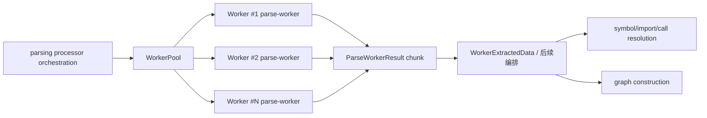
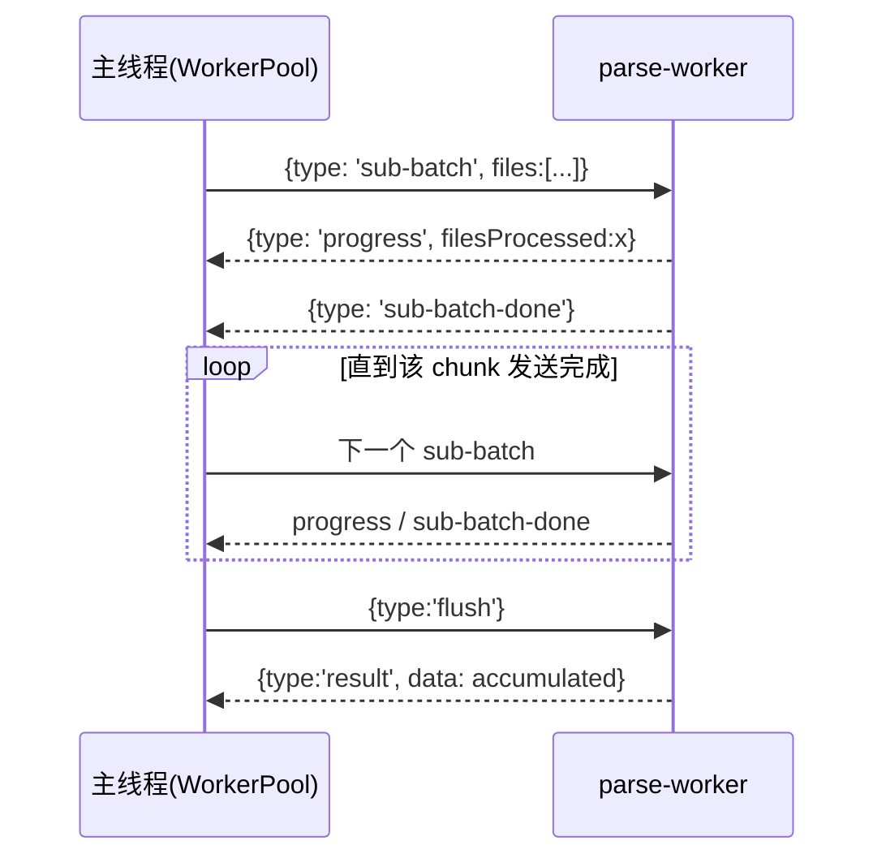
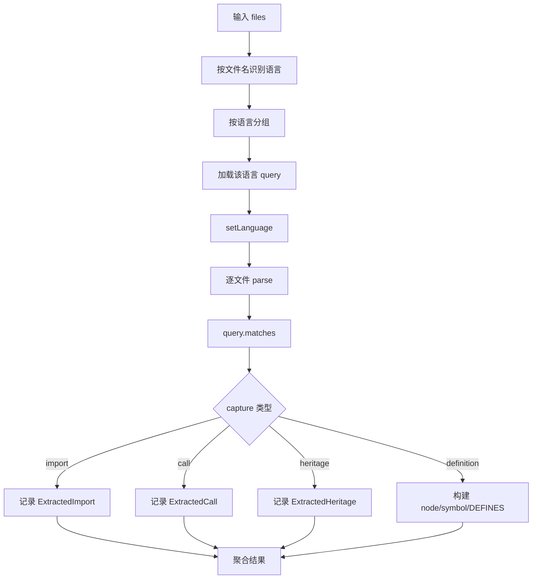

# workers_parsing 模块文档

## 模块概述

`workers_parsing` 是 GitNexus 代码摄取（ingestion）流水线中“语法解析并提取结构化事实”的并行执行层。它的核心目标不是做语义级别的全量解析与解析后推理，而是以**高吞吐、可跨语言、可在大仓库运行**为优先，将源码快速转为一组可序列化的中间结果：代码节点（nodes）、文件到符号的定义关系（DEFINES）、符号索引（symbols）、导入语句（imports）、调用点（calls）与继承/实现关系（heritage）。

该模块之所以独立存在，是因为解析阶段是整个知识图谱构建链路中最容易成为性能瓶颈和内存热点的环节。单线程处理大型多语言仓库时，会出现 CPU 饱和、AST 对象生命周期过长、消息传输放大等问题。`workers_parsing` 通过 `worker_threads` + 子批次（sub-batch）分发策略把风险拆散：主线程负责调度和聚合，worker 线程专注解析与提取，从而在保证结果一致性的同时显著提高吞吐并降低峰值内存。

从系统位置看，该模块位于 `core_ingestion_parsing` 内部，向上被解析编排层消费（可参考 [parsing_processor_orchestration.md](parsing_processor_orchestration.md)），向下依赖 Tree-sitter 语言语法与查询规则。它输出的数据会进入后续解析/解析后处理模块，例如符号解析、调用解析、导入解析（可参考 [core_ingestion_resolution.md](core_ingestion_resolution.md)）以及图谱实体组装（可参考 [core_graph_types.md](core_graph_types.md)）。

---

## 核心设计目标与设计取舍

该模块体现了一个非常明确的工程取舍：优先选择“稳定可扩展的结构抽取”，而不是“昂贵且高度语言特化的深度语义理解”。它依赖 `LANGUAGE_QUERIES` 的 capture 约定进行模式匹配，能够快速覆盖多种语言，但也意味着抽取能力受查询表达能力和语法树形态影响。

设计上另一个关键点是“可流式的 worker 协作协议”。worker 不要求一次吞下整个 chunk，而是支持 `sub-batch -> sub-batch-done -> flush` 的往返流程，使主线程可以在固定上限内输送任务，避免一次 `postMessage` 复制过大的对象图。在超大仓库里，这个机制比单次分发更稳健，配合超时和退出检测可以更早暴露病理文件或 native 侧异常。

---

## 组件与职责

### 1) `parse-worker.ts`：单 worker 内的解析与抽取执行器

该文件定义了 worker 进程内全部解析逻辑，包括输入输出类型、语言设置、Tree-sitter 匹配流程、导入/调用/继承抽取、符号节点构建，以及消息协议处理。

#### `ParseWorkerInput`

`ParseWorkerInput` 是最小输入单元，包含：

- `path: string`：文件路径，用于语言识别、ID 生成与结果归属。
- `content: string`：文件源码文本。

它故意不携带更多上下文，目的是降低结构化克隆成本，并让 worker 成为“纯函数式解析器”（输入文件文本，输出抽取结果）。

#### `ParseWorkerResult`

`ParseWorkerResult` 是 worker 的聚合输出。字段含义如下：

- `nodes: ParsedNode[]`：抽取出的代码元素节点（函数、类、接口、方法等）。
- `relationships: ParsedRelationship[]`：目前主要是 `File --DEFINES--> Symbol`。
- `symbols: ParsedSymbol[]`：符号索引条目，便于后续解析器按名称和文件定位节点。
- `imports: ExtractedImport[]`：原始导入路径信息（未解析到绝对目标）。
- `calls: ExtractedCall[]`：调用点信息，记录调用名与调用源上下文。
- `heritage: ExtractedHeritage[]`：继承、实现、trait 关系。
- `fileCount: number`：成功完成解析流程计数的文件数（跳过/失败文件不会计入）。

#### `ParsedNode`

`ParsedNode` 对应图谱中的代码实体原型。其 `properties` 含：

- `name`：符号名。
- `filePath`：定义所在文件。
- `startLine` / `endLine`：来自 name node 的行号（注意是 Tree-sitter row，通常为 0-based）。
- `language`：识别到的语言。
- `isExported`：语言特化导出可见性判定结果。
- `description?`：可选补充描述，当前主要用于 PHP Eloquent 元信息。

#### `ParsedRelationship`

当前固定 `type: 'DEFINES'`，表示文件定义了该节点；`confidence` 固定 1.0；`reason` 当前为空字符串。它为后续图构建提供最基础的归属边。

#### `ParsedSymbol`

符号索引行，记录 `filePath + name + nodeId + type`，供后续 symbol table / 调用解析阶段进行二次关联。

#### `ExtractedImport` / `ExtractedCall` / `ExtractedHeritage`

这三类是“未最终解析的事实记录”：

- `ExtractedImport` 保存原始 import path，不在本模块做路径解析。
- `ExtractedCall` 保存调用名与源函数（或文件级 fallback）。
- `ExtractedHeritage` 保存类-父类/接口/trait 的关系文本。

它们都属于“先抽取，后解析”的分层设计，避免在 worker 内叠加高复杂度语义推断。

---

### 2) `worker-pool.ts`：多 worker 调度与容错封装

`WorkerPool` 是主线程侧并行执行接口，定义如下能力：

- `dispatch<TInput, TResult>(items, onProgress?)`：将输入切块分发到多个 worker，按子批次发送并收集每个 worker 的结果。
- `terminate()`：显式终止所有 worker（必须在调用方生命周期结束时执行）。
- `size`：worker 数量。

`createWorkerPool(workerUrl, poolSize?)` 的默认并发策略是 `min(8, max(1, cpu-1))`，即预留一个核心给主线程/系统，且总 worker 不超过 8。这个上限是稳定性与吞吐之间的经验折中。

此外它内置两个重要常量：

- `SUB_BATCH_SIZE = 1500`：每次发送给 worker 的子批次条目上限。
- `SUB_BATCH_TIMEOUT_MS = 30000`：单子批次超时时间，超时即失败。

这让模块面对极端文件（超大、异常语法、解析器退化场景）时可以尽快失败而不是无限等待。

---

## 架构关系



上图体现的是“编排层 -> 并行解析层 -> 后续解析层”的链路。`workers_parsing` 不负责最终图关系推断，而是提供高质量原始事实。这样做的好处是：如果未来要增强导入解析策略或调用分派算法，不需要重写解析 worker，只需在后续模块演进。

---

## Worker 协议与时序



这个协议比“一次性发送 chunk，等待最终结果”更安全。主线程能按节奏驱动 worker，worker 则通过 `accumulated` 聚合跨子批次结果，最终在 `flush` 时统一返回。对调用方来说，仍然保持每个 worker 对应一个结果块的心智模型。

---

## 解析流程（`processBatch` 与 `processFileGroup`）



`processBatch` 先按语言聚类，减少 `parser.setLanguage` 的频繁切换。对于 TypeScript 特殊处理 `.tsx`，因为其 grammar 不同。每个语言组交给 `processFileGroup` 执行。

`processFileGroup` 内部首先编译 query（`new Parser.Query(lang, queryString)`），然后逐文件：

1. 跳过超过 512KB 的文件（防止 OOM / 解析退化）。
2. 用 `parser.parse` 构建语法树（带 `bufferSize` 参数）。
3. `query.matches(rootNode)` 获取 capture 匹配。
4. 逐 match 依据 capture 类型提取 import/call/heritage 或 definition。
5. 对 definition 生成 node + symbol + DEFINES 关系。

当捕获到错误（query 编译失败、parse 异常、matches 异常）时，函数按“跳过当前单位”策略处理，尽可能继续后续文件，避免全批次中断。

---

## 关键内部机制详解

### 多语言 grammar 切换与 TSX 分支

`languageMap` 将 `SupportedLanguages` 映射到对应 Tree-sitter grammar。TypeScript 普通文件用 `TypeScript.typescript`，TSX 文件用 `TypeScript.tsx`。`setLanguage` 根据后缀选择 key 并设置 parser 语言，若映射缺失则抛错。

这意味着语言扩展的第一步是确保三件事一致：`SupportedLanguages`、`getLanguageFromFilename`、`LANGUAGE_QUERIES`。三者缺一都会导致该语言文件被跳过或无法匹配。

### 导出判定 `isNodeExported`

该函数是语言特化的可见性启发式：

- JS/TS：向上遍历 parent，识别 export 相关节点或文本前缀。
- Python：非 `_` 前缀视作导出。
- Java/C#/Rust：查找 `public` / `pub` 相关修饰节点。
- Go：首字母大写导出。
- C/C++：固定 false。
- PHP：类/接口/trait 顶层默认可达；成员要 `public`；顶层函数默认可访问。

这是实用主义策略，不保证 100% 语义精确，但对全仓库索引场景有效。

### 调用归属 `findEnclosingFunctionId`

调用提取不只记录被调用名，还要记录“是谁调用的”。该函数从 call 节点向上爬 AST，遇到函数/方法类节点就推断名称，并生成 `generateId(label, filePath:name)`。如果找不到函数上下文，则降级为文件级 `generateId('File', filePath)`。

这使后续 call resolution 能在“函数内调用”和“顶层调用”之间做区分。

### 噪声过滤 `BUILT_INS`

`BUILT_INS` 是一个跨语言内建符号黑名单，用于过滤常见标准库/API/宏调用，减少无意义调用边。它覆盖 JS/TS、Python、C/C++、Linux kernel 宏、PHP 常见函数。

注意它是静态集合，存在误杀/漏网的自然风险：

- 误杀：业务代码恰好与 built-in 同名。
- 漏网：某语言/框架未加入集合。

通常应在后续模块中结合符号表与导入解析再二次修正。

### PHP Eloquent 增强提取

模块对 PHP 增加了领域特化信息：

1. `extractPhpPropertyDescription`：针对 `fillable`、`casts`、`hidden` 等数组属性提取值并拼接为描述文本。
2. `extractEloquentRelationDescription`：检测 `$this->hasMany(...)` 等关系方法，提取关系类型和目标模型，写入方法节点的 `description`。

这部分并非通用语义系统，而是针对常见 Laravel 项目做可检索增强，对知识图谱“业务关系理解”很有价值。

---

## 与其他模块的边界

`workers_parsing` 只负责“提取事实”，不负责“解释事实”。为避免重复，本节只描述边界：

- 与文件扫描的衔接（输入来源）：参考 [filesystem_scanning_and_loading.md](filesystem_scanning_and_loading.md)。
- 与 AST 缓存策略（是否重用 AST）：参考 [ast_cache_management.md](ast_cache_management.md)。
- 与编排层数据契约（`WorkerExtractedData` 聚合）：参考 [parsing_processor_orchestration.md](parsing_processor_orchestration.md)。
- 与符号/导入/调用解析：参考 [core_ingestion_resolution.md](core_ingestion_resolution.md)。
- 与图结构落地类型：参考 [core_graph_types.md](core_graph_types.md)。

---

## 使用方式

### 创建并调度 WorkerPool

```ts
import { createWorkerPool } from './worker-pool.js';

const pool = createWorkerPool(new URL('./parse-worker.js', import.meta.url));

try {
  const results = await pool.dispatch(files, (processed) => {
    console.log(`processed: ${processed}`);
  });

  // results: 每个 worker 返回一个 ParseWorkerResult
  // 你可以在上层进行 merge
} finally {
  await pool.terminate();
}
```

典型实践是在调用方把扫描到的 `ScannedFile` 映射为 `{path, content}` 列表后直接 dispatch。务必在结束时 `terminate()`，否则进程可能因活动 worker 句柄无法退出。

### 处理 worker 返回协议（如果你自定义调度器）

若不使用现成 `WorkerPool`，你需要理解 parse-worker 支持三种输入模式：

- 子批次模式：`{type:'sub-batch', files:[...]}` + `flush`。
- flush：`{type:'flush'}` 返回累计结果。
- 兼容模式：直接发送 `ParseWorkerInput[]`，返回单次结果。

推荐优先使用子批次模式以控制内存。

---

## 配置与可扩展点

### 并发与吞吐调优

你可以通过 `createWorkerPool(workerUrl, poolSize)` 显式设置 worker 数。经验上：

- CPU 密集型仓库可提高到接近核心数；
- 内存敏感环境建议降低并发；
- 若频繁 timeout，可尝试减小 `SUB_BATCH_SIZE` 或在上游过滤超大文件。

### 增加新语言支持

最小改动路径：

1. 在 `SupportedLanguages` 增加枚举值；
2. 在 `getLanguageFromFilename` 增加后缀映射；
3. 在 `languageMap` 绑定 Tree-sitter grammar；
4. 在 `LANGUAGE_QUERIES` 增加 capture 规则；
5. 如有导出语义差异，在 `isNodeExported` 增加分支。

### 自定义提取规则

如果你要增加新的事实类型（例如 annotation、decorator、SQL query usage），建议沿用当前 capture 约定风格，在 `processFileGroup` 增加独立分支，并确保返回结构可序列化、可跨线程传输。

---

## 边界条件、错误处理与已知限制

### 1) 大文件跳过

超过 512KB 的文件直接跳过，不计入 `fileCount`。这降低了崩溃风险，但会造成覆盖率缺口，尤其在包含生成代码或 bundle 的仓库中。

### 2) Query/Parse 容错偏“静默跳过”

query 编译失败、parse 异常、match 异常多数情况下仅 `continue`，不会中断整个批次。优点是鲁棒；缺点是问题可能被“吞掉”。建议在上层增加统计日志（如失败文件计数）。

### 3) 行号语义

`startLine/endLine` 取自 Tree-sitter `row`，通常从 0 开始。若 UI 需要 1-based 显示，需在展示层转换。

### 4) ID 唯一性依赖命名约定

`generateId(label, filePath:name)` 依赖“同文件内同类型同名不冲突”的假设。对重载、局部同名、匿名函数等场景可能出现语义折叠，后续模块需要结合更多上下文消解。

### 5) 调用抽取是名字级别

`ExtractedCall.calledName` 只有文本名，不含签名和完整限定名，天然存在多义性。后续 call resolver 需要基于符号表、导入路径、作用域规则做二次推断。

### 6) BUILT_INS 黑名单不可避免误差

静态黑名单会在不同项目中产生误判。若你关注高精度调用图，建议把 built-in 过滤策略下沉到可配置层或按语言拆分配置。

### 7) 子批次超时即失败

`SUB_BATCH_TIMEOUT_MS` 触发后会 reject 当前 worker promise。若 orchestration 未实现重试/降级，该批任务会整体失败。建议在上层实现“超时后切更小批次重试”的恢复策略。

### 8) Worker 异常退出

`exit` 非正常返回会报错提示可能 OOM/native addon failure。实践中应结合进程内存监控与文件大小分布做问题定位。

---

## 维护建议

在长期维护中，建议重点关注三类演进：

首先是语言覆盖演进。每增加一种语言，除了 grammar 与 query，还要补导出判定和函数归属规则，否则 `isExported` 与 `sourceId` 质量会明显下降。

其次是可观测性。当前模块强调容错，但对“被跳过/失败原因”的显式暴露较少。建议在不破坏性能的前提下引入采样日志或统计指标（解析失败数、query 失败数、超时数、每语言吞吐）。

最后是协议稳定性。`parse-worker` 兼容旧模式是好事，但新功能应优先基于子批次协议扩展，避免回退到大对象单次传输。

---

## 最小心智模型总结

可以把 `workers_parsing` 理解为：

1. 把文件按语言分组后交给多线程 Tree-sitter；
2. 用查询规则抽取“定义/导入/调用/继承”等事实；
3. 用子批次协议在稳定内存范围内回传聚合结果；
4. 把复杂语义解析留给后续模块。

这个模块的价值不在“最聪明”，而在“足够快、足够稳、足够可扩展”，它是整个知识图谱摄取链路的基础吞吐层。
