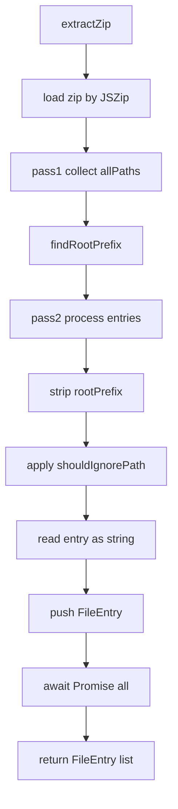
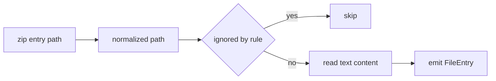
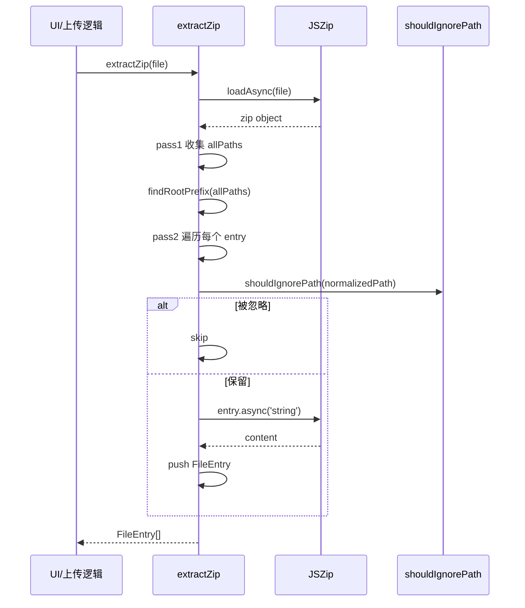
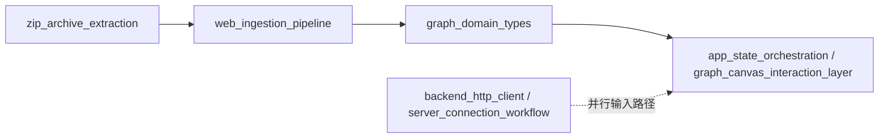

# zip_archive_extraction 模块文档

## 1. 模块定位与设计动机

`zip_archive_extraction` 对应实现文件 `gitnexus-web/src/services/zip.ts`，核心职责是把用户上传的 ZIP 压缩包解析为前端可直接消费的源码文件列表（`FileEntry[]`）。它解决的不是“下载 ZIP”问题，而是“把 ZIP 中混杂的目录结构和噪声文件转换成统一、可分析的源码输入”问题，尤其适用于 Web 端离线分析或本地导入代码库的场景。

该模块存在的关键原因是：真实世界 ZIP（尤其来自 GitHub 的 `Download ZIP`）通常包含一个顶层包装目录（例如 `repo-main/`），如果不做规范化，后续分析流程会拿到带环境相关前缀的路径，导致路径映射、去重、忽略规则和 UI 展示出现不一致。`zip.ts` 通过“自动识别并剥离公共根前缀 + 路径忽略策略 + 并发文本提取”的组合，给上层返回稳定的 `{ path, content }` 结构。

从系统层级看，它属于 `web_backend_services` 子域中的输入预处理能力。与 [backend_http_client.md](backend_http_client.md) 和 [server_connection_workflow.md](server_connection_workflow.md) 的网络拉取路线不同，本模块提供的是“本地 ZIP 导入”路线：不依赖后端 API，直接在浏览器端完成文件展开与筛选。

---

## 2. 核心数据契约：`FileEntry`

模块导出核心类型如下：

```ts
export interface FileEntry {
    path: string;
    content: string;
}
```

这个契约非常精简，但语义明确。`path` 是规范化后的相对路径（可能已剥离 ZIP 公共根目录），`content` 是按字符串解码后的文件文本。该结构通常会被后续 ingestion 或分析流程转成更高层的文件节点/AST 输入，因此它承担了“ZIP 世界”和“源码分析世界”之间的最小桥梁角色。

需要注意这里不携带二进制标记、编码元信息或文件大小，这意味着该模块默认面向“可作为文本读取的源码与配置文件”。

---

## 3. 模块内部架构



该架构反映了一个重要实现决策：模块采用“两阶段遍历”。第一阶段只为了推断路径公共前缀；第二阶段才做内容解码与过滤。这样做避免了边解码边猜测路径导致的复杂回滚逻辑，也避免在不知道最终规范路径前就把数据写入结果集。

---

## 4. 关键函数详解

## 4.1 `findRootPrefix(paths: string[]): string`

该函数用于识别 ZIP 中是否存在统一顶层目录前缀。它的输入是所有非目录条目的相对路径，输出是类似 `"repo-main/"` 的可剥离前缀，若无法确定则返回空字符串。

处理逻辑是：先筛选出包含 `/` 的路径，再提取每个路径的第一个 segment；如果所有 segment 完全相同，就认定这个 segment 为公共根目录并返回 `segment + '/'`。否则返回空。

```ts
const rootPrefix = findRootPrefix([
  'myrepo-main/src/index.ts',
  'myrepo-main/package.json'
]);
// => "myrepo-main/"
```

该算法的好处是简单、可解释、对 GitHub ZIP 兼容性强；限制是它假设“统一根目录”可以由首段全等判定。对于结构不规则的 ZIP（例如一部分文件在根下，一部分在子目录下），函数会返回空字符串，从而保持原路径，不做激进裁剪。

## 4.2 `extractZip(file: File): Promise<FileEntry[]>`

这是模块的主入口。它接收浏览器 `File` 对象，异步返回解析后的 `FileEntry[]`。

内部流程可以分解为四步：

1. 使用 `JSZip.loadAsync(file)` 读取压缩包索引。
2. 第一次 `zip.forEach` 收集所有文件路径，调用 `findRootPrefix` 计算公共根目录。
3. 第二次 `zip.forEach` 并发执行 `processEntry`：目录项跳过、路径归一化、忽略规则过滤、读取文本内容。
4. `await Promise.all(promises)` 后返回最终文件数组。

函数签名：

```ts
export const extractZip = async (file: File): Promise<FileEntry[]>
```

返回值行为：

- 成功时返回已过滤、已规范路径的文本文件列表。
- 若 ZIP 解析失败或某个条目读取失败，`Promise.all` 会整体 reject（即当前实现为 fail-fast）。

副作用主要是内存占用增长（文件内容加载到 `string` 并存入数组），不涉及持久化写盘。

---

## 5. 与忽略策略模块的协作

`zip.ts` 在处理每个文件时调用 `shouldIgnorePath(normalizedPath)`（来自 `../config/ignore-service`）。这意味着 ZIP 提取不是“全量展开”，而是依赖统一的忽略策略来屏蔽无价值或高噪声文件。

根据当前实现，`shouldIgnorePath` 会综合路径段、精确文件名、扩展名、复合扩展名及生成文件命名模式进行判定，例如会过滤 `node_modules` 路径段、常见产物扩展、以及类似 `.bundle.` / `.generated.` / `.d.ts` 这类文件。这样能显著降低后续分析负担。



因为忽略规则集中在 `ignore-service`，扩展过滤策略时不应直接改 `zip.ts`，而应优先在忽略模块演进规则，以保证“本地扫描”“ZIP 导入”等多入口保持一致语义。

---

## 6. 处理流程时序图



这个时序强调了一点：路径标准化发生在忽略判定之前。换言之，忽略规则看到的是“去根后的路径”，这能避免 ZIP 来源差异（比如根目录名不同）影响过滤结果。

---

## 7. 使用方式与示例

在前端上传流程中，通常将 `<input type="file">` 选中的 ZIP 文件传给 `extractZip`：

```ts
import { extractZip } from '@/services/zip';

async function onZipSelected(file: File) {
  const entries = await extractZip(file);

  // entries: FileEntry[]
  // 可送入后续解析/索引流程
  for (const entry of entries) {
    console.log(entry.path, entry.content.slice(0, 80));
  }
}
```

如果你的上层流程只处理特定语言，也可以在 `extractZip` 之后追加二次过滤，而不是改动模块内部通用逻辑：

```ts
const tsFiles = entries.filter(e => e.path.endsWith('.ts') || e.path.endsWith('.tsx'));
```

这种“模块内做通用净化，模块外做业务筛选”的分层方式更利于维护。

---

## 8. 边界条件、错误处理与限制

当前实现总体稳健，但有几个值得开发者特别关注的行为约束。

第一，`findRootPrefix` 只在“所有文件首段一致”时剥离根目录。如果 ZIP 结构混杂，它会保留原路径，不会做部分裁剪。这是保守设计，优点是不会误删路径信息，代价是某些 ZIP 可能仍带一层前缀。

第二，`entry.async('string')` 强制按字符串读取条目。对于二进制文件（图片、压缩包嵌套、字体等），即使未被忽略，也可能得到不可用文本或增加不必要内存压力。通常应依赖 `shouldIgnorePath` 尽量提前过滤非源码文件。

第三，当前并发策略是“为每个 entry 创建 Promise 并 `Promise.all`”。对于超大 ZIP，这会在短时间内触发大量并发解码，可能导致浏览器内存峰值升高。若未来出现大仓库导入卡顿，可考虑改为并发池/分批处理。

第四，错误处理是 fail-fast 模式：任一文件读取异常会导致整个 `extractZip` reject，而不是跳过坏文件继续。这个策略有利于暴露数据完整性问题，但在“尽力导入”场景下可能过于严格。

第五，返回数组的顺序依赖 `zip.forEach` 与异步完成时机。由于 `files.push(...)` 在异步任务完成后执行，最终顺序不保证与 ZIP 原顺序完全一致。如果调用方需要稳定排序，建议按 `path` 显式排序。

---

## 9. 可扩展点与演进建议

如果要扩展该模块，建议沿着以下方向演进而不是直接堆积条件分支。

- 当需要保留更多元信息时，可把 `FileEntry` 扩展为包含 `size`、`encoding`、`isBinary` 等字段，并在不破坏现有调用方的前提下新增可选属性。
- 当需要提升大文件体验时，可引入受控并发（例如一次只解码 N 个条目），降低峰值内存和主线程阻塞。
- 当需要容错导入时，可将失败文件收集到 `errors` 字段，返回 `success + partial failures` 结构，而不是直接抛错终止。
- 当需要严格可重复结果时，可在返回前对 `files` 做路径排序。

这些改造都应保持模块的核心边界：它是 ZIP 到文本文件列表的适配层，不应承担 AST 解析、语义索引或图构建职责。相关下游能力请参考 [web_ingestion_pipeline.md](web_ingestion_pipeline.md) 与 [graph_domain_types.md](graph_domain_types.md)。

---

## 10. 与系统其他模块的关系（避免重复阅读路径）

如果你正在梳理完整“代码导入到分析”的链路，建议按下面顺序阅读文档：先读本模块理解 ZIP 输入规整，再读 ingestion 与图类型模块，最后读 UI 状态与渲染。



其中虚线表示另一条“远程服务加载”路径：它与 ZIP 导入在上层状态汇合，但前置数据来源不同。通过这种分层，系统既支持本地离线导入，也支持后端在线拉取。