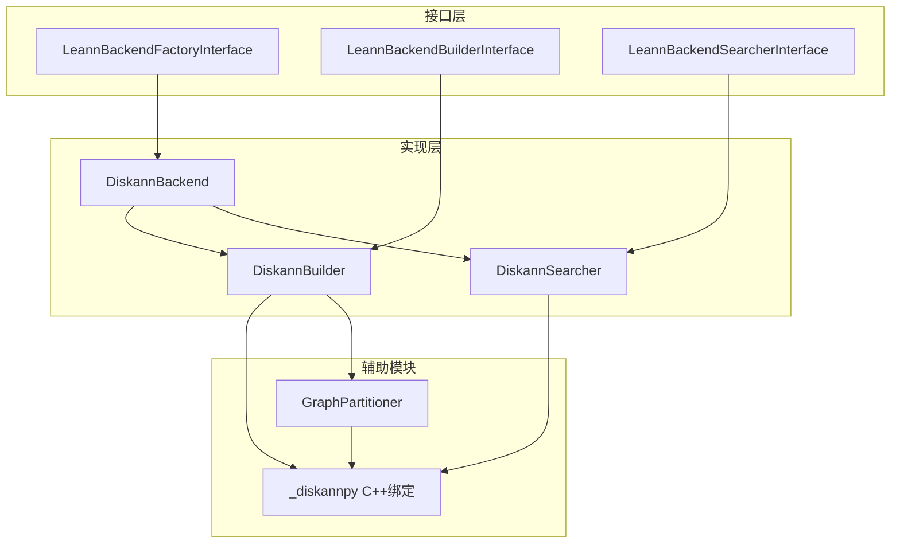

# backend_diskann 模块文档

## 1. 模块概述

`backend_diskann`模块是Leann搜索系统的一个重要后端实现，它基于微软研究院开发的DiskANN算法，提供了高效的大规模向量索引构建和搜索功能。该模块专为处理大规模向量数据而设计，特别适合在内存受限的环境中实现高性能的近似最近邻搜索。

### 1.1 设计理念与目标

该模块的设计理念是结合磁盘存储和内存计算的优势，实现对大规模向量数据集的高效索引和搜索。其主要目标包括：
- 支持十亿级别向量数据的索引构建和搜索
- 在保持高搜索精度的同时，提供快速的查询响应
- 优化内存使用，允许在内存受限的环境中运行
- 提供灵活的配置选项，适应不同的应用场景
- 与Leann系统的其他组件无缝集成

### 1.2 主要特性

- **高效的向量索引构建**：使用DiskANN算法构建高质量的向量索引
- **智能内存配置**：自动根据数据大小和系统资源配置内存参数
- **图分区支持**：通过图分区技术优化搜索性能
- **多种距离度量**：支持内积(MIPS)、L2距离和余弦相似度
- **灵活的搜索参数**：可调整搜索复杂度、波束宽度等参数
- **嵌入重计算**：支持通过ZeroMQ从嵌入服务器获取新鲜嵌入进行重排序

## 2. 架构概览

`backend_diskann`模块采用了清晰的分层架构，主要由三个核心类和一个辅助模块组成：



### 2.1 组件关系说明

1. **DiskannBackend**：作为后端工厂类，负责创建构建器和搜索器实例，是模块的入口点。
2. **DiskannBuilder**：负责向量索引的构建过程，包括数据预处理、索引参数配置和图分区等。
3. **DiskannSearcher**：实现了搜索功能，通过加载预构建的索引，提供高效的近似最近邻搜索。
4. **GraphPartitioner**：提供图分区功能，用于优化大规模索引的搜索性能。
5. **_diskannpy**：C++ DiskANN库的Python绑定，提供核心的索引构建和搜索功能。

这种架构设计使得模块具有良好的可扩展性和可维护性，各组件之间职责明确，通过接口进行交互，便于后续的功能扩展和优化。

## 3. 核心功能模块

### 3.1 DiskannBackend 工厂类

`DiskannBackend`类是模块的工厂类，实现了`LeannBackendFactoryInterface`接口，负责创建`DiskannBuilder`和`DiskannSearcher`实例。它通过`@register_backend("diskann")`装饰器将自身注册为Leann系统的一个可用后端。

### 3.2 DiskannBuilder 索引构建器

`DiskannBuilder`类负责向量索引的构建过程，主要功能包括：
- 将输入向量数据转换为DiskANN所需的格式
- 配置索引构建参数，包括复杂度、图度、内存限制等
- 支持智能内存配置，根据数据大小和系统资源自动调整参数
- 调用C++ DiskANN库构建索引
- 可选的图分区功能，用于优化搜索性能
- 构建完成后的文件清理和管理

### 3.3 DiskannSearcher 搜索器

`DiskannSearcher`类实现了搜索功能，主要特点包括：
- 加载预构建的DiskANN索引
- 支持批量向量查询
- 提供多种搜索参数配置，如复杂度、波束宽度、剪枝比例等
- 支持嵌入重计算功能，通过ZeroMQ从嵌入服务器获取新鲜嵌入
- 自动检测和使用分区索引
- 搜索结果的后处理和格式化

### 3.4 GraphPartitioner 图分区器

`GraphPartitioner`类提供了图分区功能，用于优化大规模索引的搜索性能：
- 自动构建所需的C++可执行文件
- 执行图分区算法，将索引分割为多个子图
- 优化索引布局，提高搜索效率
- 提供分区信息查询功能

## 4. 使用指南

### 4.1 基本使用流程

使用`backend_diskann`模块的基本流程如下：

1. **构建索引**：使用`DiskannBuilder`构建向量索引
2. **加载索引**：使用`DiskannSearcher`加载预构建的索引
3. **执行搜索**：调用搜索方法进行近似最近邻搜索

### 4.2 代码示例

#### 构建索引

```python
import numpy as np
from leann_backend_diskann.diskann_backend import DiskannBackend

# 创建构建器
builder = DiskannBackend.builder(
    distance_metric="mips",
    complexity=64,
    graph_degree=32
)

# 准备数据
data = np.random.rand(100000, 128).astype(np.float32)
ids = [str(i) for i in range(100000)]

# 构建索引
builder.build(data, ids, "path/to/index")
```

#### 搜索索引

```python
import numpy as np
from leann_backend_diskann.diskann_backend import DiskannBackend

# 创建搜索器
searcher = DiskannBackend.searcher("path/to/index")

# 准备查询向量
query = np.random.rand(1, 128).astype(np.float32)

# 执行搜索
results = searcher.search(query, top_k=10, complexity=64)

# 处理结果
print("Nearest neighbors:", results["labels"])
print("Distances:", results["distances"])
```

#### 使用图分区功能

```python
import numpy as np
from leann_backend_diskann.diskann_backend import DiskannBackend

# 创建构建器并启用图分区
builder = DiskannBackend.builder(
    distance_metric="mips",
    is_recompute=True  # 启用图分区
)

# 构建索引（会自动执行图分区）
data = np.random.rand(1000000, 128).astype(np.float32)
ids = [str(i) for i in range(1000000)]
builder.build(data, ids, "path/to/index")

# 搜索时会自动检测并使用分区索引
searcher = DiskannBackend.searcher("path/to/index")
query = np.random.rand(1, 128).astype(np.float32)
results = searcher.search(query, top_k=10)
```

### 4.3 配置参数说明

#### 构建参数

| 参数名 | 类型 | 默认值 | 说明 |
|--------|------|--------|------|
| distance_metric | str | "mips" | 距离度量方式，可选值："mips"、"l2"、"cosine" |
| complexity | int | 64 | 索引构建复杂度，影响索引质量和构建时间 |
| graph_degree | int | 32 | 图的最大度数，影响索引大小和搜索性能 |
| search_memory_maximum | float | 自动计算 | 搜索时的最大内存使用量(GB) |
| build_memory_maximum | float | 自动计算 | 构建时的最大内存使用量(GB) |
| num_threads | int | 8 | 构建和搜索时使用的线程数 |
| pq_disk_bytes | int | 0 | 乘积量化使用的字节数，0表示不使用PQ |
| is_recompute | bool | False | 是否启用图分区功能 |

#### 搜索参数

| 参数名 | 类型 | 默认值 | 说明 |
|--------|------|--------|------|
| top_k | int | - | 要返回的最近邻数量 |
| complexity | int | 64 | 搜索复杂度，影响搜索精度和速度 |
| beam_width | int | 1 | 搜索时的波束宽度 |
| prune_ratio | float | 0.0 | 剪枝比例，范围0.0-1.0 |
| recompute_embeddings | bool | False | 是否重新计算嵌入 |
| pruning_strategy | str | "global" | 剪枝策略，可选值："global"、"local" |
| zmq_port | int | None | ZeroMQ端口，用于嵌入重计算 |
| batch_recompute | bool | False | 是否批量重计算邻居 |
| dedup_node_dis | bool | False | 是否缓存和重用节点距离 |

## 5. 注意事项与最佳实践

### 5.1 性能优化建议

1. **内存配置**：对于大规模数据集，建议合理设置`search_memory_maximum`和`build_memory_maximum`参数，或者使用自动配置功能。
2. **图分区**：对于超过100万向量的数据集，建议启用`is_recompute`参数进行图分区，可以显著提高搜索性能。
3. **搜索参数调优**：根据应用场景调整搜索参数，如`complexity`和`beam_width`，在精度和速度之间取得平衡。
4. **距离度量选择**：根据向量类型选择合适的距离度量，一般来说，归一化向量可以使用"cosine"，未归一化向量可以使用"mips"或"l2"。

### 5.2 常见问题与解决方案

1. **内存不足错误**：如果在构建索引时遇到内存不足错误，可以尝试降低`build_memory_maximum`参数，或者使用更小的`graph_degree`。
2. **搜索精度低**：如果搜索精度不够，可以尝试增加`complexity`参数，或者启用`recompute_embeddings`功能。
3. **索引构建慢**：如果索引构建速度太慢，可以尝试增加`num_threads`参数，或者降低`complexity`参数。
4. **分区功能失败**：如果图分区功能失败，可能是因为缺少必要的C++可执行文件，确保系统已安装必要的编译工具，并尝试手动构建。

### 5.3 限制与已知问题

1. **数据类型限制**：目前只支持float32类型的向量数据，其他类型需要先转换。
2. **分区策略限制**：不支持"proportional"剪枝策略，使用时会抛出NotImplementedError。
3. **依赖要求**：需要编译C++ DiskANN库，对系统环境有一定要求。
4. **平台兼容性**：主要针对Linux系统优化，在其他平台上可能需要额外配置。

## 6. 与其他模块的关系

`backend_diskann`模块是Leann搜索系统的一个后端实现，它通过定义良好的接口与系统的其他部分交互：

1. **与core_search_api_and_interfaces模块的关系**：
   - 实现了`LeannBackendFactoryInterface`、`LeannBackendBuilderInterface`和`LeannBackendSearcherInterface`接口
   - 可以通过`LeannBuilder`和`LeannSearcher`与系统的其他部分集成
   - 搜索结果格式与`SearchResult`类兼容

2. **与backend_hnsw和backend_ivf模块的关系**：
   - 作为可选的后端实现，与HNSW和IVF后端提供类似的功能
   - 不同后端适用于不同的应用场景，可以根据需求选择合适的后端

3. **与core_runtime_and_entrypoints模块的关系**：
   - 可以通过`LeannCLI`命令行工具使用
   - 支持通过`EmbeddingServerManager`进行嵌入重计算

通过这些接口和关系，`backend_diskann`模块无缝集成到Leann搜索系统中，为用户提供高效的大规模向量搜索功能。
