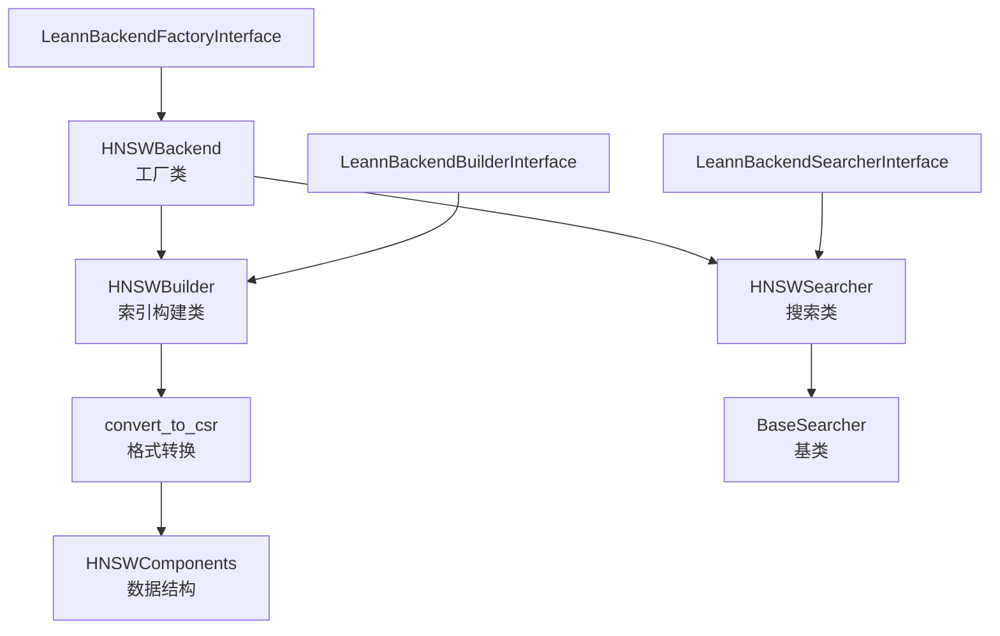

# backend_hnsw 模块文档

## 1. 模块概述

`backend_hnsw` 模块是 Leann 搜索系统的一个核心后端实现，提供基于 HNSW（Hierarchical Navigable Small World）算法的高效向量相似性搜索功能。该模块构建于 FAISS 库之上，为大规模向量数据集提供近似最近邻搜索能力。

### 1.1 设计目的与解决的问题

在现代信息检索和人工智能应用中，向量相似性搜索是一个核心问题。随着数据规模的不断增长，传统的精确搜索方法（如暴力搜索）在时间和空间复杂度上都变得不可行。HNSW 算法通过构建多层导航图结构，在保持较高搜索精度的同时，大幅提升了搜索效率。

本模块的主要设计目的包括：

- 提供高效的 HNSW 索引构建功能，支持大规模向量数据集
- 实现灵活的搜索接口，允许用户根据需求调整搜索精度和速度的平衡
- 支持多种距离度量方式，包括内积（MIPS）、L2 距离和余弦相似度
- 提供内存优化的存储格式，减少索引的内存占用
- 与 Leann 系统的核心接口无缝集成，便于扩展和替换

### 1.2 核心特性

- **高效索引构建**：支持自定义 HNSW 参数（M、efConstruction）来平衡构建时间和搜索性能
- **多种距离度量**：内置支持 MIPS、L2 和余弦相似度
- **紧凑存储格式**：提供 CSR（Compressed Sparse Row）格式的图表示，减少内存占用
- **可配置搜索**：支持调整 efSearch、beam width 等参数来控制搜索精度和速度
- **嵌入修剪**：可选地从索引中移除嵌入数据，进一步减少存储空间
- **元数据过滤**：与 Leann 的元数据过滤引擎集成，支持混合搜索

## 2. 架构设计

### 2.1 整体架构

`backend_hnsw` 模块采用分层架构设计，遵循 Leann 系统定义的后端接口规范。整体架构可以分为三个主要层次：

### 2.2 核心组件关系

1. **HNSWBackend**：作为工厂类，负责创建 `HNSWBuilder` 和 `HNSWSearcher` 实例，是模块的入口点。
2. **HNSWBuilder**：处理索引构建过程，包括 FAISS HNSW 索引的创建、数据添加、ID 映射保存以及可选的 CSR 格式转换。
3. **HNSWSearcher**：实现搜索功能，加载已构建的索引，处理查询向量，执行搜索并返回结果。
4. **convert_to_csr**：提供将 HNSW 图转换为 CSR 格式的功能，以及嵌入修剪能力。
5. **HNSWComponents**：数据结构，用于在格式转换过程中存储和操作 HNSW 索引的各个组件。

### 2.3 数据流程

索引构建流程：
1. 用户通过 `HNSWBackend.builder()` 获取 `HNSWBuilder` 实例
2. 调用 `build()` 方法，传入向量数据、ID 列表和索引路径
3. 内部创建 FAISS HNSW 索引并添加数据
4. 保存索引文件和 ID 映射文件
5. 可选地转换为 CSR 格式并修剪嵌入

搜索流程：
1. 用户通过 `HNSWBackend.searcher()` 获取 `HNSWSearcher` 实例
2. 加载索引文件和 ID 映射
3. 调用 `search()` 方法，传入查询向量和搜索参数
4. 执行 HNSW 搜索，获取原始结果
5. 将整数标签映射回原始 ID，返回最终结果

## 3. 主要功能模块

### 3.1 索引构建与搜索模块

索引构建和搜索是 `backend_hnsw` 模块的核心功能，由 `HNSWBackend`、`HNSWBuilder` 和 `HNSWSearcher` 类共同实现。这些类提供了完整的索引生命周期管理，从创建、配置到搜索和优化。

索引构建模块支持多种自定义参数，包括 M（每个节点的最大邻居数）、efConstruction（构建期间探索的候选数量）、距离度量方式（支持 "mips"、"l2" 和 "cosine"）以及存储格式选项。搜索模块则提供了丰富的搜索参数配置，允许用户在搜索精度和速度之间进行灵活平衡。

有关这些类的详细信息、API 参考和使用示例，请参考 [hnsw_backend_submodule](hnsw_backend_submodule.md) 文档。

### 3.2 格式转换模块

格式转换模块是 `backend_hnsw` 模块的关键优化组件，主要由 `convert_to_csr.py` 文件实现，核心数据结构是 `HNSWComponents`。该模块提供以下功能：

- **CSR 格式转换**：将传统的 HNSW 图表示转换为更紧凑的 CSR（Compressed Sparse Row）格式，显著减少内存占用
- **嵌入修剪**：从索引中移除嵌入数据，进一步减少存储空间，适用于索引已经构建完成且不需要原始向量数据的场景
- **格式读写**：支持读取和写入原始 FAISS 格式和自定义的紧凑格式，确保向后兼容性

该模块包含详细的验证检查，确保转换过程的正确性，并针对大文件处理进行了内存优化，包括渐进式处理、显式内存回收和分块写入等策略。

有关格式转换模块的详细信息、内部工作原理和使用示例，请参考 [convert_to_csr_submodule](convert_to_csr_submodule.md) 文档。

## 4. 与其他模块的关系

`backend_hnsw` 模块与 Leann 系统的其他模块紧密协作：

- **core_search_api_and_interfaces**：实现了该模块定义的接口，包括 `LeannBackendFactoryInterface`、`LeannBackendBuilderInterface` 和 `LeannBackendSearcherInterface`。同时，`HNSWSearcher` 继承自 `BaseSearcher`，并与 `MetadataFilterEngine` 配合工作。
- **core_runtime_and_entrypoints**：可以通过 `EmbeddingServerManager` 获取嵌入重新计算服务，支持 `recompute_embeddings` 功能。

此外，`backend_hnsw` 模块内部包含两个重要的子模块：
- **hnsw_backend_submodule**：提供核心的索引构建和搜索功能
- **convert_to_csr_submodule**：提供索引格式转换和优化功能

关于这些模块的更多信息，请参考相应的文档：
- [core_search_api_and_interfaces](core_search_api_and_interfaces.md)
- [core_chat_and_agent_layer](core_chat_and_agent_layer.md)
- [core_runtime_and_entrypoints](core_runtime_and_entrypoints.md)
- [hnsw_backend_submodule](hnsw_backend_submodule.md)
- [convert_to_csr_submodule](convert_to_csr_submodule.md)

## 5. 使用指南

### 5.1 基本用法

`backend_hnsw` 模块提供了简单直观的 API 来构建和搜索 HNSW 索引。以下是基本使用流程的概述，详细的代码示例和 API 参考请参考 [hnsw_backend_submodule](hnsw_backend_submodule.md) 文档。

#### 构建索引

构建索引的基本步骤包括：
1. 创建 `HNSWBuilder` 实例并配置参数
2. 准备向量数据和对应的 ID 列表
3. 调用 `build()` 方法构建索引

构建过程中，系统会自动处理数据类型转换、归一化（对于余弦相似度）等操作，并可选地将索引转换为紧凑的 CSR 格式。

#### 搜索索引

搜索索引的基本步骤包括：
1. 创建 `HNSWSearcher` 实例，加载预构建的索引
2. 准备查询向量
3. 调用 `search()` 方法执行搜索
4. 处理返回的结果

搜索过程支持多种参数配置，可以根据具体需求在搜索精度和速度之间进行平衡。

### 5.2 参数配置建议

#### 索引构建参数

- **M**：通常在 16-64 之间。较大的值可以提高搜索精度，但会增加索引大小和构建时间。对于高维数据，建议使用较大的值。
- **efConstruction**：通常在 100-500 之间。较大的值可以提高索引质量，但会增加构建时间。建议设置为与搜索时的 efSearch 相近或稍大。
- **distance_metric**：根据应用场景选择。对于归一化的向量，"cosine" 和 "mips" 是等价的。对于未归一化的向量，根据实际需求选择。
- **is_compact**：对于大规模索引，建议设置为 True 以减少内存占用。
- **is_recompute**：如果内存非常紧张，可以设置为 True，但需要配合嵌入服务器使用。

有关索引构建参数的更详细建议和配置示例，请参考 [hnsw_backend_submodule](hnsw_backend_submodule.md) 文档。

#### 搜索参数

- **top_k**：根据应用需求设置，通常在 10-100 之间。
- **complexity**（efSearch）：通常在 40-200 之间。较大的值可以提高搜索精度，但会增加搜索时间。建议设置为 top_k 的 2-5 倍。
- **beam_width**：对于高召回率需求，可以设置为 2-4，但会增加搜索时间。
- **prune_ratio**：对于非常大的索引，可以设置为 0.5-0.8 以减少内存使用，但可能会影响精度。
- **recompute_embeddings**：如果使用了修剪的索引，必须设置为 True 并提供 zmq_port。

有关搜索参数的更详细建议和配置示例，请参考 [hnsw_backend_submodule](hnsw_backend_submodule.md) 文档。

### 5.3 格式转换和优化

`backend_hnsw` 模块提供了强大的索引优化功能，包括 CSR 格式转换和嵌入修剪。这些功能可以显著减少索引的内存和磁盘占用，但可能会影响搜索性能（需要额外的嵌入重计算）。

有关格式转换和优化的详细信息、使用场景和示例代码，请参考 [convert_to_csr_submodule](convert_to_csr_submodule.md) 文档。

## 6. 注意事项与限制

### 6.1 常见问题与解决方案

1. **内存不足**：
   - 问题：构建或加载大型索引时出现内存错误。
   - 解决方案：使用 `is_compact=True` 和 `is_recompute=True` 减少内存占用，或者增加系统内存。

2. **搜索精度低**：
   - 问题：搜索结果与预期不符，精度较低。
   - 解决方案：增加 `complexity` 参数，调整 `beam_width`，或者在构建时增加 `M` 和 `efConstruction`。

3. **ID 映射问题**：
   - 问题：搜索结果中的 ID 与原始 ID 不匹配。
   - 解决方案：确保构建索引时的 ID 列表正确，并且 `.ids.txt` 文件没有损坏。

### 6.2 限制

- **静态索引**：当前实现不支持动态添加或删除向量，需要重新构建索引。
- **嵌入重新计算依赖**：使用紧凑格式且 `is_recompute=True` 时，需要运行嵌入服务器。
- **FAISS 依赖**：模块依赖于自定义的 FAISS 分支，包含 CSR 格式的扩展。
- **Python 全局解释器锁（GIL）**：搜索操作在 C++ 层面实现，但某些部分仍受 GIL 限制。

### 6.3 性能优化建议

1. **批量搜索**：尽可能使用批量搜索，减少函数调用开销。
2. **参数调优**：根据具体数据集和需求，进行参数调优，找到精度和速度的最佳平衡点。
3. **硬件选择**：对于大型索引，建议使用具有足够内存的机器，并且优先选择高性能 CPU。
4. **索引预加载**：在服务启动时预加载索引，避免首次搜索的延迟。

## 7. 总结

`backend_hnsw` 模块为 Leann 系统提供了高效、灵活的 HNSW 向量搜索能力。通过精心设计的接口和丰富的配置选项，用户可以根据具体需求平衡搜索精度、速度和内存占用。该模块的紧凑存储格式和嵌入修剪功能使其特别适合大规模向量搜索场景，同时与 Leann 系统的其他组件无缝集成，为构建完整的搜索和问答系统提供了坚实的基础。

未来的改进方向可能包括支持动态索引更新、更好的分布式搜索支持，以及与更多向量嵌入模型的集成。
