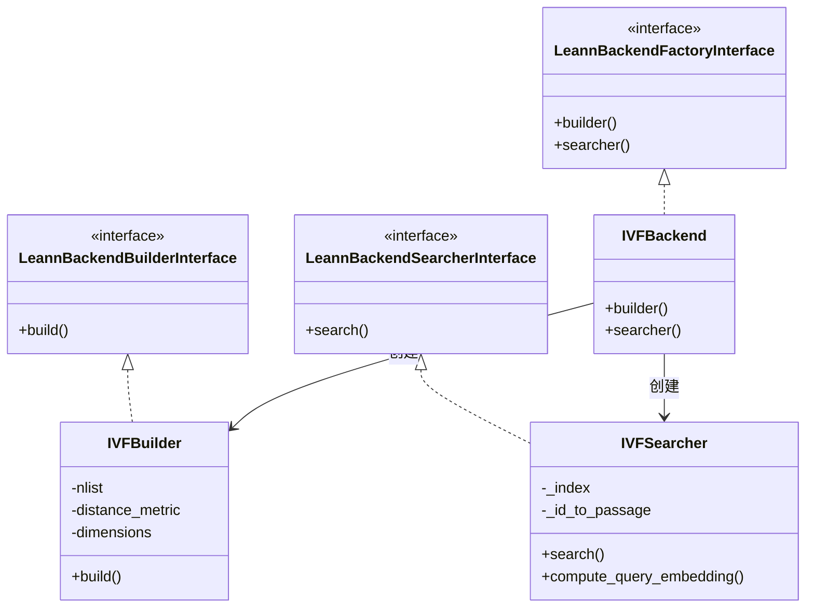

# IVF Backend 模块文档

## 1. 模块概述

IVF Backend 模块是 Leann 搜索系统的一个核心后端实现，基于 FAISS 库的 IndexIVFFlat 索引结构，提供高效的向量近似最近邻搜索功能。该模块的主要设计目的是为大规模向量数据集提供快速的索引构建和查询能力，同时支持增量更新操作，包括向量的添加和删除。

IVF（Inverted File）索引是一种经典的向量索引结构，通过将向量空间划分为多个聚类中心（簇），在查询时只需搜索部分相关簇，从而显著提高搜索效率。本模块在 FAISS 的 IndexIVFFlat 基础上，使用 IndexIDMap2 进行包装，实现了基于 passage ID 的稳定增删操作，为上层应用提供了简洁易用的接口。

该模块适用于需要处理百万级以上向量数据的场景，在保持较高搜索精度的同时，能够提供比暴力搜索快数十倍甚至数百倍的查询速度。

## 2. 架构与组件

### 2.1 核心组件架构

IVF Backend 模块采用工厂模式设计，主要包含三个核心类和两个辅助函数，整体架构如下：



### 2.2 组件关系说明

1. **IVFBackend**：作为工厂类，实现了 `LeannBackendFactoryInterface` 接口，负责创建 `IVFBuilder` 和 `IVFSearcher` 实例。
2. **IVFBuilder**：实现了 `LeannBackendBuilderInterface` 接口，负责构建 IVF 索引，包括训练聚类中心、添加向量数据和保存索引文件。
3. **IVFSearcher**：继承自 `BaseSearcher` 并实现了 `LeannBackendSearcherInterface` 接口，负责加载已构建的索引并执行搜索操作。
4. **add_vectors** 和 **remove_ids**：两个辅助函数，用于实现索引的增量更新功能。

模块还使用了一组辅助函数来处理 ID 映射、距离度量和数据归一化等底层操作。

## 3. 核心功能

### 3.1 索引构建

索引构建功能由 `IVFBuilder` 类负责，主要包括以下步骤：

1. **参数初始化**：设置聚类中心数量（nlist）、距离度量方式和向量维度等参数。
2. **数据预处理**：将输入数据转换为 float32 类型的连续数组，并根据距离度量方式决定是否进行归一化。
3. **索引创建与训练**：
   - 创建适当的量化器（IndexFlatL2 或 IndexFlatIP）
   - 基于量化器创建 IndexIVFFlat 索引
   - 使用输入数据训练索引
4. **ID 映射与向量添加**：
   - 使用 IndexIDMap2 包装 IVF 索引以支持自定义 ID
   - 为每个向量分配内部 ID 并添加到索引
5. **索引保存**：将构建好的索引保存到磁盘，并保存 ID 映射关系。

**关键代码片段**：
```python
def build(self, data: np.ndarray, ids: list[str], index_path: str, **kwargs) -> None:
    # 数据预处理
    if data.dtype != np.float32:
        data = data.astype(np.float32)
    data = np.ascontiguousarray(data)
    
    # 创建量化器和IVF索引
    quantizer = (
        faiss.IndexFlatL2(dim) if metric_enum == faiss.METRIC_L2 else faiss.IndexFlatIP(dim)
    )
    ivf = faiss.IndexIVFFlat(quantizer, dim, self.nlist, metric_enum)
    ivf.train(data)
    index = faiss.IndexIDMap2(ivf)
    
    # 添加向量
    faiss_ids = np.arange(n, dtype=np.int64)
    index.add_with_ids(data, faiss_ids)
```

### 3.2 向量搜索

搜索功能由 `IVFSearcher` 类实现，主要包括以下步骤：

1. **索引加载**：从磁盘加载索引文件和 ID 映射关系。
2. **查询预处理**：将查询向量转换为适当格式，并根据距离度量方式决定是否归一化。
3. **搜索参数设置**：设置 nprobe 参数（搜索时需要检查的聚类中心数量）。
4. **执行搜索**：使用 FAISS 索引进行搜索，获取距离和内部 ID。
5. **结果映射**：将内部 ID 映射回原始 passage ID，并返回搜索结果。

**关键代码片段**：
```python
def search(self, query: np.ndarray, top_k: int, complexity: int = 64, nprobe: Optional[int] = None, **kwargs) -> dict[str, Any]:
    # 查询预处理
    if query.dtype != np.float32:
        query = query.astype(np.float32)
    if self.distance_metric == "cosine":
        query = _normalize_l2(query)
    
    # 设置nprobe参数
    ivf_index = faiss.extract_index_ivf(self._index)
    nprobe = nprobe or min(complexity, ivf_index.nlist)
    ivf_index.nprobe = nprobe
    
    # 执行搜索
    distances, label_rows = self._index.search(query, top_k)
    
    # 映射ID
    string_labels = [[self._id_to_passage.get(int(lab), str(lab)) for lab in row] for row in label_rows]
    return {"labels": string_labels, "distances": distances}
```

### 3.3 增量更新

IVF Backend 支持索引的增量更新，包括向量的添加和删除：

#### 3.3.1 添加向量

`add_vectors` 函数用于向现有索引添加新向量：
1. 加载现有索引和 ID 映射。
2. 检查新 passage ID 是否已存在（避免重复）。
3. 为新向量分配连续的内部 ID。
4. 将新向量添加到索引。
5. 保存更新后的索引和 ID 映射。

#### 3.3.2 删除向量

`remove_ids` 函数用于从索引中删除指定向量：
1. 加载现有索引和 ID 映射。
2. 将要删除的 passage ID 转换为内部 ID。
3. 从索引中移除对应向量。
4. 更新 ID 映射。
5. 保存更新后的索引和 ID 映射。

## 4. 接口与用法

### 4.1 索引构建接口

**IVFBuilder** 提供了构建 IVF 索引的功能，使用方法如下：

```python
from leann_backend_ivf.ivf_backend import IVFBackend
import numpy as np

# 准备数据
data = np.random.rand(10000, 128).astype(np.float32)  # 10000个128维向量
ids = [f"passage_{i}" for i in range(10000)]

# 创建构建器
builder = IVFBackend.builder(
    nlist=100,  # 聚类中心数量
    distance_metric="l2",  # 距离度量：l2, mips, cosine
    dimensions=128  # 向量维度（可选，会自动从数据中推断）
)

# 构建索引
builder.build(data, ids, "path/to/index.leann")
```

**主要参数**：
- `nlist`：聚类中心数量，默认为 100。较大的值可以提高搜索精度，但会增加内存使用和查询时间。
- `distance_metric`：距离度量方式，支持 "l2"（欧氏距离）、"mips"（最大内积）和 "cosine"（余弦相似度）。
- `dimensions`：向量维度，可选参数，如不提供则从输入数据中推断。

### 4.2 搜索接口

**IVFSearcher** 提供了搜索功能，使用方法如下：

```python
from leann_backend_ivf.ivf_backend import IVFBackend
import numpy as np

# 创建搜索器
searcher = IVFBackend.searcher("path/to/index.leann")

# 准备查询向量
query = np.random.rand(1, 128).astype(np.float32)

# 执行搜索
results = searcher.search(
    query,
    top_k=10,  # 返回前10个结果
    complexity=64,  # 搜索复杂度，影响nprobe参数
    nprobe=None  # 显式设置nprobe参数（可选）
)

# 处理结果
passage_ids = results["labels"][0]  # 第一维是查询批次，这里只有一个查询
distances = results["distances"][0]
for pid, dist in zip(passage_ids, distances):
    print(f"Passage: {pid}, Distance: {dist}")
```

**主要参数**：
- `query`：查询向量，形状为 (n_queries, n_dimensions)。
- `top_k`：返回的最近邻数量。
- `complexity`：搜索复杂度，用于自动设置 nprobe 参数（当 nprobe 未显式设置时）。
- `nprobe`：搜索时检查的聚类中心数量，值越大搜索精度越高但速度越慢。

### 4.3 增量更新接口

#### 添加向量

```python
from leann_backend_ivf.ivf_backend import add_vectors
import numpy as np

# 准备新数据
new_embeddings = np.random.rand(100, 128).astype(np.float32)
new_passage_ids = [f"new_passage_{i}" for i in range(100)]

# 添加到索引
add_vectors("path/to/index.leann", new_embeddings, new_passage_ids)
```

#### 删除向量

```python
from leann_backend_ivf.ivf_backend import remove_ids

# 要删除的passage ID列表
passage_ids_to_remove = ["passage_5", "passage_10", "passage_15"]

# 从索引中删除
removed_count = remove_ids("path/to/index.leann", passage_ids_to_remove)
print(f"Removed {removed_count} vectors")
```

## 5. 配置与部署

### 5.1 环境要求

- Python 3.7+
- numpy
- faiss-cpu（或 faiss-gpu，如果需要GPU加速）

安装依赖：
```bash
pip install numpy faiss-cpu
```

### 5.2 索引配置建议

根据不同的数据集规模和性能需求，可以调整以下参数：

| 数据集规模 | nlist 建议值 | nprobe 建议范围 | 内存占用估算 |
|------------|--------------|-----------------|--------------|
| 10万-100万 | 100-500      | 10-50           | 中等         |
| 100万-1000万 | 500-2000    | 20-100          | 较高         |
| 1000万以上 | 2000-10000   | 50-200          | 高           |

### 5.3 部署注意事项

1. **文件格式**：索引文件使用 FAISS 原生格式保存，同时会生成一个 JSON 文件存储 ID 映射关系。
2. **线程安全**：当前实现不支持多线程并发写入，如需并发更新需要外部加锁。
3. **内存要求**：整个索引需要加载到内存中，对于大规模数据集需要确保有足够的内存。
4. **备份策略**：建议在更新索引前备份现有索引文件，以防更新过程中出现问题。

## 6. 最佳实践与常见问题

### 6.1 最佳实践

1. **选择合适的 nlist**：一般建议 nlist 设置为 sqrt(N) 到 N/1000 之间，其中 N 是向量总数。
2. **平衡精度与速度**：通过调整 nprobe 参数在搜索精度和速度之间找到平衡。对于大多数应用，nprobe 设置为 nlist 的 5-10% 通常能获得较好的折衷。
3. **向量归一化**：如果使用 cosine 相似度作为距离度量，确保所有向量（包括查询向量）都进行了归一化。
4. **批量操作**：尽可能使用批量添加和删除操作，而不是单个向量操作，以提高效率。
5. **索引优化**：对于静态或变化不频繁的数据集，可以考虑定期重新构建索引以优化性能。

### 6.2 常见问题

**Q: 为什么我的搜索结果质量不高？**

A: 可能的原因和解决方法：
- nprobe 设置过小，尝试增大 nprobe 值
- nlist 设置不合理，尝试调整 nlist 参数
- 向量质量问题，检查原始向量是否合适

**Q: 内存不足怎么办？**

A: 可以考虑：
- 减少 nlist 的值（但可能影响搜索精度）
- 使用更小维度的向量
- 考虑使用 FAISS 的其他索引类型（如 IVFPQ）进行压缩（需要修改代码）

**Q: 添加向量时报错 "Passage id already exists" 怎么办？**

A: 这表示你尝试添加的 passage ID 已存在于索引中。你可以：
- 先使用 remove_ids 删除这些 ID，然后再添加
- 使用不同的 passage ID
- 检查你的 ID 生成逻辑，确保不会产生重复 ID

**Q: 可以在 GPU 上使用吗？**

A: 当前代码使用的是 faiss-cpu，如果需要 GPU 加速，可以：
1. 安装 faiss-gpu 替代 faiss-cpu
2. 修改代码，在创建索引时使用 GPU 版本的 FAISS 索引
3. 注意 GPU 内存限制，大规模索引可能无法全部放入 GPU 内存

## 7. 总结与亮点回顾

IVF Backend 模块为 Leann 系统提供了高效的向量索引和搜索功能，其主要亮点包括：

1. **高效的近似搜索**：基于 IVF 索引结构，在保持较高精度的同时提供显著的搜索加速。
2. **灵活的距离度量**：支持 L2、MIPS 和 Cosine 三种常用的距离度量方式，适应不同应用场景。
3. **增量更新支持**：提供了向量添加和删除功能，支持动态更新索引，无需完全重建。
4. **ID 映射机制**：通过 IndexIDMap2 和自定义 ID 映射，实现了基于业务 ID 的稳定操作。
5. **简洁易用的接口**：遵循 Leann 后端接口规范，与其他后端（如 HNSW）保持一致的 API，便于切换和比较。

作为 Leann 搜索系统的可选后端之一，IVF Backend 特别适合中等规模到大规模的向量搜索场景，在搜索速度和精度之间提供了良好的平衡。
