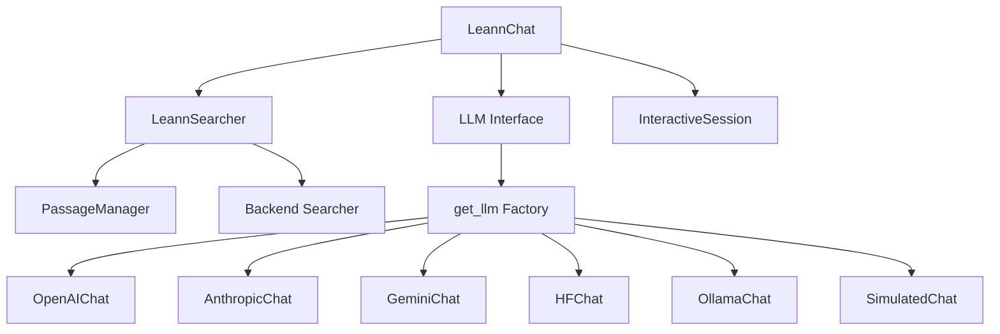
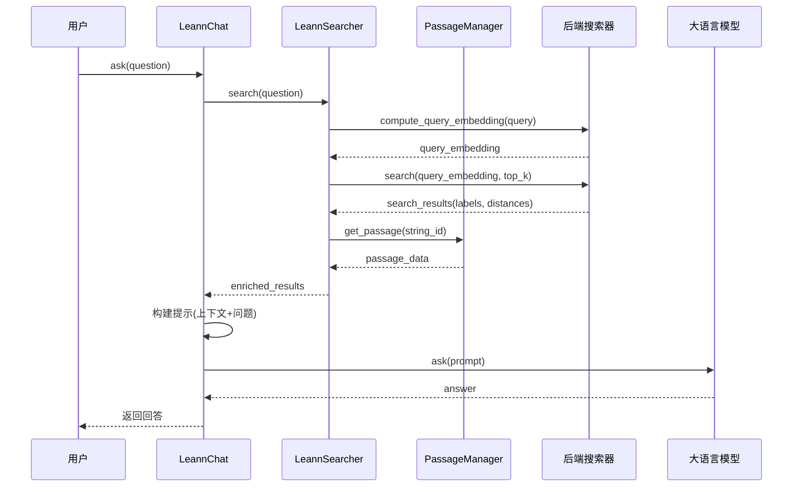

# Chat API 模块文档

## 1. 概述

Chat API 模块是 LEANN 系统中负责将检索增强生成 (Retrieval-Augmented Generation, RAG) 功能整合为统一对话接口的核心组件。该模块通过 `LeannChat` 类提供了一个高级抽象，将语义搜索与大语言模型 (LLM) 无缝结合，使用户能够以自然语言方式与知识库进行交互。

该模块的主要设计目标是：
- 提供简洁易用的对话式接口，隐藏底层搜索和 LLM 调用的复杂性
- 支持多种 LLM 后端，包括 OpenAI、Anthropic、Google Gemini、Hugging Face、Ollama 等
- 实现完整的检索-增强-生成流程，确保答案基于相关的检索上下文
- 提供交互式会话模式，方便用户直接探索和查询知识库

## 2. 核心组件

### LeannChat 类

`LeannChat` 是该模块的核心类，负责协调整个 RAG 流程。它将 `LeannSearcher` 的检索能力与 LLM 的生成能力结合起来，提供了一个统一的对话接口。

#### 初始化

```python
def __init__(
    self,
    index_path: str,
    llm_config: Optional[dict[str, Any]] = None,
    enable_warmup: bool = False,
    searcher: Optional[LeannSearcher] = None,
    **kwargs,
):
```

**参数说明：**
- `index_path`: 索引文件的路径，指向预先构建的 LEANN 索引
- `llm_config`: 可选的 LLM 配置字典，用于指定使用的 LLM 类型和参数
- `enable_warmup`: 是否在初始化时进行预热，默认为 False
- `searcher`: 可选的预配置 `LeannSearcher` 实例，如果提供则不会创建新的搜索器
- `**kwargs`: 传递给 `LeannSearcher` 构造函数的额外参数

**主要特性：**
- 如果未提供 `searcher`，会自动创建一个新的 `LeannSearcher` 实例
- 支持资源所有权管理，通过 `_owns_searcher` 标志跟踪是否应该由当前实例负责清理资源
- 使用 `get_llm` 工厂函数根据配置创建合适的 LLM 接口实例

#### ask 方法

```python
def ask(
    self,
    question: str,
    top_k: int = 5,
    complexity: int = 64,
    beam_width: int = 1,
    prune_ratio: float = 0.0,
    recompute_embeddings: bool = True,
    pruning_strategy: Literal["global", "local", "proportional"] = "global",
    llm_kwargs: Optional[dict[str, Any]] = None,
    expected_zmq_port: int = 5557,
    metadata_filters: Optional[dict[str, dict[str, Union[str, int, float, bool, list]]]] = None,
    batch_size: int = 0,
    use_grep: bool = False,
    gemma: float = 1.0,
    **search_kwargs,
):
```

**功能说明：**
这是 `LeannChat` 类的核心方法，执行完整的 RAG 流程：
1. 使用问题查询索引，检索最相关的文档片段
2. 将检索到的上下文和问题组合成提示
3. 调用 LLM 生成基于上下文的回答

**参数说明：**
- `question`: 用户的自然语言问题
- `top_k`: 检索的最相关文档数量，默认为 5
- `complexity`: 搜索复杂度/候选列表大小，值越大越准确但越慢
- `beam_width`: 每次迭代的并行搜索路径/IO 请求数量
- `prune_ratio`: 通过近似距离剪枝邻居的比例 (0.0-1.0)
- `recompute_embeddings`: 是否在搜索时重新计算嵌入，默认为 True
- `pruning_strategy`: 候选选择策略，可选 "global"、"local" 或 "proportional"
- `llm_kwargs`: 传递给 LLM 的额外参数
- `expected_zmq_port`: 用于嵌入服务器通信的 ZMQ 端口
- `metadata_filters`: 可选的元数据过滤器，用于根据元数据筛选搜索结果
- `batch_size`: 批处理大小，仅适用于 HNSW 后端
- `use_grep`: 是否使用基于 grep 的搜索而不是语义搜索
- `gemma`: 混合搜索中向量搜索结果的权重 (0.0-1.0)，1 = 纯向量搜索，0 = 纯关键词搜索
- `**search_kwargs`: 传递给搜索器的额外后端特定参数

**返回值：**
LLM 生成的回答文本，基于检索到的上下文和用户的问题。

**工作流程：**
1. 调用 `searcher.search()` 检索相关文档
2. 将检索结果格式化为上下文字符串
3. 构建包含上下文和问题的提示
4. 调用 LLM 的 `ask()` 方法生成回答
5. 记录各阶段的执行时间，便于性能分析

#### start_interactive 方法

```python
def start_interactive(self):
```

**功能说明：**
启动一个交互式对话会话，允许用户通过命令行与系统进行连续对话。

**工作流程：**
1. 使用 `create_api_session()` 创建交互式会话
2. 定义查询处理函数，将用户输入传递给 `ask()` 方法
3. 运行交互式循环，直到用户输入 "quit" 退出

#### cleanup 方法

```python
def cleanup(self):
```

**功能说明：**
显式清理嵌入服务器资源。应该在使用完聊天接口后调用此方法，特别是在测试环境或批处理场景中。

**注意事项：**
- 仅当 `LeannChat` 实例创建了搜索器时才会停止嵌入服务器
- 当传入共享搜索器时，避免关闭服务器以支持重用

#### 上下文管理

`LeannChat` 类实现了上下文管理器协议，支持使用 `with` 语句自动管理资源：

```python
def __enter__(self):
    return self

def __exit__(self, exc_type, exc, tb):
    try:
        self.cleanup()
    except Exception:
        pass
```

此外，还实现了 `__del__` 方法作为最后的清理保障，防止资源泄漏。

## 3. 架构与依赖关系

### 模块架构

Chat API 模块在整个 LEANN 系统中位于较高的抽象层次，它依赖于多个核心组件来实现其功能：



### 数据流程

当用户调用 `LeannChat.ask()` 方法时，数据在系统中的流动如下：



## 4. 使用指南

### 基本使用

#### 创建 LeannChat 实例

最简单的使用方式是直接提供索引路径：

```python
from leann.api import LeannChat

# 创建聊天实例，使用默认 LLM 配置 (OpenAI GPT-4o)
chat = LeannChat(index_path="path/to/your/index")

# 提问
answer = chat.ask("什么是机器学习？")
print(answer)

# 清理资源
chat.cleanup()
```

#### 使用上下文管理器

推荐使用上下文管理器来确保资源被正确清理：

```python
from leann.api import LeannChat

with LeannChat(index_path="path/to/your/index") as chat:
    answer = chat.ask("什么是深度学习？")
    print(answer)
    # 不需要手动调用 cleanup()
```

### 配置 LLM

#### 使用不同的 LLM 后端

```python
from leann.api import LeannChat

# 使用 Anthropic Claude
llm_config = {
    "type": "anthropic",
    "model": "claude-3-5-sonnet-20241022",
    "api_key": "your-api-key"
}

chat = LeannChat(index_path="path/to/index", llm_config=llm_config)

# 使用 Ollama 本地模型
llm_config = {
    "type": "ollama",
    "model": "llama3:8b",
    "host": "http://localhost:11434"
}

chat = LeannChat(index_path="path/to/index", llm_config=llm_config)
```

#### 传递 LLM 参数

```python
from leann.api import LeannChat

chat = LeannChat(index_path="path/to/index")

# 传递 LLM 特定参数
answer = chat.ask(
    "解释量子计算",
    llm_kwargs={
        "temperature": 0.7,
        "max_tokens": 500,
        "top_p": 0.9
    }
)
```

### 高级搜索配置

#### 调整检索参数

```python
from leann.api import LeannChat

chat = LeannChat(index_path="path/to/index")

# 调整检索参数以获得更全面或更精确的结果
answer = chat.ask(
    "列出所有与气候变化相关的内容",
    top_k=10,           # 检索更多文档
    complexity=128,     # 增加搜索复杂度
    gemma=0.8           # 稍微增加 BM25 权重
)
```

#### 使用元数据过滤

```python
from leann.api import LeannChat

chat = LeannChat(index_path="path/to/index")

# 使用元数据过滤只搜索特定章节
answer = chat.ask(
    "第一章中提到了哪些关键概念？",
    metadata_filters={
        "chapter": {"==": 1}
    }
)

# 组合多个过滤条件
answer = chat.ask(
    "2023年发表的相关研究有哪些？",
    metadata_filters={
        "year": {">=": 2023},
        "category": {"in": ["research", "study"]}
    }
)
```

#### 混合搜索

```python
from leann.api import LeannChat

chat = LeannChat(index_path="path/to/index")

# 平衡向量搜索和关键词搜索
answer = chat.ask(
    "查找关于 'Python 性能优化' 的内容",
    gemma=0.7  # 70% 向量搜索，30% BM25 关键词搜索
)

# 纯关键词搜索
answer = chat.ask(
    "查找包含特定错误代码的文档",
    gemma=0.0  # 100% BM25 搜索
)
```

### 交互式会话

```python
from leann.api import LeannChat

# 创建聊天实例并启动交互式会话
chat = LeannChat(index_path="path/to/index")
chat.start_interactive()
```

在交互式会话中，用户可以：
- 输入自然语言问题，系统会基于检索上下文回答
- 输入 "quit" 或 "exit" 退出会话
- 输入 "help" 查看可用命令

### 共享搜索器

在多个 `LeannChat` 实例之间共享搜索器可以提高资源利用率：

```python
from leann.api import LeannChat, LeannSearcher

# 创建一个共享的搜索器
searcher = LeannSearcher(index_path="path/to/index", enable_warmup=True)

# 创建多个聊天实例，共享同一个搜索器
chat1 = LeannChat(index_path="path/to/index", searcher=searcher)
chat2 = LeannChat(index_path="path/to/index", searcher=searcher, 
                  llm_config={"type": "anthropic"})

# 使用不同的聊天实例
answer1 = chat1.ask("问题 1")
answer2 = chat2.ask("问题 2")

# 只需清理一次搜索器
searcher.cleanup()
```

## 5. 性能考量与最佳实践

### 资源管理

1. **及时清理资源**：在非交互式场景中，确保调用 `cleanup()` 方法或使用上下文管理器，以避免嵌入服务器资源泄漏。

2. **搜索器复用**：当需要多个聊天实例时，考虑共享搜索器以减少内存占用和初始化开销。

3. **预热策略**：对于需要低延迟响应的应用，可以设置 `enable_warmup=True`，在初始化时预先加载模型和嵌入计算资源。

### 检索质量优化

1. **top_k 调整**：根据知识库大小和问题类型调整 `top_k` 参数。对于大型知识库或复杂问题，可以增加到 10-20；对于简单问题，3-5 可能就足够了。

2. **混合搜索平衡**：通过调整 `gemma` 参数平衡向量搜索和关键词搜索。对于精确术语查询，降低 `gemma` 值（如 0.5-0.7）；对于语义理解问题，保持较高值（0.8-1.0）。

3. **元数据过滤**：有效地使用元数据过滤可以大幅减少不相关结果，提高答案质量。

### 错误处理

```python
from leann.api import LeannChat

try:
    with LeannChat(index_path="path/to/index") as chat:
        answer = chat.ask("你的问题")
        print(answer)
except FileNotFoundError as e:
    print(f"索引文件未找到: {e}")
except Exception as e:
    print(f"发生错误: {e}")
```

## 6. 限制与注意事项

1. **索引依赖**：`LeannChat` 依赖于预先构建的 LEANN 索引，不能直接对原始文本进行操作。

2. **上下文限制**：所有检索到的文档片段必须适合 LLM 的上下文窗口。如果检索了太多文档，可能需要调整 `top_k` 或实现更智能的上下文选择策略。

3. **LLM 配置**：确保 LLM 配置正确，包括 API 密钥、模型名称和访问参数。错误的配置会导致运行时异常。

4. **资源消耗**：根据使用的 LLM 和搜索后端，`LeannChat` 可能消耗大量内存和计算资源，特别是在处理大型索引时。

5. **搜索器所有权**：当共享搜索器时，确保清楚谁负责资源清理，以避免过早清理或资源泄漏。

## 7. 相关模块参考

- [core_search_api_and_interfaces](core_search_api_and_interfaces.md)：了解 `LeannSearcher` 和搜索相关功能的详细信息
- [chat_interfaces](chat_interfaces.md)：了解支持的 LLM 后端和接口实现
- [interactive_utils](interactive_utils.md)：了解交互式会话的更多功能

## 8. 总结

Chat API 模块通过 `LeannChat` 类提供了一个强大而简洁的接口，将检索和生成功能无缝结合。该模块设计灵活，支持多种 LLM 后端和搜索配置，适用于从简单问答到复杂知识探索的各种应用场景。通过正确配置和使用，可以构建出高效、准确的知识库问答系统。
