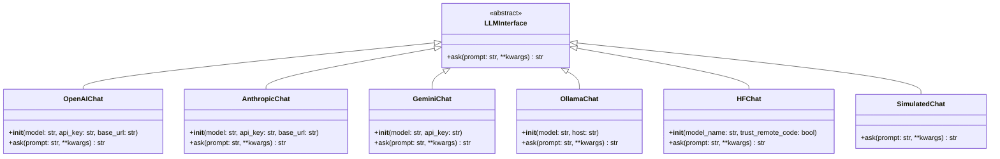

# Chat Interfaces Module Documentation

## Overview

The `chat_interfaces` module provides a unified interface for interacting with various Large Language Model (LLM) backends. It abstracts away the differences between different LLM providers, allowing developers to switch between models without changing their application code.

### Key Features

- **Unified Interface**: Single `LLMInterface` abstract base class for all LLM backends
- **Multiple Backends**: Support for OpenAI, Anthropic, Google Gemini, Ollama, Hugging Face, and simulated models
- **Configuration Flexibility**: Environment variable-based configuration with fallback options
- **Model Validation**: Built-in model existence checking with intelligent suggestions
- **Error Handling**: Comprehensive error handling and logging

## Architecture

The module follows a clear object-oriented design with an abstract base class defining the interface and concrete implementations for each backend.



## Core Components

### LLMInterface

The abstract base class that defines the common interface for all LLM implementations.

```python
class LLMInterface(ABC):
    @abstractmethod
    def ask(self, prompt: str, **kwargs) -> str:
        pass
```

**Purpose**: Defines the contract that all LLM implementations must follow. The `ask` method is the primary entry point for sending prompts to the LLM and receiving responses.

**Parameters for `ask` method**:
- `prompt` (str): The input prompt to send to the LLM
- `**kwargs`: Additional backend-specific parameters

**Returns**: The response string from the LLM

### OpenAIChat

Implementation for OpenAI models (GPT-4, GPT-3.5, etc.).

```python
class OpenAIChat(LLMInterface):
    def __init__(
        self,
        model: str = "gpt-4o",
        api_key: Optional[str] = None,
        base_url: Optional[str] = None,
    ):
        # Initialization code
    
    def ask(self, prompt: str, **kwargs) -> str:
        # Implementation
```

**Key Features**:
- Supports OpenAI API and compatible endpoints
- Handles reasoning parameters for o-series models
- Token usage logging

**Configuration**:
- `model`: Model name (default: "gpt-4o")
- `api_key`: OpenAI API key (can also use OPENAI_API_KEY env var)
- `base_url`: Custom base URL for API (can also use OPENAI_BASE_URL env var)

**Example Usage**:
```python
from leann.chat import OpenAIChat

chat = OpenAIChat(
    model="gpt-4o",
    api_key="your-api-key-here"
)

response = chat.ask("What is machine learning?")
print(response)
```

### AnthropicChat

Implementation for Anthropic Claude models.

```python
class AnthropicChat(LLMInterface):
    def __init__(
        self,
        model: str = "claude-haiku-4-5",
        api_key: Optional[str] = None,
        base_url: Optional[str] = None,
    ):
        # Initialization code
    
    def ask(self, prompt: str, **kwargs) -> str:
        # Implementation
```

**Key Features**:
- Native Claude API support
- Custom endpoint compatibility
- Token usage logging

**Configuration**:
- `model`: Model name (default: "claude-haiku-4-5")
- `api_key`: Anthropic API key (can also use ANTHROPIC_API_KEY env var)
- `base_url`: Custom base URL (can also use ANTHROPIC_BASE_URL env var)

**Example Usage**:
```python
from leann.chat import AnthropicChat

chat = AnthropicChat(
    model="claude-3-5-sonnet-20241022",
    api_key="your-api-key-here"
)

response = chat.ask("Explain quantum computing in simple terms.")
print(response)
```

### GeminiChat

Implementation for Google Gemini models.

```python
class GeminiChat(LLMInterface):
    def __init__(
        self,
        model: str = "gemini-2.5-flash",
        api_key: Optional[str] = None,
    ):
        # Initialization code
    
    def ask(self, prompt: str, **kwargs) -> str:
        # Implementation
```

**Key Features**:
- Google GenAI SDK integration
- Simple configuration

**Configuration**:
- `model`: Model name (default: "gemini-2.5-flash")
- `api_key`: Gemini API key (can also use GEMINI_API_KEY env var)

**Example Usage**:
```python
from leann.chat import GeminiChat

chat = GeminiChat(
    model="gemini-2.5-flash",
    api_key="your-api-key-here"
)

response = chat.ask("What are the benefits of Python?")
print(response)
```

### OllamaChat

Implementation for locally running Ollama models.

```python
class OllamaChat(LLMInterface):
    def __init__(
        self,
        model: str = "llama3:8b",
        host: Optional[str] = None,
    ):
        # Initialization code
    
    def ask(self, prompt: str, **kwargs) -> str:
        # Implementation
```

**Key Features**:
- Local model execution
- Model validation and suggestions
- Reasoning parameter support for compatible models
- Connection health checking

**Configuration**:
- `model`: Model name (default: "llama3:8b")
- `host`: Ollama server URL (can also use OLLAMA_HOST env var, default: "http://localhost:11434")

**Special Features**:
- Automatic model availability checking
- Intelligent model suggestions if requested model not found
- Remote library checking for model installation guidance
- Fuzzy search for model name matching

**Example Usage**:
```python
from leann.chat import OllamaChat

chat = OllamaChat(
    model="llama3:8b",
    host="http://localhost:11434"
)

response = chat.ask("Write a Python function to reverse a string.")
print(response)
```

### HFChat

Implementation for Hugging Face Transformers models.

```python
class HFChat(LLMInterface):
    def __init__(
        self,
        model_name: str = "deepseek-ai/deepseek-llm-7b-chat",
        trust_remote_code: bool = False,
    ):
        # Initialization code
    
    def ask(self, prompt: str, **kwargs) -> str:
        # Implementation
```

**Key Features**:
- Local model execution with Transformers library
- Automatic device detection (CUDA, MPS, CPU)
- Chat template support
- Model loading timeout protection
- Qwen model-specific handling

**Configuration**:
- `model_name`: Hugging Face model name (default: "deepseek-ai/deepseek-llm-7b-chat")
- `trust_remote_code`: Whether to allow execution of code from model repo (default: False, security warning when enabled)
- `LEANN_LLM_DEVICE`: Environment variable to override device selection

**Special Features**:
- Automatic device detection and fallback
- 60-second timeout for model loading
- Chat template application with fallback
- Qwen model automatic "/no_think" suffix

**Example Usage**:
```python
from leann.chat import HFChat

chat = HFChat(
    model_name="microsoft/phi-2",
    trust_remote_code=True  # Only for trusted models!
)

response = chat.ask("Explain recursion to a 10-year-old.")
print(response)
```

### SimulatedChat

A simple implementation for testing without actual LLM calls.

```python
class SimulatedChat(LLMInterface):
    def ask(self, prompt: str, **kwargs) -> str:
        # Implementation
```

**Key Features**:
- No external dependencies
- Logs prompt preview
- Returns fixed response

**Example Usage**:
```python
from leann.chat import SimulatedChat

chat = SimulatedChat()
response = chat.ask("Test prompt")
print(response)  # Returns fixed simulated response
```

## Factory Function

### get_llm

Factory function to create LLM instances based on configuration.

```python
def get_llm(llm_config: Optional[dict[str, Any]] = None) -> LLMInterface:
    # Implementation
```

**Purpose**: Simplifies LLM instance creation by handling the instantiation logic based on a configuration dictionary.

**Parameters**:
- `llm_config`: Dictionary with LLM configuration
  - `type`: LLM type ("openai", "anthropic", "gemini", "ollama", "hf", "simulated")
  - Additional backend-specific parameters

**Returns**: Instance of the appropriate LLMInterface subclass

**Example Usage**:
```python
from leann.chat import get_llm

# OpenAI
llm = get_llm({
    "type": "openai",
    "model": "gpt-4o"
})

# Ollama
llm = get_llm({
    "type": "ollama",
    "model": "llama3:8b"
})

# Hugging Face
llm = get_llm({
    "type": "hf",
    "model": "microsoft/phi-2",
    "trust_remote_code": True
})

# Default (OpenAI)
llm = get_llm()
```

## Common ask() Method Parameters

While each backend may support specific parameters, here are the common ones:

| Parameter | Type | Default | Description |
|-----------|------|---------|-------------|
| `temperature` | float | 0.7 | Controls randomness (0=deterministic, 1=creative) |
| `max_tokens` | int | varies | Maximum tokens in response |
| `top_p` | float | 0.9 | Nucleus sampling parameter |
| `thinking_budget` | str | None | Reasoning effort for compatible models ("low", "medium", "high") |

## Model Validation and Suggestions

The module includes sophisticated model validation:

### Ollama Validation
- Checks local model availability
- Queries Ollama library for remote availability
- Provides installation instructions
- Shows similar installed models via fuzzy search
- Suggests available tags for base models

### Hugging Face Validation
- Checks model existence on Hub
- Provides fuzzy search suggestions
- Falls back to popular models list

## Error Handling

The module includes comprehensive error handling:

- Connection errors for API-based backends
- Model validation errors with helpful suggestions
- Import errors for missing dependencies
- Timeout protection for Hugging Face model loading
- Graceful fallback mechanisms

## Security Considerations

### Hugging Face trust_remote_code
- **Warning**: Setting `trust_remote_code=True` allows execution of arbitrary code from model repositories
- Only enable for models from trusted sources
- Security warning is logged when enabled

### API Keys
- Keys can be passed via parameters or environment variables
- Environment variables recommended for production
- Supported variables:
  - `OPENAI_API_KEY`
  - `ANTHROPIC_API_KEY`
  - `GEMINI_API_KEY`

## Best Practices

1. **Use Environment Variables**: Store API keys in environment variables rather than hardcoding
2. **Model Selection**: Choose appropriate model sizes based on your hardware capabilities
3. **Error Handling**: Always handle potential exceptions when initializing LLM instances
4. **Resource Management**: For Hugging Face models, be mindful of GPU memory usage
5. **Testing**: Use SimulatedChat during development and testing

## Dependencies

Different backends require different dependencies:

- **OpenAI**: `openai`
- **Anthropic**: `anthropic`
- **Gemini**: `google-genai`
- **Ollama**: `requests`
- **Hugging Face**: `transformers`, `torch`, `huggingface_hub`

The module will raise ImportError with installation instructions if required dependencies are missing.

## Related Modules

- [chat_api](chat_api.md) - Higher-level chat API using these interfaces
- [react_agent](react_agent.md) - ReAct agent implementation using LLMs
- [interactive_utils](interactive_utils.md) - Interactive session utilities
