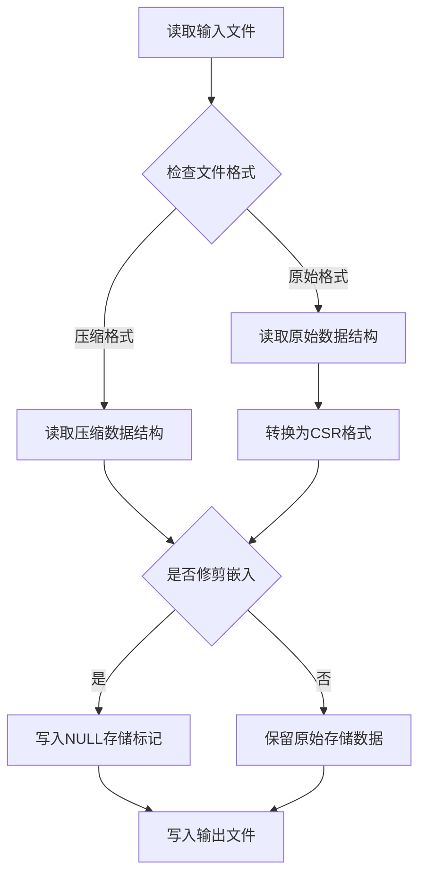

# convert_to_csr_submodule 模块文档

## 概述

`convert_to_csr_submodule` 是 `backend_hnsw` 模块下的一个核心子模块，主要负责将 FAISS 格式的 HNSW（Hierarchical Navigable Small World）索引文件转换为更紧凑、更高效的 CSR（Compressed Sparse Row）格式。这个模块还提供了对索引文件进行嵌入向量修剪的功能，帮助优化存储空间。

### 设计目的

1. **格式优化**：将原始的 HNSW 图结构转换为 CSR 格式，减少内存占用和提高访问效率
2. **存储空间管理**：提供嵌入向量修剪功能，允许在不需要原始向量数据时减小文件大小
3. **向后兼容性**：支持读取和转换多种 HNSW 格式，包括原始格式和已压缩格式
4. **内存效率**：在处理大型索引文件时采用内存优化策略，避免内存溢出

## 核心组件

### HNSWComponents 数据类

`HNSWComponents` 是一个数据类，用于存储从 HNSW 索引文件中解析出的所有组件数据。

```python
@dataclass
class HNSWComponents:
    original_hnsw_data: dict[str, Any]
    assign_probas_np: np.ndarray
    cum_nneighbor_per_level_np: np.ndarray
    levels_np: np.ndarray
    is_compact: bool
    compact_level_ptr: Optional[np.ndarray] = None
    compact_node_offsets_np: Optional[np.ndarray] = None
    compact_neighbors_data: Optional[list[int]] = None
    offsets_np: Optional[np.ndarray] = None
    neighbors_np: Optional[np.ndarray] = None
    storage_fourcc: int = NULL_INDEX_FOURCC
    storage_data: bytes = b""
```

#### 字段说明

- `original_hnsw_data`: 存储原始 HNSW 索引的元数据，如维度、节点数量、度量类型等
- `assign_probas_np`: 每个节点被分配到不同层级的概率数组
- `cum_nneighbor_per_level_np`: 每个层级的累积邻居数量数组
- `levels_np`: 每个节点所在的最大层级数组
- `is_compact`: 标识索引是否已经是压缩格式
- `compact_level_ptr`: 压缩格式中层级指针数组
- `compact_node_offsets_np`: 压缩格式中节点偏移量数组
- `compact_neighbors_data`: 压缩格式中邻居数据列表
- `offsets_np`: 原始格式中偏移量数组
- `neighbors_np`: 原始格式中邻居数组
- `storage_fourcc`: 存储部分的 FourCC 标识符
- `storage_data`: 存储部分的原始字节数据

## 主要功能

### 1. 格式转换功能

#### convert_hnsw_graph_to_csr

```python
def convert_hnsw_graph_to_csr(input_filename, output_filename, prune_embeddings=True):
    """
    Converts an HNSW graph file to the CSR format.
    Supports both original and already-compact formats (backward compatibility).

    Args:
        input_filename: Input HNSW index file
        output_filename: Output CSR index file
        prune_embeddings: Whether to prune embedding storage (write NULL storage marker)
    """
```

**功能说明**：

这是模块的核心函数，负责将 HNSW 索引文件转换为 CSR 格式。它支持处理两种输入格式：原始 FAISS 格式和已经是压缩格式的文件。转换过程包括以下关键步骤：

1. 读取并解析输入文件的头部信息和元数据
2. 根据文件格式（原始或压缩）读取相应的结构数据
3. 如果是原始格式，执行转换逻辑将其转换为 CSR 格式
4. 执行验证检查确保转换的正确性
5. 根据参数决定是否修剪嵌入向量
6. 写入输出文件

**转换过程详解**：

对于原始格式的文件，转换过程会：

1. 遍历每个节点，收集其在各个层级上的有效邻居
2. 构建压缩格式所需的三个核心数据结构：
   - `compact_level_ptr`: 指向每个层级邻居数据的指针
   - `compact_node_offsets_np`: 每个节点在 `compact_level_ptr` 中的起始位置
   - `compact_neighbors_data`: 实际的邻居数据，只包含有效邻居
3. 过滤掉无效的邻居（值为 -1 的项）
4. 重新组织数据结构，使其更紧凑

**验证检查**：

函数执行两项关键验证：
1. 验证有效邻居的总数是否一致
2. 验证最终指针索引是否与数据大小匹配

#### 使用示例

```python
# 基本用法 - 转换并修剪嵌入向量
convert_hnsw_graph_to_csr("input_index.faiss", "output_csr.faiss")

# 保留嵌入向量的转换
convert_hnsw_graph_to_csr("input_index.faiss", "output_csr.faiss", prune_embeddings=False)
```

### 2. 嵌入向量修剪功能

#### prune_hnsw_embeddings

```python
def prune_hnsw_embeddings(input_filename: str, output_filename: str) -> bool:
    """Rewrite an HNSW index while dropping the embedded storage section."""
```

**功能说明**：

这个函数创建一个新的 HNSW 索引文件，但会丢弃原始文件中的嵌入向量存储部分。这在索引已经构建完成，且不需要原始向量数据进行进一步训练时非常有用，可以显著减小文件大小。

#### prune_hnsw_embeddings_inplace

```python
def prune_hnsw_embeddings_inplace(index_filename: str) -> bool:
    """Convenience wrapper to prune embeddings in-place."""
```

**功能说明**：

这是 `prune_hnsw_embeddings` 的便利包装函数，直接在原文件上进行修剪操作，避免手动处理临时文件。

## 内部工作原理

### 数据格式转换流程



### 原始格式与CSR格式的对比

原始 HNSW 格式使用：
- `offsets_np`：指向每个节点邻居数据起始位置的数组
- `neighbors_np`：包含所有节点邻居数据的数组，包括无效邻居（-1）

CSR 压缩格式使用：
- `compact_node_offsets_np`：指向每个节点层级指针起始位置的数组
- `compact_level_ptr`：指向每个层级邻居数据起始位置的数组
- `compact_neighbors_data`：只包含有效邻居的数据数组

这种重新组织的优势在于：
1. 去除了无效邻居，节省存储空间
2. 更好的局部性，提高缓存命中率
3. 更高效的内存访问模式

### 内存管理策略

模块实现了多项内存优化策略：

1. **渐进式处理**：在转换大型索引时，逐个节点处理，避免一次性加载所有数据
2. **显式内存回收**：在处理完大型数组后立即删除并触发垃圾回收
3. **分块写入**：在写入大型列表时使用分块策略，减少内存峰值
4. **安全检查**：在读取向量数据前检查大小，防止恶意或损坏文件导致的内存溢出

## 辅助函数

### 二进制数据读写函数

#### read_struct

```python
def read_struct(f, fmt):
    """Reads data according to the struct format."""
```

读取指定格式的二进制数据，并处理可能的文件结束错误。

#### read_vector_raw / read_numpy_vector

```python
def read_vector_raw(f, element_fmt_char):
    """Reads a vector (size followed by data), returns count and raw bytes."""

def read_numpy_vector(f, np_dtype, struct_fmt_char):
    """Reads a vector into a NumPy array."""
```

这两个函数用于读取向量数据，后者将数据直接转换为 NumPy 数组。两者都包含安全检查，防止读取不合理大小的数据导致内存问题。

#### write_numpy_vector / write_list_vector

```python
def write_numpy_vector(f, arr, struct_fmt_char):
    """Writes a NumPy array as a vector (size followed by data)."""

def write_list_vector(f, lst, struct_fmt_char):
    """Writes a Python list as a vector iteratively."""
```

用于将 NumPy 数组或 Python 列表写入文件的函数，`write_list_vector` 特别优化了大型列表的写入过程，使用分块策略减少内存占用。

### 格式写入函数

#### write_compact_format

```python
def write_compact_format(
    f_out,
    original_hnsw_data,
    assign_probas_np,
    cum_nneighbor_per_level_np,
    levels_np,
    compact_level_ptr,
    compact_node_offsets_np,
    compact_neighbors_data,
    storage_fourcc,
    storage_data,
):
    """Write HNSW data in compact format following C++ read order exactly."""
```

按照 C++ 代码的读取顺序写入压缩格式的 HNSW 数据，确保与 C++ 实现的兼容性。

#### write_original_format

```python
def write_original_format(
    f_out,
    original_hnsw_data,
    assign_probas_np,
    cum_nneighbor_per_level_np,
    levels_np,
    offsets_np,
    neighbors_np,
    storage_fourcc,
    storage_data,
):
    """Write non-compact HNSW data in original FAISS order."""
```

写入原始 FAISS 格式的 HNSW 数据，主要在修剪嵌入向量但保持原始格式时使用。

## 命令行接口

模块可以作为独立脚本运行，提供命令行接口：

```bash
# 基本用法 - 转换并修剪嵌入向量
python convert_to_csr.py input_index.faiss output_csr.faiss

# 保留嵌入向量
python convert_to_csr.py input_index.faiss output_csr.faiss --keep-embeddings
```

**参数说明**：
- `input_index_file`：输入的 HNSW 索引文件路径
- `output_csr_graph_file`：输出的 CSR 格式文件路径
- `--prune-embeddings`：修剪嵌入存储（默认行为）
- `--keep-embeddings`：保留嵌入存储（覆盖 `--prune-embeddings`）

## 使用建议与注意事项

### 性能考虑

1. **内存需求**：处理大型索引时，确保系统有足够的内存。作为粗略估计，需要大约索引文件大小 2-3 倍的内存
2. **处理时间**：转换时间与索引大小成正比，对于包含数百万向量的索引可能需要较长时间
3. **进度反馈**：转换过程中会显示进度信息，每处理约 1% 的节点更新一次

### 错误处理

模块实现了全面的错误处理机制：

1. **文件错误**：处理文件不存在、读写权限等问题
2. **内存错误**：捕获内存不足异常，并尝试清理部分写入的输出文件
3. **格式错误**：验证输入文件格式，对不符合预期的文件给出明确错误信息
4. **数据一致性**：执行转换后的验证检查，确保输出文件的正确性

### 边缘情况

1. **空索引**：可以处理没有节点的空索引文件
2. **已压缩文件**：可以接受已经是 CSR 格式的文件作为输入，主要用于修剪嵌入
3. **部分文件**：能够优雅处理意外截断的文件，不会导致崩溃

### 与其他模块的关系

本模块是 `backend_hnsw` 的组成部分，与以下模块有紧密关系：

- [hnsw_backend_submodule](hnsw_backend_submodule.md)：提供 HNSW 后端的核心实现，`convert_to_csr_submodule` 生成的 CSR 格式文件可供其使用
- 其他后端模块（如 [backend_ivf](backend_ivf.md)、[backend_diskann](backend_diskann.md)）：虽然不直接交互，但在整体系统中承担类似的索引优化角色

## 示例场景

### 场景 1：优化新构建的索引

```python
from leann_backend_hnsw.convert_to_csr import convert_hnsw_graph_to_csr

# 假设刚刚使用 FAISS 构建了一个 HNSW 索引
# 现在将其转换为更高效的 CSR 格式
success = convert_hnsw_graph_to_csr(
    "newly_built_index.faiss",
    "optimized_index.faiss"
)

if success:
    print("索引优化完成，文件大小已减小")
else:
    print("索引优化失败")
```

### 场景 2：生产环境中减小索引体积

```python
from leann_backend_hnsw.convert_to_csr import prune_hnsw_embeddings_inplace

# 在生产环境部署前，移除不再需要的嵌入向量
# 注意：这会永久删除原始向量数据，确保不再需要它们
success = prune_hnsw_embeddings_inplace("production_index.faiss")

if success:
    print("索引修剪完成，存储空间已优化")
else:
    print("索引修剪失败")
```

## 总结

`convert_to_csr_submodule` 模块是 HNSW 后端的重要组成部分，通过提供高效的格式转换和存储优化功能，帮助实现更高效的向量搜索系统。它的设计考虑了内存效率、错误处理和向后兼容性，使其成为处理大型向量索引的可靠工具。

该模块与 [hnsw_backend_submodule](hnsw_backend_submodule.md) 配合使用，可以构建完整的 HNSW 向量搜索解决方案，为上层的 [core_search_api_and_interfaces](core_search_api_and_interfaces.md) 提供高效的后端支持。
