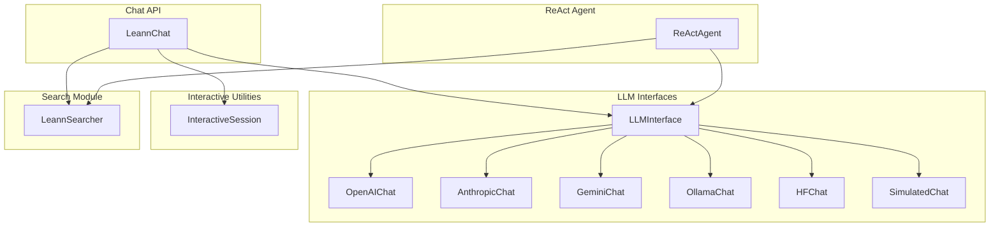

# Core Chat and Agent Layer

## Overview

The Core Chat and Agent Layer module provides a unified interface for interacting with Large Language Models (LLMs) and building intelligent agents that combine retrieval with reasoning capabilities. This module enables:

- Seamless integration with multiple LLM backends including OpenAI, Anthropic, Google Gemini, Ollama, and Hugging Face
- Retrieval-Augmented Generation (RAG) through the `LeannChat` interface that combines search with LLM responses
- Multi-turn reasoning agents using the ReAct pattern
- Interactive chat sessions for development and testing

This module sits between the core search API and end-user applications, providing a higher-level abstraction that combines retrieval with language generation. It depends on the [Core Search API and Interfaces](core_search_api_and_interfaces.md) module for search functionality.

## Architecture

The module is organized around four main component categories:

1. **LLM Interfaces** - Abstract base classes and concrete implementations for different LLM providers
2. **Chat API** - High-level `LeannChat` interface combining search and LLM capabilities
3. **ReAct Agent** - Multi-turn reasoning agent that can iteratively search and reason
4. **Interactive Utilities** - Tools for building interactive chat sessions



## Component Details

### LLM Interfaces

The LLM interface layer provides a uniform abstraction over different LLM providers. At its core is the abstract `LLMInterface` class that defines the standard `ask()` method. Concrete implementations handle the specifics of each provider.

For detailed documentation on the LLM interfaces, see [chat_interfaces.md](chat_interfaces.md).

### LeannChat

The `LeannChat` class is the main entry point for Retrieval-Augmented Generation. It combines:

- A `LeannSearcher` instance for retrieving relevant context
- An LLM interface for generating responses
- Optional interactive session support

For detailed documentation on `LeannChat`, see [chat_api.md](chat_api.md).

### ReActAgent

The `ReActAgent` implements the Reasoning + Acting (ReAct) pattern, enabling the agent to:
- Reason about what information is needed
- Formulate search queries
- Iterate until it has enough information to answer

For detailed documentation on the ReAct agent, see [react_agent.md](react_agent.md).

### Interactive Utilities

The `InteractiveSession` class provides shared functionality for building interactive chat applications, including:
- Command history
- Built-in commands (help, clear, history, quit)
- Readline support (where available)

For detailed documentation on interactive utilities, see [interactive_utils.md](interactive_utils.md).

## Usage Examples

### Basic LeannChat Usage

```python
from leann.api import LeannChat

# Initialize with default OpenAI settings
chat = LeannChat(index_path="path/to/index")

# Ask a question that combines search and LLM
response = chat.ask("What is LEANN?")
print(response)
```

### Using Custom LLM Configuration

```python
# Using Anthropic Claude
llm_config = {
    "type": "anthropic",
    "model": "claude-3-5-sonnet-20241022"
}

chat = LeannChat(
    index_path="path/to/index",
    llm_config=llm_config
)
```

### ReAct Agent Usage

```python
from leann.react_agent import create_react_agent

agent = create_react_agent(
    index_path="path/to/index",
    llm_config={"type": "openai", "model": "gpt-4o"},
    max_iterations=5
)

answer = agent.run("Explain the architecture of LEANN and how it works")
```

## Error Handling and Limitations

- **API Key Errors**: All cloud LLM providers require API keys. These can be set via environment variables or passed directly in the configuration.
- **Model Availability**: The module includes validation to check if requested models are available (locally for Ollama, remotely for Hugging Face).
- **Context Limits**: Be mindful of context window limits when using search results with many passages.
- **Cleanup**: Always call `cleanup()` or use context managers to properly release resources, especially embedding servers.

## Related Modules

- [Core Search API and Interfaces](core_search_api_and_interfaces.md) - Provides the search functionality used by this module
- [Core Runtime and Entrypoints](core_runtime_and_entrypoints.md) - Provides CLI and server interfaces that may use this module
