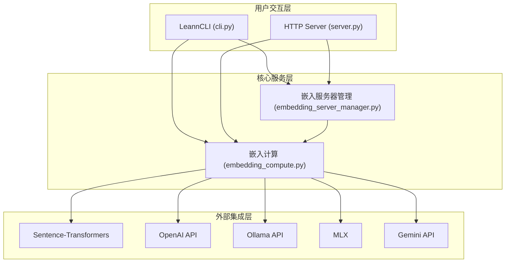
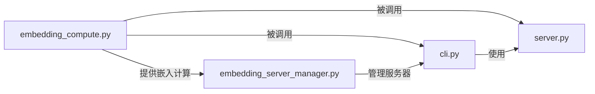

# core_runtime_and_entrypoints 模块文档

## 1. 模块概述

`core_runtime_and_entrypoints` 模块是 LEANN 系统的核心运行时和入口点模块，负责提供统一的嵌入计算、嵌入服务器管理、命令行界面 (CLI) 以及 HTTP API 服务。该模块作为用户与 LEANN 系统交互的主要桥梁，集成了从文档处理到搜索查询的完整工作流。

### 主要功能

- **统一嵌入计算**：支持多种嵌入模型和提供商（Sentence-Transformers、OpenAI、Ollama、MLX、Gemini）
- **嵌入服务器管理**：管理跨进程的嵌入服务器生命周期，支持守护进程模式
- **命令行界面**：提供完整的 CLI 工具，支持索引构建、搜索、问答等功能
- **HTTP API 服务**：提供 RESTful API 接口，便于与其他系统集成

### 设计理念

该模块采用模块化设计，各组件之间低耦合高内聚，确保：
- 灵活的嵌入计算方式切换
- 高效的资源利用（模型缓存、服务器复用）
- 良好的用户体验（简洁的 CLI 和 API）
- 跨平台兼容性（支持多种操作系统和环境）

## 2. 架构概览



### 组件说明

1. **LeannCLI**：命令行界面，提供 `build`、`search`、`ask`、`react` 等命令
2. **HTTP Server**：基于 FastAPI 的 RESTful API 服务
3. **嵌入计算模块**：统一的嵌入计算接口，支持多种后端
4. **嵌入服务器管理器**：管理嵌入服务器进程的生命周期

## 3. 核心组件详解

### 3.1 嵌入计算模块 (embedding_compute.py)

嵌入计算模块提供了统一的接口来计算文本嵌入，支持多种嵌入模型和提供商。

#### 核心功能

- 多种嵌入模式支持：Sentence-Transformers、OpenAI、Ollama、MLX、Gemini
- 智能模型缓存机制，避免重复加载
- 自适应批处理优化
- 令牌限制自动检测和截断
- 设备自动检测和优化（CUDA、MPS、CPU）

#### 主要类和函数

##### `_SentenceTransformerLike` 协议

定义了 SentenceTransformer 模型的接口协议，用于类型提示和兼容性保证。

##### `compute_embeddings` 函数

统一的嵌入计算入口点，根据指定的模式分发到相应的实现。

**参数：**
- `texts`: 要计算嵌入的文本列表
- `model_name`: 模型名称
- `mode`: 计算模式 ('sentence-transformers', 'openai', 'mlx', 'ollama', 'gemini')
- `is_build`: 是否为构建操作（显示进度条）
- `batch_size`: 批处理大小
- `adaptive_optimization`: 是否使用自适应优化

**返回值：**
- 归一化的嵌入数组，形状为 `(len(texts), embedding_dim)`

##### `get_model_token_limit` 函数

获取嵌入模型的令牌限制，支持动态发现和注册表回退。

**参数：**
- `model_name`: 模型名称
- `base_url`: 嵌入服务器的基础 URL（用于动态发现）
- `default`: 默认令牌限制

**返回值：**
- 模型的令牌限制（以令牌为单位）

##### `truncate_to_token_limit` 函数

使用 tiktoken 将文本截断到令牌限制内。

**参数：**
- `texts`: 要截断的文本列表
- `token_limit`: 最大允许令牌数

**返回值：**
- 截断后的文本列表（与输入长度相同）

#### 使用示例

```python
from leann.embedding_compute import compute_embeddings

# 使用 Sentence-Transformers 计算嵌入
embeddings = compute_embeddings(
    texts=["Hello world", "This is a test"],
    model_name="facebook/contriever",
    mode="sentence-transformers"
)

# 使用 OpenAI API 计算嵌入
embeddings = compute_embeddings(
    texts=["Hello world", "This is a test"],
    model_name="text-embedding-3-small",
    mode="openai",
    provider_options={"api_key": "your-api-key"}
)
```

### 3.2 嵌入服务器管理器 (embedding_server_manager.py)

嵌入服务器管理器负责管理嵌入服务器进程的生命周期，支持跨进程复用和守护进程模式。

#### 核心功能

- 服务器进程启动和停止管理
- 配置签名匹配和服务器复用
- 守护进程模式支持
- 跨进程锁和注册表管理
- Colab 环境特殊支持

#### 主要类

##### `EmbeddingServerManager` 类

嵌入服务器管理器的主类。

**初始化参数：**
- `backend_module_name`: 后端服务器脚本的完整模块名

**主要方法：**

###### `start_server`

启动嵌入服务器。

**参数：**
- `port`: 端口号
- `model_name`: 模型名称
- `embedding_mode`: 嵌入模式
- `**kwargs`: 其他配置选项

**返回值：**
- 元组 `(success: bool, port: int)`

###### `stop_server`

停止嵌入服务器进程。

###### `list_daemons` (类方法)

列出所有运行中的守护进程。

**返回值：**
- 守护进程记录列表

###### `stop_daemons` (类方法)

停止守护进程。

**参数：**
- `backend_module_name`: 可选的后端模块名过滤
- `passages_file`: 可选的段落文件过滤

**返回值：**
- 停止的守护进程数量

#### 使用示例

```python
from leann.embedding_server_manager import EmbeddingServerManager

# 创建管理器
manager = EmbeddingServerManager("leann_backend_hnsw.embedding_server")

# 启动服务器
success, port = manager.start_server(
    port=5557,
    model_name="facebook/contriever",
    embedding_mode="sentence-transformers"
)

# 列出守护进程
daemons = EmbeddingServerManager.list_daemons()

# 停止服务器
manager.stop_server()

# 停止所有守护进程
stopped = EmbeddingServerManager.stop_daemons(backend_module_name="leann_backend_hnsw.embedding_server")
```

### 3.3 命令行界面 (cli.py)

命令行界面模块提供了完整的 CLI 工具，是用户与 LEANN 系统交互的主要方式。

#### 核心功能

- 索引构建（支持增量更新）
- 文档搜索
- 问答功能
- ReAct 代理
- 索引管理
- HTTP 服务器启动

#### 主要类

##### `LeannCLI` 类

命令行界面的主类。

**主要方法：**

###### `build_index`

构建文档索引。

**参数：**
- `args`: 命令行参数

###### `search_documents`

搜索文档。

**参数：**
- `args`: 命令行参数

###### `ask_questions`

问答功能。

**参数：**
- `args`: 命令行参数

###### `react_agent`

ReAct 代理功能。

**参数：**
- `args`: 命令行参数

#### CLI 命令

```bash
# 构建索引
leann build my-docs --docs ./documents

# 搜索
leann search my-docs "query"

# 问答
leann ask my-docs "question"

# ReAct 代理
leann react my-docs "complex question"

# 列出索引
leann list

# 移除索引
leann remove my-docs

# 启动 HTTP 服务器
leann serve
```

### 3.4 HTTP 服务器 (server.py)

HTTP 服务器模块提供了 RESTful API 接口，便于与其他系统集成。

#### 核心功能

- 健康检查
- 索引列表
- 语义搜索

#### 主要组件

##### `SearchRequest` 模型

搜索请求的 Pydantic 模型。

**字段：**
- `query`: 搜索查询
- `top_k`: 返回结果数量
- `complexity`: 搜索复杂度
- `beam_width`: 波束宽度
- `prune_ratio`: 剪枝比例
- `recompute_embeddings`: 是否重新计算嵌入
- `pruning_strategy`: 剪枝策略
- `use_grep`: 是否使用 grep

##### `SearchResultModel` 模型

搜索结果的 Pydantic 模型。

**字段：**
- `id`: 结果 ID
- `score`: 相似度分数
- `text`: 文本内容
- `metadata`: 元数据

#### API 端点

- `GET /health`: 健康检查
- `GET /indexes`: 列出索引
- `POST /indexes/{name}/search`: 语义搜索

#### 使用示例

```bash
# 启动服务器
leann serve

# 健康检查
curl http://localhost:8000/health

# 列出索引
curl http://localhost:8000/indexes

# 搜索
curl -X POST http://localhost:8000/indexes/my-docs/search \
  -H "Content-Type: application/json" \
  -d '{"query": "test query", "top_k": 5}'
```

## 4. 子模块关系



## 5. 配置和使用

### 环境变量

- `LEANN_LOG_LEVEL`: 日志级别（DEBUG, INFO, WARNING, ERROR）
- `LEANN_EMBEDDING_DEVICE`: 嵌入计算设备（cuda, mps, cpu）
- `LEANN_SERVER_HOST`: HTTP 服务器主机
- `LEANN_SERVER_PORT`: HTTP 服务器端口
- `OPENAI_API_KEY`: OpenAI API 密钥
- `GEMINI_API_KEY`: Gemini API 密钥

### 配置选项

- 嵌入模型选择
- 嵌入模式切换
- 批处理大小调整
- 服务器端口配置
- 守护进程 TTL 设置

## 6. 注意事项和限制

1. **嵌入模型缓存**：模型会被缓存以提高性能，但会占用内存
2. **令牌限制**：不同模型有不同的令牌限制，超过的文本会被截断
3. **服务器端口**：默认端口范围是 5557-5657
4. **守护进程**：守护进程会在空闲一段时间后自动关闭
5. **增量更新**：仅支持 HNSW 后端的非紧凑索引
6. **API 依赖**：HTTP 服务器需要额外的依赖（FastAPI, uvicorn）

## 7. 相关模块

- [core_search_api_and_interfaces](core_search_api_and_interfaces.md)：核心搜索 API 和接口
- [core_chat_and_agent_layer](core_chat_and_agent_layer.md)：聊天和代理层
- [backend_hnsw](backend_hnsw.md)：HNSW 后端
- [backend_ivf](backend_ivf.md)：IVF 后端
- [backend_diskann](backend_diskann.md)：DiskANN 后端
