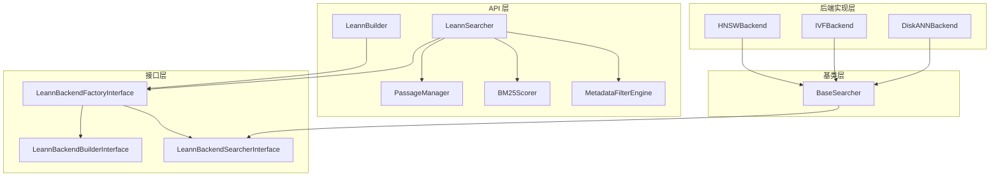

# Core Search API and Interfaces 模块文档

## 1. 模块概述

`core_search_api_and_interfaces` 模块是 LEANN 项目的核心搜索 API 和接口层，提供了构建、管理和查询向量搜索索引的高级抽象。该模块负责协调不同的后端实现（如 HNSW、IVF、DiskANN），提供统一的搜索接口，并支持元数据过滤、混合搜索等高级功能。

### 主要功能

- 提供构建向量搜索索引的统一接口
- 支持多种后端实现（HNSW、IVF、DiskANN）
- 实现向量搜索、关键词搜索和混合搜索
- 提供元数据过滤功能
- 管理嵌入计算和服务器资源
- 支持索引更新和扩展

### 设计理念

该模块采用分层架构设计，通过接口抽象将核心搜索逻辑与具体后端实现分离，使得系统可以灵活地切换和扩展不同的搜索后端。同时，提供了高级 API 类（如 `LeannBuilder`、`LeannSearcher`）来简化用户的使用体验。

## 2. 架构概览



### 架构说明

1. **API 层**：提供用户友好的高级接口，包括 `LeannBuilder`（构建索引）、`LeannSearcher`（执行搜索）、`PassageManager`（管理文档）、`BM25Scorer`（关键词搜索）和 `MetadataFilterEngine`（元数据过滤）。

2. **接口层**：定义了后端实现必须遵循的契约，包括 `LeannBackendFactoryInterface`（工厂接口）、`LeannBackendBuilderInterface`（构建器接口）和 `LeannBackendSearcherInterface`（搜索器接口）。

3. **基类层**：提供 `BaseSearcher` 抽象基类，实现了搜索器的通用功能，如元数据加载、嵌入服务器管理等。

4. **后端实现层**：包含具体的搜索后端实现，如 HNSW、IVF 和 DiskANN，这些实现继承自 `BaseSearcher` 并实现了相应的接口。

## 3. 核心组件详细说明

### 3.1 LeannBuilder

`LeannBuilder` 是用于构建向量搜索索引的主要类，负责收集文档、计算嵌入、构建索引并保存相关文件。

#### 主要功能

- **文档收集**：通过 `add_text()` 方法添加文档文本和元数据
- **嵌入计算**：支持多种嵌入模型和模式，包括 sentence-transformers、OpenAI、Gemini 等
- **索引构建**：使用指定的后端（如 HNSW、IVF）构建向量索引
- **文件管理**：保存索引、文档和元数据文件
- **预计算嵌入支持**：通过 `build_index_from_embeddings()` 方法支持从预计算的嵌入构建索引
- **索引更新**：通过 `update_index()` 方法支持向现有索引添加新文档

#### 关键方法

- `__init__(backend_name, embedding_model, dimensions, embedding_mode, embedding_options, **backend_kwargs)`：初始化构建器，指定后端和嵌入参数
- `add_text(text, metadata=None)`：添加文档文本和可选元数据
- `build_index(index_path)`：构建索引并保存到指定路径
- `build_index_from_embeddings(index_path, embeddings_file)`：从预计算的嵌入构建索引
- `update_index(index_path, remove_passage_ids=None)`：更新现有索引

#### 使用示例

```python
from leann.api import LeannBuilder

# 创建构建器
builder = LeannBuilder(
    backend_name="hnsw",
    embedding_model="facebook/contriever",
    dimensions=768,
    embedding_mode="sentence-transformers"
)

# 添加文档
builder.add_text("这是第一个文档", metadata={"id": "doc1", "category": "tech"})
builder.add_text("这是第二个文档", metadata={"id": "doc2", "category": "business"})

# 构建索引
builder.build_index("path/to/index.leann")
```

### 3.2 LeannSearcher

`LeannSearcher` 是用于执行搜索的主要类，负责加载索引、计算查询嵌入、执行搜索并返回结果。

#### 主要功能

- **索引加载**：从指定路径加载预构建的索引
- **查询嵌入**：计算查询文本的向量表示
- **向量搜索**：使用后端实现执行高效的向量相似度搜索
- **关键词搜索**：集成 BM25 算法支持纯关键词搜索
- **混合搜索**：结合向量搜索和关键词搜索的优势
- **元数据过滤**：支持基于元数据的结果过滤
- **资源管理**：管理嵌入服务器生命周期，支持预热和守护进程模式

#### 关键方法

- `__init__(index_path, enable_warmup, recompute_embeddings, use_daemon, daemon_ttl_seconds, **backend_kwargs)`：初始化搜索器
- `search(query, top_k, complexity, beam_width, prune_ratio, metadata_filters, gemma, use_grep, **kwargs)`：执行搜索
- `warmup()`：预热嵌入路径以加快首次查询
- `cleanup()`：显式清理嵌入服务器资源

#### 使用示例

```python
from leann.api import LeannSearcher

# 创建搜索器
searcher = LeannSearcher("path/to/index.leann")

# 执行向量搜索
results = searcher.search(
    query="搜索查询",
    top_k=5,
    complexity=64
)

# 打印结果
for result in results:
    print(f"ID: {result.id}, Score: {result.score}")
    print(f"Text: {result.text}")
    print(f"Metadata: {result.metadata}")
    print("-" * 50)

# 清理资源
searcher.cleanup()
```

### 3.3 PassageManager

`PassageManager` 负责管理文档数据，提供文档的存储、检索和过滤功能。

#### 主要功能

- **索引加载**：加载文档索引文件，支持分片管理以减少内存占用
- **文档检索**：根据文档 ID 高效检索文档内容
- **元数据过滤**：应用元数据过滤器到搜索结果
- **大型语料支持**：采用分片索引设计，支持处理 60M+ 文档的大型语料库

#### 关键方法

- `__init__(passage_sources, metadata_file_path=None)`：初始化 PassageManager
- `get_passage(passage_id)`：根据文档 ID 获取文档内容
- `filter_search_results(search_results, metadata_filters)`：应用元数据过滤器到搜索结果
- `__len__()`：返回文档总数

#### 内部设计

PassageManager 采用分片设计，避免在内存中维护一个巨大的全局映射，而是为每个分片维护单独的索引映射，并在需要时进行轻量级的分片查找。这种设计显著降低了大型语料库的内存占用。

### 3.4 BM25Scorer

`BM25Scorer` 实现了 BM25 关键词搜索算法，用于基于文本内容的搜索。

#### 主要功能

- **统计信息构建**：从文档语料库构建 BM25 所需的统计信息
- **相关性计算**：计算查询与文档的 BM25 相关性得分
- **关键词搜索**：执行纯关键词搜索

#### 关键方法

- `__init__(k1=1.2, b=0.75)`：初始化 BM25 评分器，设置 k1 和 b 参数
- `fit(documents)`：从文档语料库构建统计信息
- `score(query_words, document_id)`：计算查询与特定文档的相关性得分
- `search(query, top_k=5)`：执行关键词搜索

#### BM25 算法

BM25 是一种基于概率的信息检索算法，通过计算查询词在文档中的词频 (TF) 和逆文档频率 (IDF) 来评估文档与查询的相关性。k1 参数控制词频饱和度，b 参数控制文档长度归一化。

### 3.5 MetadataFilterEngine

`MetadataFilterEngine` 提供了基于元数据的搜索结果过滤功能。

#### 主要功能

- **比较运算**：支持 ==, !=, <, <=, >, >= 等比较运算符
- **成员运算**：支持 in 和 not_in 成员运算符
- **字符串运算**：支持 contains, starts_with, ends_with 字符串运算符
- **布尔运算**：支持 is_true 和 is_false 布尔运算符

#### 关键方法

- `__init__()`：初始化过滤器引擎，注册支持的运算符
- `apply_filters(search_results, metadata_filters)`：应用元数据过滤器到搜索结果
- `_evaluate_filters(result, filters)`：评估单个结果是否满足所有过滤器
- `_evaluate_field_filter(result, field_name, filter_spec)`：评估单个字段的过滤器

#### 过滤器格式

过滤器采用字典格式，格式为：`{"field_name": {"operator": value}}`。例如：

```python
metadata_filters = {
    "category": {"==": "tech"},
    "date": {">=": "2023-01-01"},
    "tags": {"in": ["ai", "machine-learning"]}
}
```

### 3.6 接口定义

模块定义了三个核心接口，用于规范后端实现：

#### LeannBackendFactoryInterface

后端工厂接口，用于创建构建器和搜索器实例。

- `builder(**kwargs)`：创建构建器实例
- `searcher(index_path, **kwargs)`：创建搜索器实例

#### LeannBackendBuilderInterface

后端构建器接口，定义了构建索引的方法。

- `build(data, ids, index_path, **kwargs)`：构建索引

#### LeannBackendSearcherInterface

后端搜索器接口，定义了搜索和嵌入计算的方法。

- `__init__(index_path, **kwargs)`：初始化搜索器
- `_ensure_server_running(passages_source_file, port, **kwargs)`：确保服务器运行
- `search(query, top_k, complexity, beam_width, prune_ratio, recompute_embeddings, pruning_strategy, zmq_port, **kwargs)`：执行搜索
- `compute_query_embedding(query, use_server_if_available, zmq_port, query_template)`：计算查询嵌入

### 3.7 BaseSearcher

`BaseSearcher` 是搜索器的抽象基类，实现了通用的搜索器功能。

#### 主要功能

- **元数据加载**：加载索引的元数据文件
- **嵌入服务器管理**：管理嵌入服务器的启动、停止和通信
- **查询嵌入计算**：提供统一的查询嵌入计算接口，支持服务器和直接计算两种模式
- **搜索抽象**：定义搜索方法的抽象接口，由具体后端实现

#### 关键方法

- `__init__(index_path, backend_module_name, **kwargs)`：初始化 BaseSearcher
- `_load_meta()`：加载元数据文件
- `_ensure_server_running(passages_source_file, port, **kwargs)`：确保嵌入服务器运行
- `compute_query_embedding(query, use_server_if_available, zmq_port, query_template)`：计算查询嵌入
- `_compute_embedding_via_server(chunks, zmq_port)`：通过服务器计算嵌入
- `search(query, top_k, complexity, beam_width, prune_ratio, recompute_embeddings, pruning_strategy, zmq_port, **kwargs)`：抽象搜索方法，由子类实现

## 4. 子模块文档

本模块的核心组件相对集中，不需要进一步拆分为子模块。所有核心功能都在本模块中实现，相关的后端实现请参考其他模块的文档：

- [backend_hnsw](backend_hnsw.md)：HNSW 后端实现
- [backend_ivf](backend_ivf.md)：IVF 后端实现
- [backend_diskann](backend_diskann.md)：DiskANN 后端实现

## 5. 使用示例

### 5.1 构建索引

```python
from leann.api import LeannBuilder

# 创建构建器
builder = LeannBuilder(
    backend_name="hnsw",
    embedding_model="facebook/contriever",
    dimensions=768,
    embedding_mode="sentence-transformers"
)

# 添加文档
builder.add_text("这是第一个文档", metadata={"id": "doc1", "category": "tech"})
builder.add_text("这是第二个文档", metadata={"id": "doc2", "category": "business"})

# 构建索引
builder.build_index("path/to/index.leann")
```

### 5.2 搜索文档

```python
from leann.api import LeannSearcher

# 创建搜索器
searcher = LeannSearcher("path/to/index.leann")

# 执行向量搜索
results = searcher.search(
    query="搜索查询",
    top_k=5,
    complexity=64
)

# 打印结果
for result in results:
    print(f"ID: {result.id}, Score: {result.score}")
    print(f"Text: {result.text}")
    print(f"Metadata: {result.metadata}")
    print("-" * 50)
```

### 5.3 使用元数据过滤

```python
# 执行带元数据过滤的搜索
results = searcher.search(
    query="搜索查询",
    top_k=5,
    metadata_filters={
        "category": {"==": "tech"},
        "date": {">=": "2023-01-01"}
    }
)
```

### 5.4 混合搜索

```python
# 执行混合搜索（向量 + 关键词）
results = searcher.search(
    query="搜索查询",
    top_k=5,
    gemma=0.7  # 向量搜索权重为 0.7，关键词搜索权重为 0.3
)
```

## 6. 配置选项

### LeannBuilder 配置

| 参数 | 类型 | 默认值 | 描述 |
|------|------|--------|------|
| backend_name | str | - | 后端名称（如 "hnsw", "ivf", "diskann"） |
| embedding_model | str | "facebook/contriever" | 嵌入模型名称 |
| dimensions | Optional[int] | None | 嵌入维度，如不提供则自动检测 |
| embedding_mode | str | "sentence-transformers" | 嵌入模式 |
| embedding_options | Optional[dict] | None | 嵌入模型的额外选项 |
| **backend_kwargs | - | - | 后端特定的参数 |

### LeannSearcher 配置

| 参数 | 类型 | 默认值 | 描述 |
|------|------|--------|------|
| index_path | str | - | 索引路径 |
| enable_warmup | bool | True | 是否启用预热 |
| recompute_embeddings | bool | True | 是否重新计算嵌入 |
| use_daemon | bool | True | 是否使用守护进程 |
| daemon_ttl_seconds | int | 900 | 守护进程 TTL（秒） |
| **backend_kwargs | - | - | 后端特定的参数 |

### 搜索参数

| 参数 | 类型 | 默认值 | 描述 |
|------|------|--------|------|
| query | str | - | 搜索查询 |
| top_k | int | 5 | 返回结果数量 |
| complexity | int | 64 | 搜索复杂度 |
| beam_width | int | 1 | 波束宽度 |
| prune_ratio | float | 0.0 | 剪枝比例 |
| metadata_filters | Optional[dict] | None | 元数据过滤器 |
| gemma | float | 1.0 | 混合搜索权重（1.0=纯向量，0.0=纯关键词） |
| use_grep | bool | False | 是否使用 grep 搜索 |

## 7. 注意事项和限制

1. **索引更新限制**：紧凑模式的 HNSW 索引不支持原地更新，需要重新构建索引。

2. **嵌入模型选择**：某些嵌入模型（如 OpenAI、Voyage、Cohere 的模型）会自动使用余弦距离度量，以获得最佳性能。

3. **内存使用**：对于大型文档集合，PassageManager 采用分片管理以减少内存占用。

4. **服务器资源**：使用嵌入服务器时，确保在使用完毕后调用 cleanup() 方法释放资源，或使用上下文管理器。

5. **元数据过滤**：元数据过滤是在搜索结果返回后应用的，因此可能返回少于 top_k 的结果。

6. **混合搜索**：混合搜索需要同时加载 BM25 索引，可能会增加内存使用。

7. **grep 搜索**：grep 搜索依赖于系统的 grep 命令，可能不适用于所有环境。

8. **线程安全**：当前实现不保证线程安全，在多线程环境中使用时需要额外的同步机制。

9. **错误处理**：在使用过程中注意处理可能的异常，如文件不存在、索引损坏等。

10. **版本兼容性**：注意保持索引构建和搜索时使用的库版本一致，避免兼容性问题。

## 8. 高级使用示例

### 8.1 使用上下文管理器

```python
from leann.api import LeannSearcher

# 使用上下文管理器自动管理资源
with LeannSearcher("path/to/index.leann") as searcher:
    results = searcher.search("搜索查询", top_k=5)
    for result in results:
        print(f"ID: {result.id}, Score: {result.score}")
# 退出上下文后自动清理资源
```

### 8.2 从预计算嵌入构建索引

```python
from leann.api import LeannBuilder
import numpy as np

# 假设有预计算的嵌入
ids = ["doc1", "doc2", "doc3"]
embeddings = np.random.rand(3, 768).astype(np.float32)

# 保存嵌入到文件
import pickle
with open("embeddings.pkl", "wb") as f:
    pickle.dump((ids, embeddings), f)

# 从预计算嵌入构建索引
builder = LeannBuilder(
    backend_name="hnsw",
    embedding_model="facebook/contriever",
    dimensions=768
)

# 可选：添加文档文本（如果没有提供，会创建占位符）
builder.add_text("文档 1 内容", metadata={"id": "doc1"})
builder.add_text("文档 2 内容", metadata={"id": "doc2"})
builder.add_text("文档 3 内容", metadata={"id": "doc3"})

# 构建索引
builder.build_index_from_embeddings("path/to/index.leann", "embeddings.pkl")
```

### 8.3 更新现有索引

```python
from leann.api import LeannBuilder

# 创建构建器（使用与原始索引相同的配置）
builder = LeannBuilder(
    backend_name="hnsw",
    embedding_model="facebook/contriever",
    dimensions=768
)

# 添加新文档
builder.add_text("新文档内容", metadata={"id": "new_doc1", "category": "update"})

# 更新索引（注意：紧凑模式的 HNSW 索引不支持更新）
builder.update_index("path/to/index.leann")
```

### 8.4 使用不同的嵌入模式

```python
from leann.api import LeannBuilder

# 使用 OpenAI 嵌入
builder_openai = LeannBuilder(
    backend_name="hnsw",
    embedding_model="text-embedding-3-small",
    embedding_mode="openai",
    embedding_options={"api_key": "your-api-key"}
)

# 使用 Gemini 嵌入
builder_gemini = LeannBuilder(
    backend_name="hnsw",
    embedding_model="models/text-embedding-004",
    embedding_mode="gemini",
    embedding_options={"api_key": "your-api-key"}
)

# 添加文档并构建索引
builder_openai.add_text("使用 OpenAI 嵌入的文档")
builder_openai.build_index("path/to/openai_index.leann")
```

### 8.5 复杂的元数据过滤

```python
from leann.api import LeannSearcher

searcher = LeannSearcher("path/to/index.leann")

# 复杂的元数据过滤
results = searcher.search(
    query="搜索查询",
    top_k=10,
    metadata_filters={
        "category": {"in": ["tech", "business"]},
        "date": {">=": "2023-01-01", "<=": "2023-12-31"},
        "views": {">": 1000},
        "is_published": {"is_true": True},
        "title": {"contains": "AI"}
    }
)
```

## 9. 最佳实践

### 9.1 索引构建最佳实践

1. **预处理文档**：在添加文档前进行必要的预处理，如去除多余空白、统一格式等。
2. **设置合理的维度**：如果已知嵌入模型的输出维度，显式设置 `dimensions` 参数可以避免额外的嵌入计算。
3. **分批处理大型语料库**：对于非常大的语料库，考虑分批构建索引，然后合并。
4. **保存元数据**：充分利用元数据字段存储有用信息，便于后续过滤和检索。

### 9.2 搜索最佳实践

1. **使用上下文管理器**：使用 `with` 语句确保资源正确释放。
2. **启用预热**：对于交互式应用，启用 `enable_warmup` 可以加快首次查询。
3. **调整 top_k**：根据实际需求调整 `top_k` 参数，避免返回过多结果。
4. **合理使用混合搜索**：根据数据特点调整 `gemma` 参数，平衡向量搜索和关键词搜索的权重。
5. **利用元数据过滤**：在搜索时使用元数据过滤可以显著提高结果质量。

### 9.3 性能优化建议

1. **选择合适的后端**：根据数据规模和查询特性选择合适的后端（HNSW 适合中小规模，IVF 适合大规模）。
2. **调整搜索参数**：根据精度和速度的权衡调整 `complexity`、`beam_width` 等参数。
3. **使用嵌入服务器**：对于频繁查询的场景，使用嵌入服务器可以显著提高性能。
4. **监控资源使用**：注意内存和磁盘使用情况，特别是对于大型索引。
