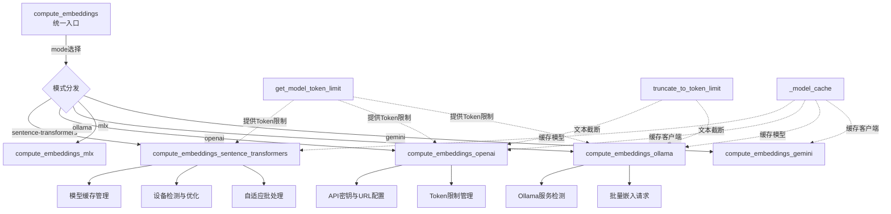

# 嵌入计算模块 (embedding_compute) 文档

## 概述

`embedding_compute` 模块是 Leann 系统中负责统一嵌入计算的核心组件。它提供了一个标准化接口，支持通过多种后端（包括 SentenceTransformers、OpenAI、MLX、Ollama 和 Gemini）生成文本嵌入。该模块设计目标是简化嵌入计算流程，同时提供强大的优化功能，如模型缓存、自适应批处理、精度优化和动态 token 限制管理。

本模块的主要功能包括：

- 统一的 `compute_embeddings` 入口点，支持多种嵌入计算模式
- 模型缓存机制，避免重复加载
- 自动设备检测与优化配置
- 动态 token 限制发现与文本截断
- 详细的性能日志记录
- 多种嵌入后端的无缝支持

## 核心组件

### _SentenceTransformerLike 协议

`_SentenceTransformerLike` 是一个类型协议，定义了与 SentenceTransformer 模型交互所需的最小接口。这允许在不依赖具体实现的情况下，对不同的模型类型进行类型检查和接口标准化。

```python
class _SentenceTransformerLike(Protocol):
    def eval(self) -> Any: ...
    def parameters(self) -> Any: ...
    def encode(self, *args: Any, **kwargs: Any) -> Any: ...
    def half(self) -> Any: ...
```

此协议确保任何符合接口的模型都可以在嵌入计算流程中互换使用，提高了代码的灵活性和可扩展性。

## 主要功能

### 统一嵌入计算入口

`compute_embeddings` 函数是模块的主要入口点，提供了统一的接口来调用不同的嵌入计算后端。

```python
def compute_embeddings(
    texts: list[str],
    model_name: str,
    mode: str = "sentence-transformers",
    is_build: bool = False,
    batch_size: int = 32,
    adaptive_optimization: bool = True,
    manual_tokenize: bool = False,
    max_length: int = 512,
    provider_options: Optional[dict[str, Any]] = None,
) -> np.ndarray
```

**参数说明：**
- `texts`: 需要计算嵌入的文本列表
- `model_name`: 使用的模型名称
- `mode`: 计算模式，可选值包括 `sentence-transformers`、`openai`、`mlx`、`ollama`、`gemini`
- `is_build`: 是否为构建操作（控制是否显示进度条）
- `batch_size`: 处理批次大小
- `adaptive_optimization`: 是否使用自适应优化
- `manual_tokenize`: 是否使用手动分词路径
- `max_length`: 最大序列长度
- `provider_options`: 提供者特定选项的字典

**返回值：**
- 形状为 `(len(texts), embedding_dim)` 的标准化嵌入数组

### SentenceTransformers 嵌入计算

`compute_embeddings_sentence_transformers` 函数实现了使用 SentenceTransformer 模型进行嵌入计算的功能，并包含了多项性能优化。

主要特性：
- 自动设备检测（支持 CUDA、MPS、CPU）
- 模型缓存机制，避免重复加载
- 自适应批处理优化
- FP16 精度支持
- 高级硬件优化（如 torch.compile）
- 可选的手动分词路径用于实验性优化

**设备优化配置：**
- MPS 设备默认批次大小为 128（特定模型为 32）
- CUDA 设备默认批次大小为 256
- CPU 设备保持原始批次大小

**使用示例：**

```python
from leann.embedding_compute import compute_embeddings

texts = ["这是一段示例文本", "这是另一段文本"]
embeddings = compute_embeddings(
    texts,
    model_name="all-MiniLM-L6-v2",
    mode="sentence-transformers",
    is_build=True
)
```

### OpenAI 嵌入计算

`compute_embeddings_openai` 函数通过 OpenAI API 计算嵌入，支持所有 OpenAI 兼容的嵌入服务（包括自定义兼容端点）。

主要特性：
- API 密钥和基础 URL 的灵活配置
- 支持提示模板应用
- 动态 token 限制检测
- 智能批处理（基于平均文本长度调整）
- 对 Gemini 兼容端点的特殊处理

**使用示例：**

```python
embeddings = compute_embeddings(
    texts,
    model_name="text-embedding-3-small",
    mode="openai",
    provider_options={
        "api_key": "your-api-key",
        "base_url": "https://api.openai.com/v1"
    }
)
```

### Ollama 嵌入计算

`compute_embeddings_ollama` 函数利用 Ollama API 进行嵌入计算，支持本地运行的各种开源嵌入模型。

主要特性：
- 自动检测 Ollama 服务状态
- 模型存在性验证和嵌入支持检查
- 真正的批处理支持
- 智能重试机制
- 嵌入维度一致性验证
- 自动 L2 归一化

**使用示例：**

```python
embeddings = compute_embeddings(
    texts,
    model_name="nomic-embed-text",
    mode="ollama",
    provider_options={
        "host": "http://localhost:11434"
    }
)
```

### MLX 和 Gemini 嵌入计算

模块还支持通过 MLX（用于 Apple Silicon 优化）和 Google Gemini API 进行嵌入计算，提供了更广泛的模型选择和平台优化。

## Token 限制管理

该模块实现了复杂的 token 限制管理机制，确保输入文本符合模型的最大序列长度要求。

### 模型 Token 限制获取

`get_model_token_limit` 函数通过混合方法确定模型的 token 限制：

1. 首先检查缓存中是否已有结果
2. 对于 Ollama 模型，通过 `/api/show` 动态发现
3. 对于 LM Studio，通过 Node.js 子进程调用 SDK 查询
4. 回退到预定义的模型限制注册表
5. 如果都找不到，使用默认值（2048 tokens）

### 文本截断

`truncate_to_token_limit` 函数使用 tiktoken 库（cl100k_base 编码）将文本截断到指定的 token 限制：

- 记录截断统计信息（截断的文本数量、移除的 token 总数等）
- 对前几个截断操作发出详细警告
- 提供总体截断摘要

## 架构设计



上图展示了 `embedding_compute` 模块的整体架构。核心是 `compute_embeddings` 函数作为统一入口，根据指定的模式将请求分发到不同的后端实现。每个后端实现都针对其特定平台进行了优化，并共享了 Token 限制管理和文本截断等公用功能。模型缓存机制确保了高性能和资源的有效利用。

## 性能优化

该模块包含了多项性能优化策略：

### 模型缓存

所有模型加载后都会存储在全局缓存中，使用包含模型名称、设备和优化设置的键。这避免了重复加载模型的开销，特别是在多次调用嵌入计算时。

### 自适应优化

当 `adaptive_optimization` 设置为 `True` 时，模块会根据设备类型自动调整批处理大小：
- MPS 设备使用 128 的批处理大小（特定模型为 32）
- CUDA 设备使用 256 的批处理大小
- CPU 设备保持原始批处理大小

### 硬件特定优化

- **CUDA**: 启用 TF32、CuDNN 基准测试、设置内存使用比例
- **MPS**: 设置内存使用比例（如支持）
- **CPU**: 设置线程数、启用 MKLDNN（如支持）

### 高级模型优化

- FP16 精度转换（适用于支持的设备）
- torch.compile 优化（减少开销模式）
- 模型设置为评估模式并禁用梯度计算

## 错误处理和边缘情况

### 输入验证

所有嵌入计算函数都会验证输入文本列表不为空，某些实现（如 OpenAI）还会检查单个文本是否有效。

### 嵌入验证

计算后的嵌入会经过检查，确保不包含 NaN 或 Inf 值，这可能表明模型计算过程中出现了问题。

### 失败处理

- **Ollama**: 实现了重试机制，对失败批次提供零向量作为备用
- **OpenAI**: 批处理失败会记录错误并重新抛出异常
- **所有实现**: 嵌入维度一致性验证，防止维度不一致导致的后续问题

### 模型加载回退

SentenceTransformers 实现包含多层回退机制：
1. 首先尝试使用高级参数本地加载
2. 如果失败，尝试基本本地加载
3. 如果仍失败，尝试网络下载（带高级参数）
4. 最后尝试基本网络加载

## 使用指南

### 基本使用

```python
from leann.embedding_compute import compute_embeddings

# 准备文本
texts = ["第一个文档内容", "第二个文档内容", "第三个文档内容"]

# 使用 SentenceTransformers
embeddings_st = compute_embeddings(
    texts,
    model_name="all-MiniLM-L6-v2",
    mode="sentence-transformers"
)

# 使用 OpenAI
embeddings_openai = compute_embeddings(
    texts,
    model_name="text-embedding-3-small",
    mode="openai",
    provider_options={"api_key": "your-key"}
)

# 使用 Ollama
embeddings_ollama = compute_embeddings(
    texts,
    model_name="nomic-embed-text",
    mode="ollama"
)
```

### 高级配置

```python
# 自定义批处理大小和禁用自适应优化
embeddings = compute_embeddings(
    texts,
    model_name="all-MiniLM-L6-v2",
    mode="sentence-transformers",
    batch_size=64,
    adaptive_optimization=False
)

# 使用手动分词路径（实验性）
embeddings = compute_embeddings(
    texts,
    model_name="all-MiniLM-L6-v2",
    mode="sentence-transformers",
    manual_tokenize=True,
    max_length=256
)

# 使用提示模板（适用于 OpenAI 和 Ollama）
embeddings = compute_embeddings(
    texts,
    model_name="text-embedding-3-small",
    mode="openai",
    provider_options={
        "prompt_template": "为以下文本生成嵌入: "
    }
)
```

## 扩展与集成

该模块设计为易于扩展，可以通过以下方式添加新的嵌入提供者：

1. 实现新的 `compute_embeddings_*` 函数，遵循现有模式
2. 在 `compute_embeddings` 函数的模式分发部分添加新的分支
3. 确保利用共享工具函数（如 `get_model_token_limit` 和 `truncate_to_token_limit`）
4. 实现适当的缓存机制，避免重复加载资源

与其他模块的集成主要通过 [core_search_api_and_interfaces](core_search_api_and_interfaces.md) 模块中的组件进行，特别是 `LeannBuilder` 和 `LeannSearcher`，它们使用 `embedding_compute` 模块来生成索引和查询的嵌入。

## 注意事项和限制

1. **环境变量**: 多个功能依赖于环境变量（如 `LEANN_EMBEDDING_DEVICE`、`OPENAI_API_KEY`、`GEMINI_API_KEY` 等）
2. **依赖项**: 不同的模式需要不同的依赖项，模块会在运行时检查并提示安装缺失的包
3. **Ollama 模型兼容性**: 不是所有 Ollama 模型都支持嵌入，模块会尝试验证模型兼容性
4. **嵌入归一化**: 不同后端对嵌入归一化的处理不同（Ollama 明确进行 L2 归一化，而其他一些则不）
5. **内存使用**: 大型模型和批次大小可能消耗大量内存，特别是在 GPU 上
