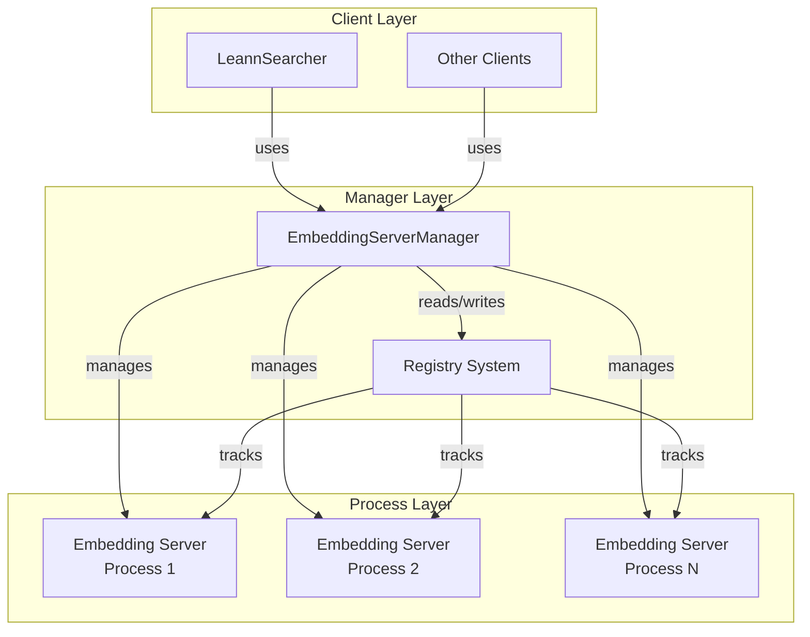
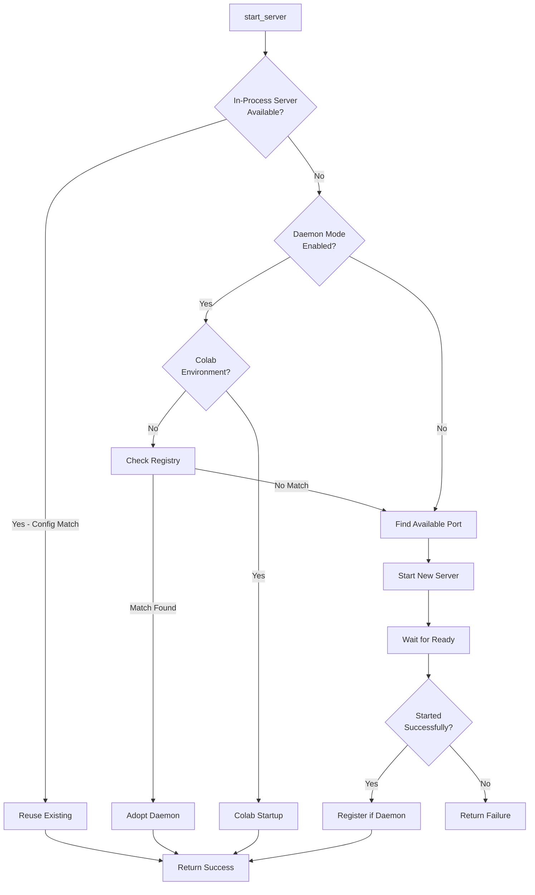

# Embedding Server Manager Documentation

## Overview

The `EmbeddingServerManager` is a core component of the Leann system responsible for managing the lifecycle of embedding server processes. It provides a streamlined interface for starting, monitoring, and stopping embedding servers, with built-in support for daemon mode, process reuse, and environment-specific configurations.

### Key Features

- **Process Lifecycle Management**: Start, stop, and monitor embedding server processes
- **Daemon Mode**: Run servers as daemons that persist across client sessions
- **Configuration Signature Matching**: Reuse existing servers when configurations match
- **Environment Adaptation**: Special handling for Google Colab and CI environments
- **Cross-Process Coordination**: Registry-based daemon discovery and management
- **Automatic Cleanup**: atexit and weakref finalizer-based process cleanup

## Architecture

The `EmbeddingServerManager` follows a singleton-like pattern per backend type, managing the lifecycle of embedding server processes with intelligent reuse and cleanup mechanisms.

### Component Diagram



## Core Class: EmbeddingServerManager

### Initialization

```python
def __init__(self, backend_module_name: str):
    """
    Initializes the manager for a specific backend.

    Args:
        backend_module_name (str): The full module name of the backend's server script.
                                   e.g., "leann_backend_diskann.embedding_server"
    """
```

**Parameters:**
- `backend_module_name`: Full Python module path to the backend's embedding server implementation

**Instance Variables:**
- `server_process`: Reference to the subprocess.Popen object for the running server
- `server_port`: Port number the server is listening on
- `_server_config`: Configuration signature for the currently active server
- `_daemon_mode`: Boolean indicating if the manager is attached to a daemon server
- `_registry_path`: Path to the registry record for daemon servers
- `_atexit_registered`: Flag to prevent duplicate atexit registrations

### Starting a Server

#### `start_server()` Method

```python
def start_server(
    self,
    port: int,
    model_name: str,
    embedding_mode: str = "sentence-transformers",
    **kwargs,
) -> tuple[bool, int]:
    """Start the embedding server."""
```

**Parameters:**
- `port`: Suggested port number (manager will find an available port if needed)
- `model_name`: Name of the embedding model to use
- `embedding_mode`: Embedding mode (default: "sentence-transformers")
- `**kwargs`: Additional options including:
  - `provider_options`: Provider-specific configuration
  - `passages_file`: Path to passages metadata file
  - `distance_metric`: Distance metric for similarity calculations
  - `use_daemon`: Whether to use daemon mode (default: True)
  - `daemon_ttl_seconds`: TTL for daemon servers (default: 900)
  - `enable_warmup`: Whether to enable server warmup (default: True)

**Returns:**
- Tuple of (success: bool, port: int)

**Workflow:**



#### Configuration Signatures

The manager uses configuration signatures to determine if an existing server can be reused. The signature includes:

- `model_name`: Name of the embedding model
- `passages_file`: Resolved path to passages file
- `embedding_mode`: Embedding mode being used
- `distance_metric`: Distance metric configuration
- `provider_options`: Provider-specific options
- `passages_signature`: Hash of passage file metadata and contents

#### `_build_config_signature()` Method

```python
def _build_config_signature(
    self,
    *,
    model_name: str,
    embedding_mode: str,
    provider_options: Optional[dict],
    passages_file: Optional[str],
    distance_metric: Optional[str],
) -> dict:
    """Create a signature describing the current server configuration."""
```

### Server Startup Methods

#### `_start_new_server()`

Internal method for starting a fresh server process. Handles command building, process launching, and readiness waiting.

#### `_start_server_colab()`

Specialized startup method for Google Colab environments with modified process management and timeouts.

#### `_build_server_command()`

Constructs the command line arguments for starting the embedding server subprocess.

```python
def _build_server_command(
    self, port: int, model_name: str, embedding_mode: str, **kwargs
) -> list:
    """Build the command to start the embedding server."""
```

#### `_launch_server_process()`

Launches the server subprocess with appropriate environment and output handling.

```python
def _launch_server_process(
    self,
    command: list,
    port: int,
    *,
    provider_options: Optional[dict] = None,
    config_signature: Optional[dict] = None,
) -> None:
    """Launch the server process."""
```

Key features:
- Project root working directory
- Environment variable passing with encoded provider options
- CI-specific output redirection to prevent buffer deadlocks
- atexit cleanup registration

#### `_wait_for_server_ready()`

Polls the server port until it becomes available or a timeout occurs.

```python
def _wait_for_server_ready(self, port: int) -> tuple[bool, int]:
    """Wait for the server to be ready."""
```

- Default timeout: 120 seconds
- Poll interval: 0.5 seconds
- Checks both port availability and process liveness

### Stopping a Server

#### `stop_server()` Method

```python
def stop_server(self):
    """Stops the embedding server process if it's running."""
```

**Behavior:**
- For daemon mode: Simply detaches without stopping the process
- For ephemeral servers:
  1. Attempts graceful termination with `SIGTERM`
  2. Waits up to 5 seconds for graceful shutdown
  3. Escalates to `SIGKILL` if process doesn't terminate
  4. Cleans up internal state references

### Process Cleanup

#### `_finalize_process()`

Best-effort cleanup method registered with both `atexit` and `weakref.finalize` to ensure cleanup even if the manager is garbage collected.

## Daemon Management System

The daemon system allows embedding servers to persist across multiple client sessions, improving startup performance for repeated use.

### Registry System

Daemon servers are tracked in a registry located at `~/.leann/servers/`.

#### Registry Record Structure

```json
{
  "pid": 12345,
  "port": 5557,
  "backend_module_name": "leann_backend_diskann.embedding_server",
  "daemon_ttl_seconds": 900,
  "created_at": 1234567890.123,
  "config_signature": { ... }
}
```

#### Registry Key Generation

Registry keys are SHA-256 hashes of sorted JSON containing:
- `backend_module_name`: The backend module name
- `config_signature`: The full configuration signature

#### `_registry_key()` Method

```python
def _registry_key(self, config_signature: dict[str, Any]) -> str:
    payload = {
        "backend_module_name": self.backend_module_name,
        "config_signature": config_signature,
    }
    encoded = json.dumps(payload, sort_keys=True, ensure_ascii=True).encode("utf-8")
    return hashlib.sha256(encoded).hexdigest()
```

### Locking Mechanism

The registry uses file-based locking to prevent race conditions during daemon startup and discovery.

#### `_registry_lock()` Context Manager

```python
@contextlib.contextmanager
def _registry_lock(self, config_signature: dict[str, Any]):
    """Best-effort cross-process lock around a daemon registry key."""
```

**Features:**
- Creates `.lock` and `.lockinfo.json` files
- Uses `fcntl.flock()` on POSIX systems (best-effort)
- Detects and recovers from stale locks (>10 minutes old)
- Includes PID and timestamp in lock info

### Daemon Adoption

#### `_adopt_registered_server()`

```python
def _adopt_registered_server(self, config_signature: dict[str, Any]) -> Optional[int]:
    """Attempt to adopt an existing daemon server from the registry."""
```

**Validation Checks:**
1. Registry file exists and is valid JSON
2. Backend module name matches
3. Configuration signature matches
4. Process PID is still alive
5. Port is still accepting connections

### Daemon Management Class Methods

#### `list_daemons()`

```python
@classmethod
def list_daemons(cls) -> list[dict[str, Any]]:
    """List all active daemon servers."""
```

Returns a list of daemon records with:
- Full registry record contents
- Added `record_path` field
- Automatic cleanup of stale/invalid records

#### `stop_daemons()`

```python
@classmethod
def stop_daemons(
    cls,
    *,
    backend_module_name: Optional[str] = None,
    passages_file: Optional[str] = None,
) -> int:
    """Stop daemon servers, optionally filtered by backend or passages file."""
```

**Parameters:**
- `backend_module_name`: Optional filter by backend module
- `passages_file`: Optional filter by passages file

**Returns:**
- Number of daemons successfully stopped

## Environment-Specific Handling

### Google Colab Environment

The manager detects Colab via `COLAB_GPU` or `COLAB_TPU` environment variables and:
- Uses shorter timeouts (30 seconds instead of 120)
- Uses different process management with piped output
- Skips daemon mode entirely

### CI Environment

Detected via `CI=true` environment variable:
- Redirects server stdout to `/dev/null` to prevent buffer deadlocks
- Keeps stderr visible for debugging
- Uses shorter timeouts during process cleanup (3 seconds vs 10 seconds)

## Helper Functions

### Port Management

#### `_get_available_port()`

```python
def _get_available_port(start_port: int = 5557) -> int:
    """Get an available port starting from start_port."""
```

- Tries up to 100 consecutive ports
- Raises `RuntimeError` if no ports available
- Uses socket binding test to check availability

#### `_check_port()`

```python
def _check_port(port: int) -> bool:
    """Check if a port is in use"""
```

Uses TCP connection attempt to verify if a server is listening on the port.

### Process Management

#### `_pid_is_alive()`

```python
def _pid_is_alive(pid: int) -> bool:
    """Best-effort liveness check for a process id."""
```

Uses `os.kill(pid, 0)` to check process existence without sending a signal.

### File System Helpers

#### `_safe_resolve()`

```python
def _safe_resolve(path: Path) -> str:
    """Resolve paths safely even if the target does not yet exist."""
```

#### `_safe_stat_signature()`

```python
def _safe_stat_signature(path: Path) -> dict:
    """Return a lightweight signature describing the current state of a path."""
```

Captures:
- Resolved path
- Existence status
- Modification time (nanoseconds)
- File size
- Error information if any

#### `_build_passages_signature()`

```python
def _build_passages_signature(passages_file: Optional[str]) -> Optional[dict]:
    """Collect modification signatures for metadata and referenced passage files."""
```

Recursively builds signatures for:
- The passages metadata file itself
- All referenced passage files in the metadata
- All referenced index files in the metadata

## Usage Examples

### Basic Usage

```python
from leann.embedding_server_manager import EmbeddingServerManager

# Create a manager for a specific backend
manager = EmbeddingServerManager("leann_backend_diskann.embedding_server")

# Start a server
success, port = manager.start_server(
    port=5557,
    model_name="all-MiniLM-L6-v2",
    embedding_mode="sentence-transformers"
)

if success:
    print(f"Server running on port {port}")
    # Use the server...
    
    # Stop when done
    manager.stop_server()
```

### Using Daemon Mode

```python
# Start a daemon server (default behavior)
success, port = manager.start_server(
    port=5557,
    model_name="all-MiniLM-L6-v2",
    use_daemon=True,
    daemon_ttl_seconds=3600  # 1 hour TTL
)

# Later, another instance can reuse the same daemon
manager2 = EmbeddingServerManager("leann_backend_diskann.embedding_server")
success2, port2 = manager2.start_server(
    port=5557,
    model_name="all-MiniLM-L6-v2"  # Same config = reuse
)

# Detach from daemon (doesn't stop the process)
manager2.stop_server()
```

### Managing Daemons

```python
# List all active daemons
daemons = EmbeddingServerManager.list_daemons()
for daemon in daemons:
    print(f"Daemon on port {daemon['port']} (PID: {daemon['pid']})")

# Stop all daemons for a specific backend
stopped = EmbeddingServerManager.stop_daemons(
    backend_module_name="leann_backend_diskann.embedding_server"
)
print(f"Stopped {stopped} daemons")

# Stop daemons using a specific passages file
stopped = EmbeddingServerManager.stop_daemons(
    passages_file="/path/to/passages.json"
)
```

## Configuration Options

### Server Startup Options

| Option | Type | Default | Description |
|--------|------|---------|-------------|
| `port` | int | (required) | Suggested starting port |
| `model_name` | str | (required) | Name of embedding model |
| `embedding_mode` | str | "sentence-transformers" | Embedding mode |
| `provider_options` | dict | None | Provider-specific config |
| `passages_file` | str | None | Path to passages metadata |
| `distance_metric` | str | None | Distance metric for similarity |
| `use_daemon` | bool | True | Use daemon mode |
| `daemon_ttl_seconds` | int | 900 | Daemon time-to-live |
| `enable_warmup` | bool | True | Enable server warmup |

### Environment Variables

| Variable | Purpose |
|----------|---------|
| `LEANN_LOG_LEVEL` | Logging level (DEBUG, INFO, WARNING, ERROR) |
| `CI` | Enable CI-specific behaviors |
| `COLAB_GPU` / `COLAB_TPU` | Detect Colab environment |
| `LEANN_EMBEDDING_OPTIONS` | Encoded provider options (internal) |

## Edge Cases and Limitations

### Port Availability
- The manager tries up to 100 consecutive ports from the suggested start port
- If no ports are available, `RuntimeError` is raised
- Port conflicts with non-embedding-server processes will trigger port finding

### Daemon Registry
- Registry is stored in user's home directory - may have permissions issues
- Locking is best-effort, especially on non-POSIX systems
- Stale locks are automatically cleaned up after 10 minutes

### Process Cleanup
- Cannot guarantee cleanup if the Python process is force-killed (SIGKILL)
- Daemon servers continue running even after manager exits
- Orphaned daemons can be cleaned up via `stop_daemons()`

### Colab Environment
- Daemon mode is not available in Colab
- Process management has different timeout behavior
- Output is captured differently for debugging

### Configuration Matching
- Configuration signatures include file paths and modification times
- Moving or modifying passage files will prevent server reuse
- Provider options must match exactly for reuse

### Cross-Platform Considerations
- File locking uses `fcntl` which is POSIX-only; best-effort fallback on Windows
- Path resolution handles Windows paths but registry uses `~/.leann` regardless
- Process signals may behave differently on non-POSIX systems

## Error Handling

The manager uses logging extensively for error reporting:

- `ERROR`: Server startup failures, port exhaustion, process management errors
- `WARNING`: Process termination timeouts, cleanup issues
- `INFO`: Server lifecycle events, daemon adoption
- `DEBUG`: Detailed internal operations (not shown by default)

Key exceptions are caught and converted to error log messages with boolean return values indicating success/failure.

## Related Modules

- [embedding_compute](embedding_compute.md) - Handles embedding computation logic used by the servers
- [core_search_api_and_interfaces](core_search_api_and_interfaces.md) - Uses EmbeddingServerManager for search functionality
- Backend modules (backend_hnsw, backend_ivf, backend_diskann) - Provide the actual embedding server implementations
