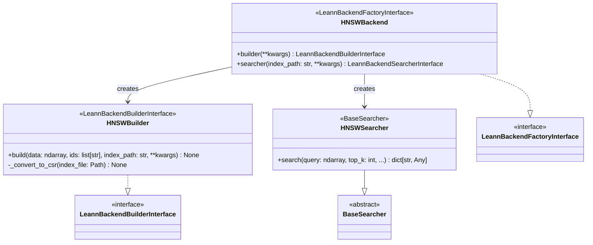
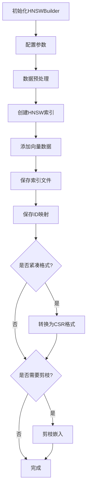
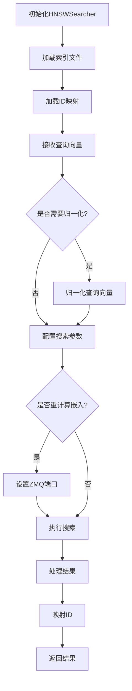

# HNSW Backend 子模块文档

## 1. 概述

`hnsw_backend_submodule` 是 `leann-core` 框架的核心后端组件，提供基于 Hierarchical Navigable Small World (HNSW) 算法的高效向量索引和搜索功能。该模块通过 Faiss 库实现高性能的近似最近邻搜索，并提供灵活的配置选项和优化策略。

### 主要功能

- 构建和管理 HNSW 向量索引
- 支持多种距离度量（MIPS、L2、余弦相似度）
- 提供索引压缩和优化功能
- 支持基于元数据的过滤搜索
- 实现与 Leann 框架的无缝集成

### 核心价值

该模块通过 HNSW 算法实现了在大规模向量数据集中的高效检索，同时保持较高的搜索精度。它通过一系列优化（如索引压缩、嵌入重计算等）平衡了性能和资源消耗，是 Leann 框架中向量搜索功能的核心实现之一。

## 2. 架构与组件

HNSW 后端的架构围绕三个核心类设计，实现了完整的索引构建和搜索流程。

### 核心组件关系图



### 组件详细说明

#### HNSWBackend

作为工厂类，`HNSWBackend` 负责创建索引构建器和搜索器实例。它使用装饰器 `@register_backend("hnsw")` 注册到 Leann 后端注册表中，使框架能够通过名称 "hnsw" 引用此后端。

#### HNSWBuilder

`HNSWBuilder` 实现了索引构建过程，主要职责包括：

1. 初始化和配置 HNSW 索引参数
2. 处理输入数据（类型转换、归一化等）
3. 构建 Faiss HNSW 索引
4. 持久化索引和 ID 映射
5. 可选地将索引转换为 CSR 紧凑格式

#### HNSWSearcher

`HNSWSearcher` 继承自 `BaseSearcher`，实现了搜索功能，主要职责包括：

1. 加载预构建的 HNSW 索引
2. 管理搜索参数配置
3. 执行向量搜索并处理结果
4. 集成元数据过滤功能
5. 管理嵌入服务器通信

### 工作流程

#### 索引构建流程



#### 搜索流程



## 3. 核心功能

### 索引构建

索引构建是 HNSW 后端的核心功能之一，通过 `HNSWBuilder` 类实现。构建过程包括参数配置、数据预处理、索引创建、持久化和可选优化等步骤。

主要特性：
- 支持多种距离度量：MIPS、L2 和余弦相似度
- 可配置的 HNSW 索引参数（M、efConstruction 等）
- 自动数据类型转换和归一化
- 索引压缩选项（CSR 格式）
- 嵌入剪枝功能

### 向量搜索

向量搜索功能由 `HNSWSearcher` 类实现，提供了丰富的搜索配置选项和优化策略。

主要特性：
- 可配置的搜索复杂度（efSearch）
- 支持束搜索（beam search）
- 实现 PQ 剪枝和多种剪枝策略
- 嵌入重计算选项（通过 ZMQ 服务器）
- 结果后处理和 ID 映射

### 索引优化

HNSW 后端提供了多种索引优化选项，主要通过以下两种方式实现：

1. **CSR 格式转换**：将标准 HNSW 索引转换为更紧凑的 CSR 格式，减少内存占用
2. **嵌入剪枝**：移除索引中的原始嵌入，仅保留图结构，进一步减少存储需求

这些优化可以显著降低索引的内存和磁盘占用，但可能会影响搜索性能（需要额外的嵌入重计算）。

## 4. API 参考

### HNSWBackend

工厂类，用于创建 HNSW 后端的构建器和搜索器实例。

```python
@register_backend("hnsw")
class HNSWBackend(LeannBackendFactoryInterface):
    @staticmethod
    def builder(**kwargs) -> LeannBackendBuilderInterface:
        """创建 HNSWBuilder 实例"""
        
    @staticmethod
    def searcher(index_path: str, **kwargs) -> LeannBackendSearcherInterface:
        """创建 HNSWSearcher 实例"""
```

### HNSWBuilder

索引构建类，负责创建和优化 HNSW 索引。

```python
class HNSWBuilder(LeannBackendBuilderInterface):
    def __init__(self, **kwargs):
        """
        初始化 HNSWBuilder
        
        参数:
            **kwargs: 构建参数
                - is_compact: 是否使用紧凑格式 (默认: True)
                - is_recompute: 是否重计算嵌入 (默认: True)
                - M: HNSW 的 M 参数 (默认: 32)
                - efConstruction: HNSW 的 efConstruction 参数 (默认: 200)
                - distance_metric: 距离度量 ("mips", "l2", "cosine") (默认: "mips")
                - dimensions: 向量维度 (可选，自动检测)
        """
        
    def build(self, data: np.ndarray, ids: list[str], index_path: str, **kwargs):
        """
        构建 HNSW 索引
        
        参数:
            data: 向量数据 (N, D)
            ids: 向量对应的字符串 ID 列表
            index_path: 索引保存路径
            **kwargs: 额外的构建参数
        """
```

### HNSWSearcher

搜索类，用于在 HNSW 索引中执行向量搜索。

```python
class HNSWSearcher(BaseSearcher):
    def __init__(self, index_path: str, **kwargs):
        """
        初始化 HNSWSearcher
        
        参数:
            index_path: 索引文件路径
            **kwargs: 额外的加载参数
        """
        
    def search(
        self,
        query: np.ndarray,
        top_k: int,
        zmq_port: Optional[int] = None,
        complexity: int = 64,
        beam_width: int = 1,
        prune_ratio: float = 0.0,
        recompute_embeddings: bool = True,
        pruning_strategy: Literal["global", "local", "proportional"] = "global",
        batch_size: int = 0,
        **kwargs,
    ) -> dict[str, Any]:
        """
        使用 HNSW 索引搜索最近邻
        
        参数:
            query: 查询向量 (B, D)，B 是批量大小，D 是维度
            top_k: 返回的最近邻数量
            complexity: 搜索复杂度/efSearch，越高越准确但越慢
            beam_width: 并行搜索路径数量/beam_size
            prune_ratio: 通过 PQ 剪枝的邻居比例 (0.0-1.0)
            recompute_embeddings: 是否从服务器获取新鲜嵌入
            pruning_strategy: PQ 候选选择策略:
                - "global": 使用全局 PQ 队列大小进行选择 (默认)
                - "local": 局部剪枝，排序并选择最佳候选
                - "proportional": 基于新邻居数量比例进行选择
            zmq_port: 用于嵌入服务器通信的 ZMQ 端口。如果 recompute_embeddings 为 True，则必须提供。
            batch_size: 邻居处理批大小，0=禁用 (HNSW 特定)
            **kwargs: 额外的 HNSW 特定参数 (用于向后兼容)
            
        返回:
            包含 'labels' (列表的列表) 和 'distances' (ndarray) 的字典
        """
```

## 5. 使用指南

### 基本使用

#### 构建索引

```python
from leann.api import LeannBuilder
import numpy as np

# 准备数据
data = np.random.rand(10000, 128).astype(np.float32)  # 10000 个 128 维向量
ids = [f"doc_{i}" for i in range(10000)]

# 构建 HNSW 索引
builder = LeannBuilder(backend="hnsw")
builder.build(
    data=data,
    ids=ids,
    index_path="./my_index",
    distance_metric="cosine",
    M=32,
    efConstruction=200
)
```

#### 搜索索引

```python
from leann.api import LeannSearcher
import numpy as np

# 加载索引
searcher = LeannSearcher("./my_index")

# 准备查询
query = np.random.rand(1, 128).astype(np.float32)

# 执行搜索
results = searcher.search(
    query=query,
    top_k=10,
    complexity=128,
    recompute_embeddings=True
)

# 处理结果
print("最相似的文档:")
for i, (doc_id, distance) in enumerate(zip(results["labels"][0], results["distances"][0])):
    print(f"{i+1}. {doc_id}: {distance}")
```

### 高级配置

#### 构建优化

```python
# 构建更大、更精确的索引
builder = LeannBuilder(
    backend="hnsw",
    M=64,  # 更大的 M 值，更高精度但更大的索引
    efConstruction=400,  # 更高的构建复杂度
    distance_metric="cosine",
    is_compact=True,  # 使用紧凑格式
    is_recompute=True  # 允许嵌入重计算
)

builder.build(data=data, ids=ids, index_path="./optimized_index")
```

#### 搜索优化

```python
# 加载索引
searcher = LeannSearcher("./optimized_index")

# 高性能搜索配置
results = searcher.search(
    query=query,
    top_k=20,
    complexity=256,  # 更高的搜索复杂度
    beam_width=4,  # 并行搜索路径
    prune_ratio=0.5,  # 50% 剪枝比例
    pruning_strategy="local",  # 局部剪枝策略
    recompute_embeddings=True  # 重计算嵌入以提高精度
)
```

## 6. 最佳实践

### 索引构建

1. **参数选择**：
   - 对于大多数应用，M 值在 16-64 之间是合适的
   - efConstruction 通常设置为 100-400，更高的值会提高精度但增加构建时间
   - 对于高维度数据，考虑使用更大的 M 值

2. **距离度量**：
   - 使用余弦相似度时，数据会自动归一化
   - 对于 OpenAI 嵌入，推荐使用余弦相似度

3. **存储优化**：
   - 对于大规模索引，推荐使用 `is_compact=True` 以减少存储空间
   - 如果搜索性能是首要考虑，可以使用 `is_compact=False` 和 `is_recompute=False`

### 搜索优化

1. **复杂度平衡**：
   - complexity (efSearch) 通常设置为 top_k 的 2-4 倍
   - 对于精度要求高的应用，可以设置更高的值，但会增加搜索时间

2. **嵌入重计算**：
   - 对于压缩索引 (`is_compact=True`)，必须启用 `recompute_embeddings=True`
   - 重计算可以提高精度，但会增加搜索延迟
   - 考虑使用嵌入服务器来提高重计算性能

3. **剪枝策略**：
   - 对于大多数应用，"global" 剪枝策略是一个好的起点
   - 如果需要更高的精度，可以尝试 "local" 策略
   - "proportional" 策略在某些数据集上可能提供更好的精度-性能平衡

## 7. 注意事项与限制

### 常见问题

1. **内存使用**：
   - HNSW 索引可能需要大量内存，特别是对于大规模数据集
   - 使用紧凑格式 (`is_compact=True`) 可以显著减少内存需求

2. **首次搜索延迟**：
   - 启用嵌入重计算时，首次搜索可能需要额外时间启动嵌入服务器
   - 考虑在应用启动时预加载索引和服务器

3. **数据类型**：
   - 输入数据会自动转换为 float32，确保原始数据质量足够

### 限制

1. **距离度量**：
   - 当前仅支持 MIPS、L2 和余弦相似度
   - 其他距离度量需要扩展代码

2. **更新操作**：
   - HNSW 索引不支持增量更新，需要重新构建
   - 对于频繁更新的数据集，考虑使用其他后端或分批重建策略

3. **嵌入重计算依赖**：
   - 使用紧凑格式时，搜索依赖嵌入服务器的可用性
   - 确保服务器有足够的资源处理重计算请求

## 8. 与其他模块的关系

HNSW 后端是 Leann 框架的核心组件之一，与多个模块有紧密联系：

- **core_search_api_and_interfaces**：HNSW 后端实现了该模块定义的接口，如 `LeannBackendFactoryInterface`、`LeannBackendBuilderInterface` 和 `LeannBackendSearcherInterface`。更多信息请参考 [core_search_api_and_interfaces](core_search_api_and_interfaces.md)。

- **core_runtime_and_entrypoints**：HNSW 后端使用 `EmbeddingServerManager` 来管理嵌入服务器，该组件是核心运行时模块的一部分。更多信息请参考 [core_runtime_and_entrypoints](core_runtime_and_entrypoints.md)。

- **convert_to_csr_submodule**：HNSW 后端的索引压缩功能依赖于该子模块。更多信息请参考 [convert_to_csr_submodule](convert_to_csr_submodule.md)。

## 9. 示例应用

### 文档检索系统

以下示例展示了如何使用 HNSW 后端构建一个简单的文档检索系统：

```python
from leann.api import LeannBuilder, LeannSearcher, PassageManager
import numpy as np

# 1. 准备文档和嵌入
passages = [
    "机器学习是人工智能的一个分支，使系统能够从经验中学习和改进。",
    "自然语言处理是计算机科学和人工智能的一个领域，关注计算机与人类语言之间的交互。",
    "深度学习是基于人工神经网络和表示学习的更广泛的机器学习方法家族的一部分。",
    "计算机视觉是一个跨学科的科学领域，研究计算机如何从数字图像或视频中获得高层次的理解。"
]
passage_ids = [f"doc_{i}" for i in range(len(passages))]

# 假设我们有这些段落的嵌入
embeddings = np.random.rand(len(passages), 128).astype(np.float32)

# 2. 构建索引
builder = LeannBuilder(backend="hnsw")
builder.build(
    data=embeddings,
    ids=passage_ids,
    index_path="./document_index",
    distance_metric="cosine"
)

# 保存段落内容
manager = PassageManager("./document_index")
manager.add_passages({pid: text for pid, text in zip(passage_ids, passages)})
manager.save()

# 3. 搜索相关文档
searcher = LeannSearcher("./document_index")

# 假设有查询嵌入
query_embedding = np.random.rand(1, 128).astype(np.float32)

results = searcher.search(
    query=query_embedding,
    top_k=3,
    complexity=128
)

# 4. 显示结果
print("最相关的文档:")
for i, doc_id in enumerate(results["labels"][0]):
    passage = manager.get_passage(doc_id)
    print(f"{i+1}. {doc_id}: {passage}")
```
