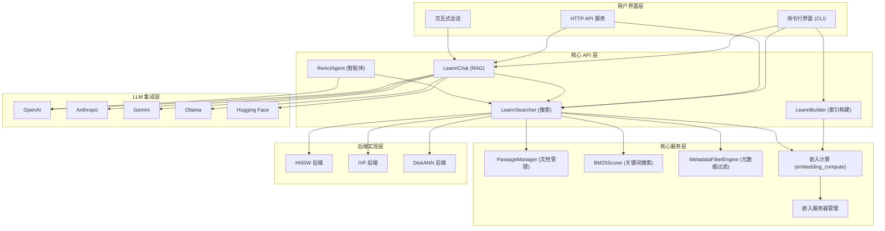

# LEANN 仓库概览

LEANN 是一个高性能、可扩展的向量搜索与检索增强生成（RAG）系统，专注于为大规模向量数据集提供高效的索引构建、相似性搜索和智能问答能力。

## 主要功能/亮点

- **多后端向量搜索**：支持 HNSW、IVF、DiskANN 三种主流向量索引算法，适应不同规模和性能需求的数据集
- **统一搜索 API**：提供简洁一致的高层接口，屏蔽底层后端实现细节
- **灵活的嵌入计算**：集成 Sentence-Transformers、OpenAI、Gemini、Ollama、MLX 等多种嵌入模型
- **检索增强生成（RAG）**：结合向量搜索与大语言模型（LLM），实现智能问答
- **ReAct 智能体**：支持多步推理与搜索的迭代交互
- **完整的工具链**：提供 CLI、HTTP API、交互式会话等多种使用方式
- **元数据过滤**：支持基于元数据的搜索结果过滤
- **混合搜索**：结合向量搜索与 BM25 关键词搜索
- **高效资源管理**：实现嵌入服务器进程管理、模型缓存、内存优化等机制

## 典型应用场景

- 大规模文档库的语义搜索与问答
- 企业知识库的智能检索
- 个人文档管理与搜索
- RAG 应用的后端支撑
- 向量数据库的轻量级替代方案

---

## 目录结构

LEANN 采用模块化架构设计，将核心搜索 API、聊天与智能体层、运行时入口点以及不同的后端实现清晰分离。核心功能位于 `packages/leann-core`，提供统一的接口和高层抽象；具体的向量索引后端作为独立包实现，可根据需求灵活选择。

```text
packages/
├── leann-core/                # 核心功能包
│   └── src/leann/             # 核心模块实现
│       ├── api/               # 高层 API（LeannBuilder、LeannSearcher、LeannChat）
│       ├── chat/              # LLM 接口与实现
│       ├── react_agent/       # ReAct 智能体实现
│       ├── embedding_compute/ # 统一嵌入计算接口
│       ├── embedding_server_manager/ # 嵌入服务器管理
│       ├── cli/               # 命令行界面
│       └── server/            # HTTP API 服务
├── leann-backend-hnsw/        # HNSW 后端实现
├── leann-backend-ivf/         # IVF 后端实现
└── leann-backend-diskann/     # DiskANN 后端实现
```

### 核心模块说明

| 模块 | 主要职责 | 文件位置 | <div style="width:300px">组件</div> |
|------|----------|----------|--------------------------------------|
| 核心搜索 API | 提供统一的索引构建与搜索接口 | `packages/leann-core/src/leann/` | `LeannBuilder`, `LeannSearcher`, `PassageManager`, `BM25Scorer`, `MetadataFilterEngine` |
| 聊天与智能体层 | 实现 RAG 与 ReAct 智能体 | `packages/leann-core/src/leann/` | `LeannChat`, `LLMInterface`, `ReActAgent`, `InteractiveSession` |
| 运行时与入口点 | 提供 CLI、HTTP API 和嵌入管理 | `packages/leann-core/src/leann/` | `LeannCLI`, `EmbeddingServerManager`, `compute_embeddings` |
| HNSW 后端 | 基于 HNSW 算法的高效索引 | `packages/leann-backend-hnsw/` | `HNSWBackend`, `HNSWBuilder`, `HNSWSearcher` |
| IVF 后端 | 基于 IVF 算法的可扩展索引 | `packages/leann-backend-ivf/` | `IVFBackend`, `IVFBuilder`, `IVFSearcher` |
| DiskANN 后端 | 基于 DiskANN 的大规模索引 | `packages/leann-backend-diskann/` | `DiskannBackend`, `DiskannBuilder`, `DiskannSearcher` |

---

## 系统架构与主流程

LEANN 采用分层架构设计，从底层向量索引到高层应用接口形成完整的技术栈。系统各组件之间通过清晰的接口协作，确保了模块化和可扩展性。



### 主要数据流

1. **索引构建流程**：
   - 用户通过 `LeannBuilder` 添加文档
   - 文档文本通过 `embedding_compute` 转换为向量
   - 选择的后端（HNSW/IVF/DiskANN）构建向量索引
   - 索引文件、文档和元数据被保存到指定路径

2. **搜索流程**：
   - 用户通过 `LeannSearcher` 提交查询
   - 查询文本被转换为向量
   - 后端执行向量相似性搜索
   - 可选地应用 BM25 关键词搜索和元数据过滤
   - 返回排序后的搜索结果

3. **RAG 问答流程**：
   - 用户通过 `LeannChat` 提问
   - 系统执行搜索获取相关上下文
   - 上下文和问题被组合成提示发送给 LLM
   - LLM 生成的答案返回给用户

---

## 核心功能模块

### 1. 索引构建与管理

LEANN 提供了灵活的索引构建功能，支持多种后端和配置选项。

- **多后端支持**：HNSW（适合中小规模，高精度）、IVF（适合大规模，可增量更新）、DiskANN（适合超大规模，内存优化）
- **灵活的嵌入选项**：支持多种嵌入模型和计算方式
- **增量更新**：部分后端支持向现有索引添加新文档
- **元数据管理**：自动管理文档 ID、文本和自定义元数据

**示例代码**：
```python
from leann.api import LeannBuilder

# 创建索引构建器
builder = LeannBuilder(
    backend_name="hnsw",
    embedding_model="facebook/contriever",
    dimensions=768
)

# 添加文档
builder.add_text("这是第一个文档", metadata={"id": "doc1", "category": "tech"})
builder.add_text("这是第二个文档", metadata={"id": "doc2", "category": "business"})

# 构建索引
builder.build_index("path/to/index.leann")
```

### 2. 向量搜索与混合搜索

系统提供了强大的搜索功能，结合了向量搜索、关键词搜索和元数据过滤。

- **向量相似性搜索**：基于语义相似度查找相关文档
- **BM25 关键词搜索**：传统的关键词匹配搜索
- **混合搜索**：结合向量和关键词搜索的优势
- **元数据过滤**：基于自定义元数据字段过滤结果
- **可配置搜索参数**：调整搜索复杂度、精度和速度的平衡

**示例代码**：
```python
from leann.api import LeannSearcher

# 创建搜索器
searcher = LeannSearcher("path/to/index.leann")

# 执行搜索
results = searcher.search(
    query="搜索查询",
    top_k=5,
    complexity=64,
    metadata_filters={"category": {"==": "tech"}},
    gemma=0.7  # 混合搜索权重
)

# 处理结果
for result in results:
    print(f"ID: {result.id}, Score: {result.score}")
    print(f"Text: {result.text}")
```

### 3. 检索增强生成（RAG）

LEANN 将向量搜索与大语言模型集成，提供智能问答能力。

- **多 LLM 支持**：OpenAI、Anthropic、Google Gemini、Ollama、Hugging Face
- **上下文管理**：自动将搜索结果格式化为 LLM 提示
- **交互式会话**：支持多轮对话
- **可定制提示模板**：调整系统提示和上下文格式

**示例代码**：
```python
from leann.api import LeannChat

# 创建 RAG 聊天实例
chat = LeannChat(
    index_path="path/to/index.leann",
    llm_config={"type": "openai", "model": "gpt-4o"}
)

# 提问
response = chat.ask("LEANN 系统的主要功能是什么？")
print(response)
```

### 4. ReAct 智能体

系统实现了 ReAct（Reasoning + Acting）模式，支持多步推理和搜索。

- **迭代推理**：智能体可以思考需要什么信息
- **自动查询生成**：根据推理步骤生成搜索查询
- **多步搜索**：执行多次搜索以收集足够信息
- **最终答案合成**：基于收集的信息生成综合答案

**示例代码**：
```python
from leann.react_agent import create_react_agent

# 创建 ReAct 智能体
agent = create_react_agent(
    index_path="path/to/index.leann",
    llm_config={"type": "openai", "model": "gpt-4o"},
    max_iterations=5
)

# 运行智能体
answer = agent.run("解释 LEANN 的架构以及各组件如何协作")
print(answer)
```

### 5. 嵌入计算与管理

LEANN 提供了统一的嵌入计算接口，支持多种模型和优化策略。

- **多模型支持**：Sentence-Transformers、OpenAI、Gemini、Ollama、MLX
- **模型缓存**：避免重复加载模型
- **批量处理优化**：自动调整批大小以提高性能
- **嵌入服务器**：支持跨进程复用嵌入计算资源
- **令牌限制处理**：自动检测和处理模型的令牌限制

### 6. 命令行与 HTTP API

系统提供了完整的工具链，便于开发和部署。

- **CLI 工具**：支持索引构建、搜索、问答、智能体等功能
- **HTTP API**：基于 FastAPI 的 RESTful 接口
- **交互式会话**：支持命令行交互式聊天
- **索引管理**：列出、删除索引等管理功能

**CLI 示例**：
```bash
# 构建索引
leann build my-docs --docs ./documents

# 搜索
leann search my-docs "查询内容"

# 问答
leann ask my-docs "问题内容"

# 启动 HTTP 服务
leann serve
```

---

## 核心 API/类/函数

### 1. `LeannBuilder`

**用途**：构建向量搜索索引的主要类，负责收集文档、计算嵌入、构建索引并保存相关文件。

**主要方法**：
- `__init__(backend_name, embedding_model, dimensions, embedding_mode, embedding_options, **backend_kwargs)`：初始化构建器
- `add_text(text, metadata=None)`：添加文档文本和可选元数据
- `build_index(index_path)`：构建索引并保存到指定路径
- `build_index_from_embeddings(index_path, embeddings_file)`：从预计算的嵌入构建索引
- `update_index(index_path, remove_passage_ids=None)`：更新现有索引

**使用场景**：当需要创建新的向量搜索索引或更新现有索引时使用。

---

### 2. `LeannSearcher`

**用途**：执行搜索的主要类，负责加载索引、计算查询嵌入、执行搜索并返回结果。

**主要方法**：
- `__init__(index_path, enable_warmup, recompute_embeddings, use_daemon, daemon_ttl_seconds, **backend_kwargs)`：初始化搜索器
- `search(query, top_k, complexity, beam_width, prune_ratio, metadata_filters, gemma, use_grep, **kwargs)`：执行搜索
- `warmup()`：预热嵌入路径以加快首次查询
- `cleanup()`：显式清理嵌入服务器资源

**使用场景**：当需要对已构建的索引执行搜索查询时使用。

---

### 3. `LeannChat`

**用途**：检索增强生成（RAG）的主要接口，结合搜索和 LLM 功能。

**主要方法**：
- `__init__(index_path, llm_config, search_config, system_prompt, context_template)`：初始化聊天实例
- `ask(question, top_k, complexity, metadata_filters, gemma, stream)`：提问并获取答案
- `__enter__() / __exit__()`：支持上下文管理器自动清理资源

**使用场景**：当需要结合搜索和 LLM 进行智能问答时使用。

---

### 4. `ReActAgent`

**用途**：实现 Reasoning + Acting 模式的智能体，能够迭代搜索和推理。

**主要方法**：
- `__init__(searcher, llm, max_iterations, system_prompt)`：初始化智能体
- `run(question)`：运行智能体回答问题
- `_is_task_complete(question, scratchpad)`：判断任务是否完成

**使用场景**：当需要复杂的多步推理和搜索来回答问题时使用。

---

### 5. `PassageManager`

**用途**：负责管理文档数据，提供文档的存储、检索和过滤功能。

**主要方法**：
- `__init__(passage_sources, metadata_file_path=None)`：初始化 PassageManager
- `get_passage(passage_id)`：根据文档 ID 获取文档内容
- `filter_search_results(search_results, metadata_filters)`：应用元数据过滤器到搜索结果
- `__len__()`：返回文档总数

**使用场景**：内部使用，由 `LeannSearcher` 调用，管理文档数据。

---

### 6. `BM25Scorer`

**用途**：实现 BM25 关键词搜索算法，用于基于文本内容的搜索。

**主要方法**：
- `__init__(k1=1.2, b=0.75)`：初始化 BM25 评分器
- `fit(documents)`：从文档语料库构建统计信息
- `score(query_words, document_id)`：计算查询与特定文档的相关性得分
- `search(query, top_k=5)`：执行关键词搜索

**使用场景**：当需要进行纯关键词搜索或混合搜索时使用。

---

### 7. `MetadataFilterEngine`

**用途**：提供基于元数据的搜索结果过滤功能。

**主要方法**：
- `__init__()`：初始化过滤器引擎
- `apply_filters(search_results, metadata_filters)`：应用元数据过滤器到搜索结果
- `_evaluate_filters(result, filters)`：评估单个结果是否满足所有过滤器

**支持的运算符**：`==`, `!=`, `<`, `<=`, `>`, `>=`, `in`, `not_in`, `contains`, `starts_with`, `ends_with`, `is_true`, `is_false`

**使用场景**：当需要基于元数据字段过滤搜索结果时使用。

---

### 8. `compute_embeddings`

**用途**：统一的嵌入计算入口点，根据指定的模式分发到相应的实现。

**签名**：
```python
def compute_embeddings(
    texts: list[str],
    model_name: str,
    mode: str = "sentence-transformers",
    is_query: bool = False,
    is_build: bool = False,
    batch_size: int = 32,
    adaptive_optimization: bool = True,
    query_template: str | None = None,
    provider_options: dict | None = None
) -> np.ndarray
```

**参数**：
- `texts`：要计算嵌入的文本列表
- `model_name`：模型名称
- `mode`：计算模式（'sentence-transformers', 'openai', 'mlx', 'ollama', 'gemini'）
- `is_build`：是否为构建操作（显示进度条）
- `batch_size`：批处理大小

**返回值**：归一化的嵌入数组

**使用场景**：当需要计算文本嵌入时使用，被 `LeannBuilder` 和 `LeannSearcher` 内部调用。

---

### 9. `EmbeddingServerManager`

**用途**：管理嵌入服务器进程的生命周期，支持跨进程复用和守护进程模式。

**主要方法**：
- `__init__(backend_module_name)`：初始化管理器
- `start_server(port, model_name, embedding_mode, **kwargs)`：启动嵌入服务器
- `stop_server()`：停止嵌入服务器进程
- `list_daemons()`（类方法）：列出所有运行中的守护进程
- `stop_daemons()`（类方法）：停止守护进程

**使用场景**：当需要管理嵌入服务器进程，实现跨进程资源复用时使用。

---

### 10. 后端工厂类（`HNSWBackend`, `IVFBackend`, `DiskannBackend`）

**用途**：作为工厂类，负责创建具体的后端构建器和搜索器实例。

**主要方法**：
- `builder(**kwargs)`：创建构建器实例
- `searcher(index_path, **kwargs)`：创建搜索器实例

**使用场景**：内部使用，由 `LeannBuilder` 和 `LeannSearcher` 根据配置选择合适的后端。

---

## 技术栈与依赖

| 技术/依赖 | 用途 | 来源 |
|-----------|------|------|
| Python | 主要开发语言 | 核心 |
| NumPy | 数值计算 | 核心 |
| FAISS | 向量索引（HNSW、IVF） | `leann-backend-hnsw`, `leann-backend-ivf` |
| DiskANN | 大规模向量索引 | `leann-backend-diskann` |
| Sentence-Transformers | 文本嵌入模型 | 核心（可选） |
| OpenAI API | 嵌入与 LLM | 核心（可选） |
| Google Gemini API | 嵌入与 LLM | 核心（可选） |
| Anthropic API | LLM | 核心（可选） |
| Ollama | 本地 LLM | 核心（可选） |
| Hugging Face Transformers | 本地 LLM | 核心（可选） |
| FastAPI | HTTP API 服务 | 核心（可选） |
| ZeroMQ | 嵌入服务器通信 | 核心 |

### 后端选择建议

| 后端 | 适用场景 | 数据规模 | 内存需求 | 精度 |
|------|----------|----------|---------|------|
| HNSW | 中小规模，高精度优先 | 百万级 | 中高 | 高 |
| IVF | 大规模，需要增量更新 | 千万级 | 中 | 中 |
| DiskANN | 超大规模，内存受限 | 亿级 | 低 | 中高 |

---

## 关键模块与典型用例

### 基本搜索与问答

**功能说明**：构建索引并执行基本的搜索和问答。

**配置与依赖**：
- 安装：`pip install leann-core leann-backend-hnsw`
- 可选：设置 `OPENAI_API_KEY` 环境变量以使用 LLM 功能

**使用示例**：

```python
from leann.api import LeannBuilder, LeannSearcher, LeannChat

# 1. 构建索引
builder = LeannBuilder(
    backend_name="hnsw",
    embedding_model="facebook/contriever",
    dimensions=768
)

# 添加文档
builder.add_text("LEANN 是一个向量搜索系统", metadata={"id": "doc1"})
builder.add_text("它支持多种后端，包括 HNSW、IVF 和 DiskANN", metadata={"id": "doc2"})
builder.add_text("LEANN 还提供 RAG 功能，可以结合搜索和 LLM", metadata={"id": "doc3"})

# 保存索引
builder.build_index("my-index.leann")

# 2. 执行搜索
searcher = LeannSearcher("my-index.leann")
results = searcher.search("LEANN 支持哪些后端？", top_k=3)
for result in results:
    print(f"Score: {result.score:.4f}, Text: {result.text}")

# 3. RAG 问答（需要 OpenAI API 密钥）
chat = LeannChat("my-index.leann")
answer = chat.ask("LEANN 的主要功能是什么？")
print(answer)

# 清理资源
searcher.cleanup()
chat.cleanup()
```

### 使用不同的嵌入模型

**功能说明**：使用 OpenAI、Gemini 等 API 进行嵌入计算。

**配置与依赖**：
- 设置相应的 API 密钥环境变量（`OPENAI_API_KEY`, `GEMINI_API_KEY` 等）

**使用示例**：

```python
from leann.api import LeannBuilder

# 使用 OpenAI 嵌入
builder = LeannBuilder(
    backend_name="hnsw",
    embedding_model="text-embedding-3-small",
    embedding_mode="openai"
)

# 或者使用 Gemini 嵌入
builder = LeannBuilder(
    backend_name="hnsw",
    embedding_model="models/text-embedding-004",
    embedding_mode="gemini"
)

# 添加文档并构建索引
builder.add_text("示例文档")
builder.build_index("openai-index.leann")
```

### 命令行使用

**功能说明**：使用 CLI 工具进行索引管理、搜索和问答。

**使用示例**：

```bash
# 构建索引
leann build my-docs --docs ./my-documents --backend hnsw

# 搜索
leann search my-docs "查询内容" --top-k 5

# 问答
leann ask my-docs "问题内容"

# 启动 HTTP 服务
leann serve --host 0.0.0.0 --port 8000

# 列出索引
leann list

# 删除索引
leann remove my-docs
```

---

## 配置、部署与开发

### 环境变量

| 环境变量 | 说明 | 默认值 |
|---------|------|--------|
| `LEANN_LOG_LEVEL` | 日志级别 | INFO |
| `LEANN_EMBEDDING_DEVICE` | 嵌入计算设备 | 自动检测 |
| `LEANN_SERVER_HOST` | HTTP 服务器主机 | localhost |
| `LEANN_SERVER_PORT` | HTTP 服务器端口 | 8000 |
| `OPENAI_API_KEY` | OpenAI API 密钥 | - |
| `GEMINI_API_KEY` | Gemini API 密钥 | - |
| `ANTHROPIC_API_KEY` | Anthropic API 密钥 | - |

### 安装选项

LEANN 支持多种安装方式，根据需要选择：

```bash
# 最小安装（仅核心功能）
pip install leann-core

# 安装 HNSW 后端
pip install leann-core leann-backend-hnsw

# 安装所有后端
pip install leann-core leann-backend-hnsw leann-backend-ivf leann-backend-diskann

# 安装 HTTP 服务器支持
pip install leann-core[server]
```

---

## 监控与维护

### 日志

LEANN 使用标准的 Python 日志模块，日志级别可通过 `LEANN_LOG_LEVEL` 环境变量调整。

### 常见问题排查

| 问题 | 可能原因 | 解决方案 |
|------|----------|----------|
| 内存不足 | 索引过大，或者后端配置不当 | 使用更内存高效的后端（如 DiskANN），或者减少索引大小 |
| 搜索精度低 | 搜索参数配置不当 | 增加 `complexity` 参数，或者调整后端构建参数 |
| 嵌入服务器无法启动 | 端口被占用，或者依赖缺失 | 检查端口占用，确保所有依赖正确安装 |
| API 密钥错误 | 环境变量未设置或无效 | 检查 API 密钥环境变量是否正确设置 |
| 索引加载失败 | 索引文件损坏或版本不兼容 | 尝试重新构建索引，确保使用相同版本的库 |

---

## 总结与亮点回顾

LEANN 是一个功能全面、架构灵活的向量搜索与 RAG 系统，其主要亮点包括：

1. **多后端支持**：提供 HNSW、IVF、DiskANN 三种主流向量索引算法，适应不同规模的数据集和性能需求。

2. **统一的 API**：通过简洁一致的高层接口屏蔽底层实现细节，使开发者可以轻松切换不同的后端和配置。

3. **全面的嵌入支持**：集成了多种嵌入模型和计算方式，从本地 Sentence-Transformers 到云服务 API，满足不同场景的需求。

4. **强大的 RAG 能力**：结合向量搜索和大语言模型，提供智能问答功能，并支持 ReAct 模式的多步推理。

5. **高效的资源管理**：实现了模型缓存、嵌入服务器、内存优化等机制，确保系统高效运行。

6. **完整的工具链**：提供 CLI、HTTP API、交互式会话等多种使用方式，方便开发和部署。

LEANN 适用于从小型个人项目到大型企业应用的各种场景，为语义搜索、知识库问答、RAG 应用等提供了可靠的基础设施。