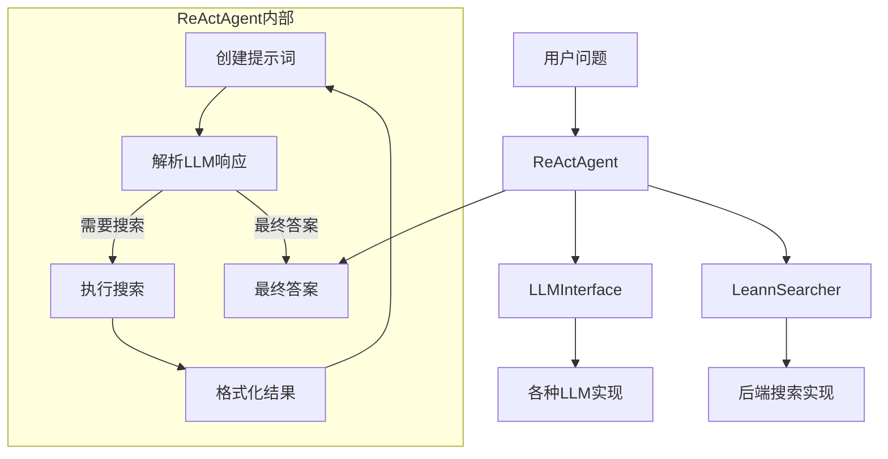

# ReAct 代理模块文档

## 1. 模块概述

ReAct（Reasoning + Acting）代理模块是 LEANN 系统中的智能问答组件，实现了基于推理-行动循环的多轮检索模式。该模块通过结合大语言模型（LLM）的推理能力和 LEANN 的搜索功能，能够智能地决定何时进行搜索、如何构建搜索查询，并最终基于收集到的信息给出完整答案。

### 设计理念

本模块的设计受到 mini-swe-agent 模式的启发，但专注于多轮检索任务，保持了简洁而高效的实现。核心思想是让代理通过反复的思考-行动-观察循环来逐步收集信息，直到认为有足够的材料来回答原始问题。这种方法特别适合需要从多个来源综合信息的复杂查询场景。

### 主要功能

- 智能推理：利用 LLM 分析当前信息状态，决定下一步行动
- 多轮搜索：支持多轮次的搜索查询，每次查询基于前序结果
- 结果整合：自动格式化搜索结果并提供给 LLM 进行分析
- 灵活配置：支持自定义 LLM 配置、最大迭代次数等参数
- 历史追踪：记录完整的搜索历史，便于调试和分析

## 2. 核心组件

### ReActAgent 类

`ReActAgent` 是本模块的核心类，实现了完整的 ReAct 代理逻辑。

#### 初始化参数

| 参数 | 类型 | 必需 | 描述 |
|------|------|------|------|
| searcher | LeannSearcher | 是 | 用于执行搜索的 LEANN 搜索器实例 |
| llm | LLMInterface \| None | 否 | LLM 接口实例，如果为 None 则通过 llm_config 创建 |
| llm_config | dict[str, Any] \| None | 否 | 用于创建 LLM 的配置字典 |
| max_iterations | int | 否 | 最大搜索迭代次数，默认为 5 |

#### 主要方法

##### `__init__`

初始化 ReAct 代理，设置搜索器、LLM 和最大迭代次数。如果没有直接提供 LLM 实例，则会根据 llm_config 创建一个。

##### `search`

执行搜索查询并返回结果。

**参数：**
- `query` (str): 搜索查询字符串
- `top_k` (int): 返回结果数量，默认为 5

**返回值：**
- `list[SearchResult]`: 搜索结果列表

##### `run`

运行 ReAct 代理来回答问题。这是主要的公开方法，执行完整的推理-行动循环。

**参数：**
- `question` (str): 要回答的问题
- `top_k` (int): 每次迭代的搜索结果数量，默认为 5

**返回值：**
- `str`: 最终答案字符串

#### 内部方法

##### `_format_search_results`

将搜索结果格式化为适合 LLM 处理的字符串。

**参数：**
- `results` (list[SearchResult]): 搜索结果列表

**返回值：**
- `str`: 格式化后的搜索结果字符串

##### `_create_react_prompt`

创建用于 LLM 的 ReAct 提示词，包含问题、当前迭代信息和之前的观察结果。

**参数：**
- `question` (str): 原始问题
- `iteration` (int): 当前迭代次数
- `previous_observations` (list[str]): 之前的观察结果列表

**返回值：**
- `str`: 完整的提示词字符串

##### `_parse_llm_response`

解析 LLM 响应，提取思考内容和行动。

**参数：**
- `response` (str): LLM 的原始响应

**返回值：**
- `tuple[str, str | None]`: (思考内容, 行动)，其中行动是搜索查询字符串或 None（表示要提供最终答案）

### create_react_agent 函数

这是一个便捷函数，用于创建 ReActAgent 实例，简化了常见的初始化流程。

**参数：**
- `index_path` (str): LEANN 索引路径
- `llm_config` (dict[str, Any] \| None): LLM 配置字典
- `max_iterations` (int): 最大搜索迭代次数
- `**searcher_kwargs`: 传递给 LeannSearcher 的额外关键字参数

**返回值：**
- `ReActAgent`: 初始化好的 ReActAgent 实例

## 3. 架构与工作流程

### 系统架构

ReAct 代理模块在 LEANN 系统中的位置处于核心聊天与代理层，它与搜索 API 和 LLM 接口紧密协作。



### 工作流程

ReAct 代理的工作流程遵循经典的思考-行动-观察循环：

```mermaid
sequenceDiagram
    participant User as 用户
    participant Agent as ReActAgent
    participant LLM as LLMInterface
    participant Searcher as LeannSearcher
    
    User->>Agent: 提出问题
    loop 直到得到答案或达到最大迭代
        Agent->>Agent: 创建ReAct提示词
        Agent->>LLM: 发送提示词
        LLM-->>Agent: 返回推理和行动
        Agent->>Agent: 解析LLM响应
        alt 需要更多信息
            Agent->>Searcher: 执行搜索
            Searcher-->>Agent: 返回搜索结果
            Agent->>Agent: 格式化结果为观察
        else 有足够信息
            Agent->>User: 返回最终答案
            break
        end
    end
    alt 达到最大迭代
        Agent->>LLM: 请求基于所有搜索结果的最终答案
        LLM-->>Agent: 返回最终答案
        Agent->>User: 返回最终答案
    end
```

### 详细执行步骤

1. **初始化阶段**：
   - 创建或接收 LeannSearcher 实例
   - 配置 LLM 接口（直接提供或通过配置创建）
   - 设置最大迭代次数

2. **循环执行阶段**（最多 max_iterations 次）：
   - 构建包含当前问题、迭代次数和之前观察的提示词
   - 将提示词发送给 LLM 进行推理
   - 解析 LLM 响应，提取思考内容和行动
   - 如果行动是搜索，则执行搜索并格式化结果
   - 如果行动是最终答案，则结束循环

3. **终止条件**：
   - LLM 明确表示要提供最终答案
   - 达到最大迭代次数
   - 连续两次搜索无结果（提前终止）

## 4. 使用指南

### 基本使用

使用 `create_react_agent` 函数是最简单的方式：

```python
from leann.react_agent import create_react_agent

# 创建 ReAct 代理
agent = create_react_agent(
    index_path="path/to/your/index",
    llm_config={
        "provider": "openai",
        "model": "gpt-4",
        "api_key": "your-api-key"
    },
    max_iterations=5
)

# 运行代理回答问题
answer = agent.run("什么是机器学习？")
print(answer)
```

### 高级配置

对于更复杂的场景，您可以直接使用 ReActAgent 类：

```python
from leann.react_agent import ReActAgent
from leann.api import LeannSearcher
from leann.chat import get_llm

# 自定义配置
searcher = LeannSearcher("path/to/index", metadata_filter={"category": "technology"})
llm = get_llm({
    "provider": "anthropic",
    "model": "claude-3-opus",
    "api_key": "your-api-key",
    "temperature": 0.7
})

# 创建代理
agent = ReActAgent(
    searcher=searcher,
    llm=llm,
    max_iterations=10
)

# 运行并访问搜索历史
answer = agent.run("解释深度学习的发展历史")
print(answer)

# 查看搜索历史
for item in agent.search_history:
    print(f"迭代 {item['iteration']}:")
    print(f"思考: {item['thought']}")
    print(f"搜索: {item['action']}")
    print(f"结果数: {item['results_count']}\n")
```

### 配置选项

#### LLM 配置

LLM 配置取决于使用的提供商，常见选项包括：

```python
# OpenAI 配置
llm_config = {
    "provider": "openai",
    "model": "gpt-4",  # 或 "gpt-3.5-turbo"
    "api_key": "your-api-key",
    "temperature": 0.7,
    "max_tokens": 1000
}

# Anthropic 配置
llm_config = {
    "provider": "anthropic",
    "model": "claude-3-opus",
    "api_key": "your-api-key"
}

# 其他支持的提供商: "hf" (Hugging Face), "ollama", "gemini", "simulated"
```

#### 搜索器配置

可以通过 `create_react_agent` 的 `searcher_kwargs` 传递搜索器配置：

```python
agent = create_react_agent(
    index_path="path/to/index",
    llm_config=llm_config,
    top_k=10,  # 每次搜索返回的结果数
    metadata_filter={"year": 2023},  # 元数据过滤
    scorer="bm25"  # 评分方法
)
```

## 5. 集成与依赖

### 依赖关系

ReAct 代理模块依赖于 LEANN 系统中的其他几个核心模块：

1. **搜索 API 模块**：
   - `LeannSearcher`: 提供搜索功能
   - `SearchResult`: 表示搜索结果的数据结构
   
2. **聊天接口模块**：
   - `LLMInterface`: 定义 LLM 交互的抽象接口
   - `get_llm`: 工厂函数，用于创建 LLM 实例

### 与其他模块的关系

- 与 [core_search_api_and_interfaces](core_search_api_and_interfaces.md) 模块紧密协作，使用其提供的搜索功能
- 依赖 [chat_interfaces](chat_interfaces.md) 模块提供的 LLM 接口
- 可以与 [interactive_utils](interactive_utils.md) 模块结合使用，创建交互式会话

## 6. 注意事项与最佳实践

### 边缘情况与限制

1. **最大迭代次数限制**：
   - 代理总是会在 `max_iterations` 次迭代后停止，即使没有找到满意的答案
   - 建议根据问题复杂度设置合理的值（通常 3-10 次）

2. **LLM 响应格式问题**：
   - 代理依赖于 LLM 按照特定格式响应（"Thought:"、"Action:"、"Final Answer:"）
   - 如果 LLM 没有遵循格式，代理会尝试最佳努力解析，但可能失败
   - 使用更强大的模型（如 GPT-4、Claude 3）可以提高格式遵从性

3. **搜索结果质量**：
   - 代理的性能很大程度上依赖于搜索结果的质量
   - 确保索引质量良好，元数据准确

4. **无结果处理**：
   - 如果连续两次搜索都没有结果，代理会提前停止并尝试基于已有信息回答
   - 在这种情况下，答案质量可能会受到影响

### 最佳实践

1. **选择合适的 LLM**：
   - 对于复杂任务，优先使用能力更强的模型
   - 对于简单任务，可以使用更快、更经济的模型

2. **配置适当的迭代次数**：
   - 简单问题：3 次迭代
   - 中等复杂度：5 次迭代
   - 复杂研究问题：7-10 次迭代

3. **监控搜索历史**：
   - 利用 `search_history` 属性调试和优化代理行为
   - 分析搜索查询模式，改进索引或提示词

4. **错误处理**：
   - 实现适当的错误处理，特别是对于 LLM API 调用和搜索操作
   - 考虑添加超时机制，防止代理卡住

5. **提示词优化**：
   - 对于特定领域，可以考虑修改 `_create_react_prompt` 方法添加领域特定的指导
   - 但要注意保持基本的 ReAct 结构，确保解析逻辑正常工作

## 7. 示例场景

### 场景 1：研究性问题回答

```python
# 创建代理
agent = create_react_agent(
    index_path="research_papers_index",
    llm_config={"provider": "openai", "model": "gpt-4", "api_key": "..."},
    max_iterations=7
)

# 回答复杂研究问题
question = "比较和对比卷积神经网络和Transformer在图像识别中的优缺点"
answer = agent.run(question)
print("最终答案:", answer)
```

### 场景 2：多文档信息整合

```python
# 使用元数据过滤的搜索器
searcher = LeannSearcher(
    "company_docs_index",
    metadata_filter={"department": ["engineering", "product"]}
)

agent = ReActAgent(
    searcher=searcher,
    llm_config={"provider": "anthropic", "model": "claude-3-sonnet", "api_key": "..."},
    max_iterations=5
)

# 获取跨部门信息
answer = agent.run("我们公司在过去一年中推出了哪些与AI相关的产品和技术？")
print(answer)
```

通过这些示例，您可以看到 ReAct 代理模块如何灵活应用于各种信息检索和问答场景，利用 LLM 的推理能力增强传统的搜索功能。
