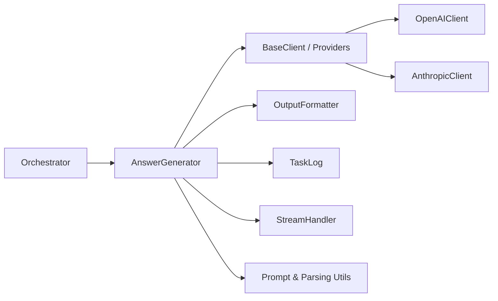
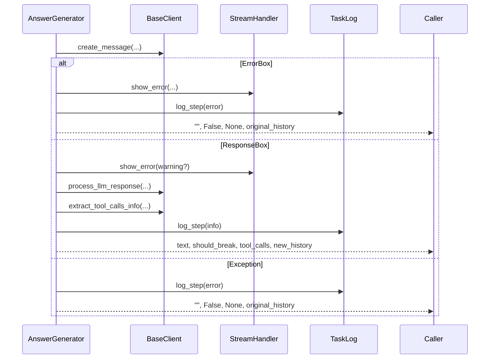
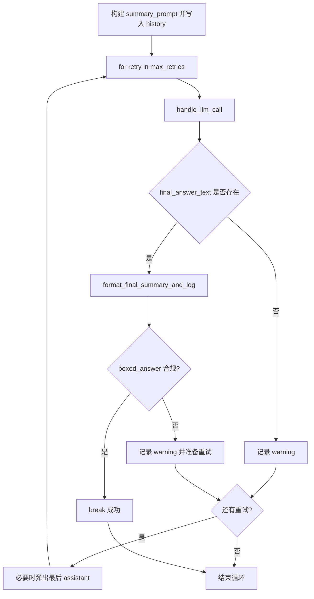
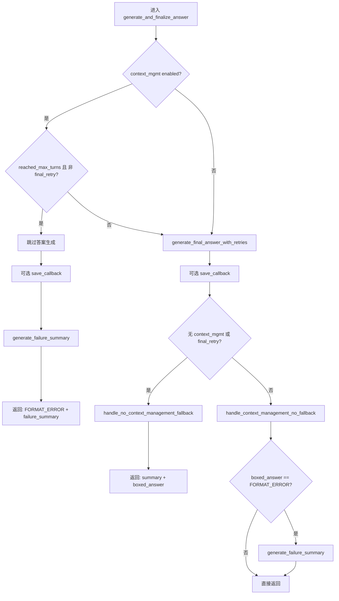

# answer_generator 模块文档

## 模块定位与设计目标

`answer_generator` 是 `miroflow_agent_core` 中负责“收尾决策”的关键模块。它并不参与工具执行本身，也不负责主循环调度，而是专注于在任务接近结束时，把已有对话上下文、工具结果与模型输出整合为可交付的最终答案，并在必要时触发“失败经验压缩”以支持下一轮重试。这个模块存在的核心原因是：在真实 Agent 场景中，模型经常会出现“有内容但格式不合规”“轮次耗尽前仍未收敛”“回答质量不足以直接输出”等情况，若没有统一的终局处理层，系统会在稳定性与准确率之间出现明显波动。

从职责边界看，`AnswerGenerator` 承担四类能力：第一，统一封装 LLM 调用后的错误处理与日志落盘；第二，生成最终摘要并校验 boxed answer（例如是否命中格式约束）；第三，根据是否启用上下文压缩策略，决定是否采用中间答案回退；第四，在失败场景下生成结构化失败经验（failure experience summary），供上层编排器发起下一次“带记忆重试”。因此它是 Orchestrator 决策链中的“最终输出闸门”，同时也是上下文管理策略的执行载体。

---

## 在系统中的位置



`Orchestrator` 在主任务循环结束或触发收尾阶段时调用 `AnswerGenerator`。`AnswerGenerator` 通过 `BaseClient` 发起最终 LLM 请求，通过 `OutputFormatter` 解析最终摘要与 boxed answer，通过 `TaskLog` 与 `StreamHandler` 分别处理结构化日志与实时错误展示。当答案无法稳定产出时，它还会调用 prompt/parsing 工具链生成失败经验摘要，供 Orchestrator 进入下一轮尝试。

可参考：
- [orchestrator.md](orchestrator.md)
- [base_client.md](base_client.md)
- [output_formatter.md](output_formatter.md)
- [stream_handler.md](stream_handler.md)
- [miroflow_agent_logging.md](miroflow_agent_logging.md)

---

## 核心类：`AnswerGenerator`

### 构造函数

```python
AnswerGenerator(
    llm_client: BaseClient,
    output_formatter: OutputFormatter,
    task_log: TaskLog,
    stream_handler: StreamHandler,
    cfg: DictConfig,
    intermediate_boxed_answers: List[str],
)
```

初始化时注入的依赖都不是可选项，说明该类是典型的“协调器型组件”：

- `llm_client`：抽象于供应商实现（OpenAI/Anthropic 等），负责消息创建与响应解析。
- `output_formatter`：将原始回答整理为 `final_summary`、`final_boxed_answer`、`usage_log`。
- `task_log`：记录步骤级日志（info/warning/error）。
- `stream_handler`：用于向外部流式展示 warning/error。
- `cfg`：读取策略配置，尤其是 `agent.context_compress_limit` 与 `agent.keep_tool_result`。
- `intermediate_boxed_answers`：上游执行过程中积累的中间候选答案，用于无上下文管理时回退。

内部关键状态：

- `context_compress_limit = cfg.agent.get("context_compress_limit", 0)`：`>0` 表示启用上下文管理（允许失败摘要驱动重试）。
- `max_final_answer_retries`：当 `keep_tool_result == -1` 时为 `3`（默认），否则强制为 `1`。这体现了一个重要设计：当工具结果保留策略变化时，终局回答重试被收缩，避免语义历史污染。

---

## 关键方法深度解析

## 1) `handle_llm_call`

```python
async def handle_llm_call(...) -> Tuple[Optional[str], bool, Optional[Any], List[Dict[str, Any]]]
```

该方法是 AnswerGenerator 对 LLM 交互的统一入口，目标是把“供应商差异、异常处理、响应包装处理、日志记录”收敛在一个地方。它会先调用 `llm_client.create_message(...)`，然后处理三类特殊返回：

1. `ErrorBox`：立即通过 `stream.show_error` 提示并视为失败。
2. `ResponseBox`：可携带 `extra_info.warning_msg`；警告会被流式输出后再提取真实响应。
3. `None` 或异常：记录 error 日志，并返回可重试形态（空字符串、`should_break=False`、原始 history）。

成功路径下，它继续调用：

- `llm_client.process_llm_response(...)` 得到 `assistant_response_text` 与 `should_break`。
- `llm_client.extract_tool_calls_info(...)` 提取工具调用元信息。

**返回语义**：
- `response_text` 可能为空字符串（失败时）而非 `None`，调用方要按“truthy”检查。
- `message_history` 是潜在已变更版本；失败分支刻意返回 `original_message_history`，避免污染上下文。



---

## 2) `generate_failure_summary`

```python
async def generate_failure_summary(...) -> Optional[str]
```

该方法实现“失败经验压缩”。它不是简单摘要，而是将失败轨迹结构化为下一次尝试可利用的经验，核心用于控制上下文长度与保持任务连续性。

内部步骤值得关注：

- 对 `message_history` 做浅拷贝，避免直接破坏主链历史。
- 若最后一条是 user 消息则移除，防止重复指令干扰失败总结。
- 追加 `FAILURE_SUMMARY_PROMPT` 与 `FAILURE_SUMMARY_ASSISTANT_PREFIX`，强制模型按期望结构输出。
- 调用 `handle_llm_call`（step id 使用 `turn_count + 10`，与主流程日志分层）。
- 成功后再用 `extract_failure_experience_summary` 做二次抽取，得到可复用摘要。

如果生成失败返回 `None`，上层需要容忍“无失败经验”分支。

---

## 3) `generate_final_answer_with_retries`

```python
async def generate_final_answer_with_retries(...) -> Tuple[
    Optional[str], str, Optional[str], str, List[Dict[str, Any]]
]
```

这是最终答案生成的重试引擎。方法会先通过 `generate_agent_summarize_prompt(...)` 注入总结请求，再循环调用 `handle_llm_call`。每次成功返回后，利用 `output_formatter.format_final_summary_and_log(...)` 解析：

- `final_summary`
- `final_boxed_answer`
- `usage_log`

判定是否成功的关键条件不是“有文本”，而是 `final_boxed_answer != FORMAT_ERROR_MESSAGE`。即：即使有回答文本，若未满足格式约束仍视作失败尝试。

当一次尝试失败且还有重试机会时，会移除尾部 assistant 消息，避免错误格式持续污染后续尝试。



---

## 4) `handle_no_context_management_fallback`

```python
def handle_no_context_management_fallback(...) -> Tuple[str, str, str]
```

此方法适用于 `context_compress_limit == 0`（无上下文管理）。设计原则是“既然没有下一次压缩重试机会，就尽量给出可用答案”。因此当 `final_boxed_answer` 无效时，它会尝试使用 `intermediate_boxed_answers` 的最后一个值回退。

这是一种偏可用性的策略，可能牺牲部分严谨性，但能减少空答案率。

---

## 5) `handle_context_management_no_fallback`

```python
def handle_context_management_no_fallback(...) -> Tuple[str, str, str]
```

此方法适用于 `context_compress_limit > 0`。策略与上一方法相反：不使用中间答案猜测，不进行“兜底拍脑袋”，而是保留失败状态并交给失败经验总结。核心原因是该模式下系统明确有后续 retry 通道，错误兜底可能误导下一轮。

---

## 6) `generate_and_finalize_answer`（主入口）

```python
async def generate_and_finalize_answer(...) -> Tuple[
    str, str, Optional[str], str, List[Dict[str, Any]]
]
```

这是外部最应调用的方法，封装了所有策略分支。其关键输入开关有三个：

- `context_compress_limit > 0`（上下文管理是否开启）
- `reached_max_turns`（是否因轮次耗尽退出主循环）
- `is_final_retry`（是否最后一次机会）

### 决策逻辑（实际执行版）



### 返回值约定

该方法统一返回：

1. `final_summary: str`
2. `final_boxed_answer: str`
3. `failure_experience_summary: Optional[str]`
4. `usage_log: str`
5. `message_history: List[Dict[str, Any]]`

注意第三项只有在需要“失败压缩重试”时才会有值。

---

## 配置行为说明

典型配置位于 `cfg.agent`：

```yaml
agent:
  context_compress_limit: 3   # >0 启用上下文管理
  keep_tool_result: -1        # -1 时 final answer 允许最多 3 次重试，否则只 1 次
```

`context_compress_limit` 在本模块中的作用不是直接做 token truncation，而是作为“是否走失败经验驱动重试”的策略开关。真正压缩与重启流程由上游编排器配合完成。

---

## 与其他核心模块的协作关系

`AnswerGenerator` 与 `ToolExecutor` 的关系是间接的：工具调用信息来自 LLM 响应解析，但此模块不执行工具。工具执行属于主循环阶段，最终在收尾时只消费已经写入 `message_history` 的结果。与 `StreamHandler` 的协作也偏“用户可见性增强”而非业务必需：即使不显示流式错误，主流程仍可根据返回值继续决策。

从边界控制看，它避免了 Orchestrator 直接处理供应商细节（ErrorBox/ResponseBox）与格式校验细节（FORMAT_ERROR_MESSAGE），降低了上层复杂度。

---

## 使用方式与扩展示例

最小调用路径（通常由 Orchestrator 内部触发）：

```python
final_summary, final_boxed_answer, failure_summary, usage_log, message_history = \
    await answer_generator.generate_and_finalize_answer(
        system_prompt=system_prompt,
        message_history=message_history,
        tool_definitions=tool_definitions,
        turn_count=turn_count,
        task_description=task_description,
        reached_max_turns=reached_max_turns,
        is_final_retry=is_final_retry,
        save_callback=save_callback,
    )
```

若要扩展新策略，推荐优先扩展点：

- 在 `generate_final_answer_with_retries` 中新增“格式失败后的提示强化策略”（例如附加格式修复提示）。
- 在 `handle_context_management_no_fallback` 中注入更细粒度错误分类（例如区分“无答案”与“有答案但格式错”）。
- 在 `handle_llm_call` 中补充 provider-specific telemetry（注意保持 `BaseClient` 抽象一致）。

---

## 边界条件、错误场景与已知限制

该模块有较强容错，但仍有一些重要约束。首先，它默认将调用异常吞并并返回可重试状态，这提高了稳定性，但也可能掩盖底层系统性故障；生产环境应依赖 `TaskLog` 与外部告警系统结合监控。其次，`message_history` 在多处会被原地修改（append/pop），调用方若共享同一引用需注意并发安全与副作用隔离。再次，`generate_failure_summary` 使用浅拷贝，对嵌套对象不做深复制，若消息对象内部可变结构被外部修改，可能导致不可预期行为。

格式约束上，本模块将 `FORMAT_ERROR_MESSAGE` 作为“硬失败标记”，这使流程清晰，但也意味着 OutputFormatter 的解析规则必须稳定；一旦格式规则升级，AnswerGenerator 可能出现“文本看似正确但仍被判失败”的现象。最后，中间答案回退策略只取最后一个候选值，不做置信度排序，这在复杂任务中可能不是最优。

---

## 维护建议

建议将该模块视为“策略层”而非“模型层”。当你需要提升最终成功率时，优先检查三件事：`summary_prompt` 质量、`OutputFormatter` 的解析鲁棒性、以及 context management 开关是否匹配任务类型。若你需要定位问题，先看 `TaskLog` 中 `Main Agent | Final Answer` 与 `Main Agent | Failure Summary` 相关 step，再回溯 `BaseClient` 的 provider 调用日志。

对于跨模块细节，请参考：
- LLM 客户端抽象与响应处理：[base_client.md](base_client.md)
- 输出结构提取与格式规则：[output_formatter.md](output_formatter.md)
- 主流程编排与重试生命周期：[orchestrator.md](orchestrator.md)
- 日志结构定义：[miroflow_agent_logging.md](miroflow_agent_logging.md)
