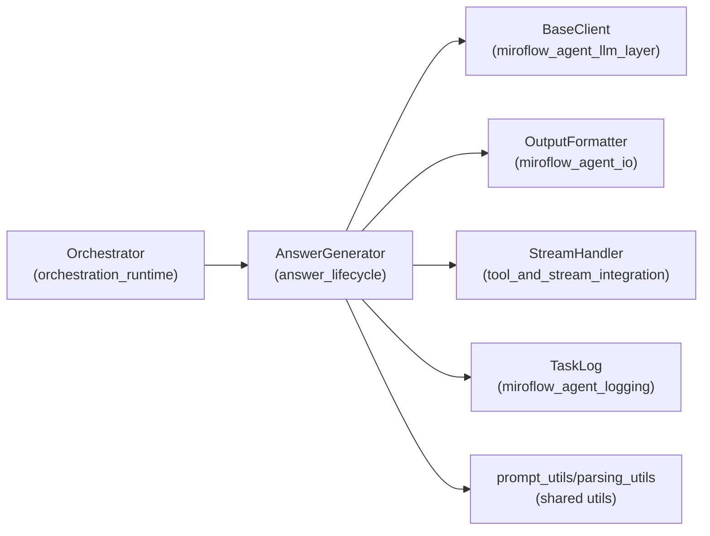
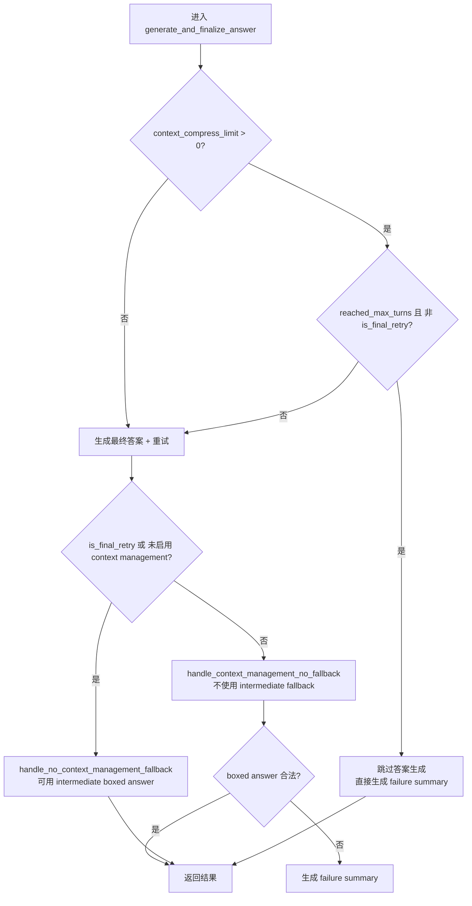
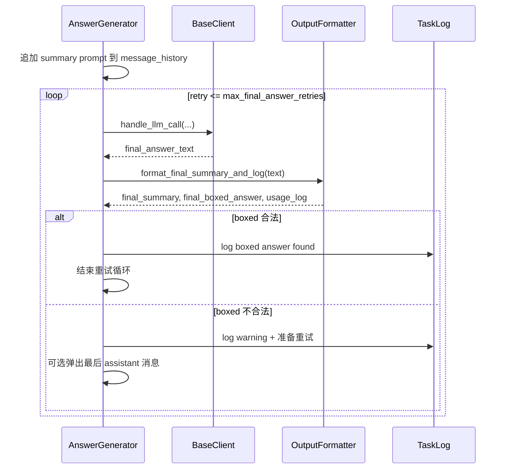

# answer_lifecycle 模块文档

## 模块概述

`answer_lifecycle` 模块负责在主代理（main agent）完成多轮推理和工具调用后，统一处理“答案收敛”阶段：向 LLM 发起最终回答请求、校验输出格式（尤其是 `\boxed{}`）、在失败时生成“失败经验摘要”用于上下文压缩重试，并根据上下文管理策略选择不同的兜底行为。该模块存在的核心价值是：把“生成答案”从“执行推理/调用工具”的主循环里解耦出来，形成可复用、可观测、可策略化控制的生命周期闭环。

从系统视角看，它是 `miroflow_agent_core` 内部的“结束控制器”。上游通常由编排层触发（参见 [orchestration_runtime.md](orchestration_runtime.md) 与 [orchestrator.md](orchestrator.md)），下游依赖 LLM 客户端、输出格式化器、流式事件通道与任务日志模块，实现“产出答案 + 记录过程 + 可重试压缩”的一体化行为。其核心实现位于 `apps/miroflow-agent/src/core/answer_generator.py`，主要类为 `AnswerGenerator`。

---

## 设计目标与设计动机

在真实任务场景中，代理在“最后一步”最常见的失败并不是知识缺失，而是输出格式不合规、上下文过长导致遗忘、或达到回合上限后无法给出可靠结论。`answer_lifecycle` 的设计正是为了解决这些“末端失败”：它并不重新定义推理能力，而是通过明确的生命周期策略，提升最终可用答案的稳定性。

该模块遵循三条关键设计原则。第一，统一 LLM 调用出口：无论是生成最终答案还是生成失败摘要，都走同一套调用与日志链路，减少分支逻辑不一致。第二，格式优先于“盲猜”：当启用上下文管理时，如果答案格式不合法，不会轻易用中间结果替代，而是优先沉淀失败经验进入下一轮。第三，可配置的保守/激进策略切换：通过 `context_compress_limit` 与 `keep_tool_result` 等配置切换重试次数、是否保留工具结果、以及达到最大回合后的行为。

---

## 在整体系统中的位置



上图展示了 `AnswerGenerator` 的依赖边界：它不直接执行工具，也不直接管理主循环，而是消费“已有消息历史”和“工具定义”来完成答案阶段。`BaseClient` 负责真实模型调用，`OutputFormatter` 负责 `\boxed{}` 提取与统计信息拼接，`StreamHandler` 负责对用户界面或 SSE 消费方透出错误，`TaskLog` 负责结构化追踪。这样做使得答案生命周期可以在不改动工具执行层的情况下独立演进。

---

## 核心类：AnswerGenerator

### 职责概览

`AnswerGenerator` 是一个面向“最终回答阶段”的状态协调器。它维护必要的配置快照（如 `context_compress_limit`、`max_final_answer_retries`）和中间答案缓存（`intermediate_boxed_answers`），并对外提供一个高层入口 `generate_and_finalize_answer(...)`，内部组合多个子步骤：

1. 统一发起 LLM 调用并处理包装响应；
2. 按策略重试最终答案生成；
3. 校验格式并决定兜底；
4. 在需要时生成失败经验摘要用于下一轮压缩重试。

### 构造函数与关键字段

```python
AnswerGenerator(
    llm_client: BaseClient,
    output_formatter: OutputFormatter,
    task_log: TaskLog,
    stream_handler: StreamHandler,
    cfg: DictConfig,
    intermediate_boxed_answers: List[str],
)
```

构造时注入的依赖均为运行期协作对象。`cfg.agent.context_compress_limit` 决定是否开启上下文管理模式，`cfg.agent.keep_tool_result` 影响最终答案重试次数：当其为 `-1`（保留全部工具结果）时，默认允许 `3` 次最终答案重试；否则只尝试 `1` 次。这一策略隐含一个工程判断：上下文信息更完整时，重试成本与收益更匹配。

---

## 核心流程（主入口）

### `generate_and_finalize_answer(...)`

这是模块最重要的方法，负责按“是否启用上下文管理 + 是否达到最大回合 + 是否最终重试”做决策。

**参数**：
- `system_prompt`: 系统提示词
- `message_history`: 当前会话历史（会被原地调整）
- `tool_definitions`: 工具定义列表
- `turn_count`: 当前轮次
- `task_description`: 原始任务描述
- `reached_max_turns`: 是否因达到回合上限退出主循环
- `is_final_retry`: 是否为最后一次重试机会
- `save_callback`: 可选历史持久化回调

**返回**：
`(final_summary, final_boxed_answer, failure_experience_summary, usage_log, message_history)`

**副作用**：
会写入 `TaskLog`，可能通过 `StreamHandler` 推送错误事件，会修改 `message_history` 并可触发 `save_callback`。



这个流程体现了模块最重要的策略差异：在上下文管理模式中，系统宁可“承认失败并总结经验”，也不轻易把中间答案当最终答案，从而避免将错误结果固化。

---

## 关键子流程详解

### 1) `handle_llm_call(...)`：统一 LLM 调用与响应解包

该方法是所有 LLM 请求的统一入口，减少重复异常处理逻辑。

它会调用 `llm_client.create_message(...)`，并处理三类响应：

- `ErrorBox`：通过 `stream.show_error(...)` 对外发错，再按失败路径返回空响应。
- `ResponseBox`：提取真实 `response`；若包含 `warning_msg`，同样推送到流。
- 普通响应：交给 `BaseClient.process_llm_response(...)` 与 `extract_tool_calls_info(...)` 标准化。

**返回值语义**：
`(assistant_response_text, should_break, tool_calls_info, message_history)`。
其中 `should_break` 常用于上游控制是否提前结束对话步进。

**错误处理细节**：
出现异常时，不抛出到上层，而是记录 `TaskLog` 并返回 `("", False, None, original_message_history)`，即“软失败 + 恢复原历史”，这对重试逻辑非常关键。

### 2) `generate_final_answer_with_retries(...)`：最终答案重试机制

该方法先调用 `generate_agent_summarize_prompt(...)` 生成收敛提示词，再追加到历史中触发最终回答。每次尝试后会通过 `OutputFormatter.format_final_summary_and_log(...)` 提取：

- `final_summary`: 面向日志/可读输出的完整总结
- `final_boxed_answer`: 从最后一个 `\boxed{}` 提取出的答案
- `usage_log`: token 使用信息

当提取结果等于 `FORMAT_ERROR_MESSAGE` 时，认为格式不合规，会在允许范围内重试，并移除最后一个 assistant 消息避免坏样本污染下一次尝试。



### 3) `generate_failure_summary(...)`：失败经验压缩

当答案不可用、或在上下文管理模式下需要进入下一轮时，模块会将完整对话压缩为“失败经验摘要”。它会先构建专用历史：

- 去掉末尾多余 user 消息（若存在）
- 追加 `FAILURE_SUMMARY_PROMPT`
- 追加 `FAILURE_SUMMARY_ASSISTANT_PREFIX` 以约束结构

随后复用 `handle_llm_call` 生成文本，再通过 `extract_failure_experience_summary(...)` 提取结构化摘要。该摘要不是给用户看的最终答案，而是给下一轮代理作为“失败记忆”。

### 4) 两类兜底策略

`handle_no_context_management_fallback(...)` 与 `handle_context_management_no_fallback(...)` 是策略分水岭。

前者（未启用上下文管理，或最后一次重试）更偏“结果导向”：若没有合法 boxed，会尝试使用 `intermediate_boxed_answers[-1]`。后者（启用上下文管理且仍有重试机会）更偏“准确性优先”：不会使用中间答案，宁可触发失败摘要进入下一轮。

---

## 配置项与行为映射

`answer_lifecycle` 对以下配置最敏感：

```yaml
agent:
  context_compress_limit: 0   # >0 表示启用上下文管理/失败压缩重试
  keep_tool_result: -1        # -1 保留全部工具结果；也影响最终答案重试次数
```

行为要点如下：

- `context_compress_limit == 0`：单轮结果优先，允许中间答案兜底。
- `context_compress_limit > 0`：多轮可靠性优先，失败时生成摘要，不轻易兜底。
- `keep_tool_result == -1`：`max_final_answer_retries = 3`；否则通常只尝试 1 次。

如果你需要更激进或更保守的策略，最直接的扩展点是调整 `max_final_answer_retries` 计算规则，或在两类 fallback 中引入更细粒度条件（例如按任务类型启用中间答案兜底）。

---

## 与其他模块的协作关系

本模块依赖但不替代以下能力：

- LLM 细节（模型参数、token 统计、多供应商差异）请参考 [base_client.md](base_client.md)、[openai_client.md](openai_client.md)、[anthropic_client.md](anthropic_client.md)。
- 输出抽取与 `\boxed{}` 解析细节请参考 [output_formatter.md](output_formatter.md)。
- SSE/流式事件协议请参考 [stream_handler.md](stream_handler.md)。
- 全链路日志结构请参考 [miroflow_agent_logging.md](miroflow_agent_logging.md)。
- 上游调度入口与循环控制请参考 [orchestration_runtime.md](orchestration_runtime.md) 与 [orchestrator.md](orchestrator.md)。

---

## 常见使用模式

下面示例展示在编排层中调用该模块的典型方式（示意）：

```python
final_summary, final_boxed_answer, failure_summary, usage_log, message_history = \
    await answer_generator.generate_and_finalize_answer(
        system_prompt=system_prompt,
        message_history=message_history,
        tool_definitions=tool_definitions,
        turn_count=turn_count,
        task_description=task_description,
        reached_max_turns=reached_max_turns,
        is_final_retry=is_final_retry,
        save_callback=save_history,
    )

if final_boxed_answer != FORMAT_ERROR_MESSAGE:
    # 成功产出最终答案
    pass
elif failure_summary:
    # 使用 failure_summary 驱动下一轮上下文压缩重试
    pass
else:
    # 最终失败处理
    pass
```

在扩展时，建议保持 `generate_and_finalize_answer` 作为唯一对外入口，把新策略封装在内部私有流程，避免上游编排层感知过多分支。

---

## 边界条件、错误与限制

该模块做了较多容错，但仍有一些必须注意的行为约束。

首先，`message_history` 会被就地修改：如移除末尾 user、追加 summary prompt、重试时弹出 assistant 消息。若上游还要复用原始历史，请在调用前自行深拷贝。其次，`handle_llm_call` 采用“吞异常并返回空响应”的策略，优点是不中断主流程，缺点是若上游没有检查空字符串，可能把“调用失败”误判为“模型正常但无内容”。

此外，`generate_failure_summary` 依赖提示词结构和解析函数的一致性；若你改了 `FAILURE_SUMMARY_ASSISTANT_PREFIX` 或 `extract_failure_experience_summary(...)` 的协议，必须联调验证，否则可能得到空摘要。再者，`OutputFormatter` 以 `\boxed{}` 为关键约束，这对数学问答非常有效，但对非 boxed 任务会显得严格，需要在任务模板层面提前统一格式要求。

最后一个操作性注意点是流式错误：当响应被 `ErrorBox` 包装时，`stream.show_error` 可能触发流终止信号（队列 `None`），这会影响前端消费端状态机；如果你在同一任务里还想继续输出其他事件，需要在上游协议层谨慎处理。

---

## 可扩展性建议

如果你希望增强 `answer_lifecycle`，建议优先在以下方向演进：

- 引入“任务类型感知”的 fallback 策略，例如对事实检索任务允许更积极的 intermediate fallback，对计算类任务保持严格 boxed 校验。
- 为失败摘要增加质量评分（如是否包含可复用事实），低质量摘要时触发重新摘要。
- 在 `handle_llm_call` 增加可配置的错误分类（超时、限流、结构错误），让重试策略能按错误类型分流。

这些扩展都应遵守当前模块的核心边界：**答案生命周期控制**，而不是重新承担工具执行或主循环编排职责。

---

## 小结

`answer_lifecycle` 的本质是“让最终答案阶段可控、可观测、可恢复”。它通过统一 LLM 调用、格式化校验、失败摘要压缩和上下文管理策略，把原本脆弱的“最后一步”变成系统级可靠机制。对维护者而言，理解该模块最关键的是把握其决策哲学：**在可重试时优先准确性，在无重试机会时优先可用性**。