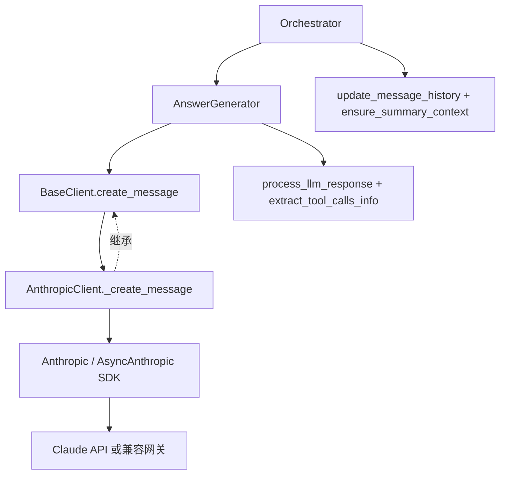
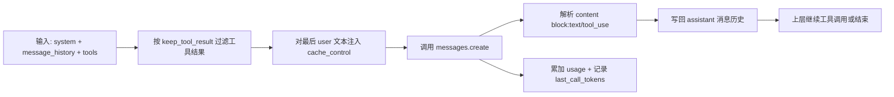
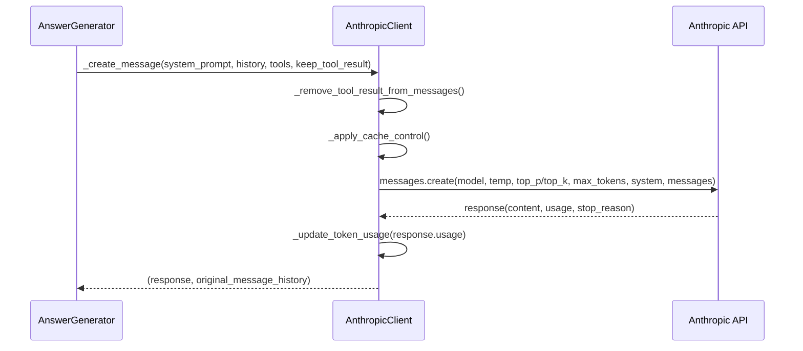
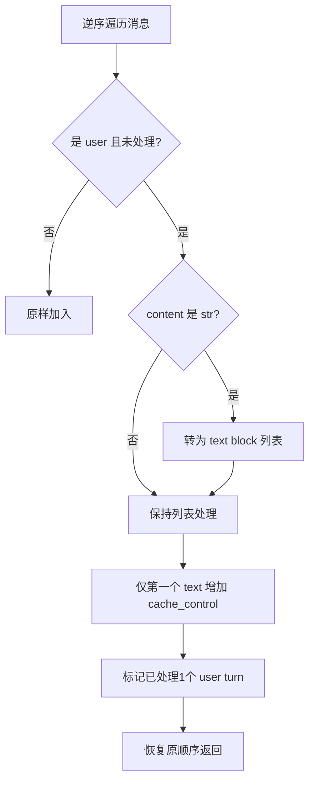
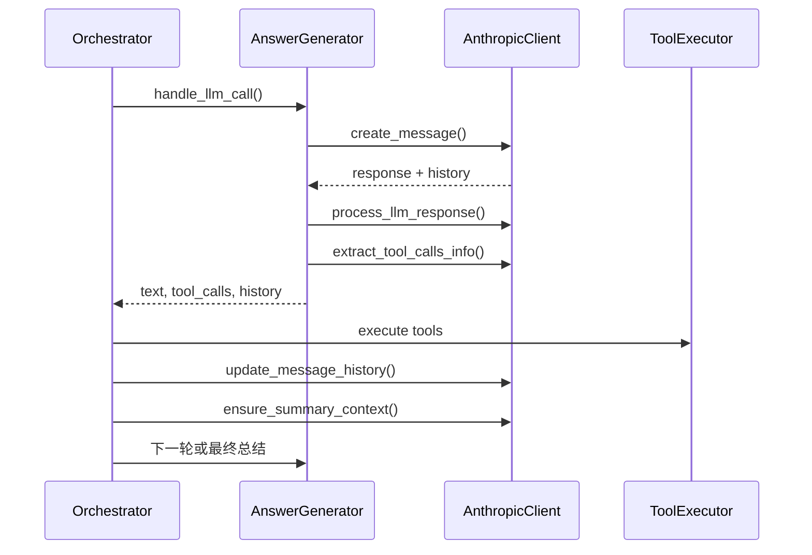

# anthropic_client 模块文档

## 模块简介与设计动机

`anthropic_client` 是 `miroflow_agent_llm_layer` 中面向 Anthropic Claude 的 Provider 适配模块，核心实现为 `AnthropicClient`。它继承统一抽象 [`BaseClient`](base_client.md)，对上层暴露一致的调用契约（`create_message / process_llm_response / update_message_history / ensure_summary_context`），对下层封装 Anthropic SDK 与请求细节（`Anthropic / AsyncAnthropic`、messages API、prompt caching 字段、usage 字段映射）。

这个模块存在的根本原因，不是“多写一个客户端”，而是把 **供应商差异隔离在 LLM 层**。在 Miroflow 的主执行链路里，`Orchestrator`、`AnswerGenerator`、`ToolExecutor` 都依赖统一行为，而不是某个厂商的 API 语义。`AnthropicClient` 因此承担“协议翻译器 + 成本/上下文守门人”的双重职责：一方面把系统内部消息历史变成 Anthropic 所需格式，另一方面跟踪 token/cache 使用并在上下文风险出现时触发回退策略。

---

## 在整体系统中的位置

从模块关系看，`AnthropicClient` 位于编排层与外部模型服务之间：



这意味着上层几乎无需关心 provider 差异。若切换到 [`openai_client.md`](openai_client.md)，编排循环仍可复用，差异主要局限在 provider 实现内部。

---

## 核心职责总览

`AnthropicClient` 的职责可以概括为五条主线：

1. 创建 sync/async Anthropic 客户端并附加任务级 tracing header。
2. 调用 Claude messages API，支持 `top_p/top_k/max_tokens/system` 等参数映射。
3. 施加 Anthropic prompt caching（ephemeral）策略，降低重复上下文成本。
4. 维护统一 token usage 统计（含 cache read/write），供最终汇总与上下文判断使用。
5. 把 Anthropic 的 block 响应转成系统可消费的消息历史结构，驱动后续工具循环。



---

## 类与方法详解：`AnthropicClient`

### 1) `__post_init__(self)`

该方法先调用父类初始化，继承 `BaseClient` 的通用配置装载与 client 构建流程，然后初始化 Anthropic 相关计数字段（`input_tokens/output_tokens/cache_creation_tokens/cache_read_tokens`）。当前系统真正依赖的是父类统一的 `self.token_usage`，这些字段更多是 provider 侧扩展位。

**关键副作用**：
- 建立 `self.client`（通过 `_create_client`）。
- 初始化统一 token 计数容器。
- 写入“LLM 初始化完成”日志（父类行为）。

### 2) `_create_client(self) -> Union[AsyncAnthropic, Anthropic]`

根据 `cfg.llm.async_client` 选择异步或同步客户端，并把 `task_id` 作为 `x-upstream-session-id` 注入 HTTP headers。这个 header 对排障非常重要：日志、网关、上游调用链可以对齐同一 task。

- Async 路径：`AsyncAnthropic(..., http_client=DefaultAsyncHttpxClient(...))`
- Sync 路径：`Anthropic(..., http_client=DefaultHttpxClient(...))`

同时支持自定义 `base_url`，可接入兼容代理或企业网关。

### 3) `_update_token_usage(self, usage_data)`

把 Anthropic usage 字段映射到统一结构 [`TokenUsage`](base_client.md)：

- `cache_creation_input_tokens` → `total_cache_write_input_tokens`
- `cache_read_input_tokens` → `total_cache_read_input_tokens`
- `input_tokens` → `total_input_tokens`
- `output_tokens` → `total_output_tokens`

并更新 `self.last_call_tokens`：

```python
self.last_call_tokens = {
    "input_tokens": input + cache_creation + cache_read,
    "output_tokens": output,
}
```

这里的 `last_call_tokens` 是后续 `ensure_summary_context()` 的关键输入。若 usage 缺失，模块只记录 warning，不中断主流程（弱失败策略）。

### 4) `_create_message(...)`（核心调用）

这是 Anthropic API 的真实请求方法，带有 `tenacity.retry(wait=10s, stop=5)`。流程如下：



实现上有两个设计点：

- 发送给 LLM 的是“过滤副本”，返回给上层的是“原始历史”。这样既省 token，又保留完整日志与审计轨迹。
- `system` 被传为 block 列表，并显式附加 `cache_control: {type: "ephemeral"}`，与 user 侧缓存策略呼应。

**异常处理**：
- `CancelledError`：记录取消日志后继续抛出（不吞取消信号）。
- 其他异常：记录错误并抛出，最终由 `BaseClient.create_message` 兜底为 `response=None`。

### 5) `process_llm_response(self, llm_response, message_history, agent_type="main")`

把 Anthropic 响应 block 转成系统标准结构。

处理逻辑：
- 响应为空或无 content：返回 `("", True, message_history)`，提示上层中断本轮。
- 遍历 `llm_response.content`：
  - `text` block：拼接到 `assistant_response_text`。
  - `tool_use` block：保留 `id/name/input` 到 assistant content。
- 将组装后的 assistant 消息 append 到 `message_history`。

这一步把 Anthropic 的原生分块协议统一成编排层可消费的历史结构。

### 6) `extract_tool_calls_info(...)`

当前实现委托 `parse_llm_response_for_tool_calls(assistant_response_text)`，即主要依赖文本中的 MCP 标记解析工具调用，而非直接消费 `tool_use` block。

这与 `process_llm_response` 保留了 `tool_use` block 并不冲突，但也引出一个限制：如果模型只输出 block tool_use、文本里没有规范标签，解析结果可能为空。

### 7) `update_message_history(self, message_history, all_tool_results_content_with_id)`

将工具结果汇总文本后，回填成一条 Anthropic 风格 user 消息：

```python
{
  "role": "user",
  "content": [{"type": "text", "text": merged_text}]
}
```

这种“合并回填”实现简洁、token 开销可控，但会弱化“每个 call_id 与结果内容一一对应”的可追踪性。

### 8) `generate_agent_system_prompt(self, date, mcp_servers)`

转调 `generate_mcp_system_prompt` 生成系统提示。提示词细节与工具协议规范请参考 [`base_client.md`](base_client.md) 与相关 prompt 文档。

### 9) `_estimate_tokens(self, text)`

使用 `tiktoken` 估算 token：优先 `o200k_base`，失败回退 `cl100k_base`，再失败退化为 `len(text)//4`。这不是计费精度工具，而是上下文安全估算器。

### 10) `ensure_summary_context(self, message_history, summary_prompt)`

用于“总结前”上下文风险判断。估算公式：

`last_input + last_output + last_user + summary + max_tokens + 1000`

其中 summary/last_user 会乘 `1.5` buffer。若超过 `max_context_length`，方法会移除最后一组 assistant-user（典型是“工具请求 + 工具结果”），返回 `(False, rolled_back_history)`，让上层进入提前总结逻辑。

### 11) `format_token_usage_summary()` / `get_token_usage()`

`format_token_usage_summary()` 输出两部分：
- 可展示的多行统计文本（input/output/cache write/cache read）
- 用于日志聚合的单行字符串

`get_token_usage()` 返回副本，避免调用方误改内部状态。

### 12) `_apply_cache_control(self, messages)`

该方法只给“最近一条 user 消息中的第一个非空 text block”添加 `cache_control: {type: "ephemeral"}`。



该策略较保守，避免对整段历史全部施加缓存控制造成不可预期行为。

---

## 与上游核心组件的协同关系

`AnthropicClient` 不单独运行，而是嵌在主编排循环中：



在这个链路里，`AnthropicClient` 主要负责“模型通信 + 历史格式适配 + token/context 安全”。工具执行、回滚判定、最终答案格式化分别在 [`tool_executor.md`](tool_executor.md)、[`orchestrator.md`](orchestrator.md)、[`answer_generator.md`](answer_generator.md) 中定义。

---

## 配置项与运行行为

`AnthropicClient` 读取的核心配置来自 `cfg.llm` 与 `cfg.agent`。

```yaml
llm:
  provider: anthropic
  model_name: claude-3-7-sonnet-latest
  api_key: ${env:ANTHROPIC_API_KEY}
  base_url: https://api.anthropic.com
  async_client: true
  temperature: 0.2
  top_p: 0.95        # =1.0 时不传
  top_k: -1          # =-1 时不传
  max_tokens: 4096
  max_context_length: 200000

agent:
  keep_tool_result: 3
```

行为说明：
- `keep_tool_result` 影响发送给模型的历史压缩策略（父类实现）。
- `max_tokens` 与 `max_context_length` 一起影响 `ensure_summary_context` 的回退阈值。
- `async_client` 决定 Anthropic SDK 类型与调用路径。

---

## 典型使用方式

### 最小示例

```python
client = AnthropicClient(task_id="task-001", cfg=cfg, task_log=task_log)

response, history = await client.create_message(
    system_prompt="You are a helpful assistant.",
    message_history=[
        {"role": "user", "content": [{"type": "text", "text": "请总结这段信息"}]}
    ],
    tool_definitions=[],
    keep_tool_result=3,
)

text, should_break, history = client.process_llm_response(response, history)
```

### 工具回填后继续对话

```python
all_tool_results_content_with_id = [
    ("call-1", {"type": "text", "text": "tool result A"}),
    ("call-2", {"type": "text", "text": "tool result B"}),
]

history = client.update_message_history(history, all_tool_results_content_with_id)
pass_check, history = client.ensure_summary_context(history, summary_prompt="请给出最终答案")
```

---

## 边界条件、错误处理与已知限制

### 1. 工具调用解析路径存在“文本优先”约束

尽管 Anthropic 支持 `tool_use` block，本实现的 `extract_tool_calls_info` 仍走文本解析。若模型未按 MCP 文本标签输出，可能导致工具调用漏检。

### 2. `last_call_tokens` 键名在跨层交互中有兼容风险

`AnthropicClient` 使用 `input_tokens/output_tokens`，而 `BaseClient` 默认键名是 `prompt_tokens/completion_tokens`；`Orchestrator` 在部分路径会把 `last_call_tokens` 重置为后者。当前实现通过 `.get(...,0)` 降级处理，不会直接崩溃，但上下文估算可能出现偏差，属于值得关注的一致性问题。

### 3. 上下文判断是估算，不是精确 token 计量

`ensure_summary_context` 采用启发式估算 + buffer。它更偏向“安全提前回退”，不能等价于服务端真实 context 校验。

### 4. cache_control 仅应用到最近 user 文本

这是有意限制：减少复杂度并降低错误注入风险。但也意味着历史中更早的大段重复上下文不会被同等缓存策略覆盖。

### 5. `_create_message` 的重试触发条件是异常

对于“语义无效但不报错”的响应（例如内容空洞），不会自动重试；这类控制由上层循环（`AnswerGenerator/Orchestrator`）决定。

此外，这里使用了 `tenacity.retry(wait=10s, stop=5)` 包裹 `_create_message`。这意味着网络抖动、网关 5xx 等异常会自动重试。维护时要特别注意 `asyncio.CancelledError` 的语义：当前实现会显式记录后 `raise`，但是否被重试还取决于运行时与 tenacity 的异常判定策略。在对“用户主动取消”非常敏感的场景中，建议结合版本行为做一次集成测试，确保取消请求不会被意外重放。

### 6. `tools_definitions` 参数当前未传给 Anthropic 原生 tools 字段

本模块的工具调用机制仍以 MCP 文本协议为主，而非 Anthropic 原生工具调用参数。这是当前架构选择，不是 SDK 能力缺失。

---

## 扩展建议

如果你要扩展本模块，建议优先保持 `BaseClient` 契约稳定，避免影响编排层。

- 若要接入 Anthropic 原生 tool calling，可在 `_create_message` 增加 `tools/tool_choice` 透传，并让 `extract_tool_calls_info` 优先读取 `tool_use` block。
- 若要提升上下文估算准确性，可引入 provider 官方 tokenizer/预检查接口，替换 `_estimate_tokens`。
- 若要做更激进的缓存优化，可在 `_apply_cache_control` 中加入基于消息长度或角色策略的多点注入，但需谨慎评估兼容性。
- 若要统一 token 键名，建议在 `BaseClient` 层定义 provider-agnostic 的 `last_call_tokens` 规范字段（例如 `input_tokens/output_tokens`），并让 `OpenAIClient/AnthropicClient` 都写入同一命名。

---

## 相关文档

- 统一抽象与配置来源：[`base_client.md`](base_client.md)
- OpenAI 对照实现：[`openai_client.md`](openai_client.md)
- 编排主循环与回滚逻辑：[`orchestrator.md`](orchestrator.md)
- LLM 调用封装与最终答案生成：[`answer_generator.md`](answer_generator.md)
- 工具执行与结果后处理：[`tool_executor.md`](tool_executor.md)
- 流式事件模型：[`stream_handler.md`](stream_handler.md)
