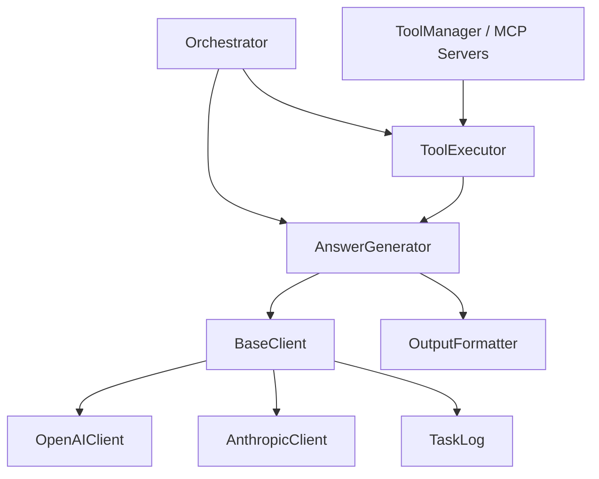
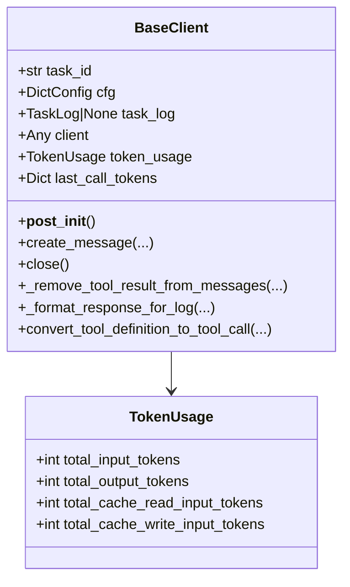
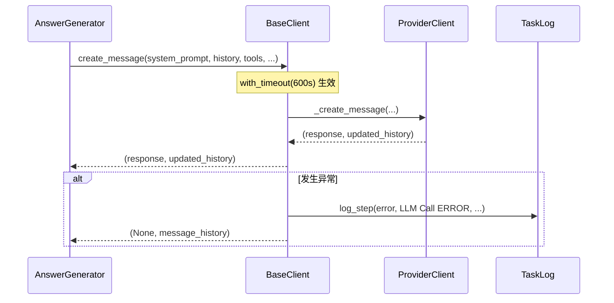
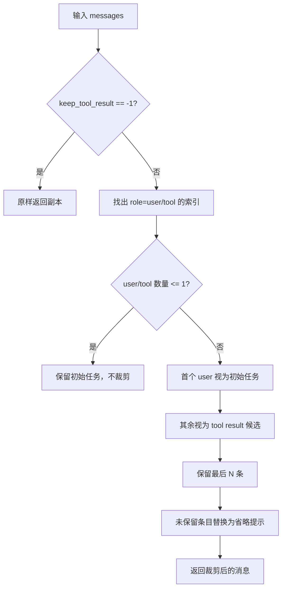

# base_client 模块文档

## 模块定位与设计动机

`base_client` 是 `miroflow_agent_llm_layer` 中的“统一 LLM 客户端抽象层”。它的核心价值不在于直接调用某个厂商 API，而在于把**上层 Agent 编排逻辑**与**底层模型供应商差异**解耦。换句话说，`Orchestrator`、`AnswerGenerator` 这类核心流程组件并不需要知道 OpenAI 和 Anthropic 在消息格式、token 统计口径、缓存机制上的差异，只需要依赖 `BaseClient` 提供的统一入口。

这个模块存在的根本原因是：在多模型、多供应商、长上下文工具调用场景下，系统会面临大量重复问题——超时控制、日志记录、消息裁剪、工具结果保留策略、token 使用统计。把这些能力集中在基类中，可以避免在每个 provider 客户端里重复实现，也让后续引入新模型（例如本地推理服务、第三方兼容 OpenAI 的网关）时具有可维护的扩展路径。

从职责上看，`base_client` 不负责完整业务流程（这属于 `orchestrator` / `answer_generator`），也不负责工具真实执行（这属于 `tool_executor` / `ToolManager`）。它专注于：**一次 LLM 调用该如何被组织、约束、记录和抽象**。

---

## 核心组件总览

当前模块仅包含两个核心组件：

- `TokenUsage`：统一 token 统计结构
- `BaseClient`：LLM provider 客户端抽象基类

### `TokenUsage`

`TokenUsage` 是一个 `TypedDict`，用于统一聚合不同供应商的 token 数据。

```python
class TokenUsage(TypedDict, total=True):
    total_input_tokens: int
    total_output_tokens: int
    total_cache_read_input_tokens: int
    total_cache_write_input_tokens: int
```

该结构的重要性在于，它不是“某家 API 的原始 usage 字段镜像”，而是系统内部可比较、可汇总的统一口径。以 provider 差异为例：

- OpenAI 常见字段是 `prompt_tokens` / `completion_tokens`，并且缓存写入通常不单独计费；
- Anthropic 会区分 `cache_creation_input_tokens` 与 `cache_read_input_tokens`。

`TokenUsage` 把这些差异归一化为四个维度，便于 `AnswerGenerator`、最终 summary 输出、成本观测逻辑做统一处理。

### `BaseClient`

`BaseClient` 是一个 `@dataclass` + `ABC` 的抽象基类。它提供：

1. 配置解析与通用字段初始化；
2. token 计数器初始化；
3. 统一调用入口 `create_message`（带超时装饰器）；
4. 工具结果裁剪逻辑；
5. 工具定义格式转换；
6. 客户端关闭与响应日志格式化辅助函数。

provider 子类（如 `OpenAIClient`、`AnthropicClient`）应在此基础上实现 `_create_client` 和 `_create_message` 等 provider-specific 细节（详见 [openai_client.md](openai_client.md)、[anthropic_client.md](anthropic_client.md)）。

---

## 在整体系统中的位置



`BaseClient` 位于核心执行链路中间层：上游接收 `AnswerGenerator` 的调用需求，下游将请求分派给具体 provider 客户端。它既是协议适配层，也是治理层（超时、日志、token 统计入口）。

如果你先阅读过 [miroflow_agent_core.md](miroflow_agent_core.md)，可以把 `BaseClient` 理解为“核心 agent 推理回路中的模型 I/O 适配器”。

---

## 类结构与关键字段



`BaseClient.__post_init__` 会从 `cfg` 中提取大量运行参数（`model_name`、`temperature`、`top_p`、`max_context_length`、`max_tokens`、`async_client` 等），并设置 `api_key`、`base_url`、`use_tool_calls` 这类可选配置。这里的设计倾向是“初始化时一次性解析，后续调用只读使用”，从而减少调用路径中对配置对象的反复访问。

---

## 关键流程详解

### 1) 统一消息创建流程：`create_message`



`create_message` 是上层最常用入口，它本身不做 provider 请求细节，而是把调用委托给子类 `_create_message`。它的核心职责是“统一边界控制”：

- 使用 `@with_timeout(DEFAULT_LLM_TIMEOUT_SECONDS)` 对整个异步调用加总超时（默认 600 秒）；
- 捕获异常并落日志，避免异常直接炸穿主循环；
- 将失败态统一映射为 `response = None`。

> 实现细节提醒：`create_message` 接收了 `step_id` 与 `task_log` 参数，但在 `BaseClient` 中未直接使用；实际日志使用的是 `self.task_log`。这体现了接口预留与当前实现之间的差距。

### 2) 工具结果裁剪：`_remove_tool_result_from_messages`

在工具调用密集场景，历史工具结果可能显著膨胀上下文，导致 token 成本和截断风险增加。该函数通过“保留结构、替换内容”的方式做压缩。



几个非常关键的行为约束：

- 第一个 `user` 消息永远保留，被视作初始任务描述；
- 从第二个 `user`（以及 `tool`）开始，按“工具结果”处理；
- 被省略条目不会删除，而是内容替换为 `Tool result is omitted to save tokens.`，避免破坏消息序列结构；
- 对 Anthropic 样式（`content: list`）与 OpenAI 样式（`content: str`）分别处理。

这段逻辑对上层“对话可追溯性”很重要：消息骨架保留，日志可理解，同时有效节省上下文 token。

### 3) 工具定义格式适配：`convert_tool_definition_to_tool_call`

该静态方法负责把内部 MCP server 的工具定义转换成 OpenAI 风格 function-calling 定义。输出工具名采用 `"{server_name}-{tool_name}"` 规则，降低跨 server 命名冲突风险。

需要注意它被定义为 `async def`，但内部没有 `await`，因此语义上更像“异步签名的纯转换函数”。这在调用端通常不是问题，但从接口设计上可视为历史兼容产物。

### 4) 客户端关闭：`close`

`close` 尝试兼容同步/异步客户端：

- 若 `self.client.close` 是同步函数，直接调用；
- 若检测到协程函数，不直接 `await`，而尝试关闭内部 `_client`；
- 若存在 `self.client._client.close`，也会尝试调用。

这是一种“尽力关闭（best effort）”策略，目标是降低资源泄漏风险，但并不保证所有 SDK 都能完全优雅退出。严格异步清理仍建议在外层事件循环里显式 `await aclose()`（若 SDK 支持）。

---

## 方法级 API 说明

## `__post_init__(self)`

该方法在 dataclass 初始化后自动执行，完成三件事：初始化 `last_call_tokens`、装载配置字段、创建 provider client。

**输入来源**是构造参数 `task_id`、`cfg`、`task_log`；**副作用**包括：

- 设置运行时属性（provider/model/采样参数/上下文限制等）；
- 初始化 `token_usage`；
- 调用 `_create_client()`；
- 写入初始化日志。

**潜在风险**：源码中直接调用 `self.task_log.log_step(...)`，没有判空。如果构造时 `task_log=None`，会触发 `AttributeError`。因此实务上应把 `task_log` 视为“事实必填”。

## `_reset_token_usage(self) -> TokenUsage`

返回新的全零 `TokenUsage`。这是内部状态初始化方法，无 I/O 副作用。

## `create_message(...) -> Tuple[Any, List[Dict]]`

统一异步调用入口。参数里最关键的是：

- `system_prompt`：系统级指令；
- `message_history`：完整历史；
- `tool_definitions`：可供模型调用的工具定义；
- `keep_tool_result`：是否裁剪工具结果。

返回 `(response, message_history)`。当异常发生时，`response` 置为 `None`，并尽量返回原消息历史。

## `convert_tool_definition_to_tool_call(tools_definitions)`

输入 MCP 风格结构，输出 OpenAI `tools` 数组。主要副作用是无（纯数据转换）。

## `_remove_tool_result_from_messages(messages, keep_tool_result) -> List[Dict]`

根据 `keep_tool_result` 决定保留多少工具结果，并替换其余内容为占位文本。此函数会记录 retention 摘要日志。

## `_format_response_for_log(response) -> Dict`

将 provider 响应裁剪成适合日志存储的小体积结构：

- 文本最多截取 500 字符；
- tool input 最多 200 字符；
- 附带 `finish_reason`、`tool_calls_count` 等关键信息。

这有助于在不写入全量原始响应的前提下保留可观测性。

## `close(self)`

执行连接释放。行为是“尽力而为”，而非强一致资源管理。

---

## 与 provider 子类的协作契约

`BaseClient` 与子类协作可以概括为：

1. 基类定义公共语义与状态容器；
2. 子类实现 API 调用、token 回填、响应解析策略。

从已实现子类可看到典型差异：

- `OpenAIClient` 使用 `chat.completions.create`，并在 `finish_reason == "length"` 场景做动态增大 `max_tokens` 重试；
- `AnthropicClient` 使用 `messages.create`，并提供 `_apply_cache_control` 给最后 user turn 加缓存控制标记；
- 两者都复用 `BaseClient` 的工具结果裁剪与通用调用封装。

如果你要深入 provider 行为，请阅读：

- [openai_client.md](openai_client.md)
- [anthropic_client.md](anthropic_client.md)

---

## 与上层模块的协作关系

在 `AnswerGenerator.handle_llm_call` 中，`BaseClient.create_message` 是标准入口。上层对返回值会进一步做三类处理：

1. `ResponseBox/ErrorBox` 解包；
2. `process_llm_response` 与 `extract_tool_calls_info`（子类实现）解析；
3. 失败时保留历史并重试。

这意味着 `base_client` 的失败语义（返回 `None` 而不是直接抛出）会直接影响上层重试策略与流程可恢复性。

日志方面，`BaseClient` 依赖 [miroflow_agent_logging.md](miroflow_agent_logging.md) 的 `TaskLog.log_step`，因此可在统一 task 日志中追踪初始化、调用失败、消息裁剪和 token 统计。

---

## 配置说明与建议

`BaseClient` 读取的关键配置位于 `cfg.llm` 与 `cfg.agent`：

```yaml
llm:
  provider: openai            # 或 anthropic
  model_name: gpt-4o-mini
  temperature: 0.7
  top_p: 1.0
  min_p: 0.0
  top_k: -1
  max_context_length: 128000
  max_tokens: 4096
  async_client: true
  api_key: ${oc.env:LLM_API_KEY}
  base_url: null
  use_tool_calls: true
  repetition_penalty: 1.0

agent:
  keep_tool_result: 3
```

建议：

- 若任务依赖长链工具调用，优先设置 `keep_tool_result` 为小正数（如 2~5），在可追溯性和 token 成本之间折中；
- 若接入第三方兼容网关，确认其对 `base_url`、headers、tool-calling 格式兼容性；
- `max_context_length` 与 provider 实际模型上限需一致，否则上层估算与真实截断行为会偏离。

---

## 使用示例

### 1) 初始化并调用

```python
from apps.miroflow-agent.src.llm.providers.openai_client import OpenAIClient

client = OpenAIClient(task_id=task_id, cfg=cfg, task_log=task_log)

response, message_history = await client.create_message(
    system_prompt=system_prompt,
    message_history=message_history,
    tool_definitions=tool_definitions,
    keep_tool_result=cfg.agent.keep_tool_result,
    step_id=turn_id,
    agent_type="main",
)

# 上层继续调用 provider-specific 解析
assistant_text, should_break, message_history = client.process_llm_response(
    response, message_history
)
```

### 2) 工具定义转换

```python
tools = await BaseClient.convert_tool_definition_to_tool_call(mcp_servers)
```

输出即 OpenAI `tools` 所需结构，可直接用于 `chat.completions.create(..., tools=tools)`。

---

## 扩展新 provider 的实现建议

新增 provider（例如 `MyProviderClient`）时，建议遵循以下最小实现面：

1. `_create_client`：创建 SDK client，并注入必要 headers（例如 task_id 透传）；
2. `_create_message`：实现请求参数组装、请求发送、重试/错误分类、返回 `(response, message_history)`；
3. token usage 更新：把 provider usage 字段映射到统一 `TokenUsage`；
4. 响应解析：实现 `process_llm_response`、`extract_tool_calls_info`、`update_message_history`（通常在子类中定义）。

实践上可以把 OpenAI/Anthropic 两个已有实现作为模板：一个偏“completion-style + finish_reason”，一个偏“content blocks + cache control”。

---

## 边界条件、错误场景与限制

### 1. `task_log` 空值风险

尽管类型声明为 `Optional[TaskLog]`，但 `__post_init__` 和多个方法直接使用 `self.task_log.log_step`。如果未传入 `task_log`，初始化阶段可能立即报错。建议在调用约定中将其视为必需。

### 2. 超时语义是“整次调用超时”

`with_timeout` 基于 `asyncio.wait_for`，超时会取消整个协程调用。若子类内部还有自己的重试等待逻辑，需注意两层超时/重试叠加造成的时间行为。

### 3. 工具结果识别策略依赖 role 约定

`_remove_tool_result_from_messages` 通过 `role in {"user", "tool"}` 识别候选，并假设“首个 user = 初始任务”。若上游消息构造不遵循此约定，裁剪结果可能不符合预期。

### 4. 内容替换而非删除

被裁剪消息会保留条目，仅替换内容。这对保持历史结构有利，但也意味着消息条数不会下降，某些 provider 若对消息条数本身敏感，仍可能有边缘影响。

### 5. `close()` 为 best-effort

该方法尝试多种关闭路径，但并不保证所有 SDK 连接都被完全释放。生产环境建议结合进程生命周期与 SDK 官方关闭 API 做最终兜底。

### 6. `convert_tool_definition_to_tool_call` 命名规则

工具名使用 `server-name` 前缀，若 server 名含特殊字符，可能影响下游解析或可读性。建议在 server 注册时约束命名。

---

## 测试与排障建议

当你排查“为什么 LLM 结果异常/成本过高/频繁超时”时，优先检查：

1. `TaskLog` 中 `LLM | Message Retention`，确认工具结果是否按预期裁剪；
2. provider 子类 token usage 更新逻辑，确认统计口径是否一致；
3. `max_context_length` 与 `max_tokens` 配置是否合理；
4. `create_message` 返回是否为 `None`，以及上层是否正确处理了失败分支；
5. 是否出现双重重试（基类超时 + 子类 retry）导致时延不可控。

---

## 相关文档

- Provider 细节： [openai_client.md](openai_client.md), [anthropic_client.md](anthropic_client.md)
- 核心执行流程： [miroflow_agent_core.md](miroflow_agent_core.md), [answer_generator.md](answer_generator.md)
- 日志体系： [miroflow_agent_logging.md](miroflow_agent_logging.md)
- LLM 层总览： [miroflow_agent_llm_layer.md](miroflow_agent_llm_layer.md)
