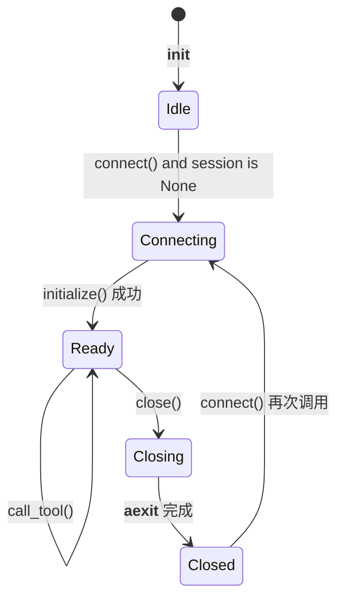
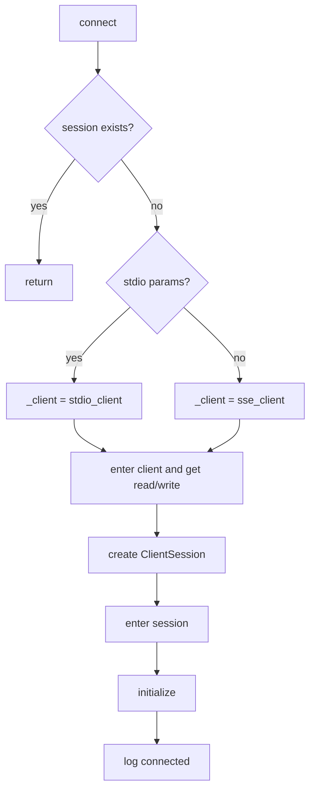
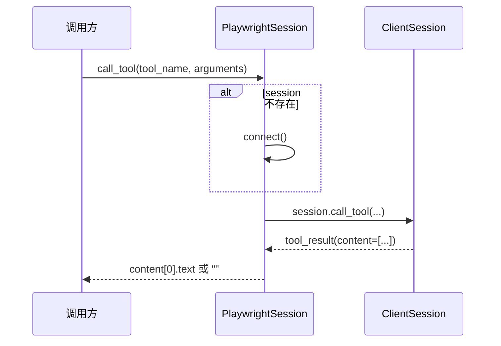

# browser_session 模块文档

## 模块简介：它解决了什么问题，为什么需要它

`browser_session` 模块位于 `miroflow_tools_management` 中，当前只包含一个核心类：`PlaywrightSession`。虽然代码体量很小，但它在系统里承担的是“会话粘合层”的职责：把 MCP（Model Context Protocol）到 Playwright 服务端的连接、初始化、复用与释放，封装成一个可持续使用的异步对象。

这个模块存在的根本原因是：浏览器自动化工具调用通常是多步连续动作，并且强依赖上下文状态。典型流程是先导航、再点击、再截图或抓取 DOM。如果每一步都新建连接，虽然逻辑上可行，但会引入额外握手开销，并可能导致上下文不稳定（例如页面状态、会话进程、临时上下文对象难以平滑延续）。`PlaywrightSession` 用“持久 session”解决这个问题，让上层组件只关心“调用哪个工具”，而不需要重复处理协议层连接细节。

在整体架构中，它是 `ToolManager` 的专用下层能力，主要服务 `server_name == "playwright"` 的调用链路。关于工具路由、黑名单、统一错误包装等更上层行为，请参考 [tool_manager.md](tool_manager.md) 和 [miroflow_tools_management.md](miroflow_tools_management.md)。

---

## 源码位置与外部依赖

- 源码文件：`libs/miroflow-tools/src/miroflow_tools/mcp_servers/browser_session.py`
- 核心组件：`PlaywrightSession`
- 直接依赖：
  - `mcp.client.stdio.stdio_client`
  - `mcp.client.sse.sse_client`
  - `mcp.client.session.ClientSession`
  - `mcp.StdioServerParameters`

`PlaywrightSession` 同时支持两类传输方式：

1. **stdio 模式**：通常用于本地子进程型 MCP Server；
2. **SSE 模式**：通常用于 HTTP/S 远端 MCP endpoint。

模块本身通过 `isinstance(server_params, StdioServerParameters)` 进行分支，未命中时默认走 SSE 客户端。

---

## 核心组件详解：`PlaywrightSession`

### 1) 生命周期状态模型

`PlaywrightSession` 的内部状态非常直接：

- `server_params`：连接参数（stdio 参数对象或 SSE 地址）；
- `_client`：底层异步客户端上下文对象（stdio/sse 二选一）；
- `read` / `write`：底层通信通道；
- `session`：`ClientSession` 实例，负责 `initialize`、`call_tool` 等 MCP 会话操作。

可以把它理解为一个“小型状态机”：



该模型的关键设计点在于：对象初始化时不做连接（lazy connect），首次调用工具时才建立 session，避免无效连接占用。

### 2) 构造函数 `__init__(self, server_params)`

函数职责是记录配置并把内部句柄置空，不做 I/O。签名如下：

```python
def __init__(self, server_params)
```

参数说明：

- `server_params`：
  - 若为 `StdioServerParameters`，后续 `connect()` 使用 `stdio_client`；
  - 否则使用 `sse_client`（通常是 `http://...` 或 `https://...`）。

返回值：无。

副作用：无外部副作用，仅修改实例字段。

### 3) 连接方法 `connect(self)`

签名：

```python
async def connect(self)
```

该方法负责“如果尚未连接则建立连接”。其流程如下：



实现细节上，它没有使用局部 `async with`，而是手动调用 `__aenter__`，把上下文生命周期提升到对象级别。这使同一个 `PlaywrightSession` 能跨多次 `call_tool` 复用单连接。

返回值：`None`。

可能异常：

- 连接建立失败（网络、进程拉起失败、地址错误）；
- `initialize()` 失败（协议握手或服务端异常）。

### 4) 工具调用方法 `call_tool(self, tool_name, arguments=None)`

签名：

```python
async def call_tool(self, tool_name, arguments=None)
```

这是模块对外最重要的 API。行为分三步：

1. 若 `session is None`，先执行 `await connect()`；
2. 调用 `await self.session.call_tool(tool_name, arguments=arguments)`；
3. 从返回对象中提取文本：`content[0].text`，若无内容则返回空字符串。

该方法返回值类型是 `str`（被规约后的文本结果），这让上层调用简单统一，但代价是表达力下降：多段 content、非文本 content、额外 metadata 都会被忽略。



参数说明：

- `tool_name: str`：目标 MCP Tool 名称，例如 `browser_navigate`；
- `arguments: dict | None`：工具参数，默认 `None`。

副作用：

- 可能触发懒连接；
- 写入日志（`Calling tool '...'`）；
- 会延续同一浏览器会话上下文（这通常是预期行为）。

### 5) 关闭方法 `close(self)`

签名：

```python
async def close(self)
```

`close()` 按顺序释放 `session` 与 `_client`，并清理内部字段。它是幂等风格：若句柄为空则跳过。

返回值：`None`。

副作用：

- 关闭 MCP 会话连接；
- 重置 `session/_client/read/write`；
- 输出关闭日志。

这个方法不会自动触发，因此建议上层在任务生命周期结束时强制调用（`try/finally` 或统一资源回收钩子）。

---

## 与系统其他模块的关系

`browser_session` 本身只做会话管理，不做策略。它在系统中的位置可以简化为：


`ToolManager.execute_tool_call()` 对 `playwright` 做了专门分支：

- 第一次调用时创建并连接 `PlaywrightSession`；
- 后续继续复用该 session；
- 返回格式由 `ToolManager` 统一包装为 `{server_name, tool_name, result|error}`。

这意味着 `PlaywrightSession` 的异常通常会在 `ToolManager` 层被捕获并转换成结构化错误响应。具体包装逻辑请参见 [tool_manager.md](tool_manager.md)。

---

## 典型使用方式

### 示例 A：SSE 连接（最常见）

```python
import asyncio
from miroflow_tools.mcp_servers.browser_session import PlaywrightSession

async def demo():
    s = PlaywrightSession("http://localhost:8931")
    try:
        await s.call_tool("browser_navigate", {"url": "https://example.com"})
        snapshot = await s.call_tool("browser_snapshot", {})
        print(snapshot)
    finally:
        await s.close()

asyncio.run(demo())
```

### 示例 B：stdio 连接

```python
from mcp import StdioServerParameters
from miroflow_tools.mcp_servers.browser_session import PlaywrightSession

params = StdioServerParameters(
    command="npx",
    args=["-y", "@modelcontextprotocol/server-playwright"],
)

session = PlaywrightSession(params)
```

### 示例 C：结合 JSON 结果解析（对应源码示例）

```python
import json
result = await session.call_tool("browser_snapshot", {})
data = json.loads(result)
print(data.get("title"))
```

前提是该工具确实返回 JSON 字符串；否则 `json.loads` 会抛异常，业务层应加校验或异常处理。

---

## 行为约束、边界条件与常见问题

### 并发首连竞态

当前实现没有显式锁。在同一个 `PlaywrightSession` 实例上，如果多个协程几乎同时首次调用 `call_tool`，它们都可能看到 `session is None` 并并发进入 `connect()`。这可能导致重复初始化或不稳定状态。若存在并发调用场景，建议在外层加 `asyncio.Lock`，或在类内增加“connecting”状态保护。

### 断连后的自动恢复缺失

一旦底层连接被远端关闭或网络中断，当前类不会自动探测并重连。异常会直接上抛。生产环境通常需要在上层加“失败后重建并重试一次”的策略。

### 返回值抽象过窄

该类固定返回 `content[0].text`。这虽然便于上层 prompt 拼接，但会丢失：

- 多段内容（只取第一段）；
- 非文本类型内容；
- 工具返回中的扩展字段。

如果你需要更完整结果，建议扩展接口，提供 `return_mode` 或直接返回原始 `tool_result`。

### 资源泄漏风险

如果调用方忘记执行 `close()`，持久连接会一直存活。长期运行服务中，这会积累文件句柄、网络连接或子进程资源。推荐统一放在任务结束回调中清理，而不是依赖调用者记忆。

### 参数校验较弱

`connect()` 只识别 `StdioServerParameters`，其余类型全部当 SSE 参数处理。如果传入无效对象，会在较底层报错，错误定位不够前置。建议在实例创建前做显式类型与格式校验。

---

## 设计取舍与实现差异提示

一个值得注意的实现差异是：`PlaywrightSession.call_tool()` 取 `content[0].text`，而 `ToolManager` 在非 playwright 分支常用 `content[-1].text`。这在跨 server 统一行为时可能造成“同一工具风格返回不同片段”的感知差异。若系统追求一致性，建议在 `ToolManager` 层统一结果提取策略。

此外，`browser_session` 不负责业务安全策略。例如 `ToolManager` 中关于 Hugging Face 数据集 URL 的抓取拦截逻辑，并不在此模块实现。也就是说，这个模块是“协议连接层”，不是“策略执行层”。

---

## 可扩展方向（维护建议）

可优先考虑以下增强：

1. 增加并发安全（如连接锁、状态机）；
2. 支持健康检查与自动重连；
3. 支持 `async with PlaywrightSession(...)` 语法糖，减少忘记关闭的风险；
4. 提供可配置返回策略（first/last/full/raw）；
5. 增加可观测性指标（连接耗时、调用耗时、失败率、重连次数）。

这些改造不会改变模块定位，但会显著提升稳定性与运维友好性。

---

## 参考文档

- [tool_manager.md](tool_manager.md)：工具路由、异常包装、playwright 分支的上层调用逻辑。
- [miroflow_tools_management.md](miroflow_tools_management.md)：工具管理域的模块级职责与整体结构。
- [tool_executor.md](tool_executor.md)：代理执行阶段如何发起工具调用。
- [orchestrator.md](orchestrator.md)：任务编排层如何驱动整体流程。

---

## 总结

`browser_session` 的核心价值在于“持续会话复用”。它没有承担复杂策略，却承担了浏览器工具链路最容易被忽视的稳定性基础：连接何时建立、如何复用、何时释放。对于初次接手该模块的开发者，最重要的理解是：把它当作一个异步资源对象来管理，而不是一次性函数；只要会话生命周期管理得当，playwright 相关工具调用会更高效、更稳定、也更易于排障。